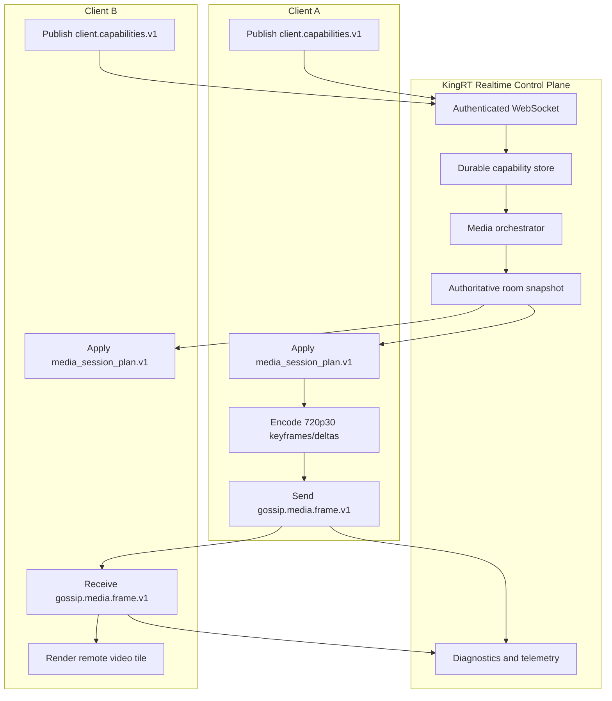
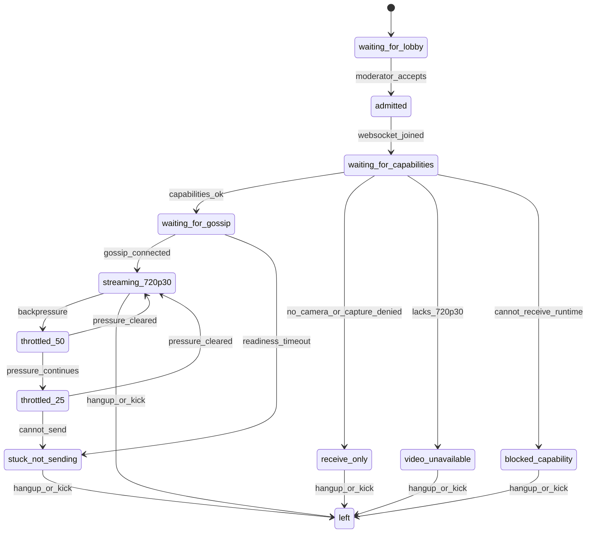

# Epic: KingRT Gossip Video Call v1

Status:
- Active from 2026-05-10 on local branch `kingrt/prod-ready`.
- Do not push. Deploy from local only when the sprint reaches its deploy gate.
- The active product goal is simple: Gossip must carry visible 720p30 video.
- This intentionally reopens the parked Gossip media work as a planned v1
  transport, not as a hidden fallback or standalone browser mesh.

## Product Target

KingRT v1 video call is not a fallback matrix. The current release target is:

1. A participant joins through auth and lobby admission.
2. Every admitted client publishes `client.capabilities.v1`.
3. The backend orchestrator computes one `media_session_plan.v1`.
4. The call waits for gossip readiness when needed, up to roughly five minutes.
5. Clients send 720p30 keyframes and deltas over the planned gossip path.
6. Receivers render those frames as normal call participants.
7. Failed frames are logged and the sender continues.
8. Backpressure pauses briefly, then sends at 50 percent cadence, then 25 percent.
9. If 25 percent still cannot send, the participant becomes `stuck_not_sending`
   with a visible reason. No reconnect loop and no hidden fallback.

Out of scope for this epic:
- SFU fallback in the active path.
- MediaSecurity sender-key gates in the active path.
- Background segmentation or background-tab media policy as stream control.
- Automatic quality experiments, profile rescue, regression harnesses or repair
  loops that hide the real media failure.
- DNS, certbot, remote branch pushes, or GitHub publication.

## Architecture Target

## State Machine

## Sprint Loop

Each sprint under this epic has exactly 20 checkboxes in `SPRINT.md`.

The last checkbox is always a deploy/debug gate:
- deploy local branch `kingrt/prod-ready`;
- no push;
- no DNS changes;
- no certbot unless a new domain was explicitly added;
- run 5 to 10 diagnostics loops after deploy;
- collect all distinct errors before preparing a second deploy;
- update this `EPIC.md` with what changed;
- refill `SPRINT.md` with the next 20 active issues.

## Subagent Operating Model

Use up to six subagents when useful:

1. Backend control plane and orchestrator.
2. Frontend capture, encode and publish.
3. Gossip data lane and envelope.
4. Receiver/rendering, tiles, fullscreen and screenshare.
5. Tests, contracts and browser/E2E proof.
6. Deploy, diagnostics and branch hygiene.

The manager integrates finished work into `kingrt/prod-ready`, keeps the sprint
checkboxes current, and deploys only from the integrated branch.

## Sprint 01 Result

Completed on 2026-05-10 from local branch `kingrt/prod-ready`, without push,
DNS automation or certbot. The first deploy attempt exposed a duplicate PHP
lobby-remove helper that crashed backend and websocket containers. The second
attempt exposed malformed call-access binding SQL from an undefined
`$hostVerifiedSelect`, breaking auth/session/ice-server probes. Both failures
were grouped from logs, fixed locally, committed, and redeployed.

The final deploy completed and post-deploy diagnostics are green for the active
production surface: runtime/version 200, app/CDN/call-app/registry 200,
expected unauthenticated 401 for marketplace/lobby/ice probes, expected 404 for
the parked SFU route, and zero recent auth SQL or PHP fatal errors across five
fast diagnostics loops.

## Current Code Anchors

- Backend capability command:
  `demo/video-chat/backend-king-php/http/module_realtime_media_session_commands.php`
- Backend capability store:
  `demo/video-chat/backend-king-php/domain/realtime/realtime_client_capabilities.php`
- Backend media plan:
  `demo/video-chat/backend-king-php/domain/realtime/realtime_media_session_plan.php`
- Backend snapshot:
  `demo/video-chat/backend-king-php/domain/realtime/realtime_room_snapshot.php`
- Backend gossip:
  `demo/video-chat/backend-king-php/domain/realtime/realtime_gossipmesh.php`
- Backend gossip relay:
  `demo/video-chat/backend-king-php/http/module_realtime_gossip_media_relay.php`
- Frontend capability bridge:
  `demo/video-chat/frontend-vue/src/domain/realtime/workspace/callWorkspace/mediaCapabilityPlanBridge.ts`
- Frontend publisher:
  `demo/video-chat/frontend-vue/src/domain/realtime/local/publisherPipeline.ts`
- Frontend gossip lane:
  `demo/video-chat/frontend-vue/src/domain/realtime/workspace/callWorkspace/gossipDataLane.ts`
- Frontend gossip flags:
  `demo/video-chat/frontend-vue/src/lib/gossipmesh/featureFlags.ts`
  and `demo/video-chat/frontend-vue/src/lib/gossipmesh/mediaCarrierMode.ts`
- Frontend receiver/render:
  `demo/video-chat/frontend-vue/src/domain/realtime/sfu/frameDecode.ts`
  and `demo/video-chat/frontend-vue/src/domain/realtime/sfu/remotePeers.ts`
- Frontend layout/video mounting:
  `demo/video-chat/frontend-vue/src/domain/realtime/workspace/callWorkspace/videoLayout.ts`
  and `demo/video-chat/frontend-vue/src/domain/realtime/workspace/callWorkspace/videoFullscreenToggle.ts`
- Protected media contracts:
  `demo/video-chat/contracts/v1/protected-media-transport-envelope.contract.json`
  and `demo/video-chat/contracts/v1/protected-media-frame.contract.json`
- Backpressure:
  `demo/video-chat/frontend-vue/src/domain/realtime/workspace/callWorkspace/publisherBackpressureController.ts`
- Diagnostics:
  `demo/call-app/call-diagnostics/`
  and `demo/video-chat/scripts/prod-debug.sh`

## Readiness Definition

This epic is done when a deployed `kingrt/prod-ready` build can prove:

- two normal call participants see each other through gossip without SFU;
- a third participant can join late and receive the next keyframe/delta flow;
- screenshare behaves like another participant stream;
- `VITE_VIDEOCHAT_GOSSIP_DATA_LANE=active` and the planned carrier mode produce
  gossip transport without SFU deciding the active stream path;
- remote render proof includes decoded pixels and `frameCount > 0`, not just a
  created peer/canvas object;
- focus changes and UI clicks do not reconnect the call;
- SFU, MediaSecurity gates, background policy and auto-quality experiments are
  not active stream-control dependencies;
- diagnostics show capability input, orchestrator plan, gossip readiness,
  sender frame counters, receiver frame counters, backpressure decisions and
  explicit stuck reasons.
