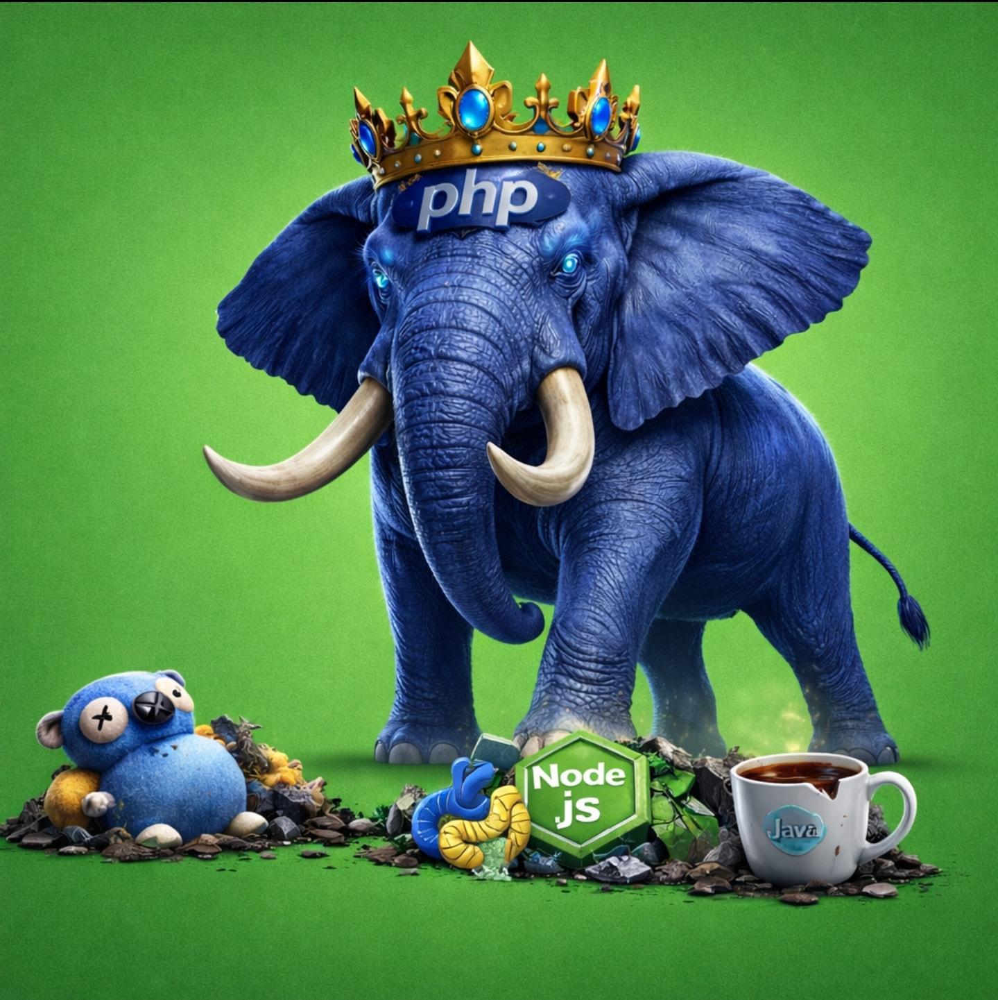

# King PHP Extension
**Systems-grade networking and infrastructure primitives for PHP**

<p align="center">
  
</p>

[](https://opensource.org/licenses/MIT)
[](https://github.com/Intelligent-Intern/king/actions/workflows/ci.yml)
[](https://github.com/Intelligent-Intern/king/releases)
[](https://github.com/Intelligent-Intern/king)
[](https://github.com/Intelligent-Intern/king/blob/main/.github/workflows/docker.yml)
[](https://github.com/Intelligent-Intern/king/actions/workflows/docker.yml)

King turns PHP into a systems platform for transport-heavy, realtime,
infrastructure-aware software. Instead of pushing critical networking,
orchestration, discovery, storage, and control-plane work into sidecars,
gateways, or glue layers, King keeps that work inside one native runtime that
is directly available to PHP.

That changes what PHP can be used for. With King, PHP is no longer limited to
short request handlers and thin application wrappers. It can own live sessions,
streams, protocol state, routing decisions, telemetry, persistence, scaling
signals, and cluster-facing workflows in one coherent runtime model.

The current line is alpha. The repo-local baseline is green, the multi-backend
object-store and control-plane surfaces are real, and the remaining closure
work is now about narrower hardening, distributed-operating proof, and
multi-node fleet behavior rather than placeholder subsystem stories.

King brings the following into one extension:

- QUIC, HTTP/1, HTTP/2, HTTP/3, TLS, streaming, cancellation, and upgrade flows
- client and server APIs over explicit session and stream state
- WebSocket and WebTransport-class realtime communication
- Smart DNS / Semantic DNS for service discovery and routing
- router and load-balancer control-plane configuration and policy
- IIBIN for schema-defined native binary encoding and decoding
- MCP for agent and tool protocol integration
- real multi-backend object-store and CDN primitives
- telemetry, metrics, tracing, and admin control surfaces
- autoscaling, orchestration, and cluster-facing infrastructure hooks

King is built for applications that need serious transport, state, and runtime
control: edge services, realtime systems, AI backends, internal control planes,
data-heavy platforms, and distributed application nodes that need native
protocol behavior without leaving PHP.

## Runtime Planes

King does not treat async work as one generic promise layer.
It separates the runtime into four clear planes so transport work, realtime
work, remote control work, and fleet behavior do not collapse into one blurry
"evented" abstraction.

### 1. Realtime Plane

The realtime plane is for long-lived interactive channels.
This is where chat messages, presence updates, room state, small control
messages, and other high-frequency bidirectional traffic belong.
In King, that plane is built around WebSocket and IIBIN.
WebSocket keeps the connection open and bidirectional.
IIBIN gives that connection a compact, schema-defined binary message format.
If an application needs to push many small messages quickly and keep both sides
in sync, this is the right plane.

### 2. Media And Transport Plane

The media and transport plane is for session ownership, stream ownership,
protocol state, transport reuse, and QUIC-aware behavior.
This is where HTTP/1, HTTP/2, HTTP/3, QUIC, TLS, session tickets, stream
lifecycle, cancellation, timeout, and polling logic live.
The key idea is that a request is not always the same thing as a connection.
King exposes `Session`, `Stream`, and protocol-specific transport paths because
serious network software needs explicit control over the transport kernel under
the application logic.

### 3. Control Plane

The control plane is for remote work that is not just "serve one response now".
This is where MCP and the pipeline orchestrator live.
MCP moves structured requests, uploads, downloads, deadlines, and cancellation
between peers.
The orchestrator manages multi-step work, queue-backed execution, remote-worker
execution, run snapshots, and restart-aware control flow.
If work needs to continue beyond one request, move to another process, or be
tracked as an explicit runtime job, it belongs here.

### 4. State And Fleet Plane

The state and fleet plane is for durable system behavior across many requests,
nodes, and services.
This is where the object store, CDN hooks, Semantic DNS, telemetry, autoscaling,
and router or load-balancer policy surfaces fit.
The object store holds artifacts and large state across local, distributed, and
real cloud backends.
Semantic DNS decides where traffic should go.
Telemetry measures what the system is doing.
Autoscaling reacts to that telemetry.
This plane is what lets King operate as infrastructure instead of only as a
request library.

### Why This Model Matters

This split keeps the system readable.
Realtime messaging does not have to pretend it is a batch job.
Transport code does not have to pretend it is business logic.
Remote orchestration does not have to masquerade as a normal HTTP request.
Fleet control does not have to hide inside random helper functions.

The result is that PHP code can stay simple while the runtime underneath stays
honest.
An application can use the small surface when that is enough, and still drop
into explicit session, stream, channel, control-plane, or fleet-plane behavior
when the system actually needs it.

## System Model

King follows a few hard rules:

- Configuration is explicit. A `King\Config` snapshot governs behavior.
- State is explicit. A `King\Session` owns connection or listener state.
- Streams are explicit. A `King\Stream` models bidirectional protocol work.
- Responses are explicit. A `King\Response` models structured receive state.
- Ownership is deterministic. Native resources are tied to PHP-visible handles.
- The OO and procedural APIs are parallel surfaces over the same native kernels.
- Security defaults stay conservative unless an operator explicitly loosens them.
- Runtime policy beats convenience. There is no hidden global magic pool.
- The target contract is not allowed to shrink just because the correct
  implementation is harder. If a subsystem matters for v1, the work is to make
  the stronger contract real, not to quietly redefine it downward.

## Target Subsystems

### Transport and Protocols

King is intended to expose a native transport stack for:

- QUIC transport
- HTTP/1 request and response handling
- HTTP/2 multiplexed transport
- HTTP/3 over QUIC
- TLS policy, certificate handling, and ticket reuse
- cancellation, timeouts, retry policy, and streaming response control
- upgrade-oriented flows such as WebSocket and related realtime protocols

### Client and Server Runtime

King targets symmetric client and server operation:

- outbound request clients for protocol-specific and generic HTTP use
- inbound listener and dispatch surfaces for server use
- session-scoped protocol metadata
- request and response streaming
- early hints, upgrade, close, and control hooks
- admin and operational control APIs

### Discovery and Control Plane

King includes a native control-plane model around:

- Smart DNS and Semantic DNS service registration
- topology awareness
- route selection
- router/loadbalancer backend discovery, configuration, and policy
- mother-node or control-node coordination
- policy-aware service discovery
- control and telemetry endpoints

### Data Plane

King is also a data and protocol runtime:

- IIBIN for schema-defined binary serialization
- MCP for tool and agent protocol traffic
- real multi-backend object-store primitives
- CDN-oriented cache distribution hooks
- pipeline orchestration for multi-step, recovery-aware workloads

### Observability and Operations

Operational visibility is a first-class concern:

- OpenTelemetry-compatible tracing and metrics surfaces
- health and status reporting
- performance and component introspection
- config policy enforcement
- ticket, certificate, and reload lifecycle management
- autoscaling and cluster integration hooks

## Public Programming Model

The core programming model is:

- `King\Config` defines transport, protocol, security, and subsystem policy.
- `King\Session` represents a live native runtime context.
- `King\Stream` represents one unit of protocol work inside a session.
- `King\Response` represents structured receive state for request flows.
- `King\Client\*` and `King\Server\*` expose higher-level protocol roles.
- `King\MCP`, `King\IIBIN`, and `King\WebSocket\Connection` expose
  subsystem-specific runtime surfaces.

The procedural API exists for direct systems work and low-friction interop.
The OO API exists for typed composition and long-lived application structure.
Neither exists only as a thin wrapper around the other.

## Design Priorities

King optimizes for:

- predictable ownership and teardown
- native protocol semantics instead of generic adapter layers
- typed error boundaries
- config-driven behavior
- minimal impedance between PHP code and native transport state
- operator control over policy and security
- compatibility with serious production environments

## Architecture

At a high level, the target architecture is:

```text
PHP Userland
  -> procedural functions and OO classes

PHP Extension Surface
  -> arginfo, object handlers, resource handlers, exception hierarchy

Native Subsystem Kernels
  -> client, server, semantic DNS, IIBIN, MCP, object store, telemetry, etc.

Configuration and Lifecycle Layer
  -> defaults, ini, config snapshot, runtime policy, shutdown semantics

External Backends
  -> quiche, OpenSSL, libcurl, kernel networking facilities
```

The important boundary is this:
King is not supposed to look like "PHP calling random native helpers".
It is supposed to look like one native system with a PHP-facing control surface.

## Documentation

The handbook lives under [`documentation/`](documentation/README.md)

## Build

To build the extension from source:

```bash
git clone --recurse-submodules https://github.com/Intelligent-Intern/king.git
cd king
./infra/scripts/build-extension.sh
```

For a fully runnable local release profile, including `libquiche.so` and
`quiche-server`, use:

```bash
cd king
./infra/scripts/build-profile.sh release
```

The build path above bootstraps the pinned QUIC dependency checkout recorded in
[`infra/scripts/quiche-bootstrap.lock`](infra/scripts/quiche-bootstrap.lock)
and normalizes the matching workspace lockfile before cargo is invoked. Do not
replace it with ad hoc local `quiche` clones or unlocked cargo retries.

The build entrypoint above is the repository build path.
Canonical release-install verification then runs through
`./infra/scripts/package-release.sh`, `./infra/scripts/install-package-matrix.sh`, and
`./infra/scripts/container-smoke-matrix.sh`.
The supported host/runtime verification matrix spans PHP `8.1` through `8.5`.

## Contributing

See [CONTRIBUTE.md](CONTRIBUTE.md).

## License

MIT. See <https://opensource.org/licenses/MIT>.
