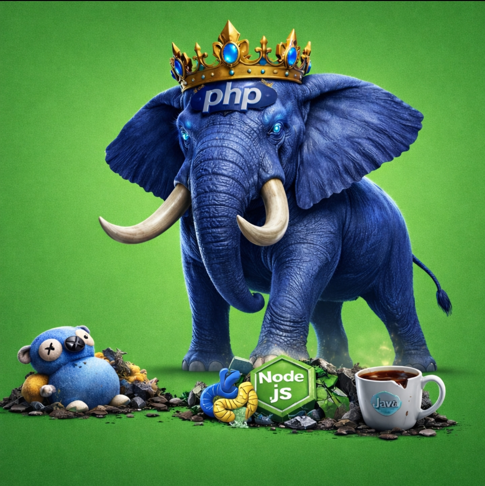

# King PHP Extension
**Systems-grade networking and infrastructure primitives for PHP**

<p align="center">
  
</p>

[](https://opensource.org/licenses/MIT)
[](https://github.com/Intelligent-Intern/king/actions/workflows/ci.yml)
[](https://github.com/Intelligent-Intern/king/releases)
[](https://github.com/Intelligent-Intern/king)
[](https://github.com/Intelligent-Intern/king/actions/workflows/ci.yml)
[](https://github.com/Intelligent-Intern/king/actions/workflows/ci.yml)

King turns PHP into a systems platform for transport-heavy, realtime,
infrastructure-aware software. Instead of pushing critical networking,
orchestration, discovery, storage, and control-plane work into sidecars,
gateways, or glue layers, King keeps that work inside one native runtime that
is directly available to PHP.

That changes what PHP can be used for. With King, PHP is no longer limited to
short request handlers and thin application wrappers. It can own live sessions,
streams, protocol state, routing decisions, telemetry, persistence, scaling
signals, and cluster-facing workflows in one coherent runtime model.

The current line is beta. The repo-local baseline is green, the multi-backend
object-store and control-plane surfaces are real, and the remaining closure
work is now about narrower hardening, distributed-operating proof, and
multi-node fleet behavior rather than paper subsystem claims.

If you do not have a Hetzner account yet, it is time to fix that. Use the
[Hetzner Cloud referral link](https://hetzner.cloud/?ref=VYfKUSIni63u) and you
help support the live infrastructure tests that keep King honest.

## How To Install And Run It

For a repository-local build:

```bash
git clone --recurse-submodules https://github.com/Intelligent-Intern/king.git
cd king
./infra/scripts/build-profile.sh release
php -d extension="$(pwd)/extension/modules/king.so" -r 'echo king_version(), PHP_EOL;'
```

That gives you the extension plus the matching QUIC runtime artifacts for the
local release profile. If you only want the extension build, use
[`./infra/scripts/build-extension.sh`](./infra/scripts/build-extension.sh).

King also ships a
[PIE](https://github.com/php/pie) install path. PIE is the successor to PECL.
Tagged releases that publish the matching PIE source asset can be installed
with `pie install intelligent-intern/king-ext`. Packaging and verification are
handled by the release scripts under [`infra/scripts/`](./infra/scripts/).

## Small But Oho

One good first King application is this:

- clients subscribe over WebSocket to `/watch?bucket=inbox`
- an uploader sends `POST /upload?bucket=inbox&object=example.txt`
- the application stores the file in the object store
- every subscriber for that bucket immediately gets a realtime notification

The event looks like this:

```json
{
  "event": "object.available",
  "bucket": "inbox",
  "object_id": "example.txt",
  "content_type": "text/plain",
  "size": 1234
}
```

The important point is that the durable write and the realtime fanout happen in
the same native runtime. The object lands in King storage, and the same PHP
process can immediately push the event over live WebSocket handles without
handing the work to a sidecar or an external glue service.

The bucket-subscription registry in this example is intentionally
application-managed and process-local. King already gives you the real object
store and WebSocket runtime needed for it, but it does not currently expose a built-in distributed bucket-watch API. For the same reason, this README example
stays single-node on purpose instead of pretending the current router or
load-balancer control-plane layer is already a verified WebSocket forwarding
dataplane.

The core shape looks like this. It keeps WebSocket handling procedural while
using the `King\ObjectStore` OO facade for durable writes:

```php
<?php

use King\ObjectStore;

$subscribers = [];

function king_example_bucket_from_request(array $request): string
{
    $query = [];
    parse_str((string) parse_url($request['uri'] ?? '/', PHP_URL_QUERY), $query);

    return (string) ($query['bucket'] ?? 'inbox');
}

function king_example_object_from_request(array $request): string
{
    $query = [];
    parse_str((string) parse_url($request['uri'] ?? '/', PHP_URL_QUERY), $query);

    return (string) ($query['object'] ?? 'upload.bin');
}

function king_example_publish(array &$subscribers, string $bucket, array $event): void
{
    $payload = json_encode($event, JSON_UNESCAPED_SLASHES);

    foreach ($subscribers[$bucket] ?? [] as $index => $websocket) {
        if (!is_resource($websocket) || !king_websocket_send($websocket, $payload)) {
            unset($subscribers[$bucket][$index]);
        }
    }
}

ObjectStore::init([
    'primary_backend' => 'local_fs',
    'storage_root_path' => __DIR__ . '/storage',
    'max_storage_size_bytes' => 50 * 1024 * 1024,
]);

$watchHandler = static function (array $request) use (&$subscribers): array {
    $bucket = king_example_bucket_from_request($request);
    $websocket = king_server_upgrade_to_websocket($request['session'], $request['stream_id']);

    if (!is_resource($websocket)) {
        return ['status' => 400, 'body' => 'websocket upgrade failed'];
    }

    $subscribers[$bucket][] = $websocket;
    king_websocket_send($websocket, json_encode([
        'event' => 'subscribed',
        'bucket' => $bucket,
    ], JSON_UNESCAPED_SLASHES));

    return ['status' => 101, 'headers' => [], 'body' => ''];
};

$uploadHandler = static function (array $request) use (&$subscribers): array {
    $bucket = king_example_bucket_from_request($request);
    $objectId = king_example_object_from_request($request);
    $storageKey = $bucket . '/' . $objectId;

    $source = fopen('php://temp', 'r+');
    fwrite($source, (string) ($request['body'] ?? ''));
    rewind($source);

    ObjectStore::putFromStream($storageKey, $source, [
        'content_type' => 'text/plain',
    ]);

    king_example_publish($subscribers, $bucket, [
        'event' => 'object.available',
        'bucket' => $bucket,
        'object_id' => $objectId,
        'content_type' => 'text/plain',
        'size' => strlen((string) ($request['body'] ?? '')),
    ]);

    return [
        'status' => 202,
        'headers' => ['content-type' => 'application/json'],
        'body' => json_encode([
            'stored' => true,
            'key' => $storageKey,
        ], JSON_UNESCAPED_SLASHES),
    ];
};
```

King brings the following into one extension:

- QUIC, HTTP/1, HTTP/2, HTTP/3, TLS, streaming, cancellation, and upgrade flows
- client and server APIs over explicit session and stream state
- WebSocket and WebTransport-class realtime communication
- Smart DNS / Semantic DNS for service discovery and routing
- router and load-balancer control-plane configuration and policy
- IIBIN for schema-defined native binary encoding and decoding
- MCP public server handling over JSON-RPC stdio and Streamable HTTP
- King-internal MCP peer calls, transfers, deadlines, and configured IIBIN payload contracts
- XSLT 2.0/3.0 transformation hooks for XML standards and Schematron/SVRL pipelines through optional SaxonC runtime loading
- real multi-backend object-store and CDN primitives
- telemetry, metrics, tracing, and admin control surfaces
- autoscaling, orchestration, and cluster-facing infrastructure hooks

King is built for applications that need serious transport, state, and runtime
control: edge services, realtime systems, AI backends, internal control planes,
data-heavy platforms, and distributed application nodes that need native
protocol behavior without leaving PHP.

## Runtime Planes

King does not treat async work as one generic promise layer.
It separates the runtime into four clear planes so transport work, realtime
work, remote control work, and fleet behavior do not collapse into one blurry
"evented" abstraction.

### 1. Realtime Plane

The realtime plane is for long-lived interactive channels.
This is where chat messages, presence updates, room state, small control
messages, and other high-frequency bidirectional traffic belong.
In King, that plane is built around WebSocket and IIBIN.
WebSocket keeps the connection open and bidirectional.
IIBIN gives that connection a compact, schema-defined binary message format.
If an application needs to push many small messages quickly and keep both sides
in sync, this is the right plane.

### 2. Media And Transport Plane

The media and transport plane is for session ownership, stream ownership,
protocol state, transport reuse, and QUIC-aware behavior.
This is where HTTP/1, HTTP/2, HTTP/3, QUIC, TLS, session tickets, stream
lifecycle, cancellation, timeout, and polling logic live.
The key idea is that a request is not always the same thing as a connection.
King exposes `Session`, `Stream`, and protocol-specific transport paths because
serious network software needs explicit control over the transport kernel under
the application logic.

### 3. Control Plane

The control plane is for remote work that is not just "serve one response now".
This is where MCP and the pipeline orchestrator live. King's public MCP server
surface handles JSON-RPC stdio and Streamable HTTP requests for tools,
resources, prompts, initialization, and ping. The internal MCP peer surface
moves structured requests, uploads, downloads, deadlines, and cancellation
between trusted King peers. IIBIN schemas for internal MCP calls are fixed on
the connection config, not passed as mutable request-time switches.
The orchestrator manages multi-step work, queue-backed execution, remote-worker
execution, run snapshots, and restart-aware control flow.
If work needs to continue beyond one request, move to another process, or be
tracked as an explicit runtime job, it belongs here.

### 4. State And Fleet Plane

The state and fleet plane is for durable system behavior across many requests,
nodes, and services.
This is where the object store, CDN hooks, Semantic DNS, telemetry, autoscaling,
and router or load-balancer policy surfaces fit.
The object store holds artifacts and large state across local, distributed, and
real cloud backends.
Semantic DNS decides where traffic should go.
Telemetry measures what the system is doing.
Autoscaling reacts to that telemetry.
This plane is what lets King operate as infrastructure instead of only as a
request library.

### Why This Model Matters

This split keeps the system readable.
Realtime messaging does not have to pretend it is a batch job.
Transport code does not have to pretend it is business logic.
Remote orchestration does not have to masquerade as a normal HTTP request.
Fleet control does not have to hide inside random helper functions.

The result is that PHP code can stay simple while the runtime underneath stays
honest.
An application can use the small surface when that is enough, and still drop
into explicit session, stream, channel, control-plane, or fleet-plane behavior
when the system actually needs it.

## System Model

King follows a few hard rules:

- Configuration is explicit. A `King\Config` snapshot governs behavior.
- State is explicit. A `King\Session` owns connection or listener state.
- Streams are explicit. A `King\Stream` models bidirectional protocol work.
- Responses are explicit. A `King\Response` models structured receive state.
- Ownership is deterministic. Native resources are tied to PHP-visible handles.
- The OO and procedural APIs are parallel surfaces over the same native kernels.
- Security defaults stay conservative unless an operator explicitly loosens them.
- Runtime policy beats convenience. There is no hidden global magic pool.
- The target contract is not allowed to shrink just because the correct
  implementation is harder. If a subsystem matters for v1, the work is to make
  the stronger contract real, not to quietly redefine it downward.

## Target Subsystems

### Transport and Protocols

King is intended to expose a native transport stack for:

- QUIC transport
- HTTP/1 request and response handling
- HTTP/2 multiplexed transport
- HTTP/3 over QUIC
- TLS policy, certificate handling, and ticket reuse
- cancellation, timeouts, retry policy, and streaming response control
- upgrade-oriented flows such as WebSocket and related realtime protocols

### Client and Server Runtime

King targets symmetric client and server operation:

- outbound request clients for protocol-specific and generic HTTP use
- inbound listener and dispatch surfaces for server use
- session-scoped protocol metadata
- request and response streaming
- early hints, upgrade, close, and control hooks
- admin and operational control APIs

### Discovery and Control Plane

King includes a native control-plane model around:

- Smart DNS and Semantic DNS service registration
- topology awareness
- route selection
- router/loadbalancer backend discovery, configuration, and policy
- mother-node or control-node coordination
- policy-aware service discovery
- control and telemetry endpoints

### Data Plane

King is also a data and protocol runtime:

- IIBIN for schema-defined binary serialization
- MCP for public JSON-RPC tool/resource/prompt servers and King-internal peer traffic
- XSLT-backed XML transformation and validation pipelines for standards-heavy payloads
- real multi-backend object-store primitives
- CDN-oriented cache distribution hooks
- pipeline orchestration for multi-step, recovery-aware workloads

### Observability and Operations

Operational visibility is a first-class concern:

- OpenTelemetry-compatible tracing and metrics surfaces
- health and status reporting
- performance and component introspection
- config policy enforcement
- ticket, certificate, and reload lifecycle management
- autoscaling and cluster integration hooks

## Public Programming Model

The core programming model is:

- `King\Config` defines transport, protocol, security, and subsystem policy.
- `King\Session` represents a live native runtime context.
- `King\Stream` represents one unit of protocol work inside a session.
- `King\Response` represents structured receive state for request flows.
- `King\Client\*` and `King\Server\*` expose higher-level protocol roles.
- `King\MCP`, `King\IIBIN`, `King\ObjectStore`,
  `King\PipelineOrchestrator`, `King\Autoscaling`, and
  `King\WebSocket\Connection` expose subsystem-specific runtime surfaces.
- `King\RTP\Socket` exposes the native RTP/ICE-lite/DTLS-SRTP runtime as a
  resource-backed OO surface.
- `King\XSLT\Processor` and the procedural `king_xslt_*` functions expose the
  SaxonC-backed XSLT runtime status and file transformation primitives.
- `King\Inference`, `King\Inference\Model`, `King\Inference\Stream`, and the
  procedural `king_inference_*` functions expose local quantized GGUF model
  registration through a backend contract. King parses GGUF metadata and tensor
  directories natively, `local` provides the current token-streaming runner
  contract, and `king_native_cpu` exposes model structure, native tokenizer
  lookup, paged KV-cache planning, public tensor views, bounded
  dequantization, K-quant block decoding, first CPU tensor/vector math, and
  a native mini-graph for embedding, RMSNorm, linear projection, RoPE, dot,
  stack, softmax, weighted-sum context assembly, serializable KV state,
  range-based KV attention, token selection from logits, scale, add steps, and
  graph-backed native CPU token streaming without an external inference runtime.
  Native graph streams are stateless by default; `king.inference_with_memory`
  sets the php.ini baseline and `with_memory` opts into carrying graph result
  state between decode steps. The stream layer can emit
  explicit OpenAI-compatible Chat
  Completions chunks, and the HTTP helper can serve
  `GET /v1/models`, `GET /v1/models/{model}`, `POST /v1/chat/completions`,
  `POST /v1/responses`, legacy `POST /v1/completions`, and
  `POST /v1/embeddings` through King server response arrays while broader
  native layer coverage and quantized kernels are added. Omitted inference
  backend config selects `king_native_cpu`; the runtime model primitive can
  resolve the configured `auto|gpu|cpu` model profile, preferring
  `gemma4:12b` when GPU use and a GPU GGUF artifact are configured, and
  falling back to `gemma3:1b` for CPU. The GPU path owns a CUDA context,
  allocates device memory, uploads required weights, caches uploaded tensors,
  and exposes native Q8_0 quantized matrix/vector, RMSNorm, RoPE, attention
  score, attention softmax, attention value aggregation, FFN/SwiGLU, and final
  output projection paths as the first decoder compute leaves. Memory-enabled
  native graph streams also
  enforce an LLM-cache admission policy with a configurable disk-free floor and
  webhook/MCP alert metadata. The process-runner path is explicit `local`
  configuration.

The procedural API exists for direct systems work and low-friction interop.
The OO API exists for typed composition and long-lived application structure.
Neither exists only as a thin wrapper around the other.

## Design Priorities

King optimizes for:

- predictable ownership and teardown
- native protocol semantics instead of generic adapter layers
- typed error boundaries
- config-driven behavior
- minimal impedance between PHP code and native transport state
- operator control over policy and security
- compatibility with serious production environments

## Architecture

At a high level, the target architecture is:

```text
PHP Userland
  -> procedural functions and OO classes

PHP Extension Surface
  -> arginfo, object handlers, resource handlers, exception hierarchy

Native Subsystem Kernels
  -> client, server, semantic DNS, IIBIN, MCP, object store, telemetry, etc.

Configuration and Lifecycle Layer
  -> defaults, ini, config snapshot, runtime policy, shutdown semantics

External Backends
  -> LSQUIC, BoringSSL, libcurl, kernel networking facilities
```

The important boundary is this:
King is not supposed to look like "PHP calling random native helpers".
It is supposed to look like one native system with a PHP-facing control surface.

## Repository Map

Core source areas:

- [`extension/`](extension/): PHP extension source, tests, headers, and build glue.
  The public native header root is [`extension/include/`](extension/include/)
  and the active runtime source root is [`extension/src/`](extension/src/).
  See [`docs/source-layout.md`](docs/source-layout.md) for the subsystem layout
  and bootstrap boundaries.
- [`infra/scripts/`](infra/scripts/): build, package, release, and local install scripts.
- [`libcurl/`](libcurl/): vendored curl headers used by the extension build.
- [`userland/flow-php/`](userland/flow-php/): repository-local PHP adapters for streaming ETL, checkpointing, and King-backed pipeline orchestration.

## Build

To build the extension from source:

```bash
git clone --recurse-submodules https://github.com/Intelligent-Intern/king.git
cd king
./infra/scripts/build-extension.sh
```

For a fully runnable local release profile, including the pinned LSQUIC source
bootstrap and release-profile staging, use:

```bash
cd king
./infra/scripts/build-profile.sh release
```

The build path above bootstraps the pinned QUIC dependency checkout recorded in
[`infra/scripts/lsquic-bootstrap.lock`](infra/scripts/lsquic-bootstrap.lock).
Do not replace it with ad hoc local LSQUIC/BoringSSL clones, local package
manager paths, or unlocked source retries.
Legacy Quiche build scripts, Cargo locks, and runtime binary fallbacks are no
longer part of the active build or release contract.

### macOS / Dev Dependency Paths

The repository build must stay portable. macOS and other developer machines may
use locally installed LSQUIC or BoringSSL, but those paths are passed through
`pkg-config` or explicit environment variables. Homebrew/Cellar paths must
stay local and must not be committed into build scripts, CI, or release assets.

Preferred `pkg-config` shape:

```bash
export PKG_CONFIG_PATH="/path/to/lsquic/lib/pkgconfig:/path/to/boringssl/lib/pkgconfig:${PKG_CONFIG_PATH:-}"
cd extension
phpize
./configure --enable-king --with-king-lsquic=yes --with-king-boringssl=yes
make
```

Explicit environment override shape:

```bash
export KING_LSQUIC_CFLAGS="-I/path/to/lsquic/include"
export KING_LSQUIC_LIBS="-L/path/to/lsquic/lib -llsquic"
export KING_BORINGSSL_CFLAGS="-I/path/to/boringssl/include"
export KING_BORINGSSL_LIBS="-L/path/to/boringssl/lib -lssl -lcrypto"
cd extension
phpize
./configure --enable-king
make
```

Root-directory overrides are also supported when a dependency has the expected
`include` and `lib` layout:

```bash
export KING_LSQUIC_ROOT="/path/to/lsquic-prefix"
export KING_BORINGSSL_ROOT="/path/to/boringssl-prefix"
cd extension
phpize
./configure --enable-king
make
```

The build entrypoint above is the repository build path.
Canonical release-install verification then runs through
`./infra/scripts/package-release.sh`, `./infra/scripts/install-package-matrix.sh`, and
`./infra/scripts/container-smoke-matrix.sh`.
The supported host/runtime verification matrix spans PHP `8.1` through `8.5`.

## PIE

King now carries the first honest maintainer surface for
[PIE](https://github.com/php/pie), the PHP Installer for Extensions.

The intended package shape is:

- root [`composer.json`](composer.json) with `type = php-ext`
- `build-path = extension`
- a pre-packaged source asset built with
  [`./infra/scripts/package-pie-source.sh`](infra/scripts/package-pie-source.sh)

That source asset is the important part. King cannot rely on the default
repository ZIP for PIE because the pinned QUIC dependency bootstrap and
package provenance have to travel with the source asset. The maintainer
workflow runs through [`infra/scripts/package-pie-source.sh`](infra/scripts/package-pie-source.sh)
and the release install/smoke matrix scripts.

## License

MIT. See <https://opensource.org/licenses/MIT>.
