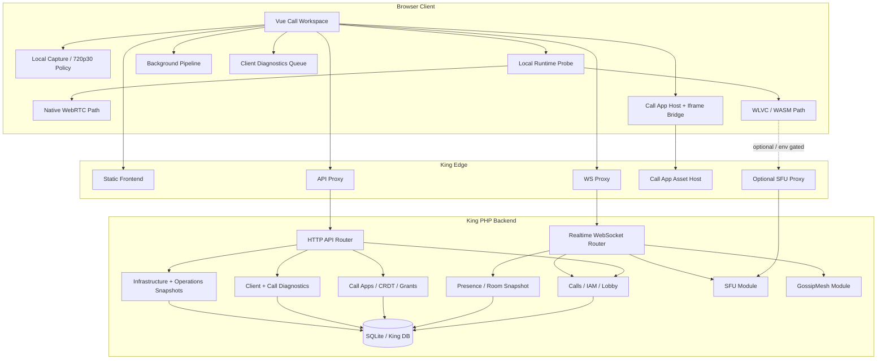
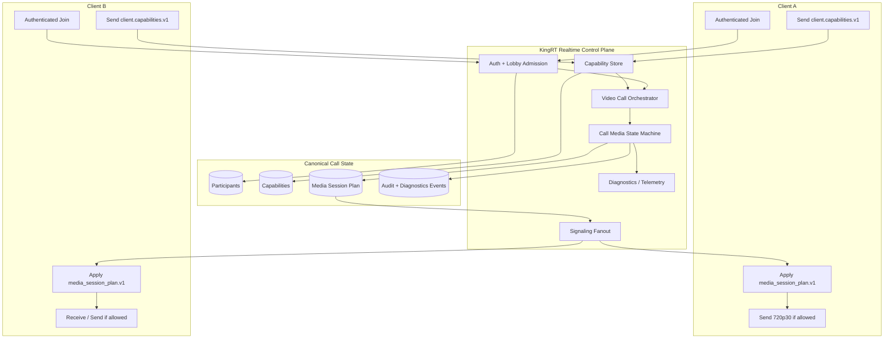
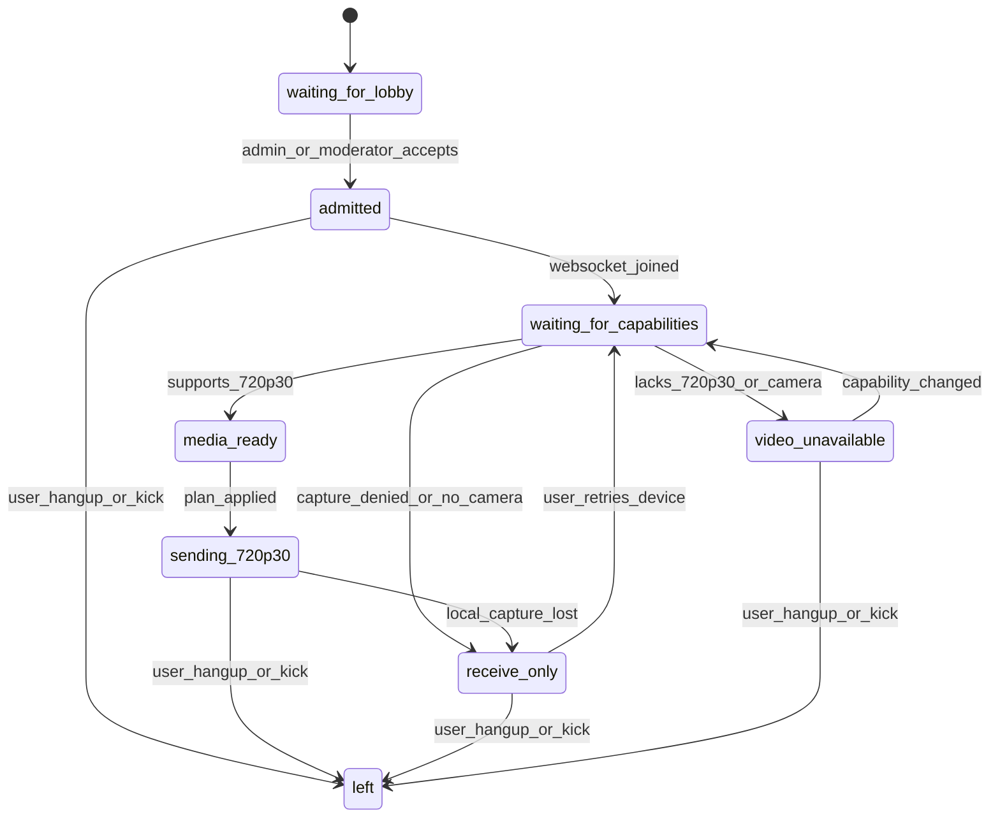

# Current And Target Architecture

Stand: 2026-05-10

## Aktuelle Architektur

### Lesart

Die Architektur ist funktional geschichtet, aber der Media-Teil ist kein einheitlicher v1-Vertrag. Der Client waehlt lokal Runtime-Pfade, der Server fuehrt Presence/Lobby/Call-App-State, und SFU/Gossip/MediaSecurity/Background sind noch als eigene Pfade im System sichtbar. Das erzeugt zu viele Stellen, die "helfen" oder "reparieren" koennen.

## Zielbild fuer v1

## State Machine Draft

## Wichtige Architekturentscheidung

Der v1-Orchestrator soll keine versteckten Downgrades machen. Er soll entscheiden und verteilen:

- `sending_720p30`
- `receive_only`
- `video_unavailable`
- `blocked_capability`
- `left`

Damit werden Fehler sichtbar und testbar, statt dass alte Pfade parallel versuchen, Medienfluss zu retten.
