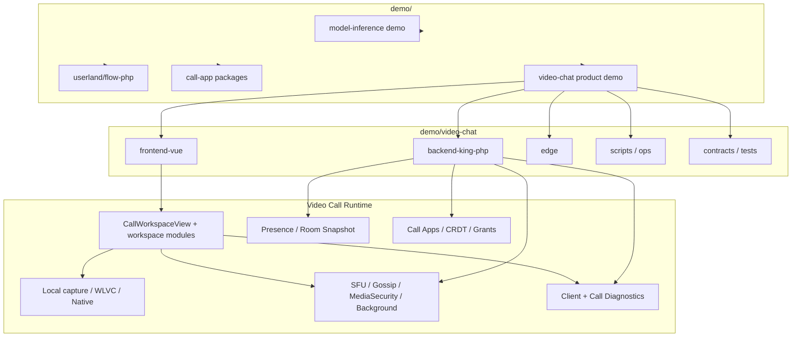

# Demo Program Complete Audit

Stand: 2026-05-10

## Scope

This audit covers the complete `demo/` tree. The full per-file inventory is
stored in [demo-program-file-inventory.tsv](demo-program-file-inventory.tsv).
That TSV is the file-by-file evidence list: path, byte size, line count,
classification, audit status and risk flags for all 5,419 physical files.

Generated and vendor-heavy paths are still inventoried, but they are not treated
as dead-code candidates unless they are referenced from first-party source:

| Class | Count | Treatment |
| --- | ---: | --- |
| `generated:node_modules` | 3,570 | Ignore for product dead-code decisions. |
| `generated:dist` | 219 | Build output, do not review as source. |
| `generated:test-results` | 3 | Local Playwright output, cleanup candidate. |
| `generated:local-runtime` | 1 | Local runtime log/env output, cleanup candidate. |
| `vendor-runtime-asset` | 41 | Committed runtime/vendor assets, review only by owner. |
| `seed-asset:background-parked` | 10 | Background seed assets, parked with background work. |
| `source` | 671 | First-party source, manual audit target. |
| `test` | 748 | Test/contract ownership target. |
| `script` | 35 | Ops/script ownership target. |
| `contract` | 24 | Contract ownership target. |
| `call-app` | 43 | Call app packages under `demo/call-app`. |

## Inventory Results

| Scope | Files |
| --- | ---: |
| Physical files under `demo/` | 5,419 |
| Non generated/vendor/local first-party-ish files | 1,626 |
| Manually suspicious files from automated flags | 262 |
| Duplicate basenames | 463 |

Keyword matrix:

| Keyword | Files | Hits | Meaning |
| --- | ---: | ---: | --- |
| `fallback` | 561 | 4,209 | The system still has many hidden fallback branches. |
| `background` | 460 | 9,373 | Background/segmentation is still broadly wired. |
| `keyframe_delta` | 317 | 4,419 | WLVC/media-frame concerns are spread across many files. |
| `reconnect` | 242 | 3,819 | Reconnect and retry logic is broad and cross-cutting. |
| `sfu` | 236 | 2,024 | SFU is still a large active code/test surface. |
| `capabilities` | 223 | 1,913 | Capability work exists but is not yet authoritative. |
| `security` | 164 | 3,095 | MediaSecurity is still deeply integrated. |
| `repair` | 160 | 2,708 | Automatic repair/recovery logic is a major source of complexity. |
| `backpressure` | 125 | 2,006 | Send-pressure decisions are spread through publisher/SFU paths. |
| `gossip` | 123 | 3,888 | Gossip topology/media work is still present as a carrier surface. |
| `quality` | 64 | 488 | Quality profile and auto-quality logic still exists. |
| `regression` | 37 | 101 | Stale regression harnesses remain visible. |
| `orchestrator` | 15 | 92 | Orchestrator language exists but not as the central media authority. |

Generated TSVs:

- [demo-program-file-inventory.tsv](demo-program-file-inventory.tsv)
- [demo-program-keyword-matrix.tsv](demo-program-keyword-matrix.tsv)
- [demo-program-suspect-files.tsv](demo-program-suspect-files.tsv)
- [demo-program-duplicate-filenames.tsv](demo-program-duplicate-filenames.tsv)
- [demo-program-inventory-summary.json](demo-program-inventory-summary.json)

## Technical Overview

### `demo/model-inference`

Recommendation: keep, but ignore for KingRT video-call v1 readiness.

This is a separate inference/RAG demo. It uses `/ws` for `infer.start` token
streaming, has its own demo auth and has no active dependency from video-call
media. It is confusing only because names such as `module_realtime.php` overlap
with video-chat naming.

Known non-videocall maintenance note: `demo/model-inference/backend-king-php/server.php`
has stale WS log text, and an embedding autoseed path appears to use `$seedPdo`
after `unset()`. This is not a video-call v1 blocker.

### `demo/userland/flow-php`

Recommendation: keep. It is not dead demo code.

It is a repo-local runtime proof used by extension PHPTs and video-chat
hardening checks. `demo/video-chat/scripts/check-security-hardening-policy.sh`
depends on `demo/userland/flow-php/src/McpHost.php`.

### `demo/call-app`

Recommendation: keep as canonical call-app package root.

The source packages are correctly located under:

- `demo/call-app/call-diagnostics`
- `demo/call-app/planning-image`
- `demo/call-app/presentation`
- `demo/call-app/spreadsheet`
- `demo/call-app/text-document`
- `demo/call-app/whiteboard`

The frontend code under `demo/video-chat/frontend-vue/src/domain/realtime/callApps`
is host integration, not package source. The backend code under
`demo/video-chat/backend-king-php/domain/call_apps` is runtime/domain support.

Gaps:

| Gap | Evidence | Impact |
| --- | --- | --- |
| Build duplication risk | `demo/video-chat/edge/Dockerfile` emits `frontend-dist/call-app` while edge runtime serves `/app/call-app`. | Generated package copies can drift from source packages. |
| Diagnostics contract stale sprint assertion | `call-app-call-diagnostics-contract.mjs` expects stale sprint text. | Test failure unrelated to runtime behavior. |
| Diagnostics event whitelist gap | Backend emits `call_app_room_snapshot_broadcast`, frontend diagnostics allow-list does not include it. | Diagnostic tail can miss relevant backend events. |
| Remove-session lacks audit row | Session removal works, but no clear `call_app_audit_events` row was found. | Operations trace is incomplete. |
| Dead asset | `public/assets/orgas/kingrt/icons/aibot.png` has no source/test/doc reference outside ignored build output. | Cleanup candidate. |
| Missing referenced asset | `UsersView.vue` references `/assets/orgas/intelligent-intern/avatar-placeholder.svg`, file absent. | Broken image risk. |

### `demo/video-chat`

Recommendation: primary v1 readiness scope.

The video-chat demo contains the actual product path and nearly all risk:

- frontend workspace, capture, media runtime, call apps, diagnostics
- backend auth, calls, lobby, presence, call apps, realtime WS, SFU, Gossip
- edge routing, deploy/smoke scripts
- hundreds of tests and contracts, many of them still proving parked surfaces

The current issue is architectural, not just implementation. Too many systems
can independently change media behavior.

## Largest Source Hotspots

| Lines | Path | Why it is suspicious |
| ---: | --- | --- |
| 2,151 | `frontend-vue/src/domain/realtime/CallWorkspaceView.vue` | Still contains many anchors for WLVC, SFU, Gossip, Background, Security and layout. Must shrink. |
| 1,994 | `workspace/callWorkspace/participantUi.ts` | Participant UI and idle/lobby/media details are too large for one module. |
| 1,518 | `backend-king-php/domain/realtime/realtime_sfu_store.php` | SFU storage/protocol/fallback concerns are still broad and active. |
| 1,492 | `backend-king-php/domain/realtime/realtime_gossipmesh.php` | Gossip topology, telemetry, recovery and restrictions live together. |
| 1,416 | `frontend-vue/src/lib/sfu/sfuClient.ts` | Large transport client with many failure and fallback branches. |
| 1,375 | `frontend-vue/src/domain/realtime/local/mediaOrchestration.ts` | Capture/background/SFU profile constraints are intertwined. |
| 1,342 | `workspace/callWorkspace/mediaSecurityRuntime.ts` | Participant-set, sender-key, recovery and native bridge resync are too coupled. |
| 1,274 | `workspace/callWorkspace/publisherBackpressureController.ts` | Backpressure can trigger drops, keyframe requests, profile downshift and socket restart. |
| 1,216 | `local/protectedBrowserVideoEncoder.ts` | Encoder, capability diagnostics, protection and SFU/Gossip publication are coupled. |
| 1,166 | `domain/realtime/sfu/frameDecode.ts` | Decode, feedback, fallback, keyframe recovery and quality pressure are coupled. |
| 1,111 | `local/publisherPipeline.ts` | Capture, encode, security, gossip and SFU dispatch all converge here. |
| 1,078 | `workspace/callWorkspace/socketLifecycle.ts` | Websocket session, origin failover, reconnect and room sync are coupled. |

Full list: [demo-program-suspect-files.tsv](demo-program-suspect-files.tsv).

## Dead Or Strange Code Candidates

These are not automatic delete instructions. They are cleanup candidates that
need a focused branch and tests.

| Candidate | Classification | Reason |
| --- | --- | --- |
| `frontend-vue/tests/contract/gossip-docs-process-contract.mjs` | Delete/rewrite later | Requires removed root `GOSSIP_CURRENT_BUILD.md` and `GOSSIP_PLANNING.md`. |
| `frontend-vue/tests/contract/gossip-native-binary-data-plane-contract.mjs` | Delete/rewrite later | Still tied to removed root gossip docs unless rewritten to archived docs. |
| `frontend-vue/tests/contract/kingrt-three-user-regression-harness-contract.mjs` | Delete/rewrite later | Regression harness is stale for the current v1 target. |
| `frontend-vue/tests/standalone/kingrt-three-user-regression-harness.mjs` | Delete/rewrite later | Same stale regression harness. |
| `frontend-vue/tests/contract/sfu-*.mjs` | Park/convert | Many tests gate SFU-only recovery, auto-quality, slow-subscriber and online pressure assumptions. |
| `frontend-vue/tests/contract/gossip-*.mjs` | Park/convert | Many tests still enforce Gossip/SFU fallback behavior instead of v1 plan behavior. |
| `frontend-vue/tests/contract/background-*.mjs` | Park/manual | Background is explicitly out of the current stabilization scope. |
| `frontend-vue/tests/standalone/king-background-segmentation-harness.*` | Park/manual | Background segmentation proof is not part of current streaming v1. |
| `frontend-vue/package.json` scripts `dev:gossip`, `test:gossip`, `test:standalone:kingrt-three-user` | Remove later | Keeps parked experiments visible as active commands. |
| `frontend-vue/package.json` scripts `test:e2e:online-sfu-*` | Park | Online SFU gates conflict with current "no SFU fallback" target. |
| `demo/video-chat/ops/bgf-loop6-deploy-delete-plan.md` | Archive/delete candidate | Tracked ops note has no references and is BGF-specific. |
| `public/assets/orgas/kingrt/icons/aibot.png` | Delete candidate | No source/test/doc references outside ignored build output. |
| `public/assets/orgas/intelligent-intern/logo.svg` | Review | No exact path references found. |
| Missing `public/assets/orgas/intelligent-intern/avatar-placeholder.svg` | Add or remove reference | Referenced by `UsersView.vue` but absent. |
| `backend-king-php/public/index.php` stale scaffold text | Update | Says API/WebSocket contracts land later, which is no longer true. |
| `realtime_sfu_store.php` JSON `sfu/frame` branch | Dead/conflicting | Early JSON rejection makes later JSON media validation effectively unreachable. |
| Duplicate `media_security_sync_request` mapping | Cleanup | Duplicated in websocket/signaling mapping. |

## Readiness Conclusion

KingRT is in v1 construction, not release. The demo program has strong pieces,
but the video-call media runtime is still carrying multiple historical
strategies at once. The next cleanup should not add another fallback. It should
make the active v1 media contract small and explicit:

1. exchange capabilities,
2. compute one backend-authored call media state,
3. wait for all relevant participants to become connected or explicitly stuck,
4. send 720p30 keyframes/deltas over the chosen gossip transport,
5. log failed frames and continue,
6. throttle only for backpressure, then stop attempting when the connection
   cannot send and surface the reason.

