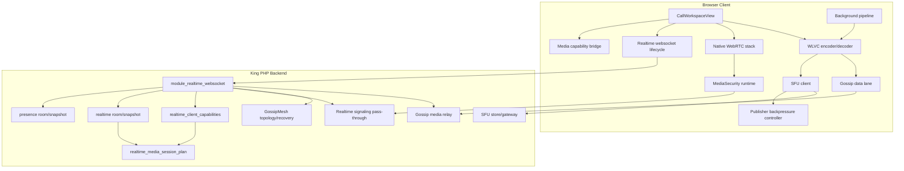
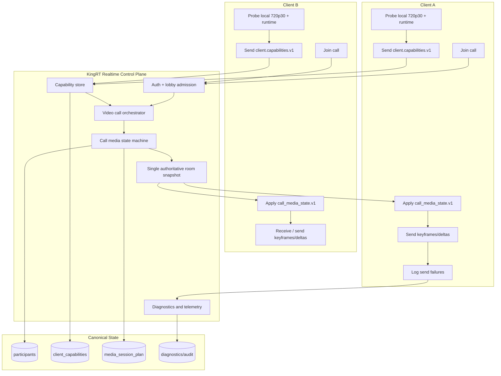
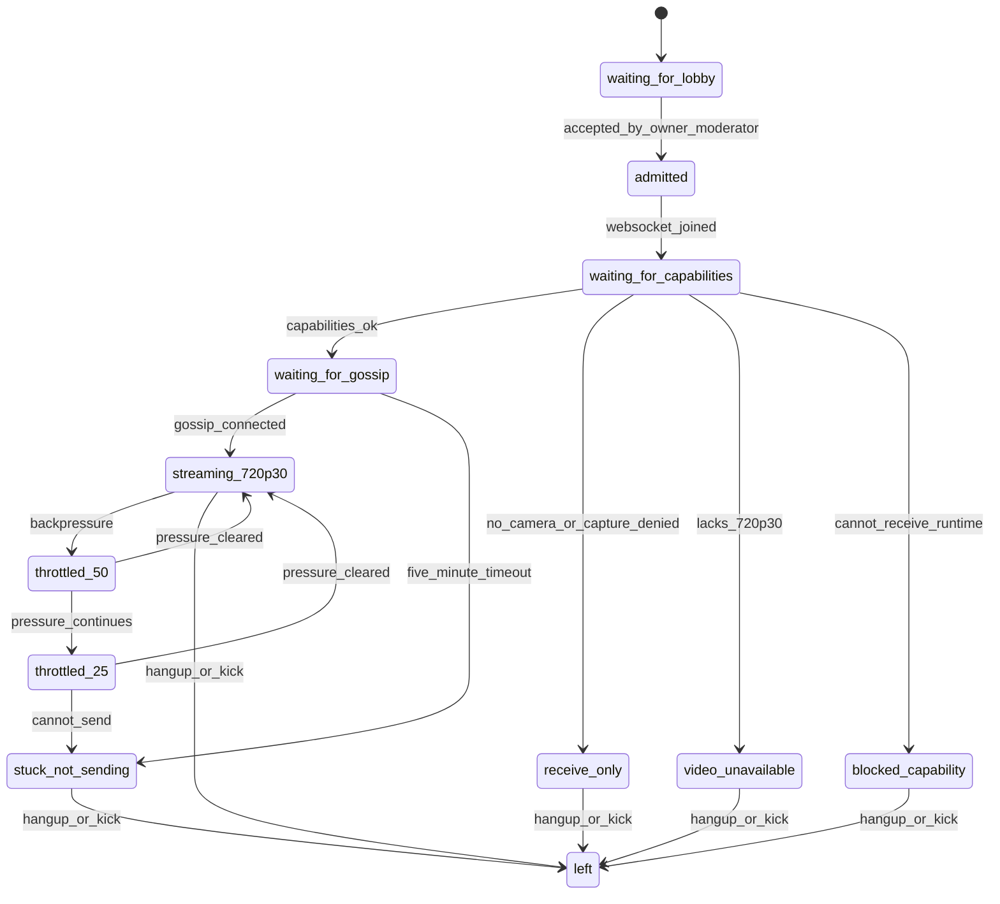

# Video Call Streaming v1 Gap Analysis

Stand: 2026-05-10

## Product Target For The Current Stabilization

The current target is intentionally small because KingRT is still building v1:

1. Clients join through auth/lobby.
2. Clients exchange `client.capabilities.v1`.
3. A backend orchestrator computes one call-wide state.
4. The call may wait up to roughly five minutes for participants to connect.
5. After gossip connectivity is up, clients send 720p30 keyframes and deltas.
6. If a keyframe or delta fails, log it and continue sending.
7. If backpressure appears, pause briefly, then try 50 percent of frames.
8. If 50 percent still fails, try 25 percent.
9. If 25 percent still cannot send, do not reconnect, do not invent another
   fallback, stop sending for that connection and expose the reason.
10. SFU fallback, Background, MediaSecurity hardening and automatic quality
    experiments are parked for this stabilization.

This is a current stabilization target, not a permanent product downgrade.
Security and stronger transport policy can return only after they fit the
orchestrated v1 state machine.

## Current Architecture

### Current Problem

There is no single authority. The browser, SFU module, Gossip module,
MediaSecurity runtime, background policy and reconnect logic can all change what
"media is working" means.

## Target Architecture

## Target State Machine

## Gap Table

| Gap | Current evidence | Why it blocks the target | Required direction |
| --- | --- | --- | --- |
| Two `room/snapshot` producers | `realtime_presence.php:316` emits a legacy snapshot; `realtime_room_snapshot.php:188` emits rich snapshot with `media_session_plan`. | Clients can receive incompatible state shapes for the same room event. | Keep one authoritative snapshot path. |
| Capability persistence is best-effort | `module_realtime_media_session_commands.php:54` catches persistence failure and still acks success at line 61. | The orchestrator cannot trust the plan if capabilities may be in memory only. | Capability command must be state-machine input with explicit success/failure. |
| Plan is derived, not durable | `realtime_media_session_plan.php` computes plan on snapshot read and derives epoch from participant count. | No monotonic orchestrator epoch, no source of truth, no recovery story. | Persist or author a canonical `media_session_plan.v1` per call/room epoch. |
| Frontend ignores plan for streaming | `roomState.ts` applies snapshots while `mediaCapabilityPlanBridge.ts` mostly normalizes/logs the plan. | Local publisher starts from local counts, not from orchestrated permission. | Plan must drive local send/receive state. |
| No all-connected barrier | `publisherPipeline.ts` publishes when remote/neighbor counts exist, not when the orchestrator says all are ready. | The target allows waiting up to five minutes before stream start. | Add `waiting_for_gossip`/ready barrier in state machine. |
| SFU remains independent | `mediaCarrierMode.ts` defaults to `sfu_first`; publisher dispatch has SFU fallback symbols. | SFU can define transport behavior outside the plan. | Park SFU from active v1 path or make it a plan-selected transport only. |
| Gossip is SFU-shaped | `gossipDataLane.ts` accepts `sfu/frame` and routes into SFU decoder helpers. | Gossip is not yet a pure keyframe/delta transport. | Define a pure gossip media envelope for keyframes/deltas. |
| Gossip relay rewrites media | `module_realtime_gossip_media_relay.php:384` changes payload to `sfu/frame`, sets `transport_only`, strips protected frame. | Relay is neither pure gossip nor pure SFU, and it mutates semantics. | Replace with pure v1 gossip frame envelope or park relay. |
| MediaSecurity can block streaming | `mediaSecurityRuntime.ts` processes sender keys and triggers recovery on participant mismatch. | Current stabilization target should stream/log without security handshakes. | Park MediaSecurity from active send path until a later security sprint. |
| Background runtime is active | `publisherPipeline.ts` uses background compositor output and background snapshot patches. | User target excludes background from v1 stabilization. | Park background from active capture/send path. |
| Backpressure can restart sockets | `publisherBackpressureController.ts` includes `SOCKET_RESTART`; send failures still route to SFU restart behavior. | User target says backpressure must not reconnect. | Replace active action set with pause, 50 percent cadence, 25 percent cadence, then stuck. |
| Foreground recovery reconnects sockets | `foregroundRecovery.ts:89` calls `connectSocket()` when socket is not healthy; support handler uses focus/visibility. | Focus loss/UI events can become reconnect loops. | Foreground/focus should request snapshot only unless the websocket is actually closed by network. |
| Background tab policy manipulates publisher | `backgroundTabPolicy.ts` pauses/unpublishes or requests keyframes based on visibility. | User target excludes background-tab policy behavior from v1 stabilization. | Park policy from active media path. |
| Auto-quality profiles exist | `workspace/config.ts` defines `rescue`, `realtime`, `balanced`, `quality` profiles below 720p30. | Target says clean 720p30, no quality experiments. | Remove active profile switching from the v1 path. |
| Tests still gate parked surfaces | Many `sfu-*`, `gossip-*`, `background-*`, regression contracts remain active in package scripts. | Tests can keep old behavior alive. | Park/convert to capability-orchestrator tests. |

## Why The Current System Looks This Way

This is the implementation protocol reconstructed from code and tests:

1. The original call workspace grew from UI, presence, chat and call controls.
2. Native WebRTC, WLVC/WASM, SFU and Gossip were added as separate media
   experiments rather than as one orchestrated transport contract.
3. Background segmentation and avatar fallback were added as call media features,
   so capture and visual processing became coupled to send-path readiness.
4. MediaSecurity was added as a stronger future contract, but today it is still
   tied directly into active frame send/receive and participant-set recovery.
5. Reconnect, foreground recovery, background-tab handling, keyframe recovery and
   quality profile switching were introduced to keep live media alive under many
   failure modes.
6. Tests then pinned those mechanisms, so some old experiments now behave like
   release gates even though the desired v1 stream target is simpler.

## Stabilization Plan

This is a plan, not an implemented fix.

1. Freeze active target to `client.capabilities.v1`, `media_session_plan.v1`,
   `call_media_state.v1`, 720p30 keyframes/deltas.
2. Convert `room/snapshot` to one authoritative backend payload.
3. Make capability persistence a real state transition, not best-effort.
4. Add orchestrator-owned plan epoch and participant state.
5. Disable active SFU fallback, background media policy, media-security send gate
   and auto-quality switching from the current streaming path.
6. Replace active backpressure behavior with pause, 50 percent cadence,
   25 percent cadence, then `stuck_not_sending`.
7. Replace reconnect-on-focus/foreground behavior with snapshot-only recovery
   unless the socket is genuinely closed by network.
8. Rewire tests so the release gate proves the new state machine instead of old
   SFU/Gossip/Background/regression behavior.

