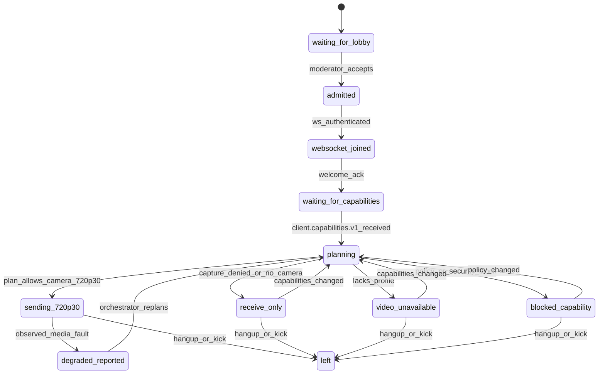

# Video Call v1 Media Contract Map

Stand: 2026-05-10

Quelle: lokale Code-Inspektion im Branch `prod-kingrt-do-not-push-to-github`,
erganzt durch parallele Agent-Analyse fuer Frontend, Backend, Edge/Ops,
Tests und Codebase-Map. Keine Runtime-Dateien wurden fuer diese Analyse
umgebaut.

## Kurzfazit

Der Video Call hat viele belastbare Einzelteile, aber noch keinen
autoritativen v1-Media-Vertrag. Der Client prueft Capabilities lokal, der
Backend-Realtime-State verwaltet Presence/Lobby/Snapshots, und SFU/Gossip/
Native/MediaSecurity/Background existieren als parallele Pfade. Fuer v1 muss
der Server aus expliziten Client-Capabilities einen `media_session_plan.v1`
berechnen und als einzige Wahrheit verteilen.

## Contract Map

| Vertrag | Heutige Quelle | Luecke | v1-Entscheidung |
| --- | --- | --- | --- |
| `client.capabilities.v1` | `runtimeCapabilities.ts`, `capturePipelineCapabilities.ts`, `lifecycle.ts` | Nur lokale Probe, nicht backend-autoritative Call-Wahrheit. | Als WebSocket-Command senden, in Presence plus persistenter Realtime-Capability-Struktur speichern, in `room/snapshot` ausliefern. |
| `media_session_plan.v1` | Kein zentrales Modul; UI-/Runtime-Orchestration verteilt in `CallWorkspaceView.vue` und `callWorkspace/*`. | Kein serverseitiger Plan fuer Transport, Profil, Security und Teilnehmerzustand. | Neues Realtime-Domain-Modul zwischen Presence, Call Access, SFU/Gossip und Snapshot. |
| `call_media_state.v1` | Presence, room snapshot, SFU remote peers, Native peers, MediaSecurity-State, Diagnostics. | Mehrere Quellen koennen widersprechen. | Snapshot bleibt autoritativ; Live-Media ist Evidenz, nicht Presence-Ersatz. |
| `media_profile.720p30` | `strictStabilityPolicy.ts`, `mediaOrchestration.ts`, SFU capture constraints, SFU tests. | Strikte Policy existiert, aber Recovery/Fallback-Pfade bleiben sichtbar. | 1280x720@30 als explizites Profil im Plan. Nicht passende Clients werden `receive_only`, `video_unavailable` oder `blocked_capability`. |
| Protected media | `contracts/v1/*media*`, `media/security.ts`, `mediaSecurityRuntime.ts`, backend `media-security-contract.php`. | Sender-Key/participant-set Drift kann Mediafluss blockieren. | Security-Policy muss Teil des Plans sein: `required`, `protected`, `blocked`; kein stiller `transport_only` Bypass. |
| Diagnostics | `client_diagnostics.php`, `call_app_diagnostics.php`, `clientDiagnostics.ts`, Call-Diagnostics-App. | Beobachtung ist gut, aber nicht Plan-Autoritaet. | Diagnostics lesen und erklaeren den Plan; sie duerfen keine verdeckten Reparaturen starten. |

## Frontend Findings

| Datei/Bereich | Verantwortung | Risiko | v1-Entscheidung |
| --- | --- | --- | --- |
| `CallWorkspaceView.vue` | Zentrale Wiring-Shell fuer Socket, Runtime, Streams, SFU, Native, Security, UI. | Sehr gross und weiterhin State-Hub. | Nicht weiter aufblasen; neue Fachlogik in Module. |
| `workspace/callWorkspace/lifecycle.ts` | Mount/Unmount, Capability-Probe, Runtime-Auswahl, Cleanup. | Lokale Auswahl entscheidet vor Backend-Plan. | Nach lokalem Probe `client.capabilities.v1` senden und Backend-Plan abwarten. |
| `media/runtimeCapabilities.ts` | WebRTC/WASM/WLVC Capability Detection. | Encoder/Decoder werden nicht gleichwertig als Call-Vertrag verteilt. | Encoder, Decoder, WebRTC, WebSocket, GPU, Camera und 720p30 getrennt melden. |
| `mediaRuntimeCapabilities.ts` | Kompatibilitaets-Wrapper. | Delegation wirkt defekt (`return c()`). | Vor Implementierung entfernen oder korrekt auf die Impl delegieren. |
| `local/mediaOrchestration.ts` | Capture, Reconfigure, Screenshare, Background, Activity Publish. | Viele Recovery- und Fallback-Pfade bleiben aktiv oder erreichbar. | Lokale Media-Action nur aus Plan ableiten. |
| `local/publisherPipeline.ts` | Encode Loop, protected frames, SFU/Gossip Dispatch. | Zentraler Timer und mehrere Carrier-Ausgaenge. | Dispatch-Ziel nur aus `media_session_plan.v1`. |
| `workspace/callWorkspace/runtimeSwitching.ts` | Runtime-Wechsel und Quality-Recovery-Probes. | Timer-basierte Quality-Recovery kann Drift erzeugen. | Runtime-Switch nur plan-/capability-getrieben. |
| `workspace/callWorkspace/runtimeHealth.ts` | Remote stall/freeze Watchdog, Keyframe, layer preference, socket restart. | Recovery kann Transportzustand veraendern. | Recovery-Policy explizit in Plan/State Machine. |
| `workspace/callWorkspace/gossipDataLane.ts` und `lib/gossipmesh/*` | Gossip topology/data lane. | Doppelzustand zu SFU/native moeglich. | Kein Default-Media-Ersatz; nur aktiv, wenn der Plan Gossip ausdruecklich auswaehlt. |
| `workspace/callWorkspace/nativeStack.ts` und `native/*` | Native WebRTC Peer- und Audio-Bridge. | Kann Fallback und Bridge gleichzeitig sein. | Stage-B/Fallback nur nach Plan, nicht als verdeckter Ersatz. |
| `workspace/callWorkspace/backgroundTabPolicy.ts` und `background/*` | Background/Tab/Preprocess-Verhalten. | Darf Publisher-Pflicht nicht still veraendern. | Optionales Preprocess-Feature, kein Media-Transport-Vertrag. |

## Backend Findings

| Datei/Bereich | Verantwortung | Risiko | v1-Entscheidung |
| --- | --- | --- | --- |
| `http/module_realtime.php` | Einstieg fuer `/ws`, `/sfu`, Attachments und Realtime-Module. | Bindet historische Pfade nah zusammen. | Neue Capability-/Plan-Module hier verdrahten, aber nicht direkt hier implementieren. |
| `http/module_realtime_websocket.php` | Auth, Upgrade, Welcome, Room Snapshot, Command Loop. | Natuerlicher Ort fuer ACK/Backfill, aber aktuell kein Media-Plan. | `client.capabilities.v1` nach Auth annehmen, ACK senden, Snapshot ausliefern. |
| `http/module_realtime_websocket_commands.php` | Secondary WS Command Dispatcher. | Capabilities wuerden sonst als normales Signaling missbraucht. | Eigenen Command fuer `client/capabilities.v1` aufnehmen. |
| `domain/realtime/realtime_presence.php` | In-Memory Connections/Rooms/Public participant shape. | Capabilities fehlen in der Connection-Projektion. | Redaktiertes `client_capabilities` pro Connection versioniert halten. |
| `domain/realtime/realtime_call_presence_db.php` | Persistente frische Realtime Presence. | Beste Stelle fuer durable Session-Capabilities fehlt noch. | Side-table oder Spalten fuer Version, JSON und Timestamp. |
| `domain/realtime/realtime_room_snapshot.php` | Baut den autoritativen Snapshot. | Kein `media_session_plan.v1` im Snapshot. | Plan als Snapshot-Teil ausliefern. |
| `domain/realtime/realtime_signaling.php` | P2P Signaling und Backfill. | Wuerde Capabilities zu ephemer verteilen. | Signaling bleibt fuer Offer/ICE/Security; Capabilities/Plan in Presence/Snapshot. |
| `domain/realtime/realtime_sfu_gateway.php` | SFU WebSocket und transport-spezifisches Session-Protokoll. | SFU kann sonst globale Orchestrator-Rolle bekommen. | SFU ist Consumer des Plans, nicht Plan-Autoritaet. |
| `domain/realtime/realtime_gossipmesh*.php` | Gossip topology, recovery, telemetry. | Alte Media-/Repair-Pfade koennen nebenher aktiv werden. | Nur nach serverseitigem Plan aktivieren; sonst parken. |
| `http/module_realtime_media_fanout_guard.php` | Blockiert normale Mediaframes auf Control-WS. | Kritischer Sicherheits-/Architektur-Guard. | Behalten; `/ws` bleibt Control Plane. |
| `http/module_realtime_gossip_media_relay.php` | Separater room-bound Gossip Media Relay Socket. | Darf nicht Default-Fallback werden. | Parken, bis Plan ihn ausdruecklich auswaehlt. |

## Edge, Deploy, Ops Findings

| Bereich | Befund | v1-Folge |
| --- | --- | --- |
| Edge Routing | `/api`, `/ws`, Static, Call-App Assets und optional `/sfu` sind routbar. | Edge ist brauchbar, aber Media-Plane muss vom Plan bestimmt werden. |
| Docker Compose | SFU ist ein eigenes `sfu` Profil. | Deploy-Status und Tests muessen dasselbe Aktivierungsmodell verwenden. |
| Deploy Script | Prod-Deploy deaktiviert aktuell SFU und startet Edge/TURN, nicht SFU. | SFU darf nicht als hartes Gate gelten, solange Deploy sie deaktiviert. |
| Deploy Smoke | Erwartet teilweise `/sfu` Handshakes. | Smoke in Domain/Admin/Ops-Gates und echte SFU-Gates trennen. |
| Prod Debug | Liefert read-only Runtime, Asset, API/WS/SFU, Call-App CSP, Compose und Logs. | Als Diagnose-Preflight/Postmortem behalten, nicht als Release-Freigabe allein. |
| Admin Infrastructure | Liefert Deployment, Nodes, Services, OTel, Scaling. | Gut fuer Ops-Readiness und Secret-Oberflaeche. |
| Video Operations | Zaehlt Live Calls aus frischer Presence und SFU Publisher separat. | Gut fuer Presence/Operations, kein Media-Erfolgsgate. |

## Tests: Keep, Update, Park, Neu

| Kategorie | Entscheidung | Beispiele |
| --- | --- | --- |
| Keep | MediaSecurity, Lobby/Access, Call-App, negative media-safety regressions, Diagnostics. | `media-security-contract.*`, `realtime-lobby-*`, `call-app-*`, `client-diagnostics-contract.*`. |
| Update | SFU-only und Recovery-only Tests auf Capability/Orchestrator-Vertrag umbauen. | `test:contract:sfu`, `realtime-sfu-contract.php`, `sfu-strict-720p30-runtime-contract.mjs`, production SFU smokes. |
| Park | Gossip-as-media-carrier, alte Regression-Harnesses, implizite Gossip/SFU Repair Gates. | `test:contract:gossip`, `gossip-media-carrier-*`, `kingrt-three-user-regression-harness-contract.mjs`. |
| Neu | Media-Capability, Orchestrator-Selection, Session-Acceptance, 720p30-Profil, Recovery-Policy, Background-Capability, E2E Orchestrated Acceptance. | Neue Contract-Suite rund um `client.capabilities.v1` und `media_session_plan.v1`. |

## State Machine



## Payload Boundary

`client.capabilities.v1` darf nur redaktierte Faehigkeiten enthalten:

```json
{
  "schema_version": "king.video.client_capabilities.v1",
  "participant_session_id": "call-session-id",
  "media": {
    "camera": true,
    "camera_720p30": true,
    "microphone": true,
    "screen_share": true
  },
  "runtime": {
    "websocket": true,
    "webrtc": true,
    "webassembly": true,
    "webcodecs": false,
    "gpu": "available_or_unknown",
    "wlvc_encoder": true,
    "wlvc_decoder": true
  },
  "constraints": {
    "video_width": 1280,
    "video_height": 720,
    "video_fps": 30
  }
}
```

Nicht erlaubt: Tokens, Cookies, SDP, rohe ICE Candidates, Frames, private
Device Labels, Secrets.

`media_session_plan.v1` muss mindestens enthalten:

```json
{
  "schema_version": "king.video.media_session_plan.v1",
  "call_id": "uuid",
  "plan_epoch": 1,
  "participants": [
    {
      "participant_session_id": "call-session-id",
      "media_state": "sending_720p30",
      "profile": "720p30",
      "transport": "planned_transport",
      "security_policy": "required"
    }
  ]
}
```

## Konkrete Next-Sprint Tickets

1. Implement `client.capabilities.v1` WebSocket command, ACK and redacted
   presence projection.
2. Add persistent realtime capability storage tied to fresh presence sessions.
3. Implement `media_session_plan.v1` as backend Realtime Domain module and add
   it to `room/snapshot`.
4. Make frontend runtime selection consume the server plan instead of making
   final transport decisions locally.
5. Split deploy smoke expectations: Domain/Admin/Ops gate versus SFU-specific
   gate.
6. Convert SFU/Gossip/Recovery tests into orchestrator/capability tests, and
   park historical media-carrier regression harnesses.

## Proof

Inspected areas:

- Frontend workspace, runtime, local media, SFU, Gossip, Native, Security,
  Background and Call Diagnostics files.
- Backend Realtime, Presence, Room Snapshot, Call Access, SFU, Gossip, Media
  Fanout Guard, Diagnostics and Ops files.
- Edge routing, Docker Compose, deploy/prod-debug/smoke scripts and admin
  ops surfaces.
- Frontend and backend contract/e2e test suites for SFU, Gossip, MediaSecurity,
  Lobby, Call Apps, Diagnostics and production smokes.

Commands/proofs run in this loop:

- `find . -maxdepth 1 -type f -name '*.md' -printf '%f\n' | sort`
- `sed -n '1,260p' analyse/video-call-v1-codebase-map.md`
- `sed -n '1,260p' analyse/readiness-check.md`
- `sed -n '1,260p' analyse/architecture.md`
- `sed -n '1,260p' BACKLOG.md`

No deploy was run because the active sprint is analysis-only and contains no
runtime change.
