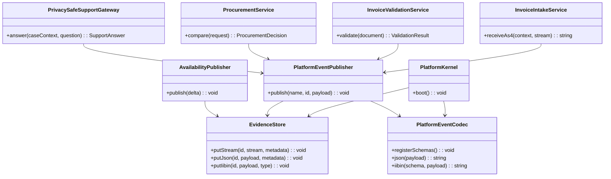

# E-Invoicing, EDI, and B2B Commerce Platform: OO Implementation

This page implements the architecture from
[E-Invoicing, EDI, and B2B Commerce Platform](e-invoicing-commerce-platform.md)
as OO services. Each operation publishes a readable JSON event first and then
the same payload as `Next Level: IIBIN` when the contract is ready for compact
internal handoff.

## Component Model



The OO layer owns invariants: tenant authorization, idempotency, immutable
evidence, privacy minimization, state transitions, event publication, and
workflow dispatch. King primitives remain visible, but they are called through
services that preserve those invariants.

## Bootstrap and Evidence Store

```php
<?php
declare(strict_types=1);

use King\Config;
use King\MCP;
use King\ObjectStore;
use King\PipelineOrchestrator;
use King\XSLT\Processor;

final class PlatformKernel
{
    public function __construct(
        private readonly string $stateRoot,
        private readonly string $nodeId,
        private readonly PlatformEventCodec $events,
    ) {}

    public function boot(): void
    {
        king_system_init([
            'cluster_id' => 'b2b-einvoice-platform',
            'node_id' => $this->nodeId,
            'state_root_path' => $this->stateRoot . '/system',
            'components' => ['client', 'server', 'object_store', 'pipeline_orchestrator', 'telemetry', 'mcp', 'iibin'],
        ]);

        ObjectStore::init([
            'primary_backend' => 'local_fs',
            'storage_root_path' => $this->stateRoot . '/objects',
            'max_storage_size_bytes' => 500 * 1024 * 1024 * 1024,
        ]);

        $this->events->registerSchemas();
    }
}

final class EvidenceStore
{
    public function putStream(string $objectId, mixed $stream, array $metadata): void
    {
        ObjectStore::putFromStream($objectId, $stream, $metadata + ['stored_at' => date(DATE_ATOM)]);
    }

    public function putJson(string $objectId, array $payload, array $metadata = []): void
    {
        ObjectStore::put($objectId, json_encode($payload, JSON_THROW_ON_ERROR), $metadata + [
            'content_type' => 'application/json',
            'stored_at' => date(DATE_ATOM),
        ]);
    }

    public function putIibin(string $objectId, string $payload, string $eventType): void
    {
        ObjectStore::put($objectId, $payload, [
            'content_type' => 'application/x-king-iibin',
            'object_type' => $eventType,
            'stored_at' => date(DATE_ATOM),
        ]);
    }
}
```

`PlatformKernel` starts the coordinated runtime and registers IIBIN schemas
once. `EvidenceStore` centralizes object-store metadata so raw AS4 envelopes,
JSON event evidence, IIBIN events, validation reports, support audits, and
procurement offer sets are stored consistently.

## Event Codec

### Event Payload: JSON

```php
<?php
final class PlatformEventCodec
{
    public function json(array $payload): string
    {
        return json_encode($payload, JSON_THROW_ON_ERROR | JSON_UNESCAPED_SLASHES);
    }

    public function iibin(string $schema, array $payload): string
    {
        return king_proto_encode($schema, $payload);
    }

    public function registerSchemas(): void
    {
        king_proto_define_schema('InvoiceIntakeEvent', [
            'tenant_id' => ['tag' => 1, 'type' => 'int32', 'required' => true],
            'message_id' => ['tag' => 2, 'type' => 'string', 'required' => true],
            'partner_id' => ['tag' => 3, 'type' => 'string', 'required' => true],
            'raw_object_id' => ['tag' => 4, 'type' => 'string', 'required' => true],
            'transport' => ['tag' => 5, 'type' => 'string', 'default' => 'as4'],
            'state' => ['tag' => 6, 'type' => 'string', 'required' => true],
            'trace_id' => ['tag' => 7, 'type' => 'string', 'required' => true],
        ]);

        king_proto_define_schema('InvoiceValidationEvent', [
            'tenant_id' => ['tag' => 1, 'type' => 'int32', 'required' => true],
            'invoice_id' => ['tag' => 2, 'type' => 'string', 'required' => true],
            'profile' => ['tag' => 3, 'type' => 'string', 'required' => true],
            'status' => ['tag' => 4, 'type' => 'string', 'required' => true],
            'report_object_id' => ['tag' => 5, 'type' => 'string', 'required' => true],
            'error_count' => ['tag' => 6, 'type' => 'int32', 'default' => 0],
        ]);

        king_proto_define_schema('ProcurementDecisionEvent', [
            'tenant_id' => ['tag' => 1, 'type' => 'int32', 'required' => true],
            'sku' => ['tag' => 2, 'type' => 'string', 'required' => true],
            'quantity' => ['tag' => 3, 'type' => 'int32', 'required' => true],
            'chosen_supplier_id' => ['tag' => 4, 'type' => 'string', 'required' => true],
            'currency' => ['tag' => 5, 'type' => 'string', 'default' => 'EUR'],
            'total_cents' => ['tag' => 6, 'type' => 'int32', 'required' => true],
            'offer_cache_object_id' => ['tag' => 7, 'type' => 'string', 'required' => true],
        ]);

        king_proto_define_schema('SupportToolRequest', [
            'tenant_id' => ['tag' => 1, 'type' => 'string', 'required' => true],
            'support_case_id' => ['tag' => 2, 'type' => 'string', 'required' => true],
            'purpose' => ['tag' => 3, 'type' => 'string', 'required' => true],
            'question' => ['tag' => 4, 'type' => 'string', 'required' => true],
            'invoice_ref' => ['tag' => 5, 'type' => 'string', 'required' => true],
            'allowed_fields' => ['tag' => 6, 'type' => 'string', 'repeated' => true],
        ]);

        king_proto_define_schema('SupportToolResponse', [
            'answer' => ['tag' => 1, 'type' => 'string', 'required' => true],
            'confidence' => ['tag' => 2, 'type' => 'double'],
            'source_count' => ['tag' => 3, 'type' => 'uint32'],
        ]);

        king_proto_define_schema('SupportToolAuditEvent', [
            'tenant_id' => ['tag' => 1, 'type' => 'int32', 'required' => true],
            'support_case_id' => ['tag' => 2, 'type' => 'string', 'required' => true],
            'tool' => ['tag' => 3, 'type' => 'string', 'required' => true],
            'purpose' => ['tag' => 4, 'type' => 'string', 'required' => true],
            'input_classification' => ['tag' => 5, 'type' => 'string', 'required' => true],
            'retention_policy' => ['tag' => 6, 'type' => 'string', 'required' => true],
        ]);
    }
}
```

### Next Level: IIBIN

```php
<?php
final class PlatformEventPublisher
{
    public function __construct(
        private readonly EvidenceStore $store,
        private readonly PlatformEventCodec $codec,
    ) {}

    public function publish(string $schema, string $objectBase, array $payload): string
    {
        $this->store->putJson($objectBase . '.json', $payload, [
            'object_type' => $schema . '-json-event',
        ]);

        $this->store->putIibin(
            $objectBase . '.iibin',
            $this->codec->iibin($schema, $payload),
            $schema . '-iibin-event'
        );

        return $objectBase . '.iibin';
    }
}
```

The publisher deliberately writes JSON first. Humans, support staff, and
operations can inspect that artifact. IIBIN is the next level for worker
handoff, compact storage, and versioned internal contracts.

## AS4 Intake Service

```php
<?php
final class InvoiceIntakeService
{
    public function __construct(
        private readonly EvidenceStore $store,
        private readonly PlatformEventPublisher $events,
        private readonly PartnerPolicy $policy,
        private readonly IdempotencyLedger $idempotency,
    ) {}

    public function receiveAs4(As4Context $context, mixed $envelopeStream): string
    {
        $this->policy->assertAllowed($context->tenantId, $context->partnerId, 'invoice.receive');

        $key = hash('sha256', $context->tenantId . ':' . $context->messageId);
        if (!$this->idempotency->claim($key)) {
            return 'duplicate';
        }

        $rawObjectId = sprintf('inbound/as4/%d/%s.xml', $context->tenantId, $context->messageId);
        $this->store->putStream($rawObjectId, $envelopeStream, [
            'content_type' => 'application/soap+xml',
            'object_type' => 'as4-inbound-envelope',
            'tenant_id' => $context->tenantId,
            'partner_id' => $context->partnerId,
            'idempotency_key' => $key,
        ]);

        $eventObjectId = $this->events->publish('InvoiceIntakeEvent', 'events/invoice-intake/' . $context->messageId, [
            'tenant_id' => $context->tenantId,
            'message_id' => $context->messageId,
            'partner_id' => $context->partnerId,
            'raw_object_id' => $rawObjectId,
            'transport' => 'as4',
            'state' => 'received',
            'trace_id' => 'as4-' . $context->messageId,
        ]);

        PipelineOrchestrator::dispatch(
            ['event_object_id' => $eventObjectId],
            [['tool' => 'verify-as4-envelope'], ['tool' => 'extract-business-document'], ['tool' => 'validate-invoice-profile']],
            ['trace_id' => 'as4-' . $context->messageId]
        );

        return 'accepted_for_processing';
    }
}
```

The service writes raw evidence, JSON event evidence, and IIBIN event handoff
before dispatching the workflow. That ordering prevents receipts without audit
evidence and worker jobs without reconstructable input.

## Validation Service

```php
<?php
final class InvoiceValidationService
{
    public function __construct(
        private readonly Processor $xslt,
        private readonly EvidenceStore $store,
        private readonly PlatformEventPublisher $events,
    ) {}

    public function validate(InvoiceDocument $document): ValidationResult
    {
        $svrlPath = sys_get_temp_dir() . '/' . $document->invoiceId . '.svrl.xml';
        $this->xslt->transformToFile($document->xmlPath, $this->rulesetFor($document->profile), $svrlPath, [
            'properties' => ['indent' => 'yes'],
        ]);

        $errors = parse_svrl_failed_asserts($svrlPath);
        $status = count($errors) === 0 ? 'valid' : 'invalid';
        $reportObjectId = 'validation/' . $document->tenantId . '/' . $document->invoiceId . '.svrl.xml';

        $this->store->putStream($reportObjectId, fopen($svrlPath, 'rb'), [
            'content_type' => 'application/xml',
            'object_type' => 'invoice-validation-report',
            'tenant_id' => $document->tenantId,
            'invoice_id' => $document->invoiceId,
        ]);

        $this->events->publish('InvoiceValidationEvent', 'events/invoice-validation/' . $document->invoiceId, [
            'tenant_id' => $document->tenantId,
            'invoice_id' => $document->invoiceId,
            'profile' => $document->profile,
            'status' => $status,
            'report_object_id' => $reportObjectId,
            'error_count' => count($errors),
        ]);

        return new ValidationResult($status, $reportObjectId, $errors);
    }

    private function rulesetFor(string $profile): string
    {
        return __DIR__ . '/rules/' . $profile . '.xsl';
    }
}
```

Business validation failures become validation results, not generic exceptions.
The JSON report event is readable; the IIBIN event is the next-level contract
for downstream workers.

## Procurement Service

```php
<?php
final class ProcurementService
{
    public function __construct(
        private readonly EvidenceStore $store,
        private readonly PlatformEventPublisher $events,
        private readonly SupplierDirectory $suppliers,
    ) {}

    public function compare(ProcurementRequest $request): ProcurementDecision
    {
        $awaitables = [];
        foreach ($this->suppliers->forSku($request->sku) as $supplier) {
            $awaitables[$supplier->id] = king_client_send_request_async(
                $supplier->endpoint,
                'QUERY',
                ['accept' => 'application/json', 'content-type' => 'application/query'],
                $this->queryBody($request),
                ['timeout_ms' => 1500]
            );
        }

        $offers = [];
        foreach ($awaitables as $supplierId => $awaitable) {
            $response = king_await($awaitable, 2000);
            $offers[$supplierId] = json_decode($response['body'], true, flags: JSON_THROW_ON_ERROR);
        }

        $decision = ProcurementDecision::fromOffers($request, $offers);
        $offerObjectId = 'procurement/offers/' . $decision->id . '.json';

        $this->store->putJson($offerObjectId, $offers, [
            'object_type' => 'procurement-offer-set',
            'cache_ttl_sec' => 120,
        ]);

        $this->events->publish('ProcurementDecisionEvent', 'events/procurement/' . $decision->id, [
            'tenant_id' => $request->tenantId,
            'sku' => $request->sku,
            'quantity' => $request->quantity,
            'chosen_supplier_id' => $decision->supplierId,
            'currency' => $decision->currency,
            'total_cents' => $decision->totalCents,
            'offer_cache_object_id' => $offerObjectId,
        ]);

        return $decision;
    }

    private function queryBody(ProcurementRequest $request): string
    {
        return sprintf('sku = "%s" AND quantity >= %d', addslashes($request->sku), $request->quantity);
    }
}
```

Supplier calls are concurrent and bounded. The service stores the full offer
set separately and emits a compact decision event that points to it.

## Privacy-Safe Support Gateway

```php
<?php
final class InternalMcpPeerFactory
{
    public function supportPeer(string $host, int $port): MCP
    {
        return new MCP($host, $port, new Config([
            'mcp.default_request_timeout_ms' => 1500,
            'mcp.iibin_routes' => [
                'support.faq/answer' => [
                    'request_schema' => 'SupportToolRequest',
                    'response_schema' => 'SupportToolResponse',
                    'decode_as_object' => false,
                ],
            ],
        ]));
    }
}

final class PrivacySafeSupportGateway
{
    public function __construct(
        private readonly MCP $mcp,
        private readonly PlatformEventPublisher $events,
        private readonly SupportPolicy $policy,
    ) {}

    public function answer(SupportCaseContext $case, string $question): SupportAnswer
    {
        $tool = 'support.faq';
        $toolInput = [
            'tenant_id' => $case->tenantId,
            'purpose' => 'support_case_answer',
            'support_case_id' => $case->caseId,
            'question' => redact_personal_data($question),
            'invoice_ref' => hash_hmac('sha256', $case->invoiceId, 'tenant-' . $case->tenantId),
            'allowed_fields' => ['status', 'received_at', 'rejection_code'],
        ];

        $this->policy->assertToolAllowed($case->userId, $case->tenantId, $tool, $toolInput);
        $answer = SupportAnswer::fromDecodedPayload(
            $this->mcp->requestIibin($tool, 'answer', $toolInput)
        );

        $this->events->publish('SupportToolAuditEvent', 'events/support-tools/' . $case->caseId, [
            'tenant_id' => $case->tenantId,
            'support_case_id' => $case->caseId,
            'tool' => $tool,
            'purpose' => 'support_case_answer',
            'input_classification' => 'redacted-support-context',
            'retention_policy' => 'support-audit-180d',
        ]);

        return $answer->confidence >= 0.75
            ? $answer
            : SupportAnswer::manualReviewRequired($answer->sources);
    }
}
```

The gateway strips direct identifiers before the internal King MCP peer. The
IIBIN request and response schemas are fixed in the `King\Config` used to
construct that peer connection; a support call cannot change schemas at
runtime. JSON audit evidence records what class of data was used; IIBIN gives
downstream compliance workers a stable event without storing the redacted
support question again.

## Availability Publisher

```php
<?php
final class AvailabilityPublisher
{
    /** @var array<string, list<resource>> */
    private array $subscribers = [];

    public function __construct(private readonly EvidenceStore $store) {}

    public function subscribe(string $sku, mixed $websocket): void
    {
        $this->subscribers[$sku][] = $websocket;
    }

    public function publish(AvailabilityDelta $delta): void
    {
        $event = [
            'type' => 'availability.changed',
            'tenant_id' => $delta->tenantId,
            'sku' => $delta->sku,
            'available_quantity' => $delta->availableQuantity,
            'warehouse' => $delta->warehouse,
            'changed_at' => date(DATE_ATOM),
        ];

        $snapshotObjectId = 'availability/' . $delta->tenantId . '/' . $delta->sku . '.json';
        $this->store->putJson($snapshotObjectId, $event, [
            'object_type' => 'availability-snapshot',
            'cache_ttl_sec' => 30,
        ]);

        foreach ($this->subscribers[$delta->sku] ?? [] as $index => $websocket) {
            if (!is_resource($websocket) || !king_websocket_send($websocket, json_encode($event, JSON_THROW_ON_ERROR))) {
                unset($this->subscribers[$delta->sku][$index]);
            }
        }
    }
}
```

Availability is JSON-first because the shop needs readable payloads. If the
same event becomes an internal worker contract, promote that payload through
the same `PlatformEventPublisher` and add a dedicated IIBIN schema.
