# E-Invoicing, EDI, and B2B Commerce Platform

This page documents a production-grade King architecture for a B2B commerce
and e-invoicing platform. It covers AS4 invoice exchange, EDIFACT processing,
XSLT validation, catalog import, live availability, procurement across
supplier APIs, privacy-safe MCP support, JSON event contracts, and the next
level IIBIN representation for internal platform events.

The companion page shows the same design as OO service composition:
[E-Invoicing, EDI, and B2B Commerce Platform: OO Implementation](e-invoicing-commerce-platform-oo.md).

## Event Strategy

External protocols keep their mandated formats: AS4/SOAP, UBL, CII, EDIFACT,
supplier JSON/XML, and authority payloads are stored as immutable evidence.
Inside the platform, every meaningful state transition is first shaped as a
readable JSON event. The next level is the same event encoded as IIBIN for
compact internal handoff, stable schemas, and fast worker communication.

JSON is the review and troubleshooting format. IIBIN is the runtime event
format once the contract is stable. Both reference durable object IDs instead
of copying full invoices, PDFs, buyer addresses, payment data, or chat text
into every event.

## Overall Architecture

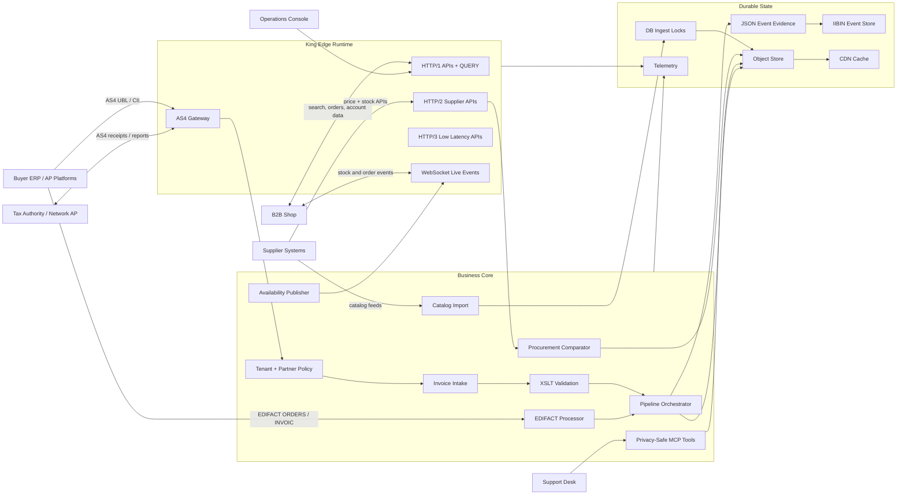

The edge runtime owns protocol work and does not decide business acceptance.
AS4 handles signed and encrypted exchange, HTTP handles platform APIs,
WebSocket delivers committed live changes, and supplier integrations use
bounded HTTP awaitables. The core normalizes every external message into a
workflow state with object-store evidence and a typed event.

## End-to-End Process

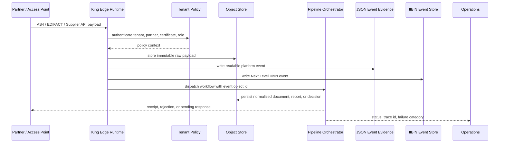

Transport success is not business acceptance. Between receipt and final
acceptance the platform uses explicit states: `received`, `duplicate`,
`validated`, `rejected`, `authority_pending`, `accepted`, `manual_review`, or
`aborted`.

## AS4 Invoice Intake

### Architecture

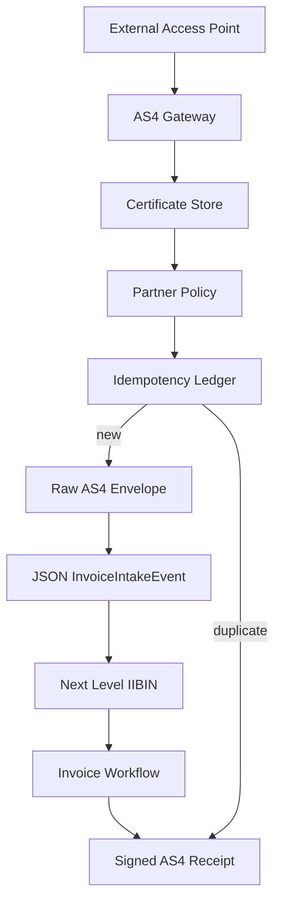

### Process

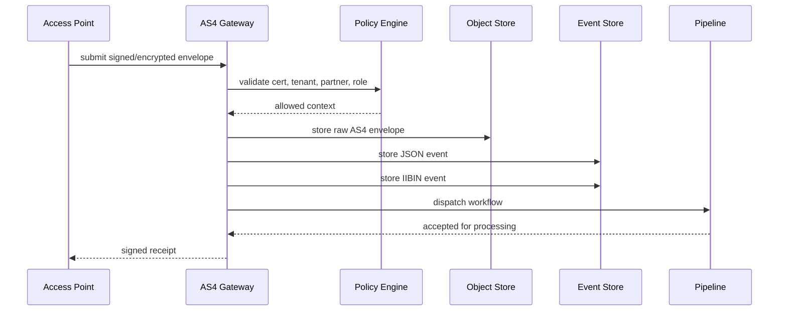

```php
<?php
use King\ObjectStore;
use King\PipelineOrchestrator;

$idempotencyKey = hash('sha256', $tenantId . ':' . $messageId);
if (!partner_policy_allows($tenantId, $partnerId, 'invoice.receive')) {
    throw new RuntimeException('partner_policy_denied');
}
if (message_already_processed($idempotencyKey)) {
    return signed_as4_receipt($messageId, 'duplicate');
}

$rawObjectId = 'inbound/as4/' . $tenantId . '/' . $messageId . '.xml';
ObjectStore::putFromStream($rawObjectId, $as4EnvelopeStream, [
    'content_type' => 'application/soap+xml',
    'object_type' => 'as4-inbound-envelope',
    'tenant_id' => $tenantId,
    'partner_id' => $partnerId,
    'idempotency_key' => $idempotencyKey,
]);
```

#### Event Payload: JSON

```php
<?php
$eventPayload = [
    'tenant_id' => $tenantId,
    'message_id' => $messageId,
    'partner_id' => $partnerId,
    'raw_object_id' => $rawObjectId,
    'transport' => 'as4',
    'state' => 'received',
    'trace_id' => 'as4-' . $messageId,
];

ObjectStore::put('events/invoice-intake/' . $messageId . '.json', json_encode($eventPayload, JSON_THROW_ON_ERROR), [
    'content_type' => 'application/json',
    'object_type' => 'invoice-intake-event-json',
]);
```

#### Next Level: IIBIN

```php
<?php
king_proto_define_schema('InvoiceIntakeEvent', [
    'tenant_id' => ['tag' => 1, 'type' => 'int32', 'required' => true],
    'message_id' => ['tag' => 2, 'type' => 'string', 'required' => true],
    'partner_id' => ['tag' => 3, 'type' => 'string', 'required' => true],
    'raw_object_id' => ['tag' => 4, 'type' => 'string', 'required' => true],
    'transport' => ['tag' => 5, 'type' => 'string', 'default' => 'as4'],
    'state' => ['tag' => 6, 'type' => 'string', 'required' => true],
    'trace_id' => ['tag' => 7, 'type' => 'string', 'required' => true],
]);

$eventObjectId = 'events/invoice-intake/' . $messageId . '.iibin';
ObjectStore::put($eventObjectId, king_proto_encode('InvoiceIntakeEvent', $eventPayload), [
    'content_type' => 'application/x-king-iibin',
    'object_type' => 'invoice-intake-event',
]);

PipelineOrchestrator::dispatch(
    ['event_object_id' => $eventObjectId],
    [['tool' => 'verify-as4-envelope'], ['tool' => 'extract-business-document'], ['tool' => 'validate-invoice-profile']],
    ['trace_id' => $eventPayload['trace_id']]
);
```

The AS4 gateway is a trust boundary. It validates certificates, partner
policy, tenant ownership, and idempotency before the business workflow sees
anything. The event references the raw envelope instead of duplicating invoice
content into the event stream.

## Invoice Validation

### Architecture

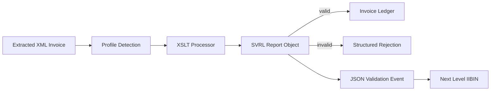

### Process

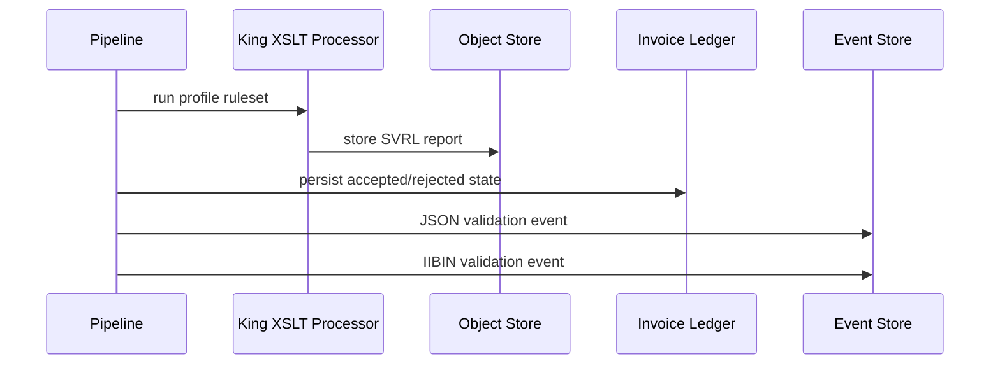

```php
<?php
use King\XSLT\Processor;

$processor = new Processor([
    'cwd' => __DIR__ . '/rules',
    'properties' => ['http://saxon.sf.net/feature/version-warning' => 'false'],
]);

$processor->transformToFile($invoiceXmlPath, profile_ruleset_path($profile), $svrlPath, [
    'properties' => ['indent' => 'yes'],
]);

$errorCount = count_svrl_failed_asserts($svrlPath);
$status = $errorCount === 0 ? 'valid' : 'invalid';
$reportObjectId = 'validation/' . $tenantId . '/' . $invoiceId . '.svrl.xml';

king_object_store_put($reportObjectId, file_get_contents($svrlPath), [
    'content_type' => 'application/xml',
    'object_type' => 'invoice-validation-report',
    'tenant_id' => $tenantId,
]);
```

#### Event Payload: JSON

```php
<?php
$eventPayload = [
    'tenant_id' => $tenantId,
    'invoice_id' => $invoiceId,
    'profile' => $profile,
    'status' => $status,
    'report_object_id' => $reportObjectId,
    'error_count' => $errorCount,
];

king_object_store_put('events/invoice-validation/' . $invoiceId . '.json', json_encode($eventPayload, JSON_THROW_ON_ERROR), [
    'content_type' => 'application/json',
]);
```

#### Next Level: IIBIN

```php
<?php
king_proto_define_schema('InvoiceValidationEvent', [
    'tenant_id' => ['tag' => 1, 'type' => 'int32', 'required' => true],
    'invoice_id' => ['tag' => 2, 'type' => 'string', 'required' => true],
    'profile' => ['tag' => 3, 'type' => 'string', 'required' => true],
    'status' => ['tag' => 4, 'type' => 'string', 'required' => true],
    'report_object_id' => ['tag' => 5, 'type' => 'string', 'required' => true],
    'error_count' => ['tag' => 6, 'type' => 'int32', 'default' => 0],
]);

king_object_store_put('events/invoice-validation/' . $invoiceId . '.iibin', king_proto_encode('InvoiceValidationEvent', $eventPayload), [
    'content_type' => 'application/x-king-iibin',
]);
```

Validation failures are not generic runtime failures. XML parse errors,
schema violations, Schematron assertions, duplicate documents, profile
mismatches, and external authority rejections should become separate states
that can be shown to support, customers, and operations.

## EDIFACT and Procurement

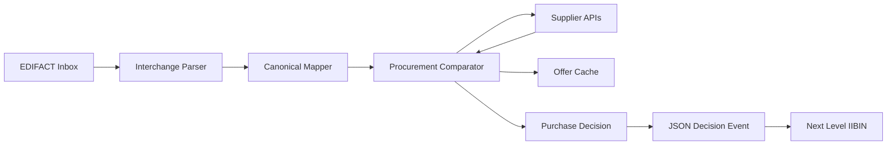

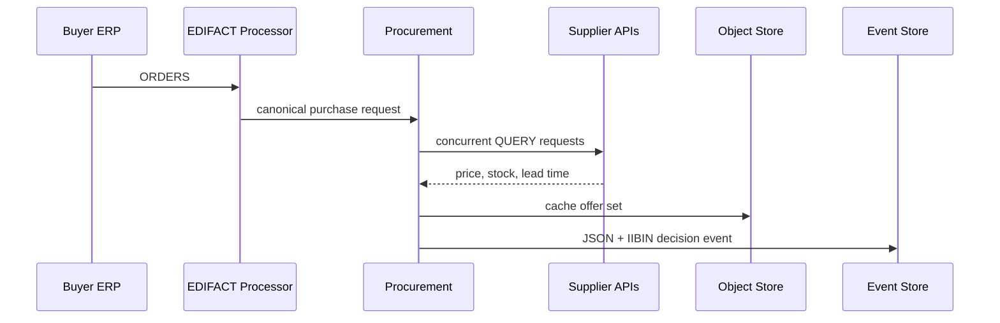

```php
<?php
$awaitables = [];
foreach ($supplierEndpoints as $supplierId => $url) {
    $awaitables[$supplierId] = king_client_send_request_async(
        $url,
        'QUERY',
        ['accept' => 'application/json', 'content-type' => 'application/query'],
        build_supplier_query($sku, $quantity, $deliveryCountry),
        ['timeout_ms' => 1500]
    );
}

$offers = collect_supplier_offers($awaitables, 2000);
$decision = choose_supplier_offer($offers, [
    'quantity' => $quantity,
    'currency' => 'EUR',
    'required_delivery_date' => $requiredDeliveryDate,
]);

$offerObjectId = 'procurement/offers/' . $decision['request_id'] . '.json';
king_object_store_put($offerObjectId, json_encode($offers, JSON_THROW_ON_ERROR), [
    'content_type' => 'application/json',
    'cache_ttl_sec' => 120,
]);
```

#### Event Payload: JSON

```php
<?php
$eventPayload = [
    'tenant_id' => $tenantId,
    'sku' => $sku,
    'quantity' => $quantity,
    'chosen_supplier_id' => $decision['supplier_id'],
    'currency' => $decision['currency'],
    'total_cents' => $decision['total_cents'],
    'offer_cache_object_id' => $offerObjectId,
];

king_object_store_put('events/procurement/' . $decision['request_id'] . '.json', json_encode($eventPayload, JSON_THROW_ON_ERROR), [
    'content_type' => 'application/json',
]);
```

#### Next Level: IIBIN

```php
<?php
king_proto_define_schema('ProcurementDecisionEvent', [
    'tenant_id' => ['tag' => 1, 'type' => 'int32', 'required' => true],
    'sku' => ['tag' => 2, 'type' => 'string', 'required' => true],
    'quantity' => ['tag' => 3, 'type' => 'int32', 'required' => true],
    'chosen_supplier_id' => ['tag' => 4, 'type' => 'string', 'required' => true],
    'currency' => ['tag' => 5, 'type' => 'string', 'default' => 'EUR'],
    'total_cents' => ['tag' => 6, 'type' => 'int32', 'required' => true],
    'offer_cache_object_id' => ['tag' => 7, 'type' => 'string', 'required' => true],
]);

king_object_store_put('events/procurement/' . $decision['request_id'] . '.iibin', king_proto_encode('ProcurementDecisionEvent', $eventPayload), [
    'content_type' => 'application/x-king-iibin',
]);
```

Procurement decisions include price, lead time, stock, minimum order quantity,
currency, tax handling, delivery constraints, reliability, and cached fallback
policy. The event references the full offer set instead of embedding it.

## Catalog and Live Availability

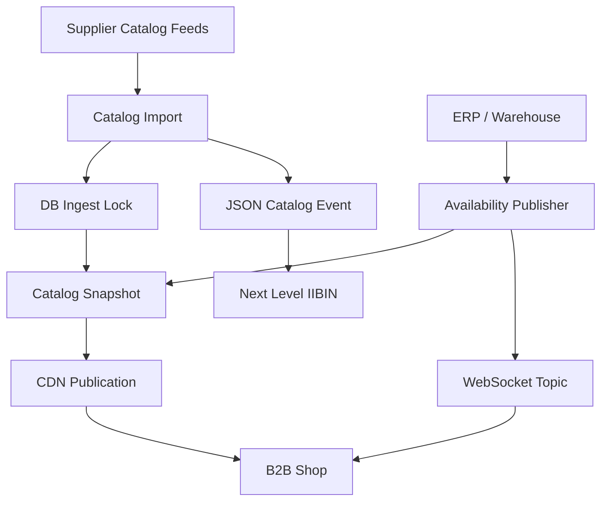

```php
<?php
$result = king_db_ingest('catalog-' . $tenantId . '-' . $supplierId, function () use ($rows): array {
    return write_catalog_rows_transactionally($rows);
}, [
    'lock_path' => __DIR__ . '/var/catalog-' . $tenantId . '.lock',
    'timeout_ms' => 5000,
]);

$snapshotObjectId = 'catalog/snapshots/' . $tenantId . '/' . $importId . '.json';
king_object_store_put($snapshotObjectId, json_encode($result['snapshot'], JSON_THROW_ON_ERROR), [
    'content_type' => 'application/json',
    'object_type' => 'catalog-snapshot',
    'cache_ttl_sec' => 300,
]);

king_cdn_cache_object($snapshotObjectId, ['ttl_sec' => 300]);
```

#### Event Payload: JSON

```php
<?php
$eventPayload = [
    'tenant_id' => $tenantId,
    'supplier_id' => $supplierId,
    'snapshot_object_id' => $snapshotObjectId,
    'changed_count' => count($result['changed_skus']),
];

king_object_store_put('events/catalog/' . $importId . '.json', json_encode($eventPayload, JSON_THROW_ON_ERROR), [
    'content_type' => 'application/json',
]);
```

#### Next Level: IIBIN

```php
<?php
king_proto_define_schema('CatalogPublishedEvent', [
    'tenant_id' => ['tag' => 1, 'type' => 'int32', 'required' => true],
    'supplier_id' => ['tag' => 2, 'type' => 'string', 'required' => true],
    'snapshot_object_id' => ['tag' => 3, 'type' => 'string', 'required' => true],
    'changed_count' => ['tag' => 4, 'type' => 'int32', 'required' => true],
]);

king_object_store_put('events/catalog/' . $importId . '.iibin', king_proto_encode('CatalogPublishedEvent', $eventPayload), [
    'content_type' => 'application/x-king-iibin',
]);
```

Catalog publication is two-phase: commit the new state first, then publish
cacheable objects and live notifications. WebSocket clients can always recover
from the latest snapshot after reconnect.

## Privacy-Safe MCP Support

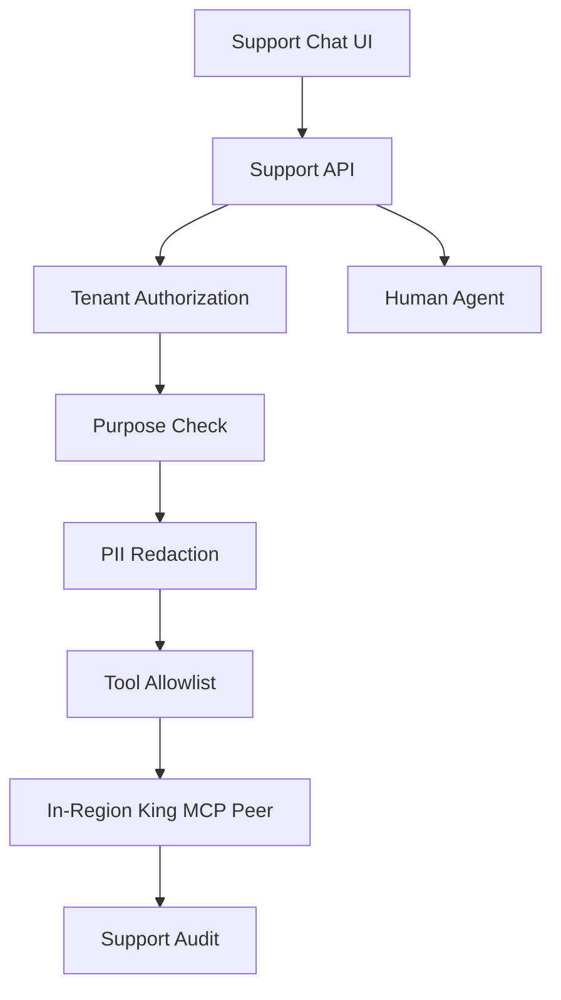

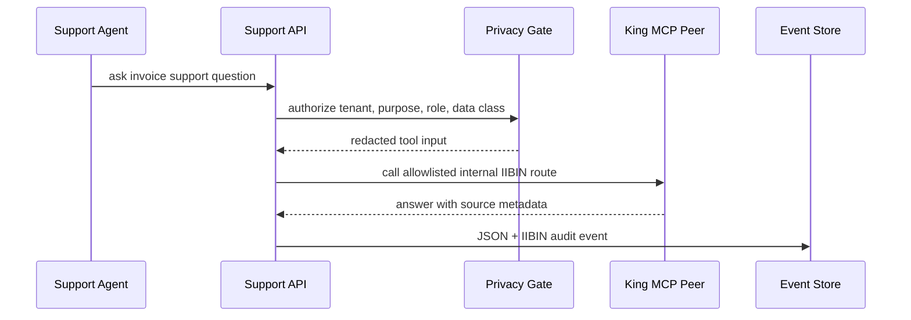

```php
<?php
use King\MCP;
use King\Config;

king_proto_define_schema('SupportToolRequest', [
    'tenant_id' => ['tag' => 1, 'type' => 'string', 'required' => true],
    'support_case_id' => ['tag' => 2, 'type' => 'string', 'required' => true],
    'purpose' => ['tag' => 3, 'type' => 'string', 'required' => true],
    'question' => ['tag' => 4, 'type' => 'string', 'required' => true],
    'invoice_ref' => ['tag' => 5, 'type' => 'string', 'required' => true],
    'allowed_fields' => ['tag' => 6, 'type' => 'string', 'repeated' => true],
]);

king_proto_define_schema('SupportToolResponse', [
    'answer' => ['tag' => 1, 'type' => 'string', 'required' => true],
    'confidence' => ['tag' => 2, 'type' => 'double'],
    'source_count' => ['tag' => 3, 'type' => 'uint32'],
]);

$toolInput = build_redacted_support_context(
    tenantId: $tenantId,
    caseId: $caseId,
    question: $customerQuestion,
    invoiceId: $invoiceId,
    allowedFields: ['status', 'received_at', 'rejection_code']
);

assert_support_tool_allowed($currentUser, $tenantId, 'support.faq', $toolInput);

$mcpConfig = new Config([
    'mcp.default_request_timeout_ms' => 1500,
    'mcp.iibin_routes' => [
        'support.faq/answer' => [
            'request_schema' => 'SupportToolRequest',
            'response_schema' => 'SupportToolResponse',
            'decode_as_object' => false,
        ],
    ],
]);

$mcp = new MCP('127.0.0.1', 9090, $mcpConfig);
$answer = $mcp->requestIibin('support.faq', 'answer', $toolInput);
```

#### Event Payload: JSON

```php
<?php
$eventPayload = [
    'tenant_id' => $tenantId,
    'support_case_id' => $caseId,
    'tool' => 'support.faq',
    'purpose' => 'support_case_answer',
    'input_classification' => 'redacted-support-context',
    'retention_policy' => 'support-audit-180d',
];

king_object_store_put('events/support-tools/' . $caseId . '.json', json_encode($eventPayload, JSON_THROW_ON_ERROR), [
    'content_type' => 'application/json',
]);
```

#### Next Level: IIBIN

```php
<?php
king_proto_define_schema('SupportToolAuditEvent', [
    'tenant_id' => ['tag' => 1, 'type' => 'int32', 'required' => true],
    'support_case_id' => ['tag' => 2, 'type' => 'string', 'required' => true],
    'tool' => ['tag' => 3, 'type' => 'string', 'required' => true],
    'purpose' => ['tag' => 4, 'type' => 'string', 'required' => true],
    'input_classification' => ['tag' => 5, 'type' => 'string', 'required' => true],
    'retention_policy' => ['tag' => 6, 'type' => 'string', 'required' => true],
]);

king_object_store_put('events/support-tools/' . $caseId . '.iibin', king_proto_encode('SupportToolAuditEvent', $eventPayload), [
    'content_type' => 'application/x-king-iibin',
]);
```

The King MCP peer receives a pseudonymous invoice reference and an allowlist
of fields, not raw invoice XML, PDFs, addresses, VAT numbers, payment data,
private-person identifiers, or full chat transcripts. The IIBIN schemas are
fixed on the connection config and cannot be changed per support call. Broader
access requires manual review and an explicit access request.

## Runtime Operations

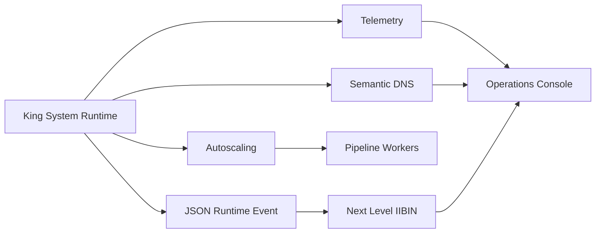

#### Event Payload: JSON

```php
<?php
king_system_init([
    'cluster_id' => 'b2b-einvoice-platform',
    'node_id' => getenv('KING_NODE_ID') ?: 'node-1',
    'state_root_path' => __DIR__ . '/var/system',
    'components' => ['client', 'server', 'object_store', 'pipeline_orchestrator', 'telemetry', 'mcp', 'iibin'],
]);

$eventPayload = [
    'cluster_id' => 'b2b-einvoice-platform',
    'node_id' => getenv('KING_NODE_ID') ?: 'node-1',
    'component' => 'pipeline_orchestrator',
    'status' => 'ready',
    'blocker_count' => 0,
];

king_object_store_put('events/runtime/' . date('YmdHis') . '.json', json_encode($eventPayload, JSON_THROW_ON_ERROR), [
    'content_type' => 'application/json',
]);
```

#### Next Level: IIBIN

```php
<?php
king_proto_define_schema('RuntimeComponentEvent', [
    'cluster_id' => ['tag' => 1, 'type' => 'string', 'required' => true],
    'node_id' => ['tag' => 2, 'type' => 'string', 'required' => true],
    'component' => ['tag' => 3, 'type' => 'string', 'required' => true],
    'status' => ['tag' => 4, 'type' => 'string', 'required' => true],
    'blocker_count' => ['tag' => 5, 'type' => 'int32', 'default' => 0],
]);

king_object_store_put('events/runtime/' . date('YmdHis') . '.iibin', king_proto_encode('RuntimeComponentEvent', $eventPayload), [
    'content_type' => 'application/x-king-iibin',
]);
```

Operations must expose lifecycle state, admission decisions, blocked pipeline
runs, degraded dependencies, and autoscaling decisions as first-class data.
Deep diagnostics belong in telemetry and object-store reports; JSON/IIBIN
events keep the control plane fast and readable.
