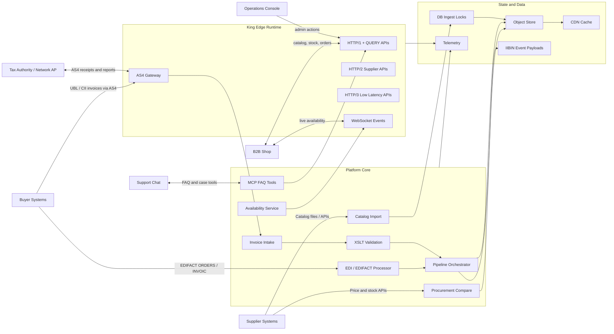
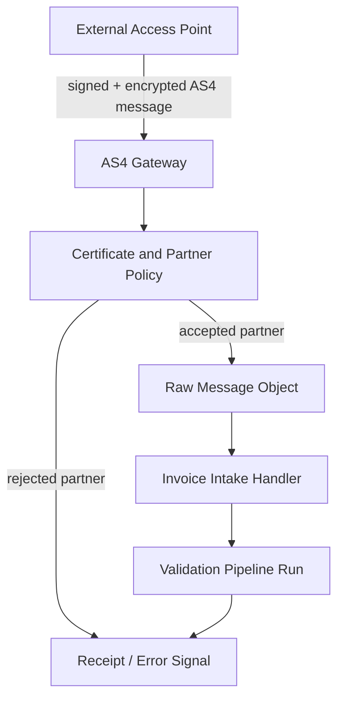
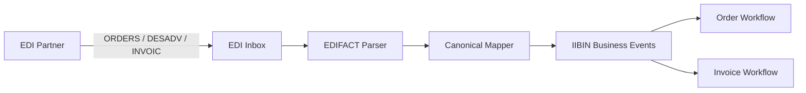
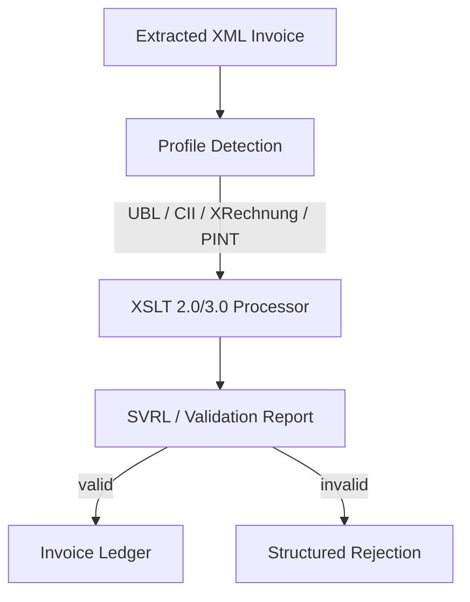
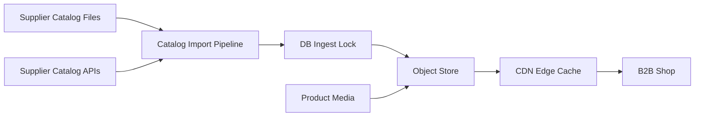
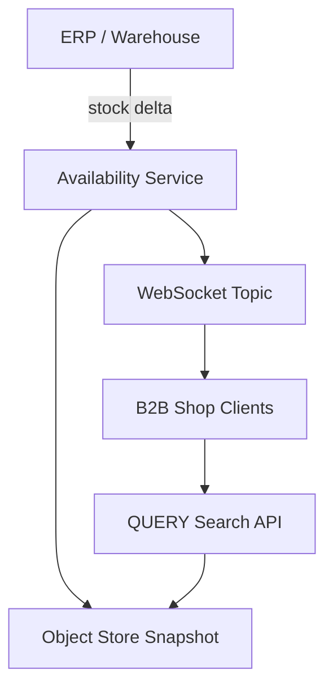
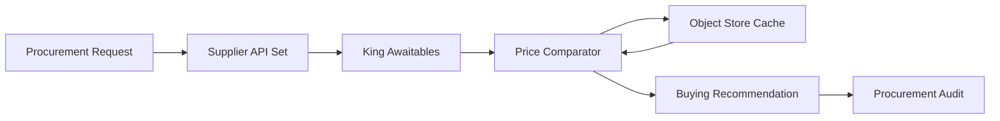
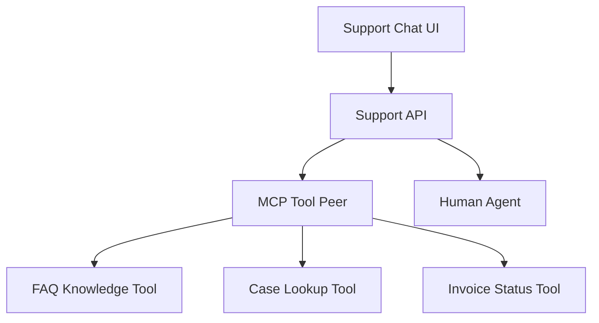
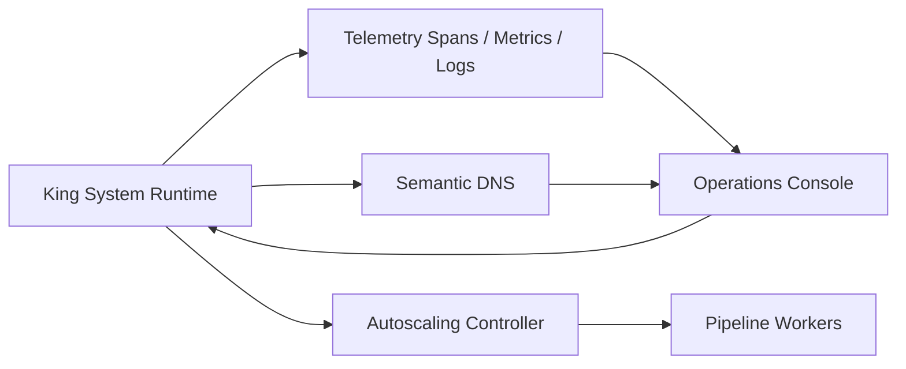
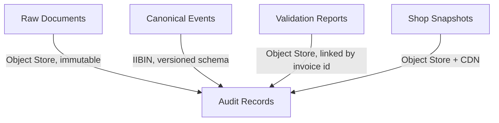

# E-Invoicing, EDI, and B2B Commerce Platform

This document shows how King primitives can be composed into a serious
e-invoicing, EDI, and B2B commerce platform. The example covers AS4-based
e-invoice exchange, EDIFACT flows, an e-commerce catalog and availability
surface, procurement price comparison across supplier APIs, cached payloads in
the object store, XSLT validation for incoming invoices, and MCP-backed support
FAQ tooling.

The architecture is intentionally split into bounded blocks. Each block owns a
clear runtime responsibility, publishes explicit events, and persists durable
state before fanout. Real deployments still need country-specific regulatory
profiles, tax authority credentials, certificate policies, retention rules,
and tenant-level access controls, but the technical composition below is the
shape King is meant to support.

## Overall System



The edge runtime owns network-facing protocol work. HTTP/1 handles classic
control APIs and the `QUERY` method for search-like requests, HTTP/2 and
HTTP/3 cover supplier and partner APIs, WebSocket carries live shop updates,
and AS4 terminates document exchange with access points or tax authority
gateways.

The platform core keeps business flows explicit. EDIFACT and e-invoice intake
do not write directly into every downstream system. They normalize, validate,
store, and publish events through the orchestrator. State is split by purpose:
object store for durable payloads and cacheable artifacts, DB ingest for
small locked write paths, CDN for public catalog/media delivery, IIBIN for
compact internal event payloads, and telemetry for traceable operation.

## Block 1: AS4 and E-Invoice Intake



```php
<?php
use King\ObjectStore;
use King\PipelineOrchestrator;

ObjectStore::putFromStream($objectId, $as4PayloadStream, [
    'content_type' => 'application/soap+xml',
    'object_type' => 'as4-inbound-envelope',
    'tenant_id' => $tenantId,
    'partner_id' => $partnerId,
]);

$run = PipelineOrchestrator::dispatch(
    [
        'tenant_id' => $tenantId,
        'partner_id' => $partnerId,
        'object_id' => $objectId,
        'transport' => 'as4',
    ],
    [
        ['tool' => 'verify-as4-envelope'],
        ['tool' => 'extract-business-document'],
        ['tool' => 'validate-invoice-profile'],
        ['tool' => 'persist-invoice-ledger'],
    ],
    ['trace_id' => 'as4-invoice-' . $messageId]
);
```

The AS4 block accepts signed and encrypted envelopes from a partner access
point. Certificate validation, partner routing, message ID deduplication, and
receipt generation belong here because they are transport concerns and must be
settled before the business document is trusted.

The raw envelope is stored before extraction. That gives operations a durable
audit object for non-repudiation, replay, and legal traceability. The business
document is then passed into a pipeline run where XML validation, profile
checks, and tenant ledger persistence are separate steps with their own
failure categories.

## Block 2: EDIFACT Processing



```php
<?php
king_proto_define_schema('BusinessDocumentEvent', [
    'tenant_id' => ['tag' => 1, 'type' => 'int32', 'required' => true],
    'document_id' => ['tag' => 2, 'type' => 'string', 'required' => true],
    'document_type' => ['tag' => 3, 'type' => 'string', 'required' => true],
    'source_protocol' => ['tag' => 4, 'type' => 'string', 'default' => 'edifact'],
]);

$event = king_proto_encode('BusinessDocumentEvent', [
    'tenant_id' => $tenantId,
    'document_id' => $messageReference,
    'document_type' => $messageType,
    'source_protocol' => 'edifact',
]);

king_object_store_put('events/' . $messageReference . '.iibin', $event, [
    'content_type' => 'application/x-king-iibin',
]);
```

EDIFACT traffic is usually partner-specific even when message names look
standard. The EDI block should therefore parse interchange envelopes, validate
partner agreements, and map messages into canonical business events before the
order, despatch, or invoice workflow sees them.

IIBIN is useful between internal blocks because it keeps event contracts
schema-defined and compact. The original EDIFACT interchange remains in object
storage for audit and replay; the canonical event is what downstream services
consume.

## Block 3: XSLT Invoice Validation



```php
<?php
use King\XSLT\Processor;

$processor = new Processor([
    'cwd' => __DIR__ . '/rules',
    'properties' => [
        'http://saxon.sf.net/feature/version-warning' => 'false',
    ],
]);

$report = $processor->transformToFile(
    $invoiceXmlPath,
    __DIR__ . '/rules/peppol-bis-billing-3-svrl.xsl',
    $reportPath,
    ['properties' => ['indent' => 'yes']]
);
```

Incoming e-invoices should be validated in layers. XML well-formedness,
schema validation, profile detection, Schematron/SVRL execution, and business
rule classification should be separate enough that the platform can explain
exactly what failed and where.

`King\XSLT\Processor` is the correct primitive for XSLT 2.0/3.0 rule chains
such as Schematron-generated stylesheets. The validation report should be
stored as its own object, linked from the invoice ledger, and turned into a
structured rejection when the profile-specific checks fail.

## Block 4: Catalog Import and CDN Publication



```php
<?php
king_db_ingest('catalog-import-' . $supplierId, static function () use ($rows): array {
    $db = new PDO('sqlite:' . __DIR__ . '/var/catalog.sqlite');
    $db->beginTransaction();

    foreach ($rows as $row) {
        $stmt = $db->prepare(
            'INSERT OR REPLACE INTO products (sku, name, price_cents, updated_at) VALUES (?, ?, ?, ?)'
        );
        $stmt->execute([$row['sku'], $row['name'], $row['price_cents'], date(DATE_ATOM)]);
    }

    $db->commit();
    return ['imported' => count($rows)];
}, [
    'lock_path' => __DIR__ . '/var/catalog-import.lock',
    'timeout_ms' => 5000,
]);

king_cdn_cache_object('catalog/latest.json', ['ttl_sec' => 300]);
```

Catalog imports are write-heavy and often arrive as mixed file and API feeds.
The import block should normalize supplier records, write under an explicit
ingest lock, and publish versioned catalog objects only after a complete
transaction succeeds.

The CDN is not the source of truth. It is the delivery layer for read-heavy
shop artifacts such as product JSON, images, and generated search indexes.
The object store remains the durable source for catalog snapshots, media, and
rollback candidates.

## Block 5: Live Availability for the B2B Shop



```php
<?php
$event = [
    'type' => 'availability.changed',
    'sku' => $sku,
    'available' => $available,
    'warehouse' => $warehouse,
    'changed_at' => date(DATE_ATOM),
];

king_object_store_put('availability/' . $sku . '.json', json_encode($event, JSON_THROW_ON_ERROR), [
    'content_type' => 'application/json',
    'cache_ttl_sec' => 30,
]);

foreach ($subscribers[$sku] ?? [] as $connection) {
    king_websocket_send($connection, json_encode($event, JSON_THROW_ON_ERROR));
}
```

Live availability is a realtime concern, but it still needs a durable snapshot
path. Every stock delta should update a latest-known state object before the
WebSocket fanout is emitted, so reconnecting shop clients and search APIs can
recover the current value.

HTTP `QUERY` fits product and availability search because it allows a request
body without pretending the operation is a state-changing POST. WebSocket is
then used only for push updates and subscriptions, not for ad-hoc database
queries from the browser.

## Block 6: Procurement Price Comparison



```php
<?php
$awaitables = [];
foreach ($supplierEndpoints as $supplierId => $url) {
    $awaitables[$supplierId] = king_client_send_request_async(
        $url,
        'QUERY',
        ['accept' => 'application/json', 'content-type' => 'application/query'],
        'sku = "' . addslashes($sku) . '" AND quantity >= ' . (int) $quantity,
        ['timeout_ms' => 1500]
    );
}

$offers = [];
foreach ($awaitables as $supplierId => $awaitable) {
    $response = king_await($awaitable, 2000);
    $offers[$supplierId] = json_decode($response['body'], true, flags: JSON_THROW_ON_ERROR);
}

king_object_store_put('procurement/offers/' . $sku . '.json', json_encode($offers, JSON_THROW_ON_ERROR), [
    'content_type' => 'application/json',
    'cache_ttl_sec' => 120,
]);
```

Procurement comparison is a natural async workload. The platform can call
multiple supplier APIs concurrently, wait with bounded timeouts, and combine
fresh responses with cached object-store offers when a supplier is slow or
temporarily unavailable.

The comparator should not only pick the lowest unit price. Real procurement
decisions include lead time, minimum order quantity, contract terms, currency,
delivery address, tax treatment, and reliability history. The audit object
captures the candidate set and the decision rationale.

## Block 7: MCP FAQ and Support Chat



```php
<?php
use King\MCP;

$mcp = new MCP('127.0.0.1', 9090, [
    'mcp.timeout_ms' => 1500,
]);

$answer = $mcp->request(
    'support.faq',
    'answer',
    json_encode([
        'tenant_id' => $tenantId,
        'question' => $customerQuestion,
        'context' => ['invoice_id' => $invoiceId],
    ], JSON_THROW_ON_ERROR)
);
```

MCP is useful for support workflows because it gives the platform a structured
tool boundary. FAQ answers, case lookups, and invoice status queries can be
exposed as named tools instead of embedding one-off chat logic inside the
support UI.

The support API should still own authorization and tenant boundaries. MCP
tools receive only the context they are allowed to see. When confidence is
low, the chat can attach the tool trace and route the case to a human agent
instead of inventing an unsupported answer.

## Block 8: Runtime Operations and Telemetry



```php
<?php
king_system_init([
    'cluster_id' => 'b2b-einvoice-platform',
    'node_id' => getenv('KING_NODE_ID') ?: 'node-1',
    'state_root_path' => __DIR__ . '/var/system',
    'components' => [
        'client',
        'server',
        'object_store',
        'pipeline_orchestrator',
        'telemetry',
        'autoscaling',
        'mcp',
        'iibin',
    ],
]);

$span = king_telemetry_start_span('invoice.intake', [
    'tenant_id' => (string) $tenantId,
    'source' => 'as4',
]);
```

Operations need the same level of structure as business flows. System runtime
status, telemetry, autoscaling decisions, worker health, and semantic DNS
routing should be visible as first-class control-plane data, not inferred from
log scraping after something has already failed.

The operations console should expose lifecycle state and admission decisions:
which components are ready, which pipelines are blocked, which services are
degraded, and whether autoscaling is adding capacity. That keeps the platform
operable when document volume spikes or external supplier/tax endpoints become
slow.

## Event and Storage Boundaries



```php
<?php
$auditKey = sprintf(
    'audit/%s/%s/%s.json',
    $tenantId,
    $documentType,
    $documentId
);

king_object_store_put($auditKey, json_encode([
    'tenant_id' => $tenantId,
    'document_id' => $documentId,
    'raw_object_id' => $rawObjectId,
    'canonical_event_id' => $eventObjectId,
    'validation_report_id' => $reportObjectId,
    'created_at' => date(DATE_ATOM),
], JSON_THROW_ON_ERROR), [
    'content_type' => 'application/json',
    'object_type' => 'audit-record',
]);
```

The boundary rule is simple: raw external documents are immutable objects,
canonical events are schema-defined internal messages, validation reports are
stored artifacts, and operational snapshots are cacheable views. Mixing those
categories makes replay, legal audit, and support investigation much harder.

The object store is therefore more than a blob bucket. It is the durable
contract between protocol intake, validation, commerce surfaces, procurement,
and support tooling. DB ingest protects the small local write paths that need
transactional locking, while the object store keeps the long-lived payloads
and reports that other blocks reference.
