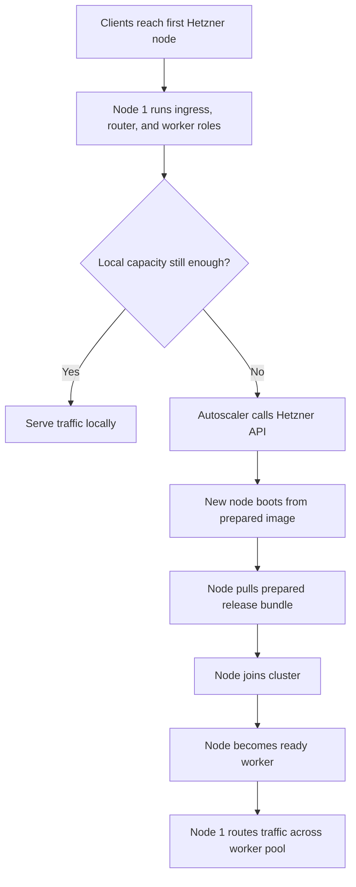

# 01: Hetzner Self-Bootstrapping Edge Cluster

This guide follows one of the most important deployment shapes in King: the
first machine is already useful on its own, but it is also the seed of a larger
cluster. It accepts traffic, serves as the first worker, watches its own load,
and, when needed, asks Hetzner for more machines. As those machines come up,
the original node starts behaving more like a router and load balancer while
the newer nodes take over more of the worker traffic.

That is the shape this example is about. It is not a toy scale demo and it is
not a local mock. It is the real story of one server growing into a cluster
without pretending that "server created" is the same thing as "safe capacity is
now available."


If a technical word is unfamiliar, keep the [Glossary](../glossary.md) open while you read.

## The Situation

You start with one Hetzner node. That first node already runs the King runtime,
the application release, the join path, and the worker entrypoints. At low
traffic it does everything itself: it accepts requests, routes them locally,
and executes worker-side work. When load rises, the same node becomes the
controller for scale-out. It requests more Hetzner instances, those instances
boot from the same prepared image, pull the same release payload, join the
cluster, and then enter the ready pool.

From that point on, the first node is no longer only "the server." It becomes
the edge node that can still work locally but now also distributes work to the
new worker fleet.



## What You Should Learn

The first thing you should learn is that the first node is not a throwaway
bootstrap box. It is already a useful production node. It begins as ingress,
load balancer, and worker at the same time, and only later shifts more of the
execution burden to additional workers.

The second thing you should learn is that new workers do not build the runtime
from scratch during a scale event. They boot from a prepared image. The King
extension, PHP runtime, service units, and worker entrypoints are already in
that image. What gets replicated during bootstrap is the release payload and
cluster membership, not the whole software stack from zero.

The third thing you should learn is that a created instance is still not enough.
The node must join, register, and become ready before the router should trust
it with traffic.

## Build The Cluster Contract First

The most important design decision happens before the first scale event: define
what a managed node already contains when Hetzner creates it.

That is what `autoscale.instance_image_id` is for. It should point to a
prepared image that already contains the King runtime, the PHP environment,
service units, worker entrypoints, and whatever else the cluster needs in order
to start cleanly. That image is the base identity of every later worker.

On top of that base image, the cluster distributes the current application
release. That is where `autoscale.prepared_release_url` comes in. It is not the
base install of the extension. It is the application payload layered onto a
node that already knows how to run King.

If you use `autoscale.bootstrap_user_data`, that user-data should still assume a
prepared image. It should start the join flow and fetch the release payload. It
should not spend the scale event compiling or installing the whole runtime.

## Configure The First Node

The first node needs enough information to act as controller, ingress, and the
initial worker.

```php
<?php

king_autoscaling_init([
    'autoscale.provider' => 'hetzner',
    'autoscale.region' => 'nbg1',
    'autoscale.api_endpoint' => 'https://api.hetzner.cloud/v1',
    'autoscale.state_path' => __DIR__ . '/autoscaling-state.bin',
    'autoscale.server_name_prefix' => 'king-edge',
    'autoscale.instance_type' => 'cpx21',
    'autoscale.instance_image_id' => 'king-php84-edge-v1',
    'autoscale.prepared_release_url' => 'https://artifacts.example.com/releases/king-site-v1.tar.zst',
    'autoscale.join_endpoint' => 'https://cluster.internal/join',
    'autoscale.hetzner_budget_path' => __DIR__ . '/budget.json',
    'autoscale.min_nodes' => 1,
    'autoscale.max_nodes' => 24,
    'autoscale.max_scale_step' => 2,
    'autoscale.cooldown_period_sec' => 60,
    'autoscale.idle_node_timeout_sec' => 300,
]);
```

This snippet matters because it shows the correct layering. `instance_image_id`
chooses the base machine image. `prepared_release_url` provides the release that
should be replicated onto new workers. `join_endpoint` is how those workers
become cluster members. `hetzner_budget_path` keeps the whole process inside
spend policy.

## Let The First Node Run As Edge And Worker

At the beginning, the first node is not waiting for a bigger cluster to exist.
It is already useful. It runs the ingress path, it can route requests, and it
can still handle work locally. That is what makes the deployment shape
practical. The system can start serving traffic with one node and grow only
when the workload really demands it.

Operationally, this means the first node carries two responsibilities at once.
It must keep accepting traffic cleanly, and it must make correct scaling
decisions when telemetry says the local path is becoming too hot.

## Scale Out From Real Pressure

Once pressure rises, the first node reads its telemetry and autoscaling status
and decides whether it should request more capacity.

```php
<?php

king_autoscaling_start_monitoring();

$status = king_autoscaling_get_status();
$nodes = king_autoscaling_get_nodes();

print_r($status);
print_r($nodes);
```

The important thing to watch here is not only whether the node count changes.
Watch the reason for the decision, the cooldown state, the budget result, and
the inventory transitions. A cluster that only tells you "count went up" is
much harder to trust than one that explains why it made the decision.

## Bring New Workers Up The Right Way

When the autoscaler asks Hetzner for a new server, the resulting machine should
already look like a King worker host the moment it boots. The instance image
provides the runtime and the role entrypoints. The prepared release bundle
provides the exact application release that should run. The join endpoint binds
that node back into the cluster.

This is the important correction to the bad mental picture of autoscaling.
Scale-out is not "spawn random Linux box, install the extension somehow,
rebuild the world, and hope it joins." Scale-out is "boot a prepared cluster
member, apply the current release payload, join, register, and become ready."

## Shift From Single Node To Worker Pool

As soon as the next workers become ready, the original node starts behaving
differently. It still can serve work itself, but it no longer has to be the
primary execution path for every request. It can keep the ingress and router
role while the additional workers absorb more of the actual execution load.

That transition is what turns one server into a cluster. The first node remains
important, but its main value changes. Early on, its value is "it can do
everything." Later, its value is "it can coordinate and distribute work while
still remaining capable of local execution if needed."

## Treat Readiness And Rollback As Part Of The Happy Path

A new node is not trustworthy only because Hetzner created it. It must join,
register, and become ready. If it never reaches that point, the cluster should
roll it back. That is normal lifecycle behavior, not a rare edge case.

This matters even more in the cluster shape described here because the first
node is already taking live traffic while scale-out is happening. Broken or
half-joined workers cannot be allowed to silently pollute the backend pool.

## What You Should Watch In Practice

Watch whether the first node stays fully usable before any workers exist. Watch
whether `instance_image_id` and `prepared_release_url` are being used in the
right order: image first, release payload second. Watch when new nodes move
from provisioned to registered to ready. Watch whether the edge node starts
routing toward workers only after those workers are ready. Watch whether failed
nodes are rolled back instead of lingering as false capacity.

Those are the details that make this a real cluster bootstrap path instead of a
scale-up demo.

## Why This Matters In Practice

You should care because this is the shape many real deployments actually need.
Teams often want to start from one machine that can already carry production
traffic, then grow into a worker fleet without redesigning the whole system.
They also want the first node to remain useful after the cluster exists instead
of becoming a strange one-off bootstrap artifact.

This guide shows that shape directly. One node starts as ingress, load balancer,
and worker. Load rises. The same node provisions more workers from a prepared
image, replicates the release payload, and then routes across the resulting
pool. That is a real platform story.

For the subsystem background, read [Autoscaling](../autoscaling.md), [Router and
Load Balancer](../router-and-load-balancer.md), and
[Semantic DNS](../semantic-dns.md).
