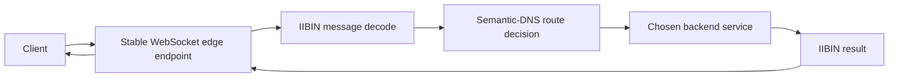

# 02: Realtime Control Plane with WebSocket, IIBIN, and Semantic-DNS

This guide shows a completely different part of the platform: a long-lived
realtime control path. A client opens one WebSocket connection to a stable edge
endpoint. The messages on that channel are encoded with IIBIN instead of loose
text. The edge process can use Semantic-DNS to decide which backend should
receive the work. The result is one realtime path that is compact, strongly
shaped, and topology-aware.

That is the real point of the guide. It is not about chat bubbles or a toy
socket demo. It is about how three real runtime surfaces compose: WebSocket as
a durable control channel, IIBIN as the message contract, and Semantic-DNS as a
routing decision input behind the channel. The repo currently documents this as
a composition pattern rather than shipping a single end-to-end sample for all
three pieces in one file.


If a technical word is unfamiliar, keep the [Glossary](../glossary.md) open while you read.

## The Situation

Imagine an operator console, device fleet, or internal control client that
needs a live connection to the platform. The client should not reconnect for
every tiny command. It should not send loosely structured JSON for every state
change. It should not hard-code which backend node is currently best. Instead,
it should keep one live session, send structured binary messages, and let the
platform decide where the work belongs right now.

That is the situation this guide explains.



## What You Should Learn

The first thing you should learn is that WebSocket becomes far more useful once
the payload is strongly shaped. A live channel without a stable message
contract is still easy to break.

The second thing you should learn is that IIBIN is not only for storage or RPC.
It is a good fit for realtime channels too, especially when the messages should
stay compact, explicit, and compatible over time.

The third thing you should learn is that Semantic-DNS does not belong only to
request/response routing. A live control channel can still depend on topology
and health information when deciding where one message or one session should
go next.

## Step 1: Define The Wire Contract

The first step is to define the enums and schemas the channel will use.

```php
<?php

king_proto_define_enum('RealtimeKind', [
    'subscribe' => 1,
    'command' => 2,
    'event' => 3,
    'ack' => 4,
]);

king_proto_define_schema('RealtimeEnvelope', [
    'kind' => ['field_number' => 1, 'type' => 'enum:RealtimeKind', 'required' => true],
    'topic' => ['field_number' => 2, 'type' => 'string'],
    'request_id' => ['field_number' => 3, 'type' => 'string'],
    'payload' => ['field_number' => 4, 'type' => 'bytes'],
]);
```

This is where the channel stops being "some bytes over a socket." The messages
now have field identity, enum meaning, and a stable decode path.

## Step 2: Open The Live Channel

The next step is to open the WebSocket connection itself.

```php
<?php

$ws = king_client_websocket_connect(
    'wss://edge.example.com/control',
    ['x-client-id' => 'ops-console'],
    [
        'handshake_timeout_ms' => 5000,
        'ping_interval_ms' => 20000,
        'max_payload_size' => 8 * 1024 * 1024,
    ]
);
```

The channel is now live. That matters because the rest of the exchange no
longer has to pay full request setup cost for every tiny state change.

## Step 3: Decide Where The Work Should Go

The client may be connected to a stable edge endpoint, but the edge node still
needs to decide which backend service is the right target for the next command
or subscription. That is where Semantic-DNS enters the picture.

```php
<?php

$route = king_semantic_dns_get_optimal_route('realtime-control', [
    'region' => 'eu-central',
    'capability' => 'session-control',
]);
```

This matters because the client does not need to know which backend is
currently healthiest or closest to the desired capability. The platform can
make that decision from current service state.

## Step 4: Send IIBIN Over WebSocket

Now the client can send a structured binary message through the channel.

```php
<?php

$binary = king_proto_encode('RealtimeEnvelope', [
    'kind' => 'command',
    'topic' => 'cluster.scale',
    'request_id' => 'req-1001',
    'payload' => json_encode(['target' => 'worker-pool', 'desired' => 6]),
]);

king_client_websocket_send($ws, $binary, true);
```

The important point is that the WebSocket frame is binary on purpose. The
channel is carrying a defined message contract, not only text that both sides
hope they are interpreting the same way.

## Step 5: Decode Replies Into Structured State

When the edge or backend replies, the same schema can be used to decode the
binary frame back into structured application data.

```php
<?php

$incoming = king_client_websocket_receive($ws, 1000);
if ($incoming === false) {
    throw new RuntimeException(king_client_websocket_get_last_error());
}

$message = king_proto_decode('RealtimeEnvelope', $incoming);
print_r($message);
```

This is where the value of the combination becomes clear. WebSocket gives you a
live channel. IIBIN gives you a strict message shape. Together they give you a
realtime path that is both fast and explicit.

## Step 6: Keep Topology And Channel Health In Sync

The channel may remain open for a long time while backend health and topology
change behind it. That is why the edge process should keep watching both
heartbeat health and route quality. Ping and pong keep the transport side
honest. Semantic-DNS keeps the backend view honest. The session can stay stable
even while the actual best backend changes over time.

That is one of the biggest reasons this example matters. Realtime systems are
not only about persistent transport. They are also about persistent correctness
while the world around the channel keeps moving.

## What You Should Watch In Practice

Watch whether the message contract is defined before traffic begins. Watch
whether the WebSocket frame is treated as binary application data rather than
just text. Watch whether Semantic-DNS is being used to make route decisions
instead of hard-coding backend addresses into the client. Watch whether ping,
close, and route changes are handled as part of one ongoing session story.

Those are the details that turn a socket example into a real control plane.

## Why This Matters In Practice

You should care because a lot of modern infrastructure wants exactly this
shape: one live control channel, compact structured messages, and backend
selection that can adapt to health, load, and topology. If any one of those
pieces is weak, the whole system becomes harder to trust. A live channel with a
loose payload is fragile. A perfect binary payload on a bad transport is not
enough. A stable channel that routes to the wrong backend is still wrong.

This guide shows how those three pieces fit together as one runtime story.

For the subsystem background, read [WebSocket](../websocket.md),
[IIBIN](../iibin.md), and [Semantic DNS](../semantic-dns.md).
