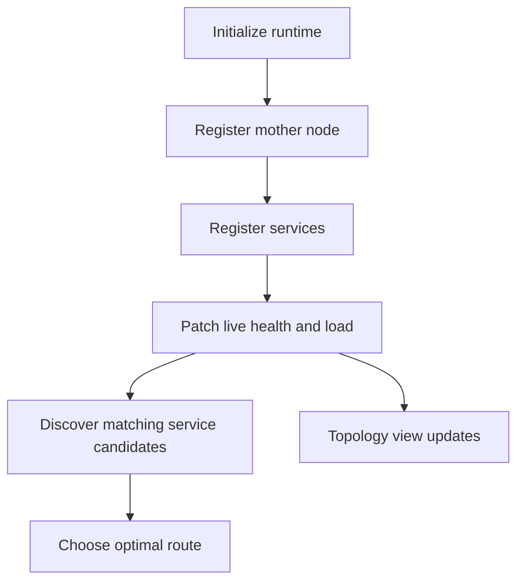

# 03: Semantic-DNS Routing Policies

This guide explains how King turns service discovery into a live routing system
instead of leaving it as a passive naming table. The point is not only to show
how a service is registered. The point is to show how registration, topology,
health, load, and route choice fit together so that the routing answer stays
sensible while the system is changing.

If a platform has more than one backend for the same kind of work, route choice
quickly becomes one of the most important correctness decisions in the whole
system. This guide exists to make that decision readable.


If a technical word is unfamiliar, keep the [Glossary](../glossary.md) open while you read.

## The Situation

Imagine a platform with two inference backends in the same region. Both can
answer the same service name. One is healthy and lightly loaded. The other is
still reachable but degraded and close to saturation. The system must answer two
questions at once.

The first question is discovery: which service instances of the required type
currently exist? The second question is routing: which of those candidates should
actually receive the next request?

That is the real Semantic-DNS problem. The runtime must keep those two answers
connected.

## What The Guide Teaches

The guide walks through initialization, mother-node registration, service
registration, status updates, service discovery, and final route selection. It
also shows why live status changes must affect route choice instead of only
showing up in dashboards.

## The Flow In One Picture



This is the shape to keep in mind. The route decision is the final stage of a
live topology story, not an isolated lookup.

## Step 1: Initialize Semantic-DNS

The first step is to create the Semantic-DNS runtime with a clear routing and
discovery mode.

```php
<?php

king_semantic_dns_init([
    'dns.server_bind_host' => '127.0.0.1',
    'dns.server_port' => 5353,
    'dns.default_record_ttl_sec' => 30,
    'dns.service_discovery_max_ips_per_response' => 8,
    'dns.semantic_mode_enable' => true,
    'dns.mode' => 'service_discovery',
    'dns.mothernode_sync_interval_sec' => 15,
]);

king_semantic_dns_start_server();
```

The important thing here is not just starting a component. The runtime is being
told how discovery should behave, how large responses may become, and how
quickly topology should be refreshed.

## Step 2: Register The Mother Node

Now the guide introduces the mother node that coordinates or anchors the local
topology view.

```php
<?php

king_semantic_dns_register_mother_node([
    'node_id' => 'mother-eu-1',
    'hostname' => '10.0.1.2',
    'port' => 7443,
    'status' => 'healthy',
    'managed_services_count' => 2,
    'trust_score' => 98,
]);
```

This matters because the topology has more structure than just a flat list of
services. The mother node tells the platform something about who coordinates or
observes that part of the service map.

## Step 3: Register Two Service Candidates

Now two services with the same logical service name are registered. Both are
capable of answering the same kind of request.

```php
<?php

king_semantic_dns_register_service([
    'service_id' => 'infer-eu-1',
    'service_name' => 'inference-primary',
    'service_type' => 'inference',
    'hostname' => '10.0.1.10',
    'port' => 8443,
    'status' => 'healthy',
    'current_load_percent' => 24,
    'active_connections' => 142,
    'total_requests' => 185443,
    'attributes' => [
        'region' => 'eu-central',
        'accelerator' => 'gpu',
    ],
]);

king_semantic_dns_register_service([
    'service_id' => 'infer-eu-2',
    'service_name' => 'inference-primary',
    'service_type' => 'inference',
    'hostname' => '10.0.1.11',
    'port' => 8443,
    'status' => 'healthy',
    'current_load_percent' => 61,
    'active_connections' => 311,
    'total_requests' => 185700,
    'attributes' => [
        'region' => 'eu-central',
        'accelerator' => 'gpu',
    ],
]);
```

At this point the runtime has enough information to discover service candidates,
but the story is still incomplete because live state has not changed yet.

## Step 4: Patch Live Health And Load

Now one service becomes degraded and heavily loaded.

```php
<?php

king_semantic_dns_update_service_status(
    'infer-eu-2',
    'degraded',
    [
        'current_load_percent' => 91,
        'active_connections' => 501,
        'total_requests' => 186002,
    ]
);
```

This step is the heart of the whole guide. Without it, discovery would still
look like a static registry and route selection would have no live operational
meaning.

## Step 5: Discover Candidates

The next question is not yet "which route wins?" It is "which services of the
requested type currently match the criteria?"

```php
<?php

$discovery = king_semantic_dns_discover_service('inference', [
    'region' => 'eu-central',
    'accelerator' => 'gpu',
]);

print_r($discovery);
```

This is where service type and scalar attributes do their job. The runtime
narrows the candidate set to services that make sense for the caller's request.

## Step 6: Choose The Best Route

Now the runtime can choose the final route from the candidate set.

```php
<?php

$route = king_semantic_dns_get_optimal_route('inference-primary', [
    'client_region' => 'eu-central',
    'latency_sensitive' => true,
]);

print_r($route);
```

The route decision is the moment where registration, status, load, client
context, and topology all come together. The system is no longer only answering
"what exists?" It is answering "what should handle the next request?"

## Step 7: Inspect The Topology

Finally, the operator or control-plane code can inspect the full topology view.

```php
<?php

$topology = king_semantic_dns_get_service_topology();
print_r($topology);
```

This is useful because sometimes the right operational question is not "what is
the next route?" but "what does the system currently believe about the whole
service map?"

## Why Discovery And Routing Must Stay Together

One of the most important lessons in the guide is that discovery and routing are
not the same action, but they do belong in the same subsystem.

Discovery builds the candidate set. Routing chooses from that set. If the two
are split too far apart, the system often ends up using stale discovery data for
live route selection or ignores health and load during the final choice.

King keeps them together so that the route answer still reflects the live
topology that discovery sees.

## Why Status Names Matter

Status is not just descriptive text. A status change should alter the route
decision.

A healthy service is a strong route candidate. A degraded service may still be a
candidate when capacity is tight, but it should not be treated like a perfectly
healthy backend. An unhealthy service should not quietly win because it still
happens to be present in the registry. A maintenance state may need to remain
visible in the topology while disappearing from route eligibility.

That is why this guide spends so much time on status changes instead of treating
them like dashboard cosmetics.

## Why Mother Nodes Matter

The mother node in this example is not decorative. It stands for the broader
topology layer that helps the platform reason about more than one isolated
service record.

In a growing platform, topology coordination matters because route choice is not
always only about the current load of one backend. Trust score, coordination
state, synchronization health, and the broader map of managed services can also
change what the best route should be.

## Why This Matters For Autoscaling

This guide is also a good bridge to the autoscaling chapter. When autoscaling
adds or removes nodes, the discovery set changes. When it drains a node, route
eligibility changes. When it promotes a new node to ready state, the routing
layer needs to know.

That means Semantic-DNS is one of the places where autoscaling becomes real
traffic behavior instead of just infrastructure bookkeeping.

## Read This Beside The Main Chapter

This guide works best beside [Smart DNS and Semantic-DNS](../semantic-dns.md).
The handbook chapter explains the full subsystem. This guide narrows the story
to one concrete routing scenario where live status and load really matter.

If the next question is "how does the chosen route get executed?", read
[Router and Load Balancer](../router-and-load-balancer.md). If the next question
is "how does topology change under load?", read [Autoscaling](../autoscaling.md).
