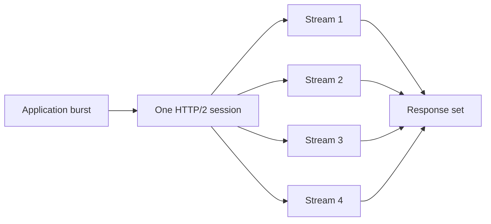
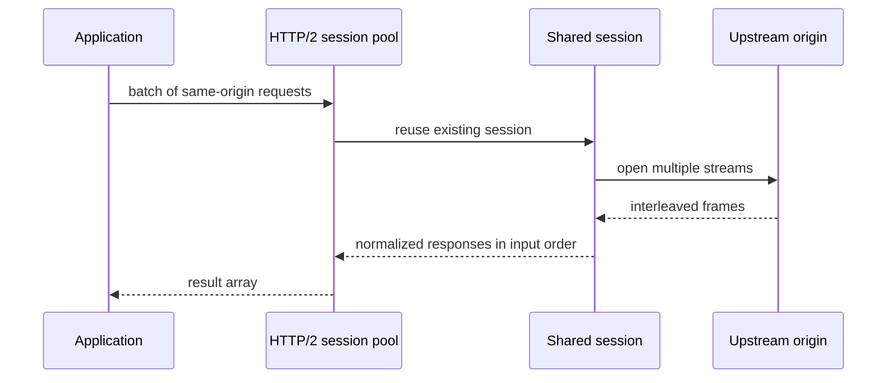

# 04: HTTP/2 Multiplexing and Push

This guide explains one of the biggest mental shifts in the client runtime:
with HTTP/2, one connection is no longer one request lane. One HTTP/2 session
can carry many streams at the same time, and that changes how latency,
connection reuse, queueing, and upstream pressure feel in a real application.

If you have mostly worked with HTTP/1, it is normal to think in terms of one
request going out, one response coming back, and the next request waiting for
its turn on another socket. HTTP/2 breaks that habit. The same session can keep
multiple requests in flight, which means that the cost of creating and tearing
down connections stops dominating every burst.

That is why this example matters. It does not exist to show “HTTP/2 support” as
an item on a checklist. It exists to show how the runtime behaves when many
related requests share one transport instead of pretending they are unrelated.

If a technical word is unfamiliar, keep the [Glossary](../glossary.md) open while you read.

## What This Example Is Really Showing

The example is built around the `king_http2_request_send_multi()` path and the
HTTP/2 client session pool. In plain language, it asks a simple question: what
happens when one application wants several resources from the same origin at
nearly the same time?

In a pooled HTTP/2 design, the answer is not “open more sockets.” The answer is
“open more streams on the connection that already exists.” That changes both
efficiency and failure behavior. A single healthy session can carry a burst of
work. A single broken session can also affect several streams at once. Both
sides of that story are important.

The example also touches server push. Even though push is not the center of
modern application design in the same way multiplexing is, it still matters
because it changes the shape of a response. A reply is no longer always “just
the thing I asked for.” A session may also carry related pushed material, and
the client has to represent that honestly.

In the current runtime, push capture is explicit rather than automatic. The
caller must opt into `capture_push`, and the HTTP/2 config must also allow push
via `http2.enable_push`.

## Why Multiplexing Matters In Practice

The easiest way to understand multiplexing is to stop thinking about sockets
and start thinking about lanes. HTTP/1 often feels like a one-lane road. If one
truck is large or slow, the vehicles behind it are affected. HTTP/2 gives the
connection many logical lanes. The runtime still has to respect flow control
and fairness, but work no longer has to pretend it is strictly sequential.

That matters for a PHP service that talks to one upstream API repeatedly. A
burst of requests for a dashboard, a page assembly step, or an internal fan-out
call can reuse one session instead of recreating transport state over and over.
The result is usually lower connection churn, more stable latency, and less
wasted work in the transport layer.

It also changes what “connection reuse” means. In HTTP/1, reuse often means “I
kept the socket alive and sent the next request later.” In HTTP/2, reuse can
mean “I kept the socket alive and used it for several streams right now.”

## What To Notice When You Read The Example

The first thing to notice is that the example keeps the requests on one origin.
That is not an arbitrary limitation. HTTP/2 multiplexing only makes sense when
the requests can honestly share the same session. The example is teaching you
session sharing, not hiding cross-origin reconnection work behind a convenience
wrapper.

The second thing to notice is response ordering. The responses are returned in
input order even though the streams may complete in a different internal order.
That is a usability decision in the public surface. It lets the caller keep a
simple request-to-response mapping without losing the performance benefits of
parallel work inside the session.

The third thing to notice is the error path. HTTP/2 has stream-level failures
such as resets, and it also has connection-level failures. The example matters
because it helps you see the difference between “one stream failed” and “the
shared session failed.” Those are not the same operational event.

## Why Push Appears In This Example

Server push can be confusing because it sounds like an optimization detail. It
is more useful to describe it as an ownership detail. If the upstream server
decides to send related resources proactively, the client has to decide how to
surface that material. The example includes push so the reader can see that a
single request may bring along more than one response object.

This matters even if you rarely depend on push in production. The lesson is not
“push is always good.” The lesson is “a multiplexed protocol can carry more
state than a one-request view suggests,” and the runtime should expose that
extra state only when the caller explicitly asks for it.

## Why This Matters In Practice

You should care because HTTP/2 changes both capacity planning
and debugging. Throughput can improve because the runtime stops paying repeated
connection setup costs. Latency can improve because the session stays hot.
Failure analysis also changes because resets, header limits, and connection
abort behavior now happen inside a multiplexed session rather than inside many
isolated sockets.

If you operate busy upstream traffic in PHP, this example is not an academic
exercise. It is the shortest path to understanding why one HTTP/2 session can
outperform a pile of ad hoc HTTP/1 work while also demanding better attention
to shared-session failure semantics.

For the full protocol explanation, read
[HTTP Clients and Streams](../http-clients-and-streams.md). For the transport
and TLS side, read [QUIC and TLS](../quic-and-tls.md).
