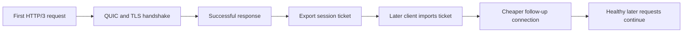
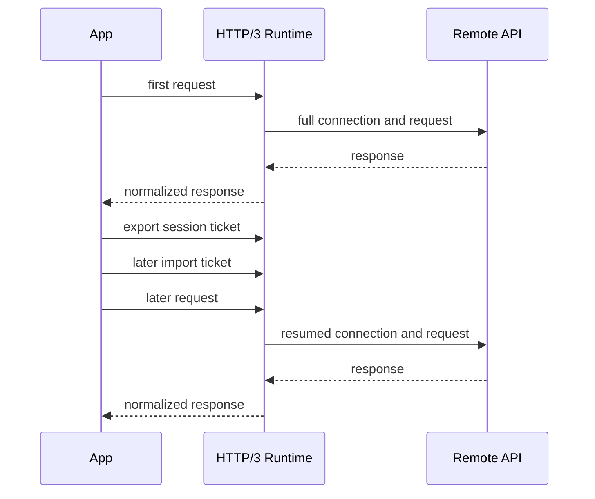

# 05: HTTP/3 Roundtrip and Reuse

This guide shows what an HTTP/3 request looks like in King when it is treated
as real transport work rather than as a protocol label. The guide is about
three things at once: the first successful request, the value of connection and
session reuse, and the role of session tickets in making later connections
cheaper and more predictable.

HTTP/3 matters because it is not only "HTTP over something newer." It is HTTP
on top of QUIC, which means the request model inherits a different transport
story: stream-oriented transport behavior, explicit session identity,
ticket-based continuation, and a different relationship to churn and recovery.


If a technical word is unfamiliar, keep the [Glossary](../glossary.md) open while you read.

## The Situation

Imagine a service that makes repeated secure requests to the same upstream API.
The first request pays the full setup cost. Later requests should not have to
start from zero each time if the platform can safely reuse transport state. The
system also needs to survive timeout churn or bad attempts without poisoning
the healthy requests that follow.

That is the real reason to care about HTTP/3 in King. It is not only about one
request succeeding. It is about what repeated secure requests feel like over
time.



## What You Should Learn

The first lesson is that one-shot convenience and explicit session ownership are
both valid, but they solve different problems. One-shot calls are a good fit
when the code wants one result and no long-lived transport object. Explicit
sessions are a better fit when the application has a continuing relationship
with the same remote peer.

The second lesson is that session tickets matter because they let the runtime
carry useful transport state forward deliberately. Ticket handling is not hidden
in unreadable process-local state. The application can export and import it on
purpose.

The third lesson is that reuse is only valuable if failure does not contaminate
healthy later work. A timeout or broken attempt must not leave the next good
request in a poisoned state.

## Step 1: Send One Direct HTTP/3 Request

The smallest direct example uses `king_http3_request_send()`.

```php
<?php

$response = king_http3_request_send(
    'https://api.example.com/v1/status',
    'GET',
    ['accept' => 'application/json'],
    null,
    [
        'connect_timeout_ms' => 5000,
        'timeout_ms' => 10000,
    ]
);

if ($response === false) {
    throw new RuntimeException(king_get_last_error());
}

var_dump($response['status']);
var_dump($response['protocol']);
var_dump($response['body']);
```

This is the direct one-shot path. The application asks for one HTTP/3 request
and gets one normalized response array back.

What matters is not only that the URL uses `https://`. What matters is that the
request rides on the QUIC transport model described in
[QUIC and TLS](../quic-and-tls.md). Even when the application calls one
function, the runtime underneath is working with streams, explicit session
identity, loss recovery, and reuse-aware transport state.

## Step 2: Use The Object-Oriented Client

The same runtime can be reached through `King\Client\Http3Client`.

```php
<?php

$client = new King\Client\Http3Client(
    new King\Config([
        'tls.verify_peer' => true,
        'quic.ping_interval_ms' => 15000,
    ])
);

$response = $client->request(
    'GET',
    'https://api.example.com/v1/status'
);

echo $response->getBody();
```

This path matters when the codebase wants a stable client object and a clear
place to keep HTTP/3-related configuration. The important thing is that the OO
surface is not a different transport implementation. It is another way to own
the same runtime behavior.

## Step 3: Hold An Explicit Session

The next level down is the explicit session path.

```php
<?php

$session = new King\Session(
    'api.example.com',
    443,
    new King\Config([
        'tls.verify_peer' => true,
        'quic.cc_algorithm' => 'bbr',
    ])
);

$stream = $session->sendRequest(
    'GET',
    '/v1/status',
    ['accept' => 'application/json']
);

$response = $stream->receiveResponse(5000);
```

This matters because a repeated HTTP/3 workload is often not really "a lot of
separate requests." It is one relationship to one upstream over time. The
session model makes that relationship visible and gives the application direct
ownership over reuse and streaming behavior.

## Step 4: Export And Import A Session Ticket

Once the first session is alive and healthy, the runtime can export a ticket
for later reuse.

```php
<?php

$ticket = king_export_session_ticket($session);

file_put_contents(__DIR__ . '/tickets/api.ticket', $ticket);
```

A ticket is resumable connection state. It does not replace every part of a
future connection, but it helps the next connection avoid starting from zero.

The later session imports the saved ticket before it starts useful work.

```php
<?php

$later = new King\Session('api.example.com', 443);

king_import_session_ticket(
    $later,
    file_get_contents(__DIR__ . '/tickets/api.ticket')
);

$stream = $later->sendRequest('GET', '/v1/status');
$response = $stream->receiveResponse(5000);
```

This is the practical shape of ticket reuse in King. The runtime does not hide
it as private process state. The application can preserve and reapply it
deliberately.

## Why Reuse Matters

If the application talks to the same upstream repeatedly, reuse matters for
both latency and stability. A platform that starts every secure connection from
zero again and again is paying the same setup cost repeatedly even when the
workload is clearly repetitive.

The point of reuse is not "speed" in the empty sense. The point is to carry
useful validated transport state forward in a controlled way while keeping the
application aware of where that state came from.

## Timeout Churn And Healthy Later Requests

Real systems do not only have clean traffic. They also have slow attempts,
timeout churn, temporary failures, and bad requests that should not damage the
next healthy request.

This is one of the reasons the King HTTP/3 tests and runtime work care so much
about churn isolation. A bad timeout event should not poison the next healthy
direct request or the next object-oriented client request. Reuse is only
valuable if the runtime can also keep failure from contaminating healthy later
work.



## What You Should Watch In Practice

When reading or running this example, notice the difference between one-shot
calls and explicit session ownership. Notice that ticket reuse is explicit.
Notice that HTTP/3 belongs to the same family as `King\Session`,
`King\Stream`, and `King\Response` rather than existing as a disconnected
feature. Most importantly, notice that healthy later requests matter as much as
the first request. A transport story is incomplete if it only works before
anything has gone wrong.

## Why This Matters For Real API Systems

HTTP/3 matters most when the application talks repeatedly to edge-facing,
latency-sensitive, or highly concurrent APIs. That includes external APIs,
internal gateways, service meshes, and control-plane systems that keep opening
new secure requests against the same remote origins.

If the platform can reuse ticket state and maintain clean behavior after churn,
it spends less time paying unnecessary setup cost and less time recovering from
its own stale client state. That is why this guide belongs in the handbook. It
shows where request semantics and transport semantics meet in a way users can
actually feel.

For the wider explanation, read [HTTP Clients and Streams](../http-clients-and-streams.md)
and [QUIC and TLS](../quic-and-tls.md).
