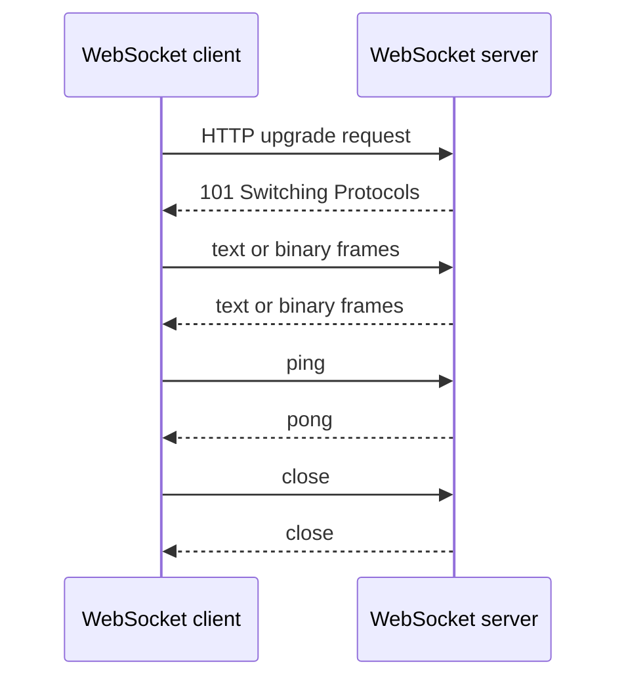
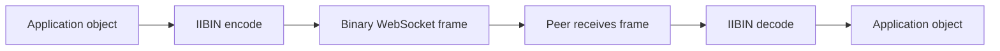

# 06: WebSocket Local Runtime

This guide is about what changes when an application stops treating network
work as a series of short request and response pairs and instead holds open a
live message channel. That is the real point of WebSocket. The handshake
matters, but the larger change is that the application starts living with an
ongoing conversation instead of a stack of isolated transactions.

That is why this example matters. It is easy to understand WebSocket only in
terms of the upgrade step and a few send or receive calls. It is harder, and
much more useful, to understand what a long-lived channel means for ownership,
timeouts, heartbeats, frame size limits, orderly close, and binary application
messages.


If a technical word is unfamiliar, keep the [Glossary](../glossary.md) open while you read.

## What This Guide Is Trying To Teach

The guide is not only "open a socket and send a string." It follows the life of
one WebSocket connection from start to finish. A client connects, performs the
upgrade, keeps the connection alive, exchanges text or binary frames, sends
heartbeat traffic, and closes in an orderly way.

That matters because WebSocket correctness is not only about the happy path.
Realtime systems fail in slow and messy ways. A peer may stop responding. A
message may be too large. A close frame may arrive while the application still
wants to send. If you only understand the handshake, you do not yet understand
the operating shape of WebSocket.



## Why The Local Runtime Framing Matters

The directory name mentions the local runtime because this example is meant to
be easy to run and easy to inspect. That does not make the lesson small. The
same lifecycle questions appear whether the peer is on the same machine or on a
different one. A connection is still long-lived. Frames still need correct
parsing and ownership. Heartbeats still matter. Shutdown still needs to be
clean.

Local examples are useful because they remove outside infrastructure from the
picture and let the reader focus on the connection model itself. Once that
model is clear, moving to a remote peer is an operational change, not a change
in basic understanding.

## What Changes Compared With Ordinary HTTP

Ordinary HTTP is request-led. WebSocket is connection-led. With HTTP, the
application usually thinks in terms of "send request, receive reply, finish."
With WebSocket, the application has to think in terms of "open channel, keep it
healthy, decide who owns sending, decide who owns receiving, and know what
counts as a clean end."

That is a deeper change than it first appears. It affects how application code
is structured, how memory limits are planned, how heartbeats are used, and how
production incidents are debugged. A timed-out request is easy to describe. A
half-alive WebSocket that is technically open but no longer exchanging healthy
traffic is a much more interesting operational problem.

## Step 1: Open The Connection

The first step is to connect and complete the upgrade.

```php
<?php

$conn = new King\WebSocket\Connection(
    'ws://127.0.0.1:9000/realtime',
    ['x-client-id' => 'example-reader'],
    [
        'handshake_timeout_ms' => 5000,
        'ping_interval_ms' => 25000,
        'max_payload_size' => 16 * 1024 * 1024,
    ]
);
```

The important point is that construction already means connection ownership.
The object is not a future plan for a socket. It is a live channel. If the
upgrade fails, the failure belongs to this step.

## Step 2: Send Text And Binary Frames

Once the channel is open, the application can send either text or binary data.
Text is a good fit for readable messages such as JSON or line-oriented control
traffic. Binary is a better fit for compact structured payloads, media
fragments, or schema-defined messages.

```php
<?php

$conn->send('{"type":"hello","user":"ada"}');
$conn->sendBinary(random_bytes(32));
```

This matters because WebSocket in King is not only a browser-chat feature. It
can also carry [IIBIN](../iibin.md), which means a live WebSocket channel can
transport structured binary objects instead of only plain text.



Once you see that path, WebSocket stops looking like "a chat socket" and starts
looking like a general-purpose realtime application lane.

## Step 3: Receive With Ownership In Mind

Receiving is where WebSocket stops feeling like buffered HTTP. The application
is now living with a channel whose next message might arrive immediately, much
later, or not at all. The runtime therefore exposes message receipt as its own
operation.

In the current public surface, pull-style receive is procedural. The
object-oriented `King\WebSocket\Connection` wrapper currently covers connect,
send, ping, close, and info inspection, while `king_client_websocket_receive()`
is the explicit receive path. The OO server-side sibling is now
`King\WebSocket\Server`, which accepts real on-wire HTTP/1 websocket upgrades
and returns accepted peers as `Connection` objects, plus a live
`getConnections()` registry for targeted server-owned sends by opaque
`connection_id`, broadcast fanout across the live accepted peer set, and
`stop()`-driven close-handshake shutdown of those same live peers.

```php
<?php

$handle = king_client_websocket_connect(
    'ws://127.0.0.1:9000/realtime',
    ['x-client-id' => 'example-reader'],
    [
        'handshake_timeout_ms' => 5000,
        'ping_interval_ms' => 25000,
        'max_payload_size' => 16 * 1024 * 1024,
    ]
);

$payload = king_client_websocket_receive($handle, 1000);

if ($payload === false) {
    throw new RuntimeException(king_client_websocket_get_last_error());
}
```

The important thing to notice is that the application is not rebuilding message
boundaries from raw bytes. The runtime gives the caller whole messages. That is
one of the main reasons a WebSocket channel can stay easier to reason about
than a raw socket with a homemade framing layer.

## Step 4: Keep The Channel Healthy

Heartbeat traffic exists because a long-lived channel is only useful if both
sides can notice when it has gone unhealthy. That is why WebSocket includes
ping and pong, and that is why this example pays attention to them.

```php
<?php

$conn->ping('keepalive');
```

Ping is not an afterthought. It shapes how quickly the application notices a
dead peer and how stable long-lived sessions remain across real network paths.
Without heartbeat discipline, the channel may stay "open" long after it stopped
being useful.

## Step 5: Close Cleanly

A WebSocket connection should normally end with an explicit close handshake
instead of an abrupt socket drop. That gives both sides a chance to agree that
the conversation is over and to record a close code and reason.

```php
<?php

$conn->close(1000, 'normal shutdown');
```

This is more important than it first sounds. The final state of a realtime
conversation often matters as much as the first successful message. A
clean close preserves that meaning instead of turning every end into "the
socket disappeared."

## What You Should Watch

When reading or running this example, pay attention to five things. Watch when
the channel becomes live. Watch how text and binary traffic are treated as
different message types. Watch how receive ownership differs from a buffered
HTTP body. Watch how ping and pong preserve channel health. Watch how close is
handled as a real protocol event rather than as an afterthought.

Those are the details that separate a working example from a channel a real system
can depend on.

## Why This Matters In Practice

You should care because WebSocket changes the reliability
model of an application. You stop measuring only request latency and start
measuring session health. You stop thinking only about retries and start
thinking about live channels, idle time, payload ceilings, peer shutdown, and
backpressure on the receive loop.

That is why this guide belongs in the handbook. It is one of the clearest
places where PHP code stops behaving like page glue and starts behaving like a
long-running networked runtime.

For the full conceptual chapter, read [WebSocket](../websocket.md).
