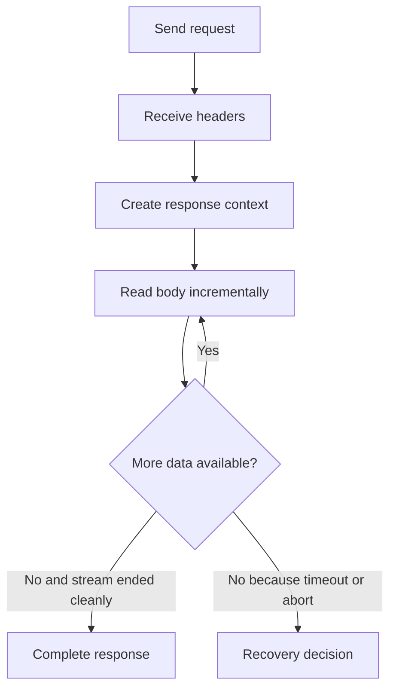
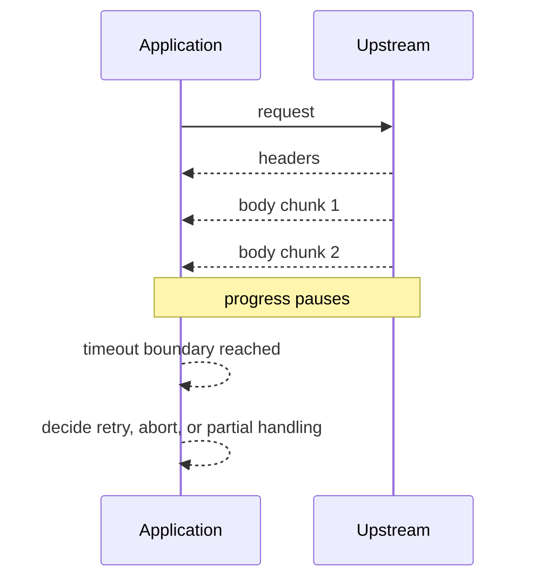

# 07: Streaming Response Timeout Recovery

This guide is about a part of HTTP that many readers do not really meet until a
production incident forces them to meet it. Not every response is a small body
that arrives immediately. Some replies are large, some are slow, some are
chunked, some are generated over time, and some fail after the headers have
already been accepted as valid.

That is why this example matters. It takes the reader out of the comfortable
world where `getBody()` always feels sufficient and into the world where the
application has to keep reading, handle timeout boundaries, and decide what to
do when a response ends badly instead of neatly.


If a technical word is unfamiliar, keep the [Glossary](../glossary.md) open while you read.

## The Real Problem This Guide Solves

The real problem is not "how do I read bytes in a loop?" The real problem is
how to reason about ownership once the headers have already been accepted but
the body is still arriving. At that point the request is neither a simple
success nor a simple failure. It is a live response stream.

That is exactly what the `response_stream` path is for. It turns the response
into something the application can consume gradually. That opens the door to
more realistic behavior, but it also means the caller now owns timeout
decisions, partial progress, and end-of-body handling.



## Why Streaming Is Different From Buffered Reads

Buffered reads hide time. That is their job. The runtime keeps working until it
can give the caller one finished response object. Streaming reads expose time.
They let the application notice that the body is arriving slowly, that the
upstream paused, or that the peer closed the connection before the transfer
finished.

This matters because a slow body is not always a broken body. A large export, a
report generator, an event feed, or a media transfer can be perfectly healthy
while still taking time to deliver. The application needs a way to keep making
progress without pretending that every valid response should already be
complete.

## Step 1: Start The Request In Streaming Mode

The first step is to ask the runtime for a response stream instead of a fully
buffered body.

```php
<?php

$response = king_send_request('https://example.com/large-export', [
    'response_stream' => true,
    'timeout_ms' => 10000,
]);

if ($response === false) {
    throw new RuntimeException(king_get_last_error());
}
```

The key idea is that a response object now represents a live exchange rather
than a finished payload. Headers may already be trustworthy while the body is
still arriving.

## Step 2: Read Incrementally

Once the response is live, the application reads in chunks instead of waiting
for one finished body string.

```php
<?php

while (!feof($response->getBodyStream())) {
    $chunk = fread($response->getBodyStream(), 8192);
    if ($chunk === false) {
        throw new RuntimeException('stream read failed');
    }

    if ($chunk === '') {
        break;
    }

    echo $chunk;
}
```

The important point is not the loop itself. The important point is that the
application now owns progress. It can persist partial work, compute rolling
checksums, emit progress information, or stop when policy says the response is
no longer worth waiting for.

## Step 3: Understand Timeouts During Useful Progress

Timeout is not only a "nothing arrived" event. It can happen in the middle of
real progress. That is why this example belongs in the handbook. The common
failure shape is not "the request never worked." The common failure shape is
"something arrived, then progress stopped."



This is where response streaming becomes operationally important. The caller
can distinguish between "no progress ever happened" and "useful progress
happened, then stalled."

## Step 4: Make A Recovery Decision

Recovery does not always mean "retry immediately." Sometimes recovery means
recording that the response was partial, closing the stream cleanly, and moving
on. Sometimes it means retrying from the beginning. Sometimes it means keeping
partial work and resuming at the application layer if the upstream supports
that kind of resume logic.

This guide is useful because it teaches the reader to separate transport facts
from business decisions. A timeout in the middle of a body is a transport fact.
Whether the application retries, resumes, fails, or accepts partial output is a
policy decision built on top of that fact.

## What You Should Watch

The first thing to watch is the moment where headers become trustworthy but the
body is still open. That is the key transition in the whole example. Before
that point, you are still negotiating the response. After that point, you are
consuming a live stream.

The second thing to watch is how incremental reads interact with timeout
boundaries. The application does not stop caring about time once the headers
arrive. Streaming means time remains part of the response contract until the
body ends cleanly.

The third thing to watch is what the runtime does and does not decide for you.
The runtime can report the transport facts. The application still decides what
to do with partial progress.

## Why This Matters In Practice

You should care because most serious data movement is not a
tiny response. File downloads, generated reports, event streams, media
transfers, and unstable upstreams all push code toward streaming behavior. If
the application only understands the fully buffered happy path, it becomes
fragile exactly where production traffic becomes interesting.

This guide teaches the reader to think in terms of response lifecycle instead
of only response objects. That is the difference between code that works on a
quiet development machine and code that stays correct when the network behaves
like a real network.

For the full client and response model, read
[HTTP Clients and Streams](../http-clients-and-streams.md).
