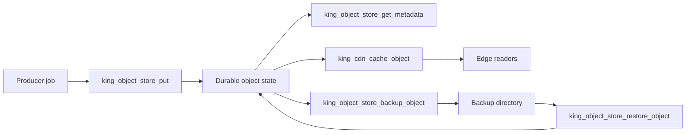

# 08: Object Store, Edge Warmup, Recovery, and High-Availability Delivery

This guide follows one important payload through the full King storage story.
The payload is not a throwaway upload. It is the kind of
artifact that real systems care about: a trained model checkpoint, a release
bundle, a large generated report, a video package, a dataset shard, or an
expensive intermediate result that several later jobs will need.

The purpose of the guide is not only to show which calls exist. The purpose is
to make the storage lifecycle feel concrete. By the end of the guide, the reader
should understand why one object write can affect metadata, edge caching,
restore behavior, recovery confidence, and future workload readiness.

## What This Guide Is Really About

At first glance the guide looks like it is about storing a payload and later
fetching it. That is only the surface. The real subject is how King keeps
payload, metadata, delivery behavior, and recovery behavior inside one runtime
model instead of spreading them across unrelated tools.

In smaller stacks, these concerns often drift apart. One tool writes files.
Another tool warms a cache. Another script copies backups. Another service tries
to remember which artifacts should stay hot. When something goes wrong, nobody
is fully sure which layer still has the correct truth. This guide shows the
opposite shape. One object identifier stays constant across durable write, edge
warmup, backup, restore, metadata inspection, and later reads.

## The Scenario

Imagine a team that trains and fine-tunes models. At the end of a run, the
system produces a checkpoint that must remain durable, must be downloadable by
operators, must be warm enough for a likely validation or fine-tuning follow-up,
and must be recoverable after host failure or restart.

This is a realistic storage problem. The checkpoint is large. It is expensive to
recreate. It may be fetched by external systems. It may be needed again very
soon. It may also need to survive longer than the process or even the host that
created it.

That is the basic picture for the example. You are not reading a guide about
"saving a file". You are reading a guide about managing one durable artifact
through its whole operational life.

## What You Should Notice

As you work through the guide, notice how many different kinds of questions are
answered by one object identity.

The first kind of question is about persistence. Has the payload been stored and
is it still there? The second kind of question is about meaning. What type of
data is it, how large is it, and what is its freshness or cache story? The
third kind of question is about delivery. Is it warm at the edge or still only
available from the origin? The fourth kind of question is about recovery. Has it
been backed up, and can it be brought back with its metadata intact?

The example is designed so those questions stay connected instead of becoming
five separate operational puzzles.

## The Architecture In One Picture



The picture is intentionally simple. One object identity sits in the middle and
every other action refers back to that same identity.

## Step 1: Initialize The Store

The first step is to initialize the object-store runtime with a storage root,
capacity, and CDN settings. This tells King where durable objects live and how
the delivery side should behave.

```php
<?php

king_object_store_init([
    'primary_backend' => 'local_fs',
    'storage_root_path' => __DIR__ . '/storage',
    'max_storage_size_bytes' => 50 * 1024 * 1024 * 1024,
    'replication_factor' => 3,
    'chunk_size_kb' => 4096,
    'cdn_config' => [
        'enabled' => true,
        'cache_size_mb' => 2048,
        'default_ttl_seconds' => 900,
    ],
]);
```

The important thing here is not only that a path exists. The runtime is also
learning the basic storage contract. It now knows which backend is primary, how
large the store may become, and whether the object should have a delivery path
beyond the origin store.

## Step 2: Write One Important Object

Now the producer writes a checkpoint into the store.

```php
<?php

$objectId = 'models/finetune/run-2026-03-27/checkpoint-00042';
$payload = file_get_contents(__DIR__ . '/checkpoint-00042.bin');

king_object_store_put($objectId, $payload, [
    'content_type' => 'application/octet-stream',
    'cache_ttl_sec' => 900,
    'expires_at' => '2026-04-03T00:00:00Z',
]);
```

The object identifier is what matters most here. It names the artifact in a way
that the rest of the platform can continue using. The payload is the data body,
but the object identifier is what lets edge warmup, metadata reads, backup, and
restore all speak about the same durable thing.

## Step 3: Read Metadata Instead Of Guessing

After the write, the next useful read is often not the payload itself. It is
the metadata. Metadata answers questions such as content size, timestamps,
freshness, and current storage state.

```php
<?php

$metadata = king_object_store_get_metadata($objectId);
print_r($metadata);
```

This step matters because serious systems should not guess about object state.
They should ask the store directly.

## Step 4: Warm The Object Toward The Edge

If the checkpoint or artifact is likely to be downloaded repeatedly, the next
step may be edge warmup.

```php
<?php

king_cdn_cache_object($objectId, [
    'ttl_sec' => 300,
]);
```

This call does not create a new truth separate from the store. It tells the CDN
layer to carry the same object identity toward the [edge](../glossary.md#edge)
so readers can fetch it faster without always hitting the origin.

## Step 5: Export A Recovery Copy

Now the guide moves from serving behavior to recovery behavior. The object is
valuable enough that the system wants an explicit backup artifact.

```php
<?php

king_object_store_backup_object($objectId, __DIR__ . '/backups/nightly');
```

This step matters because a durable store is trusted most on bad days. The
ability to export a recoverable copy with its metadata is part of what makes the
object operationally meaningful.

## Step 6: Read It Back

After the object has been stored, described, warmed, and backed up, the most
ordinary read path still matters. The application may only need the payload
again.

```php
<?php

$body = king_object_store_get($objectId);

if ($body === false) {
    throw new RuntimeException('Object not found.');
}
```

This read is simple by design. The complexity of protection, caching, and
recovery belongs inside the runtime so the caller can still use a direct read
path.

## Step 7: Inventory And Capacity View

Storage work is not only about one object. Operators also need inventory and
runtime status.

```php
<?php

$objects = king_object_store_list();
$stats = king_object_store_get_stats();

print_r($objects);
print_r($stats);
```

`king_object_store_list()` answers "what exists?" `king_object_store_get_stats()`
answers "what is the current condition of the store and CDN subsystem?" Those
are different questions, and both matter in operations.

## Step 8: Invalidate Stale Edge Copies After Change

Suppose the checkpoint or release artifact is replaced by a corrected version.
That new write changes not only the origin payload but also the correctness of
all edge copies.

```php
<?php

king_object_store_put($objectId, $newPayload);
king_cdn_invalidate_cache($objectId);
```

This is one of the most important lessons in the guide. Cache invalidation is
not optional cleanup. Once an object changes, old edge copies become a
correctness problem.

## Step 9: Restore After Loss

The guide becomes real when something fails. Imagine the origin copy is gone or
the object has to be restored in a clean environment.

```php
<?php

king_object_store_restore_object($objectId, __DIR__ . '/backups/nightly');
```

The key idea is that restore is more than "copy bytes back". The runtime also
restores the metadata that gives those bytes meaning.

## Step 10: Full-Store Backup And Restore

Some recovery events are larger than one object. For those cases the store also
supports full export and full import.

```php
<?php

king_object_store_backup_all_objects(__DIR__ . '/backups/full');
king_object_store_restore_all_objects(__DIR__ . '/backups/full');
```

This is the path that matters when the operator is thinking about host loss,
migration, environment rebuilds, or a fresh deployment that must regain the
whole durable store.

## Maintenance Is Part Of Trust

The store is not healthy forever just because it accepted one write. Maintenance
and cleanup are part of the lifecycle.

`king_object_store_optimize()` lets the runtime review and summarize its state.
`king_object_store_cleanup_expired_objects()` turns expiry policy into actual
cleanup behavior.

```php
<?php

$maintenance = king_object_store_optimize();
$cleanup = king_object_store_cleanup_expired_objects();
```

These calls are important because long-lived systems need explicit maintenance,
not just explicit creation.

## Why This Example Matters For AI Workloads

The guide is especially relevant to AI and data-heavy systems. A training or
fine-tuning platform often treats checkpoints, datasets, evaluation bundles, and
generated artifacts as if they are ordinary files. That works poorly once the
system needs durability, fast redistribution, backup readiness, and quick
rehydration for the next job.

The difference between "stored somewhere" and "stored with metadata, edge
awareness, recovery readiness, and hot-path readiness" is the difference between a
platform that waits on its own artifacts and a platform that can keep work
moving.

## What The Guide Does Not Hide

The guide is optimistic, but it is not pretending storage is simple. The same
object may have a write path, a delivery path, a backup path, and a later
restore path. The purpose of the runtime is not to erase that complexity from
the world. The purpose is to keep that complexity inside one coherent model
instead of scattering it across unrelated scripts.

That coherence is the actual lesson of the guide.

## Read This Beside The Main Chapter

This guide works best when read beside
[Object Store and CDN](../object-store-and-cdn.md). The main chapter explains
the subsystem as a whole. This guide narrows that explanation to one realistic
artifact and shows how the major actions fit together around it.

If the artifact is produced by tool traffic, read [MCP](../mcp.md) beside this
guide. If later jobs consume the stored object, read
[Pipeline Orchestrator](../pipeline-orchestrator.md). If the point of the object
is to stay warm for later compute, keep the object-store chapter open at the
sections on hotsets, predictive residency, and DirectStorage.
