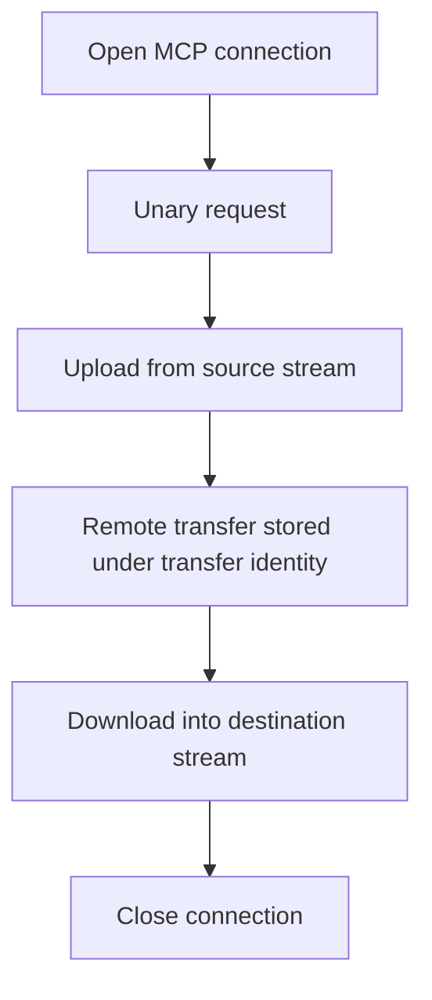

# 09: MCP Transfer Persistence

This guide explains how King handles remote control-plane traffic and larger
payload movement through one MCP runtime. The focus is not only on making one
request succeed. The focus is on keeping request identity, transfer identity,
streamed payload movement, and connection lifecycle understandable from start to
finish.

The guide is especially useful for readers who already understand why small RPC
calls are convenient but have seen those systems become awkward once payloads
grow. The moment one remote call needs to move a large artifact, a model
checkpoint, a generated bundle, or a large binary intermediate result, a simple
"just send JSON" mindset usually stops being enough.


If a technical word is unfamiliar, keep the [Glossary](../glossary.md) open while you read.

## The Situation

Imagine a remote worker that exposes a service named `artifact_service`. The
local process needs to ask the remote side for metadata about an object, upload
one large checkpoint, and later download the same checkpoint back into a local
stream.

This is a realistic control-plane problem. Some traffic is small and naturally
fits into one request and one response. Some traffic is larger and wants a
transfer identity instead of a small in-memory payload. The point of the guide
is to show how King keeps both traffic shapes inside one coherent protocol.

## What The Guide Teaches

The guide shows five connected ideas.

The first idea is explicit connection state. MCP begins with a peer connection,
not with a floating function call that forgets who it is talking to.

The second idea is a unary request. A service name, method name, and payload go
out; one response payload comes back.

The third idea is upload from stream. A large payload is drained from a PHP
stream and stored remotely under a transfer identity.

The fourth idea is download to stream. The transfer identity is used again to
fetch the payload back into another stream.

The fifth idea is that timeouts, deadlines, and cancellation are part of the
contract, not afterthoughts.

## The Flow In One Picture



This is the shape to keep in mind while reading. One peer connection, several
related operations, one transfer identity that keeps the large payload path
under control.

## Step 1: Open The Connection

The first step is to create an MCP connection handle.

```php
<?php

$conn = king_mcp_connect('127.0.0.1', 7001, null);

if ($conn === false) {
    throw new RuntimeException(king_mcp_get_error());
}
```

The important part is that this creates explicit peer state. Later operations
know which remote worker they belong to and whether the connection is still
open.

The same idea exists in object-oriented form:

```php
<?php

$conn = new King\MCP('127.0.0.1', 7001);
```

## Step 2: Send One Unary Request

Now the local process asks the remote service to describe an object.

```php
<?php

$reply = king_mcp_request(
    $conn,
    'artifact_service',
    'describe',
    '{"object_id":"models/checkpoint-42"}',
    [
        'timeout_ms' => 3000,
    ]
);

if ($reply === false) {
    throw new RuntimeException(king_mcp_get_error());
}

echo $reply . PHP_EOL;
```

This is the cleanest expression of the MCP control-plane model. The request
names a service, names a method, and carries a payload that has a defined
purpose. The runtime does not have to guess which remote behavior is being
requested.

## Step 3: Upload A Large Payload From A Stream

Now the guide moves to the larger-payload path. The local side has a checkpoint
file that should be stored remotely under a clear transfer identity.

```php
<?php

$source = fopen(__DIR__ . '/checkpoint-00042.bin', 'rb');

$ok = king_mcp_upload_from_stream(
    $conn,
    'artifact_service',
    'store_checkpoint',
    'run-2026-03-27-checkpoint-42',
    $source,
    [
        'timeout_ms' => 10000,
    ]
);

fclose($source);

if (!$ok) {
    throw new RuntimeException(king_mcp_get_error());
}
```

The interesting detail here is not only that the source is a stream. The more
important detail is that the upload is named by service, method, and stream
identifier. The current runtime persists and resolves transfers by that same
triple, with the request payload carrying the identifier component during
download. That gives the transfer a disciplined identity instead of leaving the
protocol to invent informal naming rules later.

## Step 4: Download The Same Transfer Into Another Stream

Once the remote side has stored the transfer, the local process or another peer
can resolve it again and download it into a destination stream.

```php
<?php

$destination = fopen(__DIR__ . '/restored-checkpoint.bin', 'wb');

$ok = king_mcp_download_to_stream(
    $conn,
    'artifact_service',
    'store_checkpoint',
    'run-2026-03-27-checkpoint-42',
    $destination,
    [
        'timeout_ms' => 10000,
    ]
);

fclose($destination);

if (!$ok) {
    throw new RuntimeException(king_mcp_get_error());
}
```

This is where the transfer identity proves its value. The large payload can be
referred to later without pretending it was only a one-shot response body, but
the current public surface still expects the same service and method names that
were used when the transfer was stored.

## Step 5: Close The Connection Explicitly

The guide ends by closing the connection instead of leaving the lifecycle vague.

```php
<?php

king_mcp_close($conn);
```

Or, with the object API:

```php
<?php

$conn->close();
```

The close matters because MCP is a real remote-peer relationship, not only a
bag of static functions.

## Deadlines, Timeouts, And Cancellation In Practice

The examples above used `timeout_ms`, but MCP also supports deadline and cancel
controls. This matters when the local process is coordinating several operations
that all need to stop at a consistent time boundary, or when a caller decides
that the remote work is no longer worth waiting for.

A timeout is a local per-operation wait limit. A deadline is a stronger shared
time boundary. A cancel token is a caller decision. These are different tools,
and serious control-plane work often needs all three.

The point of the guide is not to force every example to show every option. The
point is to make the lifecycle model visible enough that these options feel
natural instead of surprising.

## Why Transfer Identity Deserves So Much Attention

The transfer identity is what prevents the larger-payload path from turning into
a loose pile of ad-hoc upload and download conventions.

Without a disciplined transfer identity, a system quickly drifts into questions
such as "which file does this upload correspond to?" or "how does the download
side know which upload it is supposed to fetch?" Those questions are exactly
what structured control-plane design is meant to avoid.

King answers them by making the upload and download path name the same logical
thing in an explicit way.

## How This Connects To The Object Store

In many real systems, the uploaded MCP transfer is not the final resting place
of the payload. The remote side may persist it into the
[Object Store and CDN](../object-store-and-cdn.md), attach metadata, warm it
toward the edge, or keep it ready for later rehydration into another workload.

This is why the MCP guide should be read beside the object-store chapter. MCP is
often the way a payload crosses a process boundary. The object store is often
where that payload becomes durable and operationally meaningful.

## How This Connects To The Orchestrator

The MCP guide also fits naturally beside the
[Pipeline Orchestrator](../pipeline-orchestrator.md). A remote tool or worker
often needs a control-plane transport, and MCP gives the runtime a structured
way to carry that interaction.

If the orchestrator is the part that decides which work should happen, MCP is
often the part that lets that work reach a remote implementation.

## Read This Beside The Main Chapter

This guide works best beside [MCP](../mcp.md). The handbook chapter explains the
subsystem model as a whole. This guide narrows that explanation to one practical
sequence with a unary request and a larger transfer flow.
