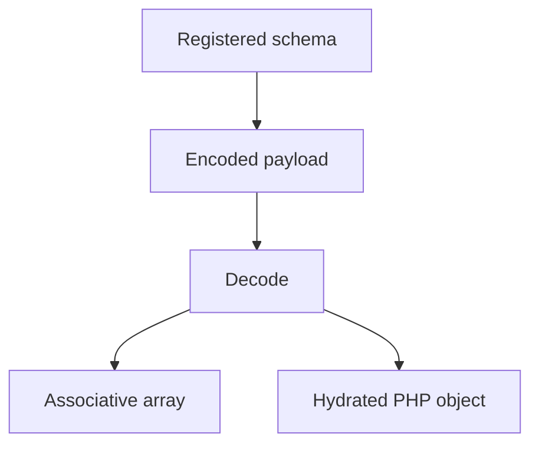

# 10: IIBIN Object Hydration

This guide explains one of the most important ideas in the extension: binary
data is only half the story. The other half is knowing exactly what that binary
data means when it arrives. That is where IIBIN object hydration becomes so
valuable.

When many readers hear "binary encoding," they first imagine compression or
speed. Those are real benefits, but they are not the most important ones. The
stronger benefit is that the wire format has a schema, the schema has field
identity, and the runtime can turn the decoded payload into a useful PHP object
shape instead of leaving the caller with anonymous bytes and guesswork.

If a technical word is unfamiliar, keep the [Glossary](../glossary.md) open while you read.

## The Problem This Example Solves

The real problem is not how to serialize one array. PHP can already move arrays
around. The real problem is how to define a message that stays understandable
over time, stays compact on the wire, and still turns back into a useful object
model on the receiving side.

That is why this example matters. It teaches the reader that IIBIN is not a
trick for making payloads smaller. It is a contract language for data that has
to move between processes without turning into ambiguous text.

## Why Hydration Is The Important Word

Hydration means the runtime is not only decoding bytes. It is restoring shape.
Field numbers, defaults, enum values, repeated fields, maps, and one-of style
choices all work together so the receiving side gets back something that still
feels like structured application data.

That matters because the expensive part of wire formats is often not encoding.
It is keeping meaning stable while code evolves. If a message can be encoded
quickly but nobody can safely extend it later, the format is not doing the hard
part of the job. Hydration matters because it keeps the decoded result close to
the shape the application actually wants to work with next.

## Schema Before Payload

One of the most important lessons in this example is ordering. The schema comes
first. The payload comes after. That sounds obvious, but many systems drift
toward unstructured encoding over time. One producer adds a field informally. Another
consumer assumes a default without writing it down. Eventually the bytes still
move, but the shared meaning becomes unstable.

IIBIN exists to prevent that drift. The schema is registered first. The fields,
enums, and structure are explicit. Only then does the payload travel. This is
what allows later readers to decode with confidence instead of reconstructing
intent from scattered assumptions.

## What You Should Notice

The first thing to notice is schema registration. The example is not doing
unstructured encoding. It registers the schema first. That tells the reader that the
message shape is explicit, not guessed at decode time.

The second thing to notice is that enums and defaults are part of the message
contract, not comments outside the contract. That is one reason the format is
so useful for long-lived systems. The message shape can say what a field means,
what values are legal, and what should happen when a field is absent.

The third thing to notice is the decode target. Sometimes the right decoded
shape is an associative array. Sometimes the right decoded shape is an object.
The example matters because it shows that hydration is not only about parsing.
It is about turning the payload into the form the application actually wants to
use next.

## Why This Matters Across The Extension

IIBIN matters in WebSocket binary frames, MCP payload design, object-store
metadata, orchestrator payloads, and any other place where the extension needs
compact and explicit data contracts. Once a reader understands hydration, many
other parts of the handbook become easier to reason about. The payload stops
looking like "a binary blob" and starts looking like "a message whose structure
is known on purpose."

That is one reason this guide matters beyond serialization alone. It helps the
reader see how King keeps binary data compact without making the application
guess what the data means.

## Why This Matters In Practice

You should care because long-lived systems need messages that
stay compact, evolvable, and exact. Text can be friendly, but it is often loose
about shape. IIBIN gives the extension a stricter language for data that has to
survive transport, storage, and version evolution without becoming vague.

That is the real strength of the subsystem. It gives PHP code a way to speak a
high-speed, strongly shaped binary language while still letting the receiving
side work with readable PHP structures.

For the full subsystem explanation, read [IIBIN](../iibin.md).
