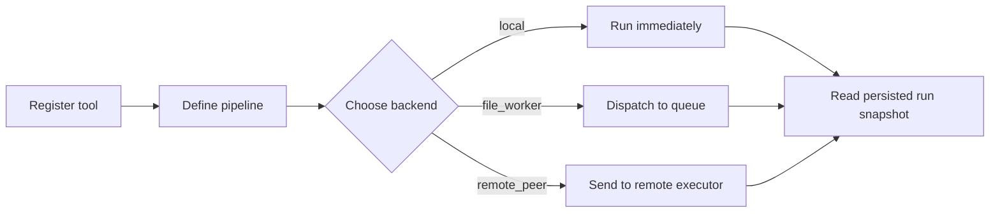

# 11: Pipeline Orchestrator Tools

This guide is the first place in the handbook where the reader can watch King
treat workflow execution as an operational system rather than as a chain of
callbacks.

Many projects begin with a few direct calls wired together in a controller.
That is usually enough until the workflow becomes important enough that people
need to inspect it after the fact. Someone wants to know whether the run was
queued, which tool definition it used, whether it timed out, whether it was
cancelled, or why a worker handled it later instead of the request process
doing the work immediately.

That is the point where an orchestrator stops sounding abstract and starts
becoming necessary. This guide exists to make that transition easy to follow.

If a technical word is unfamiliar, keep the [Glossary](../glossary.md) open while you read.

## What This Example Builds

The example builds one small but realistic orchestrated workflow. It registers a
named tool, defines a pipeline as data, starts or dispatches a run, inspects
the persisted run snapshot, and shows how the same run model behaves across
local, file-worker, and remote-peer execution.

The goal is not only to show some API calls. The goal is to show the shape of a
production-safe workflow boundary. Once you understand this example, the
orchestration model in the rest of the extension becomes easier to follow.

## Why This Example Matters

This example matters because it answers the questions that appear the moment a
workflow becomes real work instead of a short inline script. Where do tool
definitions live? How is the workflow represented? What is the run ID? Where
does status live? What happens if the request path should not execute the job
itself? How do you inspect a run after it has moved into a worker or a remote
peer? What does cancellation mean?

The guide answers those questions by following one pipeline through the
controller, persistence layer, and backend boundary instead of talking only
about API calls in isolation.

## The Important Terms

Before running the example, it helps to know what the main words mean in this
chapter.

A tool is a named capability stored in the orchestrator registry. A pipeline is
the ordered list of steps that reference those tools. A run is one concrete
execution of an initial input plus a pipeline definition. A run snapshot is the
stored record that lets you inspect that run later. A worker is the process
that claims queued runs and executes them.

These terms sound simple, but together they are what turn "some code ran" into
"the platform can explain what happened."

## Step 1: Register A Tool

The example begins by registering a tool with
`king_pipeline_orchestrator_register_tool()`. This matters because the
orchestrator does not want a pipeline to name accidental strings. A step should
refer to a declared capability with a known definition.

That tool registration step is one of the reasons orchestration becomes
governable. The platform can list tools, inspect tool metadata, and reject
pipelines that reference undefined capabilities instead of discovering mistakes
only after work has already begun.

The important boundary is that this registration step defines a durable tool
name and configuration snapshot, not an executable PHP callback. The current
public contract does not claim that userland closures or controller memory are
serialized into persisted run state. `king_pipeline_orchestrator_register_handler()`
now binds an executable handler by tool name inside the current process, but
that runtime binding is still separate from durable orchestrator state.

That registration identity is now explicit too: the durable cross-boundary
anchor is the tool name itself. A local controller, a same-host file worker, a
restarted replacement worker, and a remote execution peer must each bind their
own executable handler for that same tool name in the process that will
actually execute the step.

Forms that cannot be rehydrated honestly across those boundaries are outside the
public durability claim. Captured closures, resource-backed callables, and
handlers whose meaning depends on opaque controller memory must therefore be
rejected or fail closed instead of being treated as portable execution state.

## Step 2: Define The Pipeline As Data

After that, the example defines the pipeline itself as an array of step
descriptions. This is the point where control flow becomes data. Because the
workflow is now explicit data, the orchestrator can validate it, persist it,
queue it, send it to another peer, and inspect it later.

This is one of the most important ideas in the whole subsystem. The orchestrator
is valuable because it treats workflow as something the runtime can name, store,
and reason about.

## Step 3: Choose An Execution Backend

The example then chooses one of the execution entry points. If the backend is
local or remote-peer, it uses `king_pipeline_orchestrator_run()`. If the
backend is file-worker, it uses `king_pipeline_orchestrator_dispatch()` and
lets a worker pick the run up later with
`king_pipeline_orchestrator_worker_run_next()`.

This distinction matters because not every workflow should run in the request
process that accepted it. Some runs belong in-process for immediacy. Some
belong in a same-host worker for isolation. Some belong on a remote peer for
topology or ownership reasons. The orchestrator keeps those backend choices
explicit instead of hiding them inside one helper.

When the active backend is local and the relevant tool handlers were bound with
`king_pipeline_orchestrator_register_handler()`, `run()` now executes those
handlers directly and persists the latest local step payload after each
completed step. A later `resume_run()` can therefore continue from honest
completed-step progress instead of replaying already-completed local work.
The local callable now receives one context array with `input`, `tool`, `run`,
and `step` blocks and must return one array containing `output` as the next
array payload.

Queued file-worker runs now persist the durable handler-reference boundary too.
If you inspect a queued run with `king_pipeline_orchestrator_get_run()`, the
snapshot includes `handler_boundary` with the required tool names and step
indexes for later worker execution. That is intentionally only a durable
reference surface, not a serialized PHP callback.

## Step 4: Inspect The Persisted Run

Finally, the example reads the stored run with
`king_pipeline_orchestrator_get_run()` so you can see that the run is now a
persistent system object rather than an anonymous return value.

That is another key lesson of the example. The output of an orchestrated run is
not only the final result. It is also the stored record of what was asked,
which backend handled it, what state the run reached, which completed steps now
need caller-managed compensation after a terminal failure, and how the runtime
can describe that contract later.

## What You Should Watch

When reading or running the example, pay attention to three things.

The first thing is identity. The run ID is the anchor that ties together queue
files, persisted state, remote execution, and later inspection. The second is
backend ownership. The same high-level workflow can stay in-process, move to a
same-host worker, or cross a remote TCP boundary, and the orchestrator keeps
that topology visible. The third is lifecycle state. Queued, running,
completed, failed, and cancelled are not comments. They are persisted statuses
the runtime treats as real state.

## Why This Matters In Production

In a real system, the orchestrator lets the request path stay small while the
workflow itself stays visible. A request can accept work, persist the run, hand
it to a worker, and return. Operations can later ask which run failed, how many
runs are queued, which backend is active, which tools are registered, and what
the last run status was.

That is why this guide belongs in the handbook. It shows how workflow execution
becomes something the platform can govern instead of something the team has to
rediscover later in logs and exception traces.

## Why This Matters In Practice

You should care because workflow systems become hard to trust
when they only tell you the final outcome and nothing about the path taken to
get there. The orchestrator matters because it keeps the definition, identity,
backend, and result of a run tied together in one runtime contract.

That is the difference between "we called some helpers" and "we executed a run
the platform can account for."

For the full subsystem explanation, read
[Pipeline Orchestrator](../pipeline-orchestrator.md). If the remote-peer path
is the part you care about most, read [MCP](../mcp.md). If the queue and
recovery side matters more, read [Operations and Release](../operations-and-release.md)
together with the orchestrator chapter.
