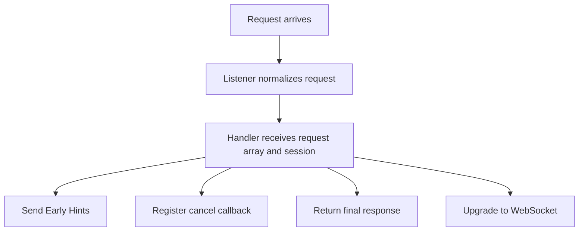

# 12: Server Upgrade and Early Hints

This guide explains the part of server programming that begins where the
smallest server examples stop. Many examples in the PHP world show a handler
that reads a request and returns a body string. That is a useful first
lesson, but it leaves out the parts that make a server feel like real
infrastructure: interim hints, cancellation, protocol upgrade, session
ownership, peer identity, TLS lifecycle, and server-controlled shutdown.

The point of this guide is to make those server-side actions feel normal and
connected instead of looking like isolated features.


If a technical word is unfamiliar, keep the [Glossary](../glossary.md) open while you read.

## The Situation

Imagine a service that accepts browser or API traffic, knows early in the
request which assets the client will need, and sometimes turns the same request
into a long-lived realtime channel. It also wants to observe the request with
telemetry and stop background work if the client disappears.

That is a normal modern server problem. It is no longer enough to think only in
terms of "read request, return body." The server has to coordinate several
actions around one request and one live session.

## What This Guide Teaches

The guide shows how one server request moves through four main ideas.

The first is request normalization. The server runtime gives the handler a clean
request array instead of raw protocol bytes.

The second is staged response behavior. The server can send Early Hints before
the final response is ready.

The third is cancellation and observability. If the client goes away or the
server wants to instrument the request, the same live session gives it a place
to do that.

The fourth is upgrade. A request can stop being only a request and become a
WebSocket channel owned by the handler.



The important thing to notice is that all of these actions sit around one live
server session. The handler is not talking to unrelated systems.

## Step 1: Start A Listener

The first step is to start a server listener with a handler. This guide uses
HTTP/1 because it is the easiest way to show the full request lifecycle in a
single place.

```php
<?php

king_http1_server_listen('127.0.0.1', 8080, null, function (array $request) {
    return [
        'status' => 200,
        'headers' => ['content-type' => 'text/plain'],
        'body' => "hello\n",
    ];
});
```

This small example already shows the main shape. The listener owns accept and
normalization. The handler sees a request array and returns a normalized
response array.

## Step 2: Use The Live Session The Handler Receives

The request array carries more than headers and body. It also gives the handler
access to the live server session and the stream identifier for this request.

```php
<?php

king_http1_server_listen('127.0.0.1', 8080, null, function (array $request) {
    $session = $request['session'];
    $streamId = $request['stream_id'];

    return [
        'status' => 200,
        'headers' => ['content-type' => 'text/plain'],
        'body' => "session-aware handler\n",
    ];
});
```

That session reference is what makes the rest of the guide possible. It is how
the handler can send Early Hints, register cancellation, upgrade to WebSocket,
reload TLS material, inspect peer identity, or attach telemetry without leaving
the server model.

## Step 3: Send Early Hints Before The Final Response

Suppose the server already knows that the client will need a stylesheet and a
script. It can tell the client that before the final page response is ready.

```php
<?php

king_http1_server_listen('127.0.0.1', 8080, null, function (array $request) {
    $session = $request['session'];
    $streamId = $request['stream_id'];

    king_server_send_early_hints($session, $streamId, [
        ['link', '</assets/app.css>; rel=preload; as=style'],
        ['link', '</assets/app.js>; rel=preload; as=script'],
    ]);

    return [
        'status' => 200,
        'headers' => ['content-type' => 'text/html'],
        'body' => "<!doctype html><html><body>ready</body></html>",
    ];
});
```

The value of Early Hints is simple. The server sends useful information as soon
as it knows it instead of waiting for every part of the final response to be
finished first. That matters most when the server can already name the
resources the client will need next.

## Step 4: Stop Work If The Client Cancels

Now imagine the handler starts expensive work. If the client disappears, that
work should stop instead of continuing pointlessly.

```php
<?php

king_http1_server_listen('127.0.0.1', 8080, null, function (array $request) {
    $session = $request['session'];
    $streamId = $request['stream_id'];

    king_server_on_cancel($session, $streamId, function () {
        error_log('client cancelled the request');
    });

    return [
        'status' => 200,
        'headers' => ['content-type' => 'text/plain'],
        'body' => "long-running work completed\n",
    ];
});
```

This is the server-side version of cancellation discipline. The server does not
only know how to start work. It also knows how to stop reacting to a request
that is no longer alive.

## Step 5: Attach Telemetry To The Session

The next step is to make the request observable.

```php
<?php

king_http1_server_listen('127.0.0.1', 8080, null, function (array $request) {
    $session = $request['session'];

    king_server_init_telemetry($session, [
        'otel.enabled' => true,
        'otel.service_name' => 'server-example',
    ]);

    return [
        'status' => 200,
        'headers' => ['content-type' => 'text/plain'],
        'body' => "telemetry attached\n",
    ];
});
```

This is useful because server behavior is not only about responding. Operators
also need to observe what happened while the request was being handled.

## Step 6: Upgrade To WebSocket

Now the guide reaches the point where the request stops being only a request.
Suppose the path `/realtime` should become a WebSocket channel.

```php
<?php

king_http1_server_listen_once('127.0.0.1', 9001, null, function (array $request) {
    $session = $request['session'];
    $streamId = $request['stream_id'];

    if (($request['path'] ?? '/') !== '/realtime') {
        return [
            'status' => 404,
            'headers' => ['content-type' => 'text/plain'],
            'body' => "not found\n",
        ];
    }

    $websocket = king_server_upgrade_to_websocket($session, $streamId);
    if ($websocket === false) {
        return [
            'status' => 400,
            'headers' => ['content-type' => 'text/plain'],
            'body' => "upgrade failed\n",
        ];
    }

    return [
        'status' => 101,
        'headers' => [],
        'body' => '',
    ];
});
```

The important shift is that the handler is no longer only preparing a final
body. It is deciding that the request should become a long-lived channel. This
is where ordinary request handling turns into realtime session ownership.

## Step 7: Inspect Peer Identity And TLS State

If the listener is running with TLS or mTLS policy, the server may want to
inspect the peer identity directly.

```php
<?php

$subject = king_session_get_peer_cert_subject($session, $request['capability']);
if ($subject !== false) {
    error_log('peer subject: ' . json_encode($subject));
}
```

This matters most for protected admin or internal control flows where the
application wants more than "the handshake passed." It wants to know who was on
the other side according to the accepted certificate chain.

The same session can also reload TLS material when certificates rotate.

```php
<?php

king_server_reload_tls_config(
    $session,
    '/etc/king/tls/server.crt',
    '/etc/king/tls/server.key'
);
```

That is a server lifecycle action, not a transport shortcut. Long-running services
need a safe way to adopt new trust material without losing the meaning of the
current listener.

## Step 8: Close From The Server Side When Needed

Sometimes the server decides that the session should end. That may be because
of maintenance, shutdown, policy, or capability mismatch.

```php
<?php

king_session_close_server_initiated(
    $session,
    $request['capability'],
    1000,
    'server maintenance'
);
```

This is cleaner than treating every server-owned shutdown as a raw socket drop.
The runtime can preserve the meaning of the close decision.

## Step 9: Add A Protected Admin Listener

Some server functions should not share the same policy as public request
traffic. That is where the admin listener comes in.

```php
<?php

king_admin_api_listen($session, [
    'admin.enable' => true,
    'admin.bind_host' => '127.0.0.1',
    'admin.bind_port' => 9443,
]);
```

The point is not only to open another listener. The point is to separate public
traffic from operational control traffic while keeping both inside one server
runtime model.

## What You Should Watch

When reading or running this example, pay attention to how many important
actions happen through the same session handle. Early Hints, cancellation,
telemetry, TLS reload, upgrade, peer identity inspection, admin control, and
server-side close all hang off one live server context.

That is the main design lesson. The runtime keeps server state coherent instead
of scattering it across unrelated callbacks.

## Why This Matters In Practice

You should care because these are the features that separate
a request handler from an operable server. Real systems need staged response
behavior, cancellation discipline, upgrade ownership, peer identity, live trust
rotation, and protected control paths. They need those things while continuing
to serve traffic.

That is why this guide belongs in the handbook. It shows how one server request
can become a richer runtime event without leaving the common server model.

For the full subsystem explanation, read [Server Runtime](../server-runtime.md).
If the request becomes a realtime channel, keep [WebSocket](../websocket.md)
nearby. If the listener runs with QUIC or HTTP/3 transport policy, keep
[QUIC and TLS](../quic-and-tls.md) nearby as well.
