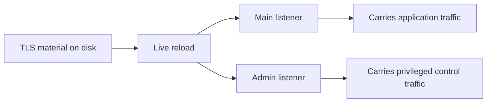
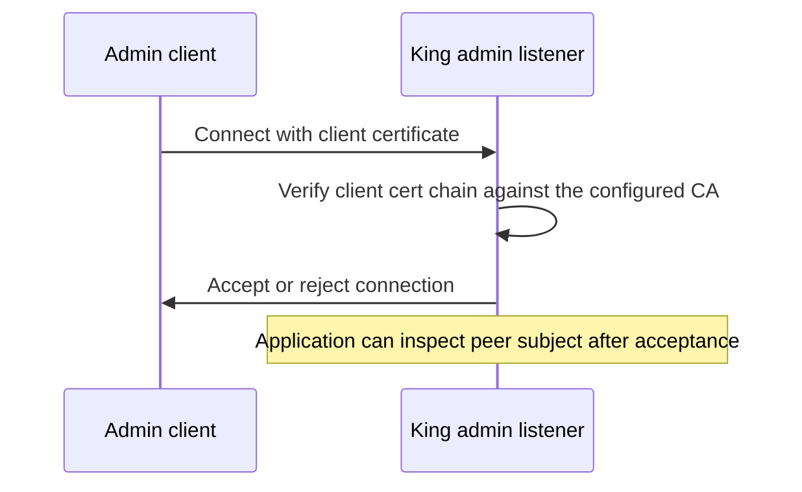

# 13: Admin API and TLS Reload

This guide explains a simple truth about production systems: accepting traffic
is not enough. A service also needs a trustworthy control surface. It needs a
way to inspect itself, rotate trust material, and accept privileged operational
actions without confusing those actions with ordinary public traffic.

That is why this example matters. It does not describe an optional side path
for operators. It describes part of the real service boundary. In the current
runtime, that boundary is represented as validated session state for the admin
API, peer certificate inspection, and TLS reload path rather than a full
network admin server and live accept-loop reconfiguration backend. Those
surfaces still exist because a running service has to keep its identity, trust
policy, and control plane healthy while it continues to serve work.

If a technical word is unfamiliar, keep the [Glossary](../glossary.md) open while you read.

## The Operational Problem Behind The Example

Certificates expire. Trust roots change. A service sometimes needs to reload
its TLS material without being torn down from scratch. A control listener needs
to exist on a tighter trust boundary than the public server path. An operator
needs a direct way to inspect the identity of the peer that just connected.

All of those concerns belong together. This example keeps them together because
they are all part of one practical question: how do you operate a server safely
while it stays online?

## Why A Separate Admin Surface Matters

Many systems begin with one listener because that is enough to serve the first
request. Later, those same systems need control endpoints for reload,
inspection, metrics, maintenance, or internal actions. That is where mistakes
often begin. A control path that shares all the same assumptions as a public
listener is much easier to expose too broadly.

This guide exists so the reader sees the split clearly. Public traffic and
privileged control traffic are not the same audience. They should not share the
same trust boundary by accident. The admin surface exists because the runtime
needs a place where operational authority is treated differently from normal
application access.

## Why Mutual TLS Matters Here

Mutual TLS matters because an admin surface should not trust the network by
default. It should trust explicit identity. That means the admin path does not
only present a server certificate. It also verifies the client certificate
chain against the configured CA and decides whether the caller belongs on that
control surface at all. A random self-signed client leaf is not enough.

This matters because TLS is more than transport encryption. In this context it
is part of access control. The process is not only protecting bytes on the
wire. It is deciding who is allowed to perform privileged operations.

## Why Live TLS Reload Is A Distinct Capability

A lot of software can pick up new certificates after a restart. That is useful,
but it is not the same as live reload. Live reload matters when a process has
to stay up, keep handling traffic, and still adopt new trust material in a
clean way.

That difference is operationally important. Restart-based rotation may be fine
for a small service with tolerant clients. It is a worse answer for systems
that need to hold long-lived sessions, avoid avoidable downtime, or rotate
trust material under active load. This guide exists so the reader can see why
"restart with new files later" and "reload identity safely while staying up"
are different capabilities.

## What You Should Notice In The Example

The first thing to notice is the split between the main traffic path and the
admin path. They are not the same audience and should not inherit the same
trust assumptions. The example is not making the system larger for the sake of
complexity. It is making the service boundary more honest.

The second thing to notice is peer certificate subject inspection. That is the
runtime telling the application who connected according to the certificate
chain that was actually accepted, not according to a user-supplied header or a
guess from outside the connection.

The third thing to notice is timing. A TLS reload is valuable only if it can be
performed while the process continues to serve traffic. In the current runtime,
that reload is modeled as a validated TLS snapshot update on the live server
session, not a full native listener hot-swap. That is why the example is not
only about configuration. It is about lifecycle.

## How This Fits A Real Service

In a real deployment, the main listener usually carries application traffic
from public clients or upstream peers. The admin listener sits on a narrower
path and receives actions such as reload, inspection, or other privileged
operations. In the current runtime, King validates and records that admin
listener snapshot on the live server session, including the required `mtls`
material, instead of spinning up a separate in-tree network listener backend.
When new trust material is prepared, the runtime reloads and tracks the TLS
snapshot while the service remains alive. When an admin client connects on a
server path that has peer identity available, the process can read its verified
subject and decide what that caller is allowed to do.

That combination is what makes the example practical. It does not show three
unrelated features. It shows one operating model: keep the service online,
rotate trust safely, and make privileged access depend on verified identity.

## Why This Matters In Practice

You should care because these are the capabilities that
separate a bare network service from an operable one. Real systems need
certificate rotation, privileged control paths, and clear peer identity. They
also need those things without turning routine maintenance into downtime or
guesswork.

This guide gives the reader the operational frame for that part of the runtime.
It shows that King is not only designed to accept application traffic. It is
designed to remain governable while it does so, even though the current repo
slice models some of that control surface as validated session state rather
than a full standalone admin daemon.

For the wider server-side explanation, read [Server Runtime](../server-runtime.md)
and [QUIC and TLS](../quic-and-tls.md).
