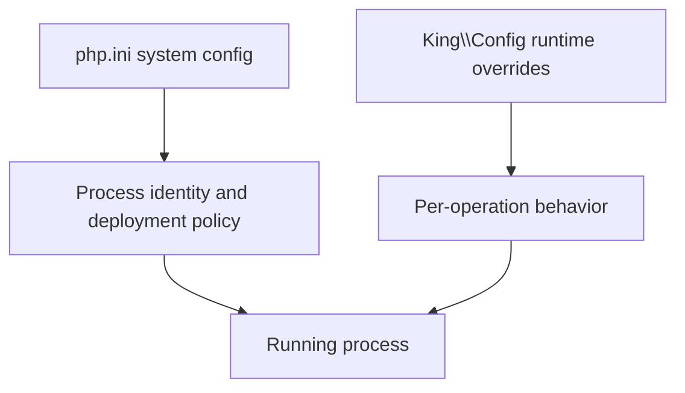

# 14: Config Policy and Overrides

This guide explains one of the most important design lines in the extension:
some settings belong to the operator, and some settings belong to the
application. If that line becomes blurry, the runtime becomes harder to secure,
harder to reason about, and harder to operate.

That is why this example matters. It is not only about how to build a
`King\Config` object. It is about understanding why runtime overrides exist at
all, why they are namespaced, why some settings belong in per-operation config,
and why other settings must stay under deployment control in `php.ini`.

If a technical word is unfamiliar, keep the [Glossary](../glossary.md) open while you read.

## The Real Question Behind The Example

The real question is simple: who is allowed to change what?

An application may reasonably want to change timeouts, per-request routing
choices, trace headers, protocol preferences, or workload-specific transport
behavior for one operation. It should not quietly change the cloud API token,
the orchestrator durable state path, or the process-wide CA bundle just because
a convenient function call made that possible.

That is the policy line this example is teaching.

## Why Namespaces Matter

The namespaced key model is not cosmetic. It keeps related settings grouped by
subsystem so the meaning of a key stays clear even when the extension surface is
large. A key under `tls.*` belongs to trust policy. A key under `mcp.*`
belongs to the control-plane transport. A key under `otel.*` belongs to
telemetry export. A key under `quic.*` belongs to transport behavior.

This matters because a large configuration surface becomes hard to learn very
quickly when every setting looks like an unrelated flat string. Namespaces keep
the vocabulary stable. They also help readers see whether a setting is about
transport, storage, telemetry, orchestration, or deployment identity before
they even open the full reference.

## Why Runtime Overrides Exist At All

Runtime overrides exist because not every decision should be forced into one
global deployment file. A single request may need a tighter timeout. One MCP
peer may need a different address. One telemetry-emitting client may need a
different service name. One protocol call may need a different cancel token or
streaming behavior.

The point of `King\Config` is to let the caller express those local choices
cleanly and explicitly. The point is not to let user code seize ownership of
the whole process. This guide exists so the reader can see both halves of that
story at once: runtime flexibility and deployment discipline.

## What You Should Notice

The first thing to notice is that config is treated as policy rather than as a
loose collection of knobs. A key is not only "something you can set." It is a statement
about which part of the system is allowed to own that decision.

The second thing to notice is reuse. A `King\Config` object is not helpful only
because it validates keys once. It is also helpful because it lets several
related calls share the same policy snapshot instead of rebuilding similar
option arrays repeatedly.

The third thing to notice is the boundary between runtime behavior and process
identity. Some things are safe to vary per operation. Other things define what
kind of process this is, what it can trust, and where it is allowed to store or
control durable state. Those settings belong to the deployment layer.

## Why This Matters In Real Systems

Configuration drift is one of the fastest ways to make a platform
unpredictable. If application code and operator code both believe they own the
same settings, you eventually get a system that cannot be reasoned about from
either side. The runtime appears to change shape depending on which code path
ran last.

This guide matters because it teaches the reader to separate "this request
needs a different behavior" from "this process is a different deployment." That
separation is one of the main reasons King can expose a large configuration
surface without turning every setting into a source of hidden surprises.

## How The Example Fits Daily Use

In daily use, a team normally keeps process-wide identity, durable paths,
provider credentials, and similar deployment facts in system configuration. The
application then builds `King\Config` snapshots for per-operation behavior such
as transport tuning, timeouts, tracing options, or client-specific protocol
preferences.

That is the practical shape this example is teaching. The deployment declares
the process. The application shapes the work running inside that process.

## Why This Matters In Practice

You should care because configuration is one of the strongest
ways a platform communicates ownership. A clean ownership line lowers surprise,
reduces security mistakes, and makes incidents easier to understand. When the
reader knows which keys belong to runtime policy and which belong to deployment
identity, the rest of the system becomes easier to reason about.

For the full model, read [Configuration Handbook](../configuration-handbook.md),
[Runtime Configuration Reference](../runtime-configuration.md), and
[System INI Reference](../system-ini-reference.md).
