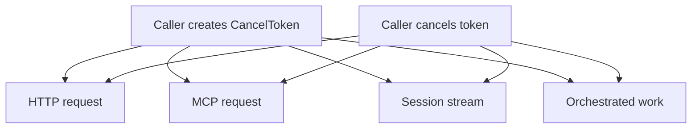

# 15: Cancel Token Across Clients

This guide is about one of the smallest but most important control primitives in
the extension: the cancel token. On the surface it looks like a small object
with two methods. In practice it is the mechanism that lets one part of the
application tell another part, with clear ownership, that the work should stop.

That matters much more than it first appears. Long-running requests, streaming
reads, MCP exchanges, and orchestrated work all need a way to stop safely when
the user is gone, when a deadline has passed, when a parent request has failed,
or when the surrounding workflow has moved on. Without a clear cancellation
model, complex systems keep doing expensive work after the result stopped
having an owner.

If a technical word is unfamiliar, keep the [Glossary](../glossary.md) open while you read.

## The Real Point Of The Example

The point of the example is to show that cancellation is not a protocol detail.
It is an ownership detail. Whoever starts work also needs a clear way to revoke
that work when the surrounding context changes.

In King, the same cancel token idea appears across several surfaces. That is
important because it gives the platform one recognizable way to express
"this operation should stop" instead of inventing a separate stop signal for
every subsystem.

## Why Shared Cancellation Matters

Shared cancellation matters because real work is rarely isolated. One incoming
request may trigger an upstream HTTP call, an MCP lookup, and a streaming read.
If the outer request times out, the inner work should usually stop too.
Otherwise the process stays busy doing work that no longer has a consumer.

This example helps the reader understand that cancellation is usually a
tree-shaped problem. The useful question is not only "can this one function
stop?" The useful question is "when the parent operation ends, do the dependent
operations end too?"

## What You Should Notice

The first thing to notice is when the token is created. It appears at the start
of the higher-level operation, not halfway through the transport code. That is
a good clue about ownership. The caller owns the lifetime of the work.

The second thing to notice is where the same token travels. It is not locked to
one protocol. The same stop signal can be carried into an HTTP request, a
stream read, an MCP transfer, or an orchestrator run. This is one of the ways
the extension keeps one common operational language across very different
subsystems. The exact stop point is still subsystem-specific: some paths honor
the token before dispatch, some during active local polling or stream work, and
queued file-worker orchestration still has its own persisted cancellation path
instead of pretending every backend is the same.

The third thing to notice is what cancellation does not promise. It does not
turn every operation into immediate rollback. It gives the runtime a clear
signal that the work should stop as soon as the relevant path can honor that
signal correctly and safely.

## Why This Matters Operationally

Cancellation is part of resource discipline. Systems that cannot stop work
cleanly often waste CPU, keep sockets alive too long, hold memory
unnecessarily, and make timeout behavior harder to understand. They also make
incident response harder, because an operator can see work still running but
not know whether that work still belongs to a live caller.

This guide matters because it frames cancellation as part of correctness rather
than as a convenience feature. The runtime is easier to reason about when
starting work and stopping work use explicit objects with clear ownership.
It is also easier to reason about when the runtime is honest about strength:
the same `CancelToken` type appears across several surfaces, but not every
surface offers the same immediate live-transport interruption semantics yet.

## Why This Matters In Practice

You should care because cancellation is one of the places
where a system shows whether it can behave responsibly under pressure.
Distributed and long-lived systems spend a lot of time in partial-failure
states. Deadlines expire. Parents fail. Users disconnect. Control-plane
decisions change. Work that was valid one second ago may be waste the next.

This example shows how King gives the caller an explicit way to express that
change. Once the idea is clear here, the same pattern becomes easier to spot in
[HTTP Clients and Streams](../http-clients-and-streams.md),
[MCP](../mcp.md), and [Pipeline Orchestrator](../pipeline-orchestrator.md).
