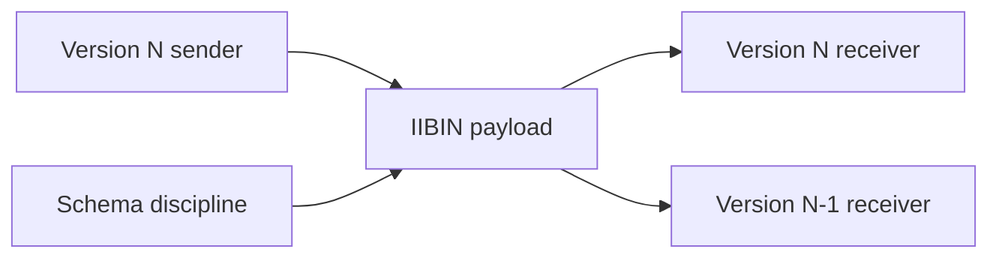

# 16: Proto Wire Compatibility

This guide is about one of the hardest promises in any long-lived platform:
data written yesterday must still be understandable tomorrow. That is the heart
of wire compatibility.

King does not treat binary formats as temporary implementation detail. It
treats them as contracts. That is why this guide matters. It teaches the reader
to think about schema changes, field identity, defaults, enum stability, and
backward reading behavior as part of platform design rather than as cleanup
work done after a first release. In the current runtime, that contract is the
runtime-supported IIBIN subset, not every imaginable schema shape.

If a technical word is unfamiliar, keep the [Glossary](../glossary.md) open while you read.

## The Compatibility Problem In Plain English

The problem is simple to describe and easy to get wrong. A sender and a
receiver may not always run the same version of the code. One side may know
about a new field that the other side has never seen. One side may omit a field
that older code once expected. A field number may stop meaning the same thing
if the team is careless. A once-safe enum value may be reused in a way older
readers cannot interpret.

This guide exists to show that compatibility is not luck. It is the result of
choosing a stable wire shape, evolving it carefully, and then testing that the
meaning still survives when versions are close but not perfectly matched.

## Why Identity Matters More Than Syntax

Many people first think about wire format as a syntax question. They ask how
the bytes are laid out, whether the encoding is compact, and whether the parser
can read it quickly. Those questions matter, but they are not the deepest part
of compatibility. The deeper question is identity. Which field number means
which thing? Which enum value keeps which meaning? Which defaults are safe when
an older reader does not see a newer field?

That is why this guide belongs in the handbook. It pushes the reader from
"can I encode this object?" toward "can I still understand this object after
the schema changes, after the fleet rolls forward gradually, and after stored
artifacts outlive the process that created them?"

## What The Example Is Actually Demonstrating

The example demonstrates controlled evolution. A schema is defined. Data is
encoded. A slightly different understanding of the schema is used on the other
side. The interesting question is not whether decoding works when both sides
are identical. The interesting question is whether the important meaning
survives when one side knows slightly more or slightly less than the other.

That is the case that matters in rolling deploys, staged upgrades, replay,
stored artifacts, background workers, and mixed-version control-plane systems.
Perfect version alignment is the easy case. Real systems spend long periods in
the almost-aligned state instead. The current repo slice proves that discipline
inside the runtime-supported field shapes: stable field numbers, unknown-field
skip behavior, decode-time defaults, packed compatibility for the supported
numeric and enum cases, and `oneof` last-member-wins semantics.

## Why This Matters Outside Serialization

It is easy to think of compatibility as a serialization concern only. In
practice, it is a system concern. A broken wire contract can become silent data
loss, wrong routing, partial replay failure, or a worker that accepts the bytes
but misunderstands their meaning. The failure may arrive far away from the code
that originally changed the schema.

That is why the example matters for more than IIBIN itself. It teaches a habit
of disciplined change. Stable field numbers, safe defaults, additive growth,
and explicit tests are all part of making a long-lived platform survivable,
even before the runtime claims the full generality of every schema form.

## What You Should Notice In Practice

You should notice that compatibility work is mostly about
protecting future operations. A team rarely breaks compatibility on purpose.
The break usually arrives through what looked like a harmless internal rename,
field reuse, or cleanup of an old enum. This guide exists so the reader sees
that those "small" changes can become large failures once a real fleet, a real
artifact archive, or a real rolling deploy is involved.

That is why wire compatibility deserves explicit documentation. A platform that
expects to live a long time needs a wire language that can also live a long
time.

For the full subsystem explanation, read [IIBIN](../iibin.md).
