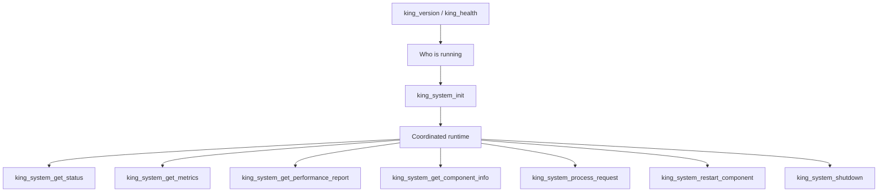
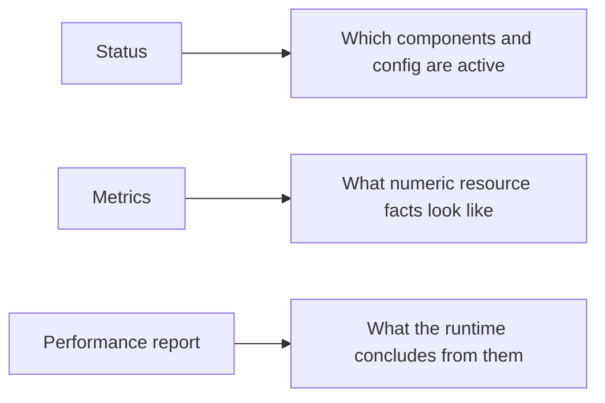
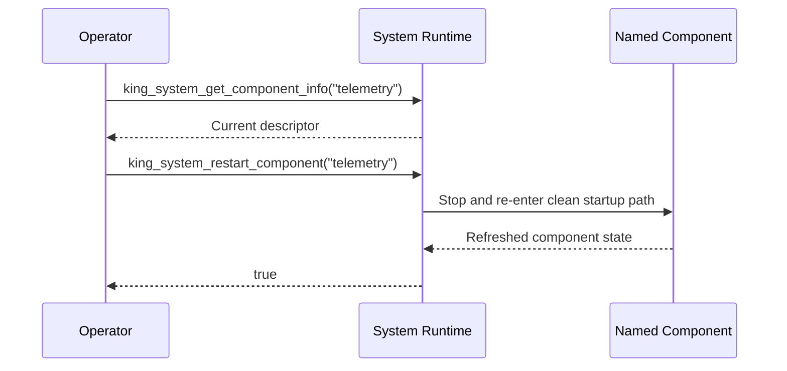

# 17: System Lifecycle Coordination

This guide explains how King behaves when you operate it as one coordinated
runtime. The goal is not only to prove that individual subsystems work. The
goal is to show how one process starts, reports its own condition, routes
normalized work through the active runtime, restarts one component when needed,
and shuts down in an orderly way.

This matters because production incidents often begin between the big feature
chapters. A process starts in the wrong order. A component keeps stale local
state. One subsystem becomes degraded while the rest of the process keeps
serving. An operator needs a fast answer to "what exactly is healthy right now?"
or "can I restart only the telemetry side without tearing down the whole node?"
Those are system-runtime questions.


If a technical word is unfamiliar, keep the [Glossary](../glossary.md) open while you read.

## What You Should Learn

You should come away from this guide with a clear picture of the system-runtime
surface:

`king_version()` and `king_health()` identify the loaded extension and its
basic runtime state.

`king_system_health_check()` answers whether the coordinated runtime is healthy
enough to proceed.

`king_system_init()` and `king_system_shutdown()` define the lifecycle
boundaries of the integrated runtime.

`king_system_get_status()`, `king_system_get_metrics()`, and
`king_system_get_performance_report()` answer different operational questions
instead of collapsing them into one vague status blob.

`king_system_get_component_info()` lets you inspect one named subsystem.

`king_system_process_request()` sends a normalized request through the
coordinated runtime instead of directly through one low-level API.

`king_system_restart_component()` gives you a controlled in-process restart path
for one named component.

## Why These Functions Exist At All

It is easy to understand why an HTTP client exists or why an object store
exists. It is less obvious why a runtime needs system-level functions on top of
all of that.

The short answer is coordination. A rich runtime is not only a library of
feature calls. It is also a living process with initialization order, component
state, metrics, recovery, and shutdown behavior. If the extension wants to be a
real platform runtime, it must describe that process-wide behavior explicitly.

Without a system layer, every deployment ends up inventing its own private
rules. One team treats a build-health call as if it were a traffic-health call.
Another treats memory metrics as if they were the same thing as component
status. Another restarts the whole process because it has no supported way to
cycle one degraded subsystem. The public system-runtime API exists to stop that
kind of ambiguity.



## Start With Identity And Basic Health

`king_version()` is the smallest possible system answer. It returns the loaded
extension version string. That sounds simple, but it matters in automated
operations, support, release verification, and fleet debugging. When an
operator asks "which build is actually running here?" the version string is the
first anchor.

`king_health()` answers a broader question about the loaded module itself. It
returns build and version information, the hosting PHP version, whether runtime
config overrides are allowed, how many runtime groups are currently active, and
which groups those are.

You can think of `king_health()` as module truth, not workload truth. It does
not answer whether one specific coordinated runtime is healthy under load. It
answers whether the extension that is currently loaded can describe itself
correctly and whether its major runtime groups are present.

```php
<?php

$version = king_version();
$moduleHealth = king_health();

var_dump($version);
var_dump($moduleHealth['build']);
var_dump($moduleHealth['active_runtimes']);
```

That is usually the first thing you call when you need to prove what binary is
in memory before you go deeper.

## Move From Module Health To Coordinated Runtime Health

`king_system_health_check()` is the next layer up. It is not a substitute for
`king_health()`. It is a different question.

The system-health call speaks for the active coordinated runtime. It answers
whether that integrated runtime currently considers itself healthy overall, and
it reports the same build and version context so operators do not lose track of
which process they are asking.

This separation matters because a process can load the extension correctly and
still have a degraded coordinated runtime. For example, the module might be
present, but one integrated component might not be initialized yet or might be
running in a degraded state.

## Initialization Defines The Working Runtime

`king_system_init(array $config)` is the call that materializes the coordinated
runtime. The config array does not just set one feature. It defines the
integrated component snapshot the process will use afterward.

That means this call belongs near the beginning of a long-lived process. Once
it succeeds, the runtime has a shared view of its active configuration and the
components participating in the integrated system path.

```php
<?php

king_system_init([
    'otel.service_name' => 'edge-runtime',
    'dns.mode' => 'service_discovery',
    'autoscale.provider' => 'hetzner',
    'storage.root_path' => __DIR__ . '/objects',
]);
```

The important thing to understand is that `king_system_init()` is not just a
convenient wrapper around `king_new_config()`. `king_new_config()` creates a
validated config snapshot. `king_system_init()` uses configuration to create the
coordinated system runtime itself.

## Status, Metrics, And Performance Are Not The Same

Many runtimes compress everything into one status call. King keeps three
separate views because they answer three different questions.

`king_system_get_status()` returns a coordinated system snapshot. In the current
public contract that includes `system_info`, `configuration`, and
`autoscaling` data. This is the best first answer to "what does the runtime
think is active right now?"

`king_system_get_metrics()` returns resource-oriented numbers. The stable public
shape includes current memory usage, peak memory usage, and the collection
timestamp.

`king_system_get_performance_report()` is more interpretive. It returns a small
performance overview, per-component performance notes, recommendations, and the
time the report was generated.



The practical benefit is that operators do not have to guess whether a field is
descriptive, numeric, or advisory. The function choice already tells them.

## Inspect One Component Without Losing The Whole Picture

`king_system_get_component_info(string $name)` lets you ask one component to
describe itself. This is useful when the broader status is not enough.

The accepted names mirror the coordinated component inventory, including
`config`, `client`, `server`, `semantic_dns`, `object_store`, `cdn`,
`telemetry`, `autoscaling`, `mcp`, `iibin`, and `pipeline_orchestrator`.

The returned descriptor includes the component name, build, version,
implementation string, configuration snapshot, and the generation timestamp.

This is the call you use when you need a precise answer such as:

"What does the telemetry component believe its configuration is right now?"

"Which implementation is backing the object-store component in this process?"

"What does the orchestrator component say about itself before I restart it?"

## Send Work Through The Coordinated Runtime

`king_system_process_request(array $request_data)` exists for callers that want
to use the integrated runtime as a platform surface instead of talking directly
to one transport helper or one subsystem helper.

The input is a normalized request array. The runtime processes that request
through the active integrated path and returns a normalized result array.

This is especially useful for edge-style or control-plane-style processes where
the point is not only to perform one feature call. The point is to send work
through the already-initialized runtime with its active configuration,
introspection, and component state.

```php
<?php

$response = king_system_process_request([
    'method' => 'GET',
    'path' => '/health',
    'headers' => [
        'accept' => 'application/json',
    ],
    'body' => '',
]);

var_dump($response);
```

You should read this as coordinated request handling, not as a replacement for
the lower-level client or server APIs. Those lower-level APIs still matter when
you need direct control. This function matters when the integrated runtime is
the thing you want to exercise.

## Restart One Component On Purpose

`king_system_restart_component(string $name)` gives the runtime a controlled way
to restart one named subsystem. That matters because whole-process restarts are
sometimes too blunt.

An operator might want to cycle a degraded telemetry component, refresh one
local control-plane slice, or reload one piece of coordinated runtime state
without immediately tearing down every active component in the process.

This function is not magic. It does not promise that every failure can be fixed
in place. It promises something more useful: restart is an explicit supported
operation, not an improvised side effect.



## Shutdown Is A First-Class Operation

`king_system_shutdown()` is the coordinated exit path. It gives the runtime one
explicit point to release resources, flush state, and stop component activity in
order.

That matters because process exit alone is not a lifecycle contract. A clean
shutdown path is where long-lived runtimes prove that they can stop without
leaving their own state behind in a confusing form.

In practice this is the right place to think about telemetry flush, object-store
state, control-plane disconnects, and any component snapshot that should not be
left half-finished.

## A Complete Example Flow

The following example shows the shape of the full lifecycle in one place.

```php
<?php

var_dump(king_version());
var_dump(king_health());

king_system_init([
    'otel.service_name' => 'edge-runtime',
    'storage.root_path' => __DIR__ . '/objects',
    'dns.mode' => 'service_discovery',
]);

var_dump(king_system_health_check());
var_dump(king_system_get_status());
var_dump(king_system_get_metrics());
var_dump(king_system_get_performance_report());
var_dump(king_system_get_component_info('telemetry'));

$result = king_system_process_request([
    'method' => 'GET',
    'path' => '/status',
    'headers' => ['accept' => 'application/json'],
    'body' => '',
]);

var_dump($result);
var_dump(king_system_restart_component('telemetry'));
var_dump(king_system_shutdown());
```

This example is deliberately plain. The point is to show the order of thought:
identify the runtime, initialize it, inspect it, process coordinated work,
restart one component if needed, and shut down cleanly.

## How This Fits With The Rest Of The Handbook

This guide is the bridge between the high-level platform story and the
subsystem chapters. The subsystem chapters explain what each area does. The
system-runtime surface explains how those areas live together inside one
process.

Read [Platform Model](../platform-model.md) for the broad architecture and
[Operations and Release](../operations-and-release.md) for the release and
shipping workflow that surrounds the runtime.
