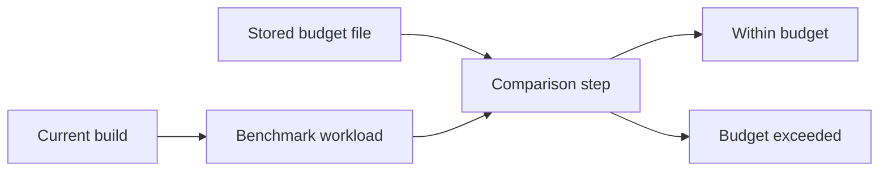

# 18: Benchmark Baseline Compare

This guide explains how King treats benchmarking as part of release control and
not as an isolated exercise. A benchmark is useful only when it helps
the team answer a practical question about the build in front of them. In King,
that question is not "did we print a number?" and not even "is this number
good?" The practical question is "does this build still behave within the
limits we said were acceptable for this workload?"

That is a much stronger way to think about benchmarking. It turns performance
from an anecdote into a contract. The result is something a release engineer, a
maintainer, and an operator can all use without arguing over taste. The build
either stayed inside the allowed range for the measured workload or it did not.

If a technical word is unfamiliar, keep the [Glossary](../glossary.md) open while you read.

## Why This Example Exists

A complex extension can become worse without becoming obviously broken. A
transport path may add a small amount of latency. A storage path may allocate
more memory than before. A retry loop may still succeed but consume more CPU.
An orchestration path may keep the same functional result while quietly growing
slower. None of those problems necessarily produces an immediate crash or test
failure. They can still make the released system worse in a way users feel.

This example exists to show how King prevents that kind of silent drift from
being accepted without evidence. It shows the benchmark run, the stored
budget, and the comparison step as one release-time workflow. In the current
repo, local baseline snapshots and committed CI budgets are related but not the
same thing.

## The Three Parts Of A Useful Benchmark

A useful benchmark always has three parts. First there is the workload. That is
the thing being measured: an HTTP path, a storage path, a protocol roundtrip,
an encode/decode loop, a lifecycle operation, or another unit of work that
really matters to the platform. Second there is the budget or baseline. In the
current project shape, local raw baselines are for developer-side comparison,
while committed per-case budgets are the actual CI and release gate. Third
there is the comparison step that decides whether the result is still inside
the allowed boundary.

If any one of those parts is missing, the result becomes much weaker. A
workload without a budget produces numbers but not decisions. A budget without
a reproducible workload is not evidence. A comparison without stable tooling is
not a release gate. This is why the benchmark system is documented together
with the release and verification flow in
[Operations and Release](../operations-and-release.md).

## What You Should Notice

The first thing to notice is that King does not treat performance as one
universal score. Each benchmark belongs to a specific runtime concern. Some are
about request latency. Some are about throughput. Some are about how much work
can be done within a fixed budget. Some are about memory use. This is important
because different subsystems fail in different ways. A single "faster or
slower" number is too coarse to explain what actually changed.

The second thing to notice is that benchmarking is tied to repeatability. The
comparison only helps if the same workload can be rerun under controlled
conditions. That is why the benchmark tooling, stored baselines, and release
checks belong in the same operational story. A one-time exciting number is not
the same thing as a maintained benchmark contract.

The third thing to notice is that the benchmark system protects users from both
obvious and non-obvious regressions. It catches the easy case where something
becomes drastically slower. It also catches the quieter case where many small
changes add up over time until the system no longer behaves like the one the
project meant to ship.

## How The Example Fits Real Work

In practice, a team uses this pattern while iterating on transport tuning,
retry behavior, memory management, encoding logic, or subsystem coordination.
The team changes code, runs the benchmark workflow, and compares the result to
either a local earlier baseline or the committed per-case budget file. If the
result stays within the budget, the build is still behaving like the intended
platform for that measured path. If the result exceeds the budget, the team now
has a concrete regression to inspect.

This matters because performance work often becomes emotional when it is not
grounded in a repeatable contract. One reader may call a result acceptable
because the median looks good. Another may reject it because tail latency
shifted. The budget file and comparison step give the project a shared frame
for that discussion.

## Why This Matters In Practice

You should care because production systems are judged by how
they behave over time, not by whether they once looked fast in a local test.
Benchmark baselines are one of the few practical ways to stop slow drift from
becoming normal. They also create a written operational memory for the project.
Future work can be compared against a known standard instead of against vague
recollections of what once felt fast enough.

That is why this example belongs in the handbook. It is not about chasing large
headline numbers. It is about proving that the released platform still behaves
within the boundaries the project chose on purpose. In the current repo, that
release boundary is the canonical budget file, while `benchmarks/results/`
stays local and ignored so developer baselines do not masquerade as shared CI
truth.

For the wider release workflow, read [Operations and Release](../operations-and-release.md).
