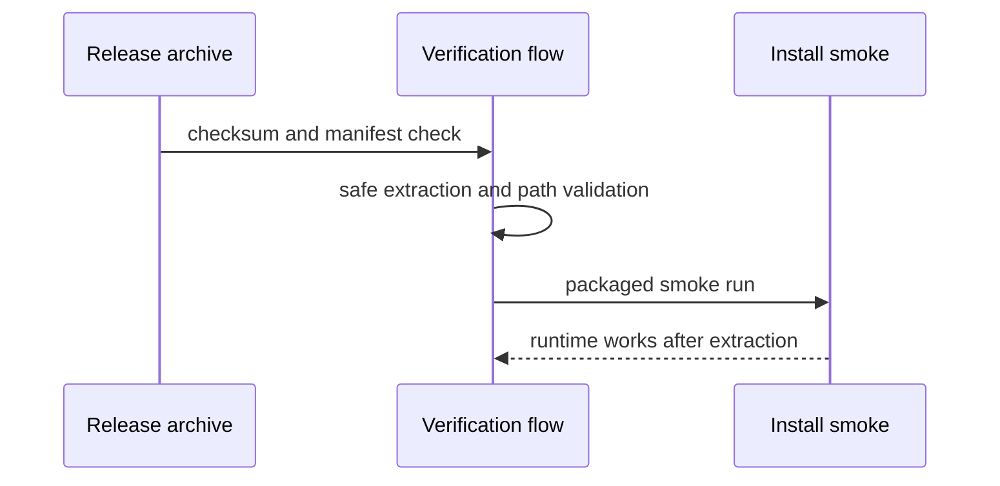

# 19: Release Package Verification

This guide is about the moment where source code stops being the thing you
trust directly and a release artifact takes its place. That is a very important
moment. Once a package is built, the user no longer sees the repository. The
user sees the archive, the manifest, the checksums, the install flow, and the
runtime behavior after extraction.

That is why this guide matters. Packaging is not the end of release
engineering. Verification is the end. The artifact must prove that it is
complete, self-consistent, reproducible, safe to unpack, and safe to install.

If a technical word is unfamiliar, keep the [Glossary](../glossary.md) open while you read.

## The Trust Question Behind The Example

The trust question is simple. If someone hands you a release archive, what do
you need to check before you are willing to install it?

You need to know that the archive checksum matches. You need to know that the
manifest matches the files actually inside the package. You need to know that
the package layout is sane, that extraction cannot escape its target, and that
the packaged smoke path still works after unpacking. In other words, you need
more than "the tarball opened without an error."

## Why Verification Has Several Layers

It is easy to think of release verification as one checksum check followed by a
quick install. That is not enough. Different checks answer different trust
questions.

The checksum answers whether the archive you received matches the expected
archive. The manifest answers whether the archive contents match the expected
file inventory. Safe extraction answers whether the archive structure itself is
acceptable. The smoke step answers whether the package behaves like King after
it leaves the build tree and enters an install-shaped environment.

This is why the verification flow is layered. A package can pass one of these
checks and still fail the release bar. A release artifact is only trustworthy
when the whole chain holds together.

## What You Should Notice

The first thing to notice is that the artifact is treated as something with its
own identity. The verification step does not quietly assume the source tree is
still nearby. It asks whether the package stands on its own.

The second thing to notice is that the archive is not extracted blindly. Safe
extraction is part of verification because archive structure is part of
artifact trust. A package format that can place files where it should not is
not safe enough to install.

The third thing to notice is that verification continues into the packaged
smoke path. That is the point where the process stops asking "does the archive
look right?" and starts asking "does the installed runtime behave like King?"

## Why This Matters Outside Release Engineering

This guide is not only for release engineers. It also matters for operators,
packagers, and anyone who has to accept an artifact into a long-lived system.
In those environments, the package file is the real unit of trust. The team
that receives it may never look at the source tree. They need confidence in the
artifact itself.

That is one reason the example belongs in the handbook. It teaches the reader
to see release packaging as part of the product contract rather than as a final
mechanical step after the "real" engineering is done.

## Why This Matters In Practice

You should care because users install artifacts, not Git
commits. If the artifact trust path is weak, the whole release story is weak no
matter how strong the source tree looked beforehand. Verification is what keeps
the release process honest after the build finishes.

This guide frames release verification as an engineering discipline. That is
the right frame for a platform whose release artifacts are meant to be
long-lived, installable, and defensible.

For the full release workflow, read [Operations and Release](../operations-and-release.md).
