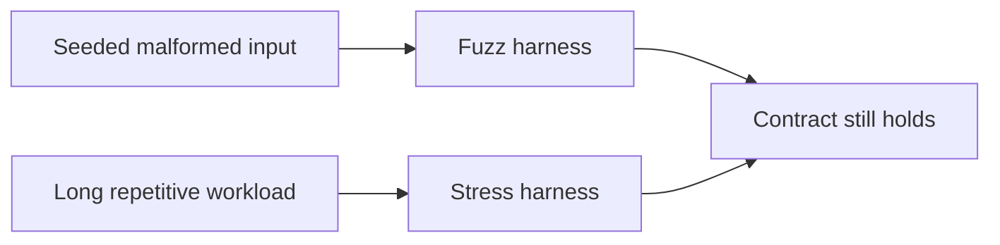

# 20: Fuzz and Stress Harnesses

This guide explains the kind of testing that becomes important after the easy
correctness checks are already green. A platform can satisfy the happy path and
still be fragile when input is malformed, when topology changes happen quickly,
when retries repeat for a long time, or when a subsystem is forced through a
large number of cycles.

That is why fuzz and stress harnesses matter. They do not replace ordinary
tests. They answer different questions. Does a parser stay stable under
deterministic malformed input? Does a registry stay coherent under churn? Does
the transport still recover after repeated aborts and retries? Does the
runtime keep the same contract after thousands of small operations rather than
one clean demonstration? In the current repo this evidence comes from two
concrete entrypoints: a seeded PHPT subset in
`./infra/scripts/fuzz-runtime.sh` and a separate sanitizer-oriented long-run
surface in `./infra/scripts/soak-runtime.sh`.

If a technical word is unfamiliar, keep the [Glossary](../glossary.md) open while you read.

## Fuzzing And Stress Are Related But Different

Fuzzing asks how the runtime behaves when the input shape becomes unusual,
malformed, or unexpected. Stress asks how the runtime behaves when the workload
becomes large, repetitive, or long-lived. Both are necessary because mature
systems fail in both ways. Some fail because one odd payload shape was never
considered. Others fail because the ordinary shape was repeated often enough to
expose a lifecycle, memory, timing, or coordination weakness.

## Why Seeded Harnesses Matter

The harnesses in King are seeded on purpose. That means the unusual input is
not random in the useless sense. It is controlled, repeatable, and reviewable.
A failing run can be rerun. A regression can be compared to an older run. A
stored seed becomes evidence rather than an accident.

This is a practical point, not a cosmetic one. A test that can only find a
problem once but cannot show it again is difficult to trust in a release
workflow. The seeded PHPT subset is there to stay rerunnable and reviewable;
the sanitizer soak path adds retained logs and failure diagnostics under
`extension/build/soak/` when the longer-running gate is exercised.

## What You Should Notice

The first thing to notice is that these harnesses protect public contract, not
only internal implementation detail. Parser stability, retry stability, churn
stability, and long-run lifecycle stability all affect what users of the
extension experience. If those surfaces become fragile, the runtime may remain
nominally feature-complete while becoming less trustworthy.

The second thing to notice is that pressure reveals different truths than one
ideal request. A single successful parse does not prove malformed data is
handled safely. One successful recovery does not prove repeated recovery stays
safe. One clean orchestration run does not prove that queue files, claims, and
state recovery stay consistent under many iterations.

The third thing to notice is that the harnesses are part of release evidence.
They are not there only to reassure a developer locally. They are there so the
project can say that high-risk surfaces were exercised under deterministic
pressure before a build was accepted. The current repo-local go-live gate pulls
in the seeded fuzz/stress subset directly, while the longer sanitizer soak
surface remains a separate deeper gate rather than something hidden inside the
default one-command path.

## How This Fits The Rest Of The Handbook

Fuzz and stress work touch almost every chapter in this book. IIBIN depends on
schema and parser stability. HTTP and WebSocket depend on transport behavior
under churn. MCP depends on transfer boundaries and failure handling. The
object store depends on durable-state behavior under repeated writes and
restores. Semantic-DNS depends on topology churn. The orchestrator depends on
queue, worker, and restart discipline.

This is why the guide belongs near the end of the examples section. It ties the
rest of the handbook together. Once a reader understands the subsystems, this
guide shows how the project proves those subsystems still behave correctly when
conditions become less polite.

## Why This Matters In Practice

You should care because production rarely looks like the
cleanest unit test. Inputs are messy. Traffic spikes. Registries churn.
Connections abort. Retries happen. Long-running services accumulate state.
Release confidence comes from knowing the system stayed correct under those
conditions, not from assuming it probably will.

That is what these harnesses provide. They are where the platform proves that
its contract still holds when the environment becomes noisy, repetitive, and
imperfect.

For the release-wide view, read [Operations and Release](../operations-and-release.md).
