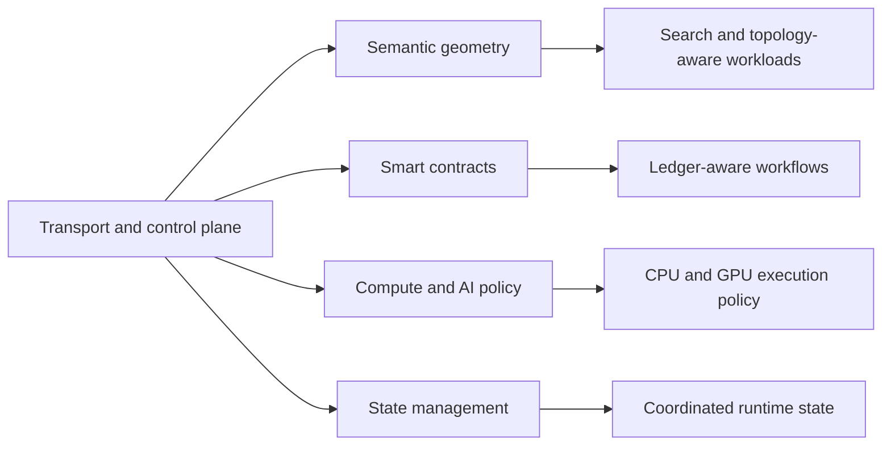
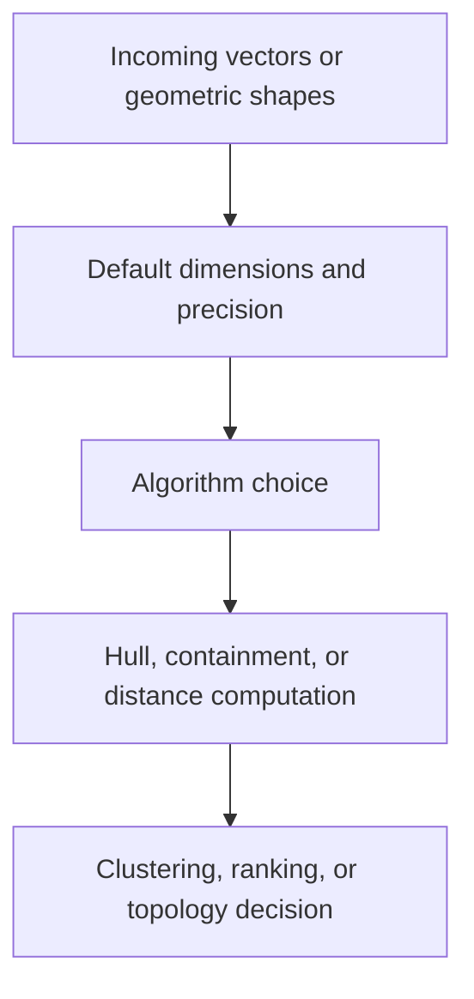
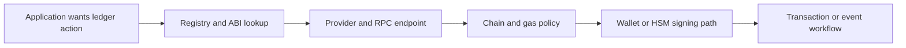
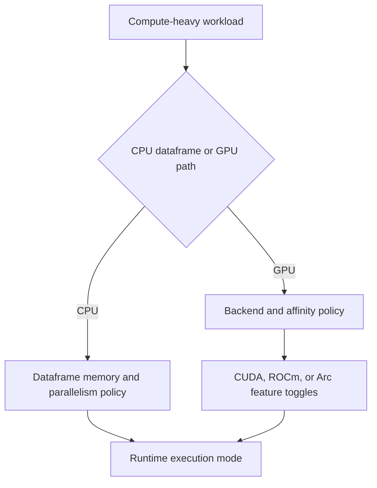

# Advanced Subsystems

This chapter groups the specialist runtime families that are part of King even
when they are not the first thing a new reader touches.

These subsystems are easy to misunderstand if they are presented as a short
list. They are not random leftovers. They are the parts of the runtime that
deal with geometry-heavy search, ledger-aware execution, compute placement, and
state coordination. Not every project will use all of them on day one, but
their presence matters because King is designed as one platform rather than as a
single-protocol extension.

## Why This Chapter Exists

The core chapters cover the parts most readers meet first: HTTP, QUIC,
WebSocket, object storage, telemetry, autoscaling, orchestration, and service
discovery. This chapter covers the neighboring specialist areas that become
important once the system grows into search, AI, ledger integration, or more
formal coordination.

The goal here is not to hide these areas behind jargon. The goal is to explain
what each subsystem is for, what decisions it lets you make, and why those
decisions belong inside the runtime.

This is the right way to read this chapter. These are supporting runtime
families that feed other parts of the platform.

## Semantic Geometry

Semantic geometry is the part of King that holds algorithm and numeric policy
for vector- and shape-oriented work. The easiest way to understand it is to
think about any system that has to compare, cluster, search, or classify points
inside a high-dimensional space.

That kind of work appears in more places than people expect. It appears in
embedding search, vector retrieval, region or hull analysis, geometric routing
heuristics, topology grouping, and any workload where "distance" or "inside vs
outside" is not only a metaphor but a real computation.

The geometry config family lets the runtime decide what default vector size is
expected, what numeric precision should be used, which convex-hull algorithm is
preferred, how point-in-polytope tests should behave, how Hausdorff distance is
calculated, how aggressive spiral search should be, and what threshold is used
to consolidate candidates into a core set.

### Why These Settings Matter

`geometry.default_vector_dimensions` matters because vector spaces need an
expected dimensionality. If the rest of your platform assumes 768-dimensional
embeddings, that assumption should live in policy instead of being copied into
dozens of call sites.

`geometry.calculation_precision` matters because `float32` and `float64` are
not only performance choices. They are also correctness and reproducibility
choices. A high-throughput approximate search path may accept lower precision
than a more exact geometric analysis path.

Algorithm settings such as `geometry.convex_hull_algorithm`,
`geometry.point_in_polytope_algorithm`, and
`geometry.hausdorff_distance_algorithm` matter because geometry code is full of
tradeoffs between precision, stability, and speed. Putting those tradeoffs into
configuration makes them explicit.

Semantic geometry is therefore not a mathematical side note. It is the runtime
policy surface for systems that depend on geometric meaning.

## Smart Contracts

The smart-contract subsystem is the ledger-aware configuration family. It gives
the runtime one place to express which distributed-ledger provider is in use,
how contract metadata is found, which chain is active, what gas defaults should
look like, where wallet material lives, whether hardware wallet integration is
enabled, and whether contract event listeners should be active.

This matters because ledger-aware systems are not only about signing one
transaction. They also have to answer operational questions. Which registry is
the source of contract metadata? Which RPC endpoint is trusted? Which chain is
being targeted? What gas defaults are safe? Which wallet should the runtime use?
Should a hardware wallet or HSM be involved? Where do ABI files come from?

The smart-contract config surface answers those questions in one place.

### The Main Ideas

`smartcontract.enable` is the high-level on/off switch. `smartcontract.registry_uri`
is where the runtime expects contract metadata to live. `smartcontract.dlt_provider`
and `smartcontract.dlt_rpc_endpoint` define the ledger backend and its RPC entry
point. `smartcontract.chain_id` prevents the runtime from accidentally treating
one chain as another.

`smartcontract.default_gas_limit` and
`smartcontract.default_gas_price_gwei` define the default execution budget
policy. `smartcontract.default_wallet_path` and
`smartcontract.default_wallet_password_env_var` define how software-managed
wallet material is found. `smartcontract.use_hardware_wallet` and
`smartcontract.hsm_pkcs11_library_path` define the hardware-wallet side of the
same story. `smartcontract.abi_directory` tells the runtime where contract
interfaces live. `smartcontract.event_listener_enable` controls whether
event-listener behavior is part of the runtime's contract.

If you are not building ledger-aware systems, this family may stay quiet. If
you are, it becomes the boundary between application intent and deployment
policy.

## High-Performance Compute And AI

King also includes a compute and AI policy family. This is where the runtime
describes whether dataframe support is enabled, how much memory those dataframe
paths should be allowed to use, how much CPU parallelism should be assumed, and
what the GPU policy should look like.

This family matters because compute-heavy systems often fail in quiet ways when
their placement rules are undefined. A process binds to the wrong GPU backend,
allocates memory too aggressively, fails to keep related workers on the same
device, or forgets to turn on the acceleration mode the deployment expected.

Putting this policy in configuration turns those assumptions into something the
runtime can state clearly.

### Dataframe Policy

The dataframe side of the family begins with `dataframe_enable`. If dataframe
work is allowed, `dataframe_memory_limit_mb`,
`dataframe_string_interning_enable`, and
`dataframe_cpu_parallelism_default` define the memory, string, and CPU policy
for that local analytics engine.

This is the part of the runtime that matters when a workload spends more time
on in-process data shaping or batch analytics than on network transport.

### GPU Policy

The GPU side of the family begins with `gpu_bindings_enable`. 
`gpu_default_backend` selects the expected backend family such as CUDA, ROCm, or
SYCL. `worker_gpu_affinity_map` defines how workers should be attached to GPU
resources. `gpu_memory_preallocation_mb` defines how much memory should be
reserved early. `gpu_p2p_enable` controls peer-to-peer GPU memory behavior.
`gpu_storage_enable_directstorage` controls whether storage paths should be
optimized for direct GPU-oriented reads.

After that come backend-specific policies such as
`cuda_enable_tensor_cores`, `rocm_enable_gfx_optimizations`,
`arc_enable_xmx_optimizations`, and `arc_video_acceleration_enable`.

These settings matter because GPU policy is never only "GPU on" or "GPU off."
It is also about which backend is assumed, how workers are pinned, what memory
behavior is acceptable, and which vendor-specific acceleration features should
be part of the runtime behavior.

## State Management

State management is the smallest family in this chapter, but it is still worth
explaining because small configuration families often carry large consequences.

The state-management subsystem defines the default backend and default URI used
when the platform needs a stateful coordination surface. In plain language, it
tells the runtime where shared or durable state should live when another part of
the platform needs to coordinate through a state backend.

`state.default_backend` chooses the backend family. `state.default_uri` tells
the runtime where that backend lives.

This sounds simple because it is simple, but it matters because coordination
systems do not work well when every subsystem invents a different default state
location. A shared state policy reduces that drift.

## Why These Subsystems Belong Together

These families are grouped together because they are specialist runtime
surfaces, not because they are unimportant. Each one expresses a domain that is
too narrow for the core networking chapters and too important to leave as a set
of undocumented keys.

Semantic geometry matters for vector and topology-aware systems. Smart
contracts matter for ledger-aware workloads. High-performance compute matters
for CPU- and GPU-heavy execution. State management matters wherever coordinated
state needs a stable home.

The common thread is that they all express domain policy inside the same King
runtime model rather than outside it.

## Configuration Walkthrough

If you want one practical way to think about the chapter, think in terms of
questions.

For geometry, the question is "what numeric and algorithmic policy should
vector and topology work use by default?" For smart contracts, the question is
"which ledger, wallet, and event-handling policy should the runtime trust?" For
compute and AI, the question is "how should CPU and GPU resources be treated by
default?" For state management, the question is "where should coordinated state
live unless a caller says otherwise?"

Those questions are much easier to reason about than memorizing raw key names.

## Related Chapters

If you want the key-by-key reference for these families, read
[Runtime Configuration](./runtime-configuration.md) and
[System INI Reference](./system-ini-reference.md).

If you want the broader picture of how these areas fit into the whole runtime,
read [Platform Model](./platform-model.md) and
[Configuration Handbook](./configuration-handbook.md).
