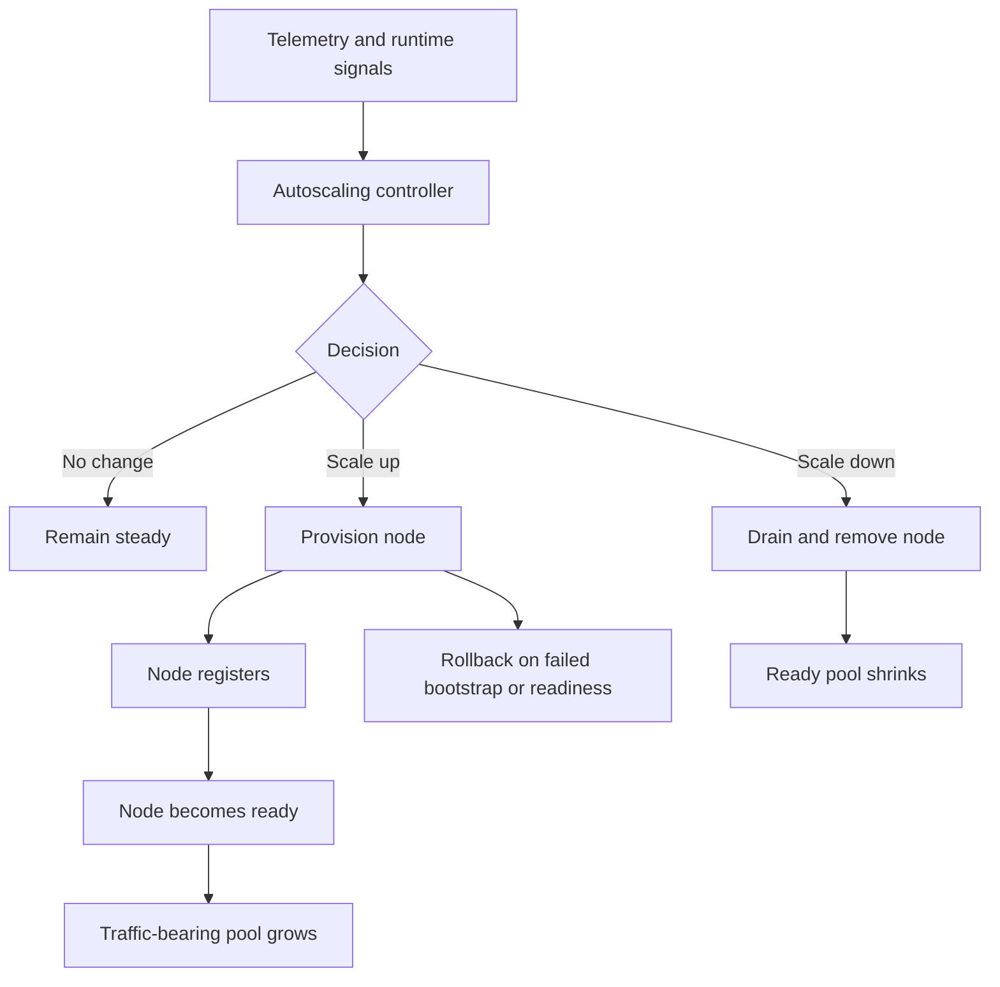
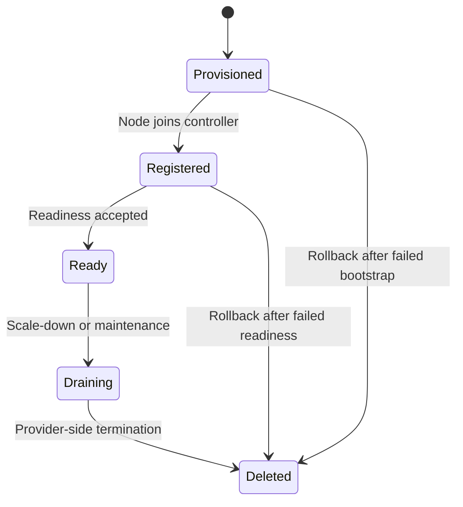
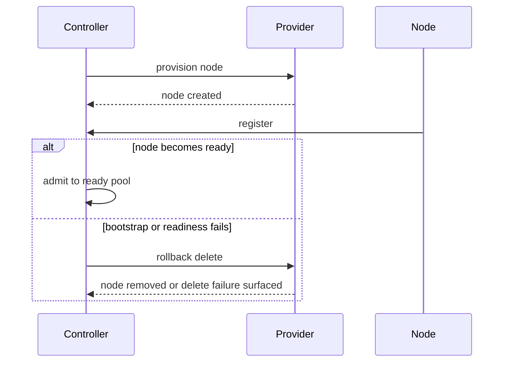

# Autoscaling

This chapter explains how King grows and shrinks managed capacity. It is not a
chapter about a shell script that occasionally calls a cloud API. It is a
chapter about a control loop: signals come in, the runtime decides whether
capacity should change, nodes move through explicit lifecycle states, provider
calls happen, readiness is checked, failed rollouts are rolled back, and the
whole process stays visible to the application.

Autoscaling matters because the platform does not only need to answer requests.
It also needs to decide how much infrastructure should exist to answer them
well. That makes autoscaling a control-plane subsystem, not an external helper.

## Start With The Core Problem

If a system never changes capacity, it will eventually hit two bad states. Under
high load it becomes too small and starts failing or slowing down badly. Under
low load it becomes too large and wastes money, energy, and operational budget.

A useful autoscaler therefore has to answer a moving question: given the current
signals from the system, should the platform stay the same size, add capacity,
or remove capacity?

That sounds simple until the real-world details arrive. Which signals matter?
How quickly should the system react? How large may one scale step be? How many
nodes must always exist? What if the provider creates a server but the node
never registers back? What if the node registers but never becomes ready? What
if the budget check says scaling would be unsafe? What if scale-down removes a
node that is still serving traffic?

King keeps these questions inside one autoscaling runtime so the answers can be
observed and reasoned about instead of disappearing into scattered scripts.

## What Autoscaling Means In King

Autoscaling in King is a managed-node control loop. The runtime tracks signals,
decision thresholds, cooldown rules, managed-node inventory, provider-side
actions, readiness progression, drain state, rollback behavior, and status
reporting.

That is why the public API is split between observation and action.

`king_autoscaling_get_status()` and `king_autoscaling_get_metrics()` answer
"what does the controller currently believe?" `king_autoscaling_init()`,
`king_autoscaling_start_monitoring()`, and `king_autoscaling_stop_monitoring()`
control the lifecycle of the autoscaling runtime. `king_autoscaling_get_nodes()`
shows the current managed-node inventory. `king_autoscaling_scale_up()` and
`king_autoscaling_scale_down()` trigger explicit capacity changes.
`king_autoscaling_register_node()`, `king_autoscaling_mark_node_ready()`, and
`king_autoscaling_drain_node()` manage node lifecycle transitions.

The same contract is also exported through `King\Autoscaling` as static methods:
`init()`, `startMonitoring()`, `stopMonitoring()`, `getStatus()`,
`getMetrics()`, `getNodes()`, `scaleUp()`, `scaleDown()`, `registerNode()`,
`markNodeReady()`, and `drainNode()`. This OO facade maps directly to the same
runtime behavior rather than introducing a separate autoscaling model.

The point is not that there are many function names. The point is that each one
maps to a real controller question.

## The Control Loop In One Picture



This diagram is the best starting picture. The autoscaler is a loop, not a
single button press.

## Signals: What The Controller Reads

The controller needs input before it can make a decision. `king_autoscaling_get_metrics()`
returns the active signal set the runtime uses for autoscaling judgment. Those
signals include CPU utilization, memory utilization, active connections,
requests per second, response time, queue depth, and the signal timestamp.

This matters because an autoscaler that cannot explain what it measured before
acting is hard to trust. The goal is not only to scale. The goal is to explain
why scaling happened or why it did not.

In practice, these signals are often downstream of the telemetry system. That is
why the autoscaling chapter belongs close to the telemetry chapter in the
handbook. Observability feeds control.

The repo-local proof for that contract is now a live one-shot HTTP request
harness rather than a doc-only or array-only shortcut. Real requests perform
CPU work, carry a measurable response time, maintain a backlog counter, compute
their current request rate and connection count, publish a live memory snapshot,
and the next autoscaling monitor tick consumes those six `autoscaling.*`
signals intact.

## Status: What The Controller Believes

`king_autoscaling_get_status()` is the broad controller summary. This is the
view you read when you want to know the controller's current state: whether it
is enabled, what provider mode is active, what the last signal source was, what
decision was made recently, how much cooldown remains, and other controller
state that explains why the system is or is not scaling.

That explanation is now structured, not only textual. The status surface carries
`last_monitor_decision`, `last_monitor_signal_snapshot`, and
`last_monitor_decision_details` so callers can see which live signals were
present, which ones created scale-up pressure, which ones were already inside
the scale-down window, which signals kept the controller in the hysteresis
middle, and whether a real decision was held back only by cooldown.

This is important because autoscaling is one of the easiest places for a system
to feel mysterious. A good controller should not only act. It should also expose
its reasoning.

## The Node Lifecycle

The node lifecycle is one of the most important ideas in the whole subsystem.
Nodes are not only present or absent. They move through explicit states
that reflect what the platform currently knows about them.

In King the important managed-node lifecycle states are `provisioned`,
`registered`, `ready`, `draining`, and `deleted`.

`provisioned` means the provider has created the node but the node has not yet
joined back to the controller as a live participant. `registered` means the node
has reported back but is not yet in the traffic-bearing pool. `ready` means it
has been admitted into service. `draining` means it is on the way out and should
finish current work rather than receive fresh work. `deleted` means it is no
longer part of the active fleet.



This lifecycle is one of the biggest reasons King autoscaling is stronger than a
simple shell script. The runtime knows what stage each node is in and can act
accordingly.

The controller also does not trust its persisted fleet snapshot blindly. If the
Hetzner state file comes back only partially after a torn write or truncated
restart artifact, the controller keeps the intact node records it could load,
asks the provider for the live server inventory, and rehydrates only the
prefix-matched nodes that are missing locally. That recovery path preserves the
stronger contract: controller-owned lifecycle state stays explicit, but partial
durable-state loss does not silently strand real provider nodes outside the
fleet model.

## Initialization

`king_autoscaling_init()` creates the runtime configuration snapshot for the
controller. This is where the platform declares provider mode, region, API
endpoint, credentials path, state path, scaling thresholds, cooldown windows,
node limits, and provider-specific bootstrap details.

```php
<?php

king_autoscaling_init([
    'autoscale.provider' => 'hetzner',
    'autoscale.region' => 'nbg1',
    'autoscale.api_endpoint' => 'http://127.0.0.1:18080',
    'autoscale.state_path' => __DIR__ . '/autoscaling-state.bin',
    'autoscale.server_name_prefix' => 'king-worker',
    'autoscale.prepared_release_url' => 'https://downloads.example.com/king.tar.gz',
    'autoscale.join_endpoint' => 'https://cluster.internal/join',
    'autoscale.hetzner_budget_path' => __DIR__ . '/budget.json',
    'autoscale.min_nodes' => 2,
    'autoscale.max_nodes' => 20,
    'autoscale.max_scale_step' => 3,
    'autoscale.scale_up_cpu_threshold_percent' => 75,
    'autoscale.scale_down_cpu_threshold_percent' => 30,
    'autoscale.cooldown_period_sec' => 60,
    'autoscale.idle_node_timeout_sec' => 300,
]);
```

The important part of initialization is not memorizing all of the keys. The
important part is that the controller contract is explicit before any capacity
decision is allowed.

## Starting And Stopping Monitoring

`king_autoscaling_start_monitoring()` starts the monitoring loop for the active
autoscaling runtime. `king_autoscaling_stop_monitoring()` stops that monitoring
loop.

In practical terms, the start call is what tells the controller to begin
evaluating signals and making decisions. In the current runtime that start step
also performs one synchronous controller tick, which makes the effect visible
immediately instead of depending on a hidden background process.

This is a good example of King preferring explicit control surfaces over hidden
automation.

## Manual Scale Actions

Not every scaling event begins from an automatic decision. Operators and tests
sometimes need explicit control. That is why the subsystem also exposes
`king_autoscaling_scale_up()` and `king_autoscaling_scale_down()`.

These functions do not replace the control loop. They give the platform a direct
way to request one scale action while still staying inside the same lifecycle and
provider model as the automatic path.

This matters because operations often need both automated and explicit control.

## Registering Nodes

Provisioning a node at the provider is not the same thing as having a useful
node. After provider-side creation, the node must still register back with the
controller.

`king_autoscaling_register_node()` marks one provisioned managed node as
registered. This is the point where the controller learns that the node exists
as a participant, not only as a provider object.

That distinction matters in every real autoscaler. A cloud provider may create a
VM successfully while the actual service bootstrap inside that VM still fails.
For Hetzner rollout-backed scale-up, the create payload carries either explicit
`bootstrap_user_data` or a generated `king-agent join --controller ... --release ...`
bootstrap so freshly provisioned nodes keep the same join intent even after a
restart or partial fleet-state recovery.

## Marking Nodes Ready

Registration is still not the same thing as serving traffic. `king_autoscaling_mark_node_ready()`
promotes one registered node into the ready pool.

This is the boundary where the system says "the node is no longer merely alive;
the node is now allowed to receive work." That boundary is critical. Without it,
new nodes either start serving too early or the runtime cannot tell the
difference between bootstrap success and actual readiness.

This is one of the most important operational distinctions in the entire
subsystem.

## Draining Nodes Before Removal

Scale-down is not just deletion. If the controller decides to remove capacity,
it should normally stop new traffic from flowing to the node before provider-side
termination begins.

`king_autoscaling_drain_node()` is the public step for that transition. It moves
one ready managed node into the draining state before the node is removed.

This matters because clean scale-down is a correctness problem, not merely a
cost problem. A badly drained node can drop live work.

## Provider Integration

The autoscaling provider contract is generic, but the provider path that is
fully exercised in-tree is the Hetzner path. This is why the documentation often
uses Hetzner examples when the chapter discusses concrete provider-backed
control behavior.

Provider integration matters because scale-up is not only a decision. It is also
a real external action. The controller has to speak to an API, request a node,
wait for bootstrap, check readiness, and, if something goes wrong, roll the node
back out cleanly.

This is where autoscaling stops being an abstract algorithm and becomes
infrastructure.

## Budget And Quota Safety

Autoscaling is not only about technical capacity. It is also about cost and
quota safety.

That is why the runtime has configuration for spend-warning thresholds,
spend-hard limits, quota warnings, quota hard limits, and provider-specific
budget probe files such as `autoscale.hetzner_budget_path`. A controller that
ignores budget and quota will eventually scale into a different kind of outage.

The goal of the subsystem is to keep those safety checks visible instead of
burying them inside provider-side surprises.

## Rollback Matters More Than Provisioning

A good autoscaler is not judged only by how well it creates new nodes. It is
also judged by how well it removes bad nodes that never completed their journey
into readiness.

If a node is provisioned but never registers back, the controller should not
leave stale capacity hanging forever. If a node registers but never becomes
ready, the controller should be able to roll it back. If the provider delete
step fails, that failure should become visible and actionable.

This is one of the strongest parts of the King autoscaling model. Failed scale
events are part of the public truth, not hidden shame.



This is the operational heart of the chapter.

## How Autoscaling Fits With Telemetry

The controller cannot make a good decision if it cannot see the state of the
system. That is why telemetry and autoscaling belong next to each other.

Telemetry provides the signal families that describe load, pressure, traffic,
latency, or saturation. Autoscaling consumes those signals and turns them into
capacity decisions. If the telemetry story is weak, the autoscaling story is
weak. If the autoscaling story is invisible, the telemetry story cannot explain
its impact on the fleet.

This is one of the clearest examples in King of observation feeding action.

## How Autoscaling Fits With Semantic-DNS And Routing

Autoscaling changes the fleet. Semantic-DNS and routing decide where traffic
should go. Those subsystems therefore naturally interact.

When autoscaling adds nodes, the ready pool changes. New service records may be
registered. Route eligibility changes. When autoscaling drains nodes, routing
should stop preferring them. When readiness fails, discovery should not pretend
the new node is already a valid backend.

This is why the autoscaling chapter belongs in the same part of the handbook as
Semantic-DNS and router policy. They are all views of one moving control plane.

## A Full Example

The following example shows a simplified provider-backed controller setup. The
runtime is initialized, monitoring is started, status and metrics are read, the
node inventory is inspected, one manual scale-up is requested, one node is
registered and admitted to ready, and finally a node is drained.

```php
<?php

king_autoscaling_init([
    'autoscale.provider' => 'hetzner',
    'autoscale.region' => 'nbg1',
    'autoscale.api_endpoint' => 'http://127.0.0.1:18080',
    'autoscale.state_path' => __DIR__ . '/autoscaling-state.bin',
    'autoscale.server_name_prefix' => 'king-worker',
    'autoscale.hetzner_budget_path' => __DIR__ . '/budget.json',
    'autoscale.min_nodes' => 2,
    'autoscale.max_nodes' => 10,
    'autoscale.cooldown_period_sec' => 60,
    'autoscale.idle_node_timeout_sec' => 300,
]);

king_autoscaling_start_monitoring();

$status = king_autoscaling_get_status();
$metrics = king_autoscaling_get_metrics();
$nodes = king_autoscaling_get_nodes();

king_autoscaling_scale_up(1);
king_autoscaling_register_node(101, 'king-worker-101');
king_autoscaling_mark_node_ready(101);

king_autoscaling_drain_node(101);

king_autoscaling_stop_monitoring();
```

This example is intentionally direct. It shows the node lifecycle and controller
surface without hiding behind a larger deployment framework.

## Configuration Families

The detailed key list lives in the runtime configuration reference, but the
families are easier to understand when grouped by purpose.

The first family is provider identity and connectivity. Keys such as
`autoscale.provider`, `autoscale.region`, `autoscale.credentials_path`, and
`autoscale.api_endpoint` tell the runtime which provider world it is operating
in and how to reach it.

The second family is node bootstrap and fleet shape. Keys such as
`autoscale.server_name_prefix`, `autoscale.bootstrap_user_data`,
`autoscale.prepared_release_url`, `autoscale.join_endpoint`,
`autoscale.instance_type`, `autoscale.instance_image_id`,
`autoscale.network_config`, and `autoscale.instance_tags` describe what kind of
nodes should be created and how those nodes should join the fleet.

The third family is scaling policy. Keys such as `autoscale.min_nodes`,
`autoscale.max_nodes`, `autoscale.max_scale_step`,
`autoscale.scale_up_cpu_threshold_percent`,
`autoscale.scale_down_cpu_threshold_percent`, and
`autoscale.scale_up_policy` tell the controller how aggressive it may be and
where the decision boundaries lie.

The fourth family is safety. Keys such as
`autoscale.spend_warning_threshold_percent`,
`autoscale.spend_hard_limit_percent`,
`autoscale.quota_warning_threshold_percent`,
`autoscale.quota_hard_limit_percent`,
`autoscale.cooldown_period_sec`, and `autoscale.idle_node_timeout_sec`
shape cooldown discipline, pending-node rollback, and budget protection.

The main point of the chapter is not memorizing those names. It is understanding
that the controller contract is explicit and organized.

## Common Mistakes

One common mistake is treating autoscaling like a single threshold check instead
of a lifecycle controller. Real autoscaling is about states, not only numbers.

Another mistake is equating provider success with readiness success. A node that
exists at the provider is not automatically safe to send traffic to.

Another mistake is ignoring rollback. A controller that can create nodes but
cannot cleanly remove failed nodes is incomplete.

Another mistake is forgetting that budget and quota are part of scaling safety.
Scaling into a billing or quota wall is still a failure mode.

Another mistake is leaving telemetry, routing, and autoscaling in separate
mental boxes. In practice they are one feedback system.

## Where To Go Next

If the next question is "which signals feed the controller?", read
[Telemetry](./telemetry.md). If the next question is "how does topology-aware
service discovery react to new or drained nodes?", read
[Smart DNS and Semantic-DNS](./semantic-dns.md). If the next question is "how
does traffic forwarding use those route decisions?", read
[Router and Load Balancer](./router-and-load-balancer.md).
