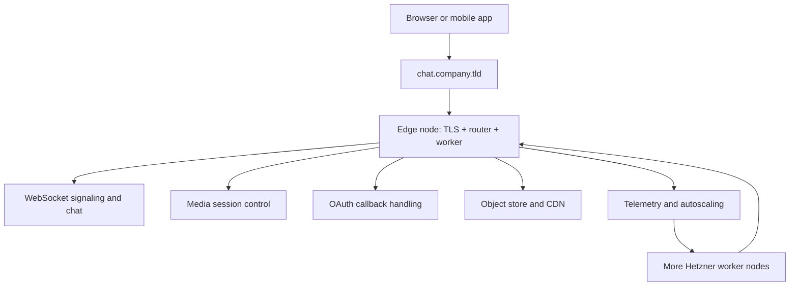
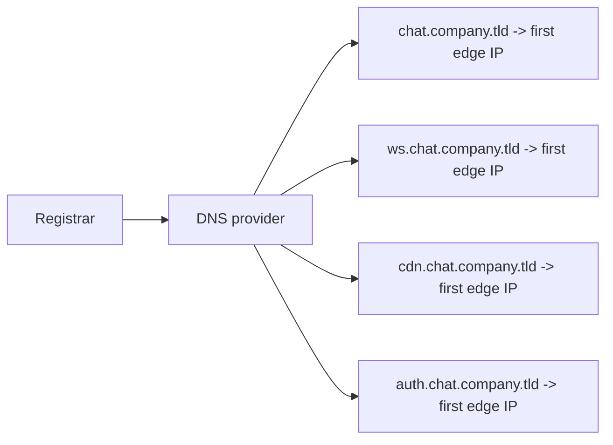
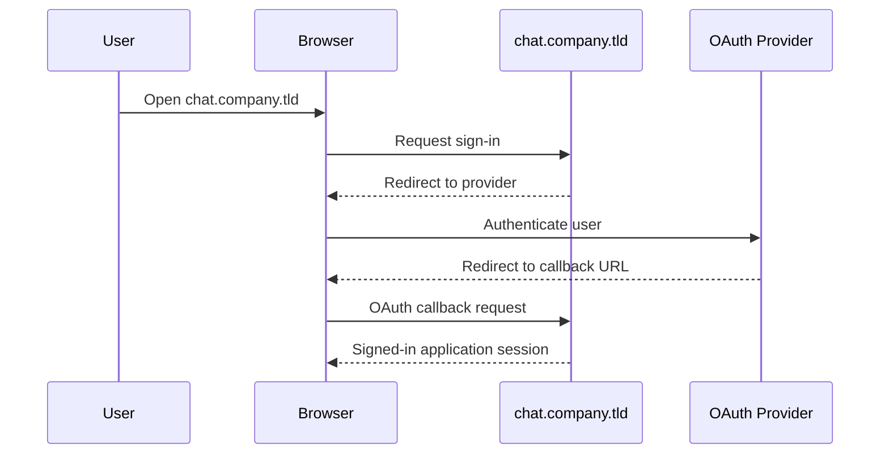
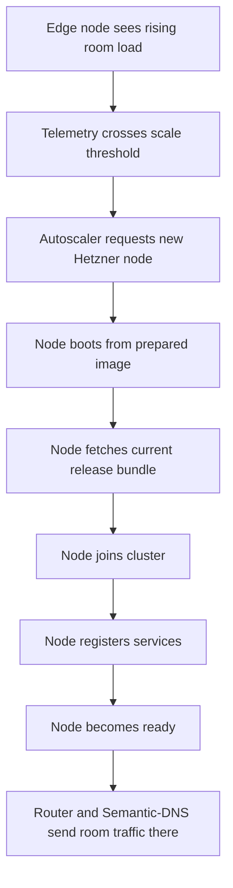

# Global Chat And Video Platform

This guide explains how to build a full production collaboration system with
King from the ground up. The target system is not a toy chat room. It is a
real product shape: users sign in with [OAuth](./glossary.md#oauth), open
rooms, exchange chat messages over [WebSocket](./websocket.md), carry typed
control traffic through [IIBIN](./iibin.md), join live video sessions over a
QUIC-backed transport path, store artifacts in the [Object Store](./object-store-and-cdn.md),
route traffic with [Semantic-DNS](./semantic-dns.md), and scale out on Hetzner
when one node is no longer enough.

The point of this guide is to show what "doing it right" looks like from the
first machine all the way to a multi-node cluster. It is written for a reader
who may be new to production deployment work. That means it does not jump
straight to cluster internals. It starts with the real first steps: naming,
domains, DNS, certificates, images, release payloads, login flow, and the role
of the first public node.

## What You Are Building

The finished system has one public hostname family owned by your team. In this
guide the base domain is written as `company.tld`. Replace that with the domain
your organization actually owns.

The platform exposes a main application entry at `chat.company.tld`. It can
also expose helper hostnames such as `api.chat.company.tld`,
`cdn.chat.company.tld`, and `auth.chat.company.tld`, but the public DNS surface
is kept deliberately small. Inside the cluster, King handles the richer service
map through Semantic-DNS and the router.

The first public node begins in three roles at the same time:

It is the TLS entrypoint.

It is the first load-balancing edge.

It is also the first worker.

That first point matters because it removes the fake split between "bootstrap
box" and "real cluster." The first node is already the real product. Later
nodes expand capacity around it.



## Start With Names Before You Start With Code

Before a junior operator writes any PHP or edits any config, they should write
down the names the system will use. This is not busywork. Naming is one of the
largest sources of confusion in realtime platforms.

Use one base product hostname that people can remember. In this guide that is
`chat.company.tld`.

Use a small number of public helper names only when there is a clear reason. A
good early shape is:

| Hostname | Purpose |
| --- | --- |
| `chat.company.tld` | Main web application, API entry, and default edge entrypoint. |
| `ws.chat.company.tld` | Optional dedicated signaling hostname if you want the browser to separate chat traffic visibly. |
| `cdn.chat.company.tld` | Static assets, avatars, room exports, and recording playback. |
| `auth.chat.company.tld` | Optional public auth helper surface if you want login callbacks on a dedicated hostname. |

For the first production phase, all of these names may resolve to the same
public edge node. That is fine. The important thing is to keep the public names
stable while the internal cluster topology grows behind them.

## Register The Domain And Create The DNS Zone

The first real deployment step is not "run the server." The first step is to
use a domain your team owns and create the DNS zone that will point users
toward the cluster.

If the domain is new, buy it from a registrar and point it at a DNS provider
your team controls. If the domain already exists, create the subdomain layout
for the collaboration product.

The DNS shape for the first rollout is intentionally simple:

`chat.company.tld` should have `A` and `AAAA` records that point to the public
IPv4 and IPv6 addresses of the first edge node.

`ws.chat.company.tld`, `cdn.chat.company.tld`, and `auth.chat.company.tld` can
either point directly at the same addresses or be `CNAME` records to
`chat.company.tld` if that matches your DNS policy.

This is the most important beginner lesson about DNS in this platform. Public
DNS should stay small and stable. It is not the place where you expose every
internal service role. Internal service choice belongs to Semantic-DNS and the
router, not to a public list of one-off hostnames.



## Obtain Certificates Before The First Public Launch

Once the DNS names resolve, issue TLS certificates for the hostnames that will
accept browser traffic. For a first rollout that usually means at least
`chat.company.tld` and often the helper names too.

This is where the TLS chapter becomes practical. The certificate and private
key become part of the deployed edge identity. If your login provider requires
strict callback matching and your browsers are expected to trust the site
cleanly, you need correct DNS and correct certificates before you ask the first
user to sign in.

If the admin surface is separate and protected by mutual TLS, prepare those
certificates at the same time. That keeps the operational plane distinct from
public user traffic from day one.

## Build A Prepared Image, Not A Blank Machine

Do not design the platform around "spawn Linux box, install everything from
scratch, and hope it joins." That is exactly the kind of deployment shape that
turns scaling into a fragile incident.

Instead, build one prepared image that already contains:

the supported PHP runtime,

the King extension,

the application process manager or service units,

the worker entrypoints,

the local storage directories with the right ownership,

and the bootstrap scripts that know how to fetch the current release payload.

The image is the machine identity. The release payload is the application
version. Keep those two ideas separate. In King autoscaling, that usually means
`autoscale.instance_image_id` identifies the prepared base image while
`autoscale.prepared_release_url` identifies the current release bundle to lay on
top of that image.

## Bring Up The First Node

The first node is the first real product node. It is not waiting for a future
cluster to become meaningful.

That node should be able to:

serve the web application,

accept OAuth callbacks,

keep WebSocket chat and signaling sessions,

coordinate video room setup,

store uploaded artifacts and generated room data,

export telemetry,

and watch enough metrics to decide when more workers are needed.

At this phase the same machine still handles local work itself. That is fine.
The important thing is that the topology is already honest. The node is edge,
router, and worker in one place. Later, those roles spread across more nodes.

## Initialize The Runtime Families In Order

When the process starts, think in runtime families instead of one giant config
blob.

The server runtime owns public request handling. The WebSocket and QUIC-facing
transport layers own long-lived chat and media sessions. The object store owns
durable payloads. Semantic-DNS owns service discovery and route policy.
Telemetry owns metrics, spans, and logs. Autoscaling owns node lifecycle and
capacity decisions.

The startup code should reflect that separation clearly.

```php
<?php

king_object_store_init([
    'storage.root_path' => '/srv/king/object-store',
]);

king_telemetry_init([
    'otel.service_name' => 'chat-edge',
    'otel.exporter_endpoint' => 'https://otel.company.tld/v1/traces',
]);

king_semantic_dns_init([
    'dns.mode' => 'service_discovery',
    'dns.bind_address' => '0.0.0.0',
    'dns.port' => 8530,
]);

king_autoscaling_init([
    'autoscale.provider' => 'hetzner',
    'autoscale.region' => 'nbg1',
    'autoscale.api_endpoint' => 'https://api.hetzner.cloud/v1',
    'autoscale.instance_type' => 'cpx31',
    'autoscale.instance_image_id' => 'chat-edge-php84-v1',
    'autoscale.prepared_release_url' => 'https://artifacts.company.tld/chat/releases/current.tar.zst',
    'autoscale.join_endpoint' => 'https://chat.company.tld/internal/join',
    'autoscale.min_nodes' => 1,
    'autoscale.max_nodes' => 24,
]);

king_system_init([
    'otel.service_name' => 'chat-edge',
    'dns.mode' => 'service_discovery',
    'storage.root_path' => '/srv/king/object-store',
    'autoscale.provider' => 'hetzner',
]);
```

This startup shape is easier to teach because each family is visible. A junior
operator can read it and understand what the process is bringing online.

## Add OAuth Before You Add Realtime Rooms

Do not postpone authentication until after rooms already exist. Identity is
part of room policy, moderation policy, and recording policy.

Pick one [identity provider](./glossary.md#identity-provider) and register the
application there. The provider will ask for at least one callback URL. If the
main application surface is `chat.company.tld`, a common callback path is:

`https://chat.company.tld/oauth/callback`

If you want the auth path on its own hostname, use:

`https://auth.chat.company.tld/oauth/callback`

The important part is consistency. The registered callback URL, the public DNS,
the certificate, and the runtime route handling must all agree.

In the live request path, the browser is redirected to the identity provider,
the provider returns the browser to the callback URL, and the application then
issues its own room-ready session state.



## Use WebSocket For Chat And Signaling

Chat messages, room presence, typing state, mute changes, invite events, and
media-control events are all better treated as live signaling traffic than as
short isolated POST requests. This is where WebSocket becomes the main control
channel of the application.

That control channel should not be a bag of anonymous JSON messages. Define the
wire format through IIBIN schemas so that room events stay typed and stable.

```php
<?php

king_proto_define_enum('RoomEventType', [
    'JOINED' => 1,
    'LEFT' => 2,
    'CHAT_MESSAGE' => 3,
    'MUTE_CHANGED' => 4,
    'MEDIA_NEGOTIATION' => 5,
]);

king_proto_define_schema('RoomEvent', [
    'fields' => [
        1 => ['name' => 'type', 'type' => 'enum', 'enum' => 'RoomEventType'],
        2 => ['name' => 'room_id', 'type' => 'string'],
        3 => ['name' => 'user_id', 'type' => 'string'],
        4 => ['name' => 'payload', 'type' => 'bytes'],
        5 => ['name' => 'sent_at_ms', 'type' => 'int64'],
    ],
]);
```

Once the browser connects, the WebSocket carries a typed stream of room events.
That same signaling channel can carry media offers, answers, ICE candidates,
and room moderation events. One stable connection is far easier to reason about
than a patchwork of polling calls.

## Carry Video Session Control Through The Same Typed Channel

Large calls usually fail when the platform treats media control as an afterthought.
The browser still needs a proper signaling path to decide who is in the room,
which media node should host the session, which participant is publishing, and
how reconnect or migration events are announced.

In this platform shape, WebSocket plus IIBIN is the signaling plane. The media
session itself uses the QUIC-facing transport path that the runtime is designed
to manage. That gives you one strongly typed control surface and one media
transport surface instead of mixing both concerns into one brittle channel.

That is the practical meaning of "chat and video belong to the same runtime."
They do not use the exact same bytes on the wire, but they are coordinated by
the same platform decisions: room identity, auth state, route choice,
telemetry, scaling, and shutdown.

## Use Semantic-DNS For Internal Route Choice

Public DNS should stay small. Internal routing can be much richer.

Register internal services through Semantic-DNS with names such as
`chat-signaling`, `media-session`, `oauth-gateway`, `room-history`, and
`recording-writer`. Then let the runtime choose routes based on health, load,
region, and room policy.

```php
<?php

king_semantic_dns_register_service([
    'service_id' => 'media-node-eu-1',
    'service_type' => 'media-session',
    'host' => '10.0.0.21',
    'port' => 9443,
    'status' => 'healthy',
    'weight' => 100,
    'metadata' => [
        'region' => 'eu-central',
        'kind' => 'video-room-worker',
    ],
]);
```

When a 1000-person event is active, this matters a lot. You do not want one
edge node to guess blindly. You want route choice to be based on the live
service graph.

## Store The Durable Parts In The Object Store

A collaboration platform produces more than live packets. It produces avatars,
uploaded files, room exports, thumbnails, moderation artifacts, generated
summaries, and often recordings.

These are object-store concerns, not chat-message concerns. Put them into the
object store with clear metadata and retention policy. Use the CDN path for
fast delivery of public or semi-public assets such as avatars, exported room
images, or packaged playback bundles.

This is also where a future AI layer becomes straightforward. Transcripts,
summaries, vector artifacts, fine-tuning datasets, and model-ready room history
can all be stored as first-class durable objects instead of as orphan files.

## Teach The First Node To Grow The Cluster

The first node must not only observe load. It must know how to add capacity
without corrupting the public surface.

That means:

new Hetzner nodes must boot from the prepared image,

each node must fetch the current release bundle,

each node must join the cluster through the join endpoint,

each node must register itself,

and each node must become ready before the router sends it traffic.

This is where autoscaling becomes part of the realtime story rather than a side
project. Chat spikes, large rooms, and bursty media events all show up in
telemetry. Telemetry drives the autoscaling loop. The autoscaling loop grows
the worker fleet. The router and Semantic-DNS start using those workers only
after readiness is true.



## Plan For 1000 Participants By Splitting Responsibilities Early

Do not treat a 1000-person room as a normal room that happens to be bigger. The
platform should separate responsibilities before scale makes the issue painful.

The public edge should accept browser traffic and own the stable public names.
Signaling workers should keep room control traffic and presence state. Media
workers should carry live publish and subscription load. Recording or export
workers should write durable artifacts. That does not mean every role needs a
different machine on day one. It means the roles should already be visible in
the design before autoscaling begins to spread them out.

This is one of the strongest practical advantages of King. The same runtime
families that serve the one-node shape still serve the split cluster shape.
Nothing important has to be redefined halfway through the product.

## Watch The Right Metrics

For this product shape, operators should care about more than CPU percent.

Watch active sessions, room counts, large-room counts, WebSocket connection
count, media-session count, outbound bitrate, reconnect rate, object-store
write rate, queue depth, node readiness, and the age of pending scale actions.

Those metrics should feed both dashboards and the autoscaling decision path.
That way the platform is not only observable to humans. It is observable to its
own control loop.

## What A Junior Operator Should Actually Do First

If this guide is handed to someone on their first week, the correct first move
is not to open a dozen files and improvise. The correct move is:

first, write down the real domain names;

second, prepare the DNS zone;

third, issue certificates;

fourth, build the prepared image;

fifth, publish the release bundle;

sixth, bring up one public edge node;

seventh, wire the OAuth callback;

eighth, enable WebSocket signaling and room schemas;

ninth, turn on object storage and telemetry;

tenth, enable autoscaling only after the one-node runtime is already clean.

That order keeps the platform understandable. Each step adds one clear layer on
top of a working base.

## Why This Guide Matters

Many deployment guides stop right before the hard parts. They show a local
demo, skip identity, skip DNS, skip routing, skip release payloads, skip
artifacts, skip scale-out, and then quietly expect the operator to invent the
real system alone.

This guide does the opposite. It starts with the real public entrypoint and
follows the product all the way to the operational shape it actually needs. The
goal is not only to prove that King can open a socket or serve a page. The goal
is to show how one runtime can own the entire collaboration platform story from
login to room traffic to durable artifacts to autoscaling.

## Read This Next

For the cluster growth mechanics, read
[01: Hetzner Self-Bootstrapping Edge Cluster](./01-hetzner-self-bootstrapping-edge-cluster/README.md).

For the typed control-channel story, read
[02: Realtime Control Plane With WebSocket, IIBIN, And Semantic-DNS](./02-realtime-control-plane-websocket-iibin-semantic-dns/README.md).

For the transport details behind the media path, read
[QUIC and TLS](./quic-and-tls.md) and [WebSocket](./websocket.md).
