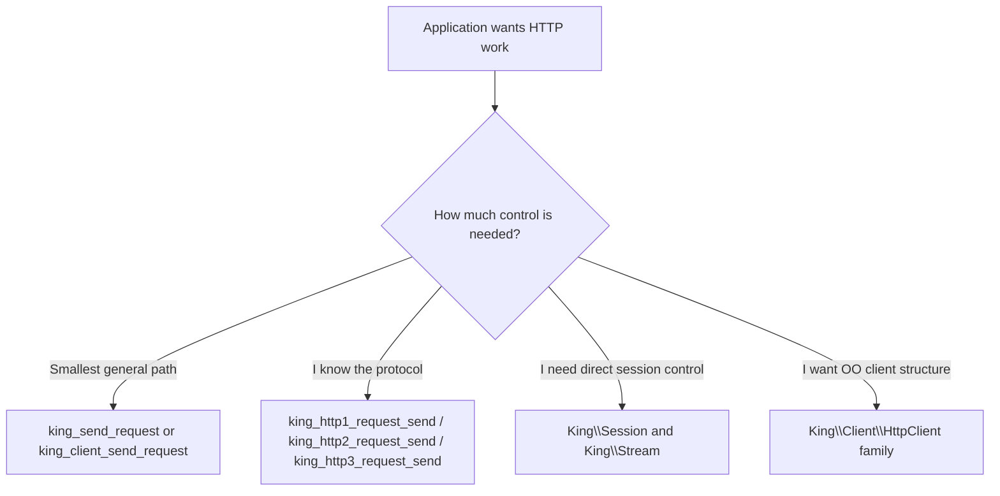
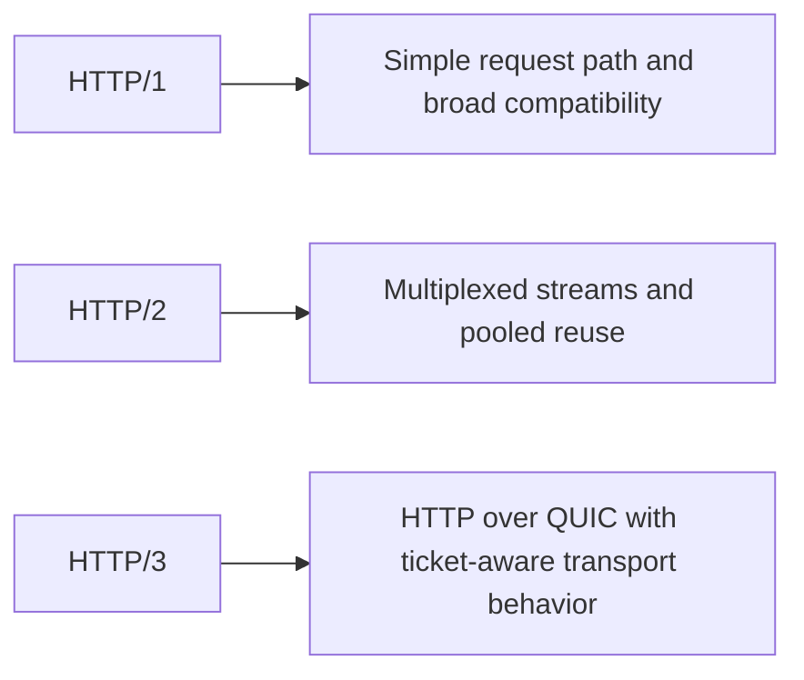
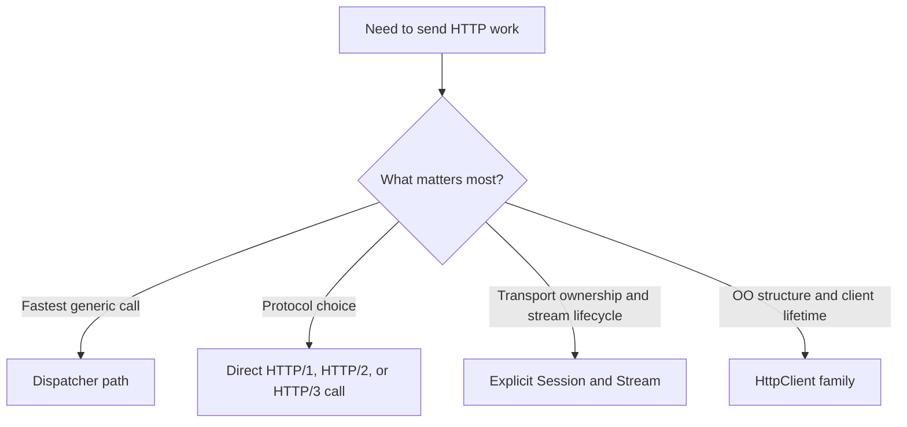

# HTTP Clients and Streams

This chapter explains how King sends HTTP requests, how it receives responses,
how sessions and streams fit together, and how to choose between HTTP/1,
HTTP/2, and HTTP/3 without guessing.

Many readers already know everyday HTTP. They know what a method, URL, header,
and response body are. What usually feels unfamiliar is the runtime model
underneath. King does not treat HTTP as one giant helper that hides all
connection state forever. It lets the application stay at a simple level when
that is enough, but it also exposes sessions, streams, response contexts, and
protocol-specific paths when the application needs more control.

The purpose of this chapter is to make those layers feel normal. A beginner
should come away understanding what a session is, what a stream is, why there
are several request entry points, and when a response should be streamed instead
of buffered. You should come away with a clear map of the
runtime.

## Start With The Big Picture

There are four main ways to perform HTTP work in King.

The first way is the dispatcher path. This is the general request path through
`king_send_request()` or `king_client_send_request()`. The runtime chooses the
active transport path for the request.

The second way is the protocol-specific one-shot path. This uses
`king_http1_request_send()`, `king_http2_request_send()`,
`king_http2_request_send_multi()`, or `king_http3_request_send()` when the
application already knows which protocol it wants.

The third way is the explicit session-and-stream path. This uses `king_connect()`,
`king_poll()`, `king_close()`, `king_cancel_stream()`, and the `King\Session`
and `King\Stream` objects when the application wants direct control over a live
transport context.

The fourth way is the object-oriented client path through `King\Client\HttpClient`
and the version-specific `Http1Client`, `Http2Client`, and `Http3Client`
classes.



These are not four unrelated transport stacks. They are four entry styles into
the same runtime.

## What A Session Is

A `King\Session` is a live transport context. In simple words, it is the object
that owns the connection state.

That state includes transport metadata such as whether the connection is alive,
which protocol was negotiated, how many streams exist, how many bytes have moved
through the transport, how much delay the path is showing, and whether tickets
or pooled reuse may be relevant later.

This matters because a serious HTTP client often needs to do more than send one
request and forget everything. It may want to reuse a transport, observe
statistics, drive the session event loop, or keep several streams alive at once.
That is why King exposes the session instead of burying it.

The low-level procedural entry to this model is `king_connect()`. The object API
entry is `new King\Session(...)`.

## What A Stream Is

A `King\Stream` is one unit of request work inside a session. The easiest mental
picture is that a stream carries one request and its response inside a larger
session.

This distinction matters most with multiplexed protocols such as HTTP/2 and
HTTP/3, where one session may carry several streams at once. The stream is the
thing you send request-body chunks on, finish, receive a response from, close,
or cancel without necessarily destroying the whole session.

If you are used to short-lived request helpers, this is one of the biggest shifts
in the King model. The request does not have to be the same thing as the
connection.

## What A Response Is

A `King\Response` is the structured view of the answer that came back. It gives
the application a status code, normalized headers, and body access. The body can
be consumed all at once with `getBody()` or incrementally with `read()`.

That second mode is important enough to say early. Not every response should be
buffered in one giant string. Some responses are large. Some arrive slowly. Some
should be processed as they stream in. The response object exists so the runtime
can support both styles without making the caller drop down into raw socket
reads.

## Dispatcher Path Versus Direct Protocol Path

The dispatcher path is what you use when you want one general request entry
point and you are happy to let the runtime choose the appropriate active client
path. `king_send_request()` and `king_client_send_request()` are the two names
for that model.

The direct protocol path is what you use when protocol choice is itself part of
the application decision. If you know the call must be HTTP/1, use
`king_http1_request_send()`. If you want a direct HTTP/2 call, use
`king_http2_request_send()`. If you want one multiplex batch over one HTTP/2
session, use `king_http2_request_send_multi()`. If you want one HTTP/3 request
over the QUIC runtime, use `king_http3_request_send()`.

The choice is not about good and bad APIs. The choice is about whether the
application wants the runtime to decide the active path or wants to pin the
protocol explicitly.

## HTTP/1, HTTP/2, And HTTP/3 In Plain Language

HTTP/1 is the simplest protocol family in the chapter. It is still important
because it remains common, widely compatible, and easy to reason about.
In the current runtime, HTTP/1 keep-alive reuse is intentionally bounded: the
pool keeps at most one idle socket per origin and at most sixteen idle sockets
globally. Under mixed-load bursts that exceed that budget, the oldest idle
origins are reopened instead of pretending there is an unbounded reuse pool,
and any reused socket that comes back with `Connection: close` is torn down
instead of being silently recycled.

HTTP/2 adds multiplexing. That means one session can carry several request
streams at the same time. It also changes how pooled reuse feels, because the
connection can keep serving multiple requests without looking like a strict
one-request-at-a-time pipe.

HTTP/3 sits on top of QUIC. It brings the request layer into the transport model
described in [QUIC and TLS](./quic-and-tls.md). This means the caller gets the
benefits of HTTP over a transport that already thinks in streams, recovery,
session identity, and resumption.



The important point is not to memorize slogans. The important point is to ask
what shape the traffic has and what the application wants from reuse.

## A First One-Shot Request

The smallest direct request example uses the HTTP/1 one-shot function.

```php
<?php

$response = king_http1_request_send(
    'http://127.0.0.1:8080/health',
    'GET',
    ['accept' => 'application/json']
);

if ($response === false) {
    throw new RuntimeException(king_get_last_error());
}

var_dump($response['status']);
var_dump($response['headers']);
var_dump($response['body']);
```

The structure is deliberately simple. The application asks for one request and
gets back one normalized response snapshot.

## The Dispatcher Path

`king_send_request()` is the general procedural client entry point. It accepts a
URL, method, headers, body, and optional request options. The client-facing
alias `king_client_send_request()` uses the same runtime.

The dispatcher path is useful when the code wants one general "send a request"
operation and is comfortable with the runtime choosing the active transport
backend. This keeps application code simpler when the request does not care
which of the active client paths satisfied it.

In practice, this is a good starting point for many applications. The code can
graduate to direct protocol calls or explicit sessions later when it actually
needs more control.

## Streaming Responses Instead Of Buffering Everything

Some responses should not be buffered all at once. A large file, a long report,
a progressive server response, or any response that should be processed while it
arrives is a better fit for streaming.

King supports this with `options['response_stream'] => true`. In that mode, the
request call returns a request context rather than a fully materialized response.
That context is then turned into a `King\Response` by `king_receive_response()`.

```php
<?php

$ctx = king_send_request(
    'http://127.0.0.1:8080/stream',
    'GET',
    null,
    null,
    ['response_stream' => true]
);

$response = king_receive_response($ctx);

while (!$response->isEndOfBody()) {
    echo $response->read(4096);
}
```

The basic picture is simple. Instead of "send request and get final body now",
the runtime says "the response is alive; here is the context and here is how
you consume it safely."

## Why Early Hints Appear On The Client Side Too

A response is not always only one final message. Some server paths send Early
Hints before the final response. On the client side, King exposes
`king_client_early_hints_process()` and `king_client_early_hints_get_pending()`
for request-context workflows.

The first function parses and stores a user-provided Early Hints style header
batch against a live request context. The second returns the pending hint list
for that context. This is useful when the application wants to process likely
needed resources before the main response body is complete.

That matters because a staged server response should have a staged client-side
story too. The request context is where that story lives.

## The Explicit Session Path

The next layer down is the explicit session path. This is where the application
creates a live transport context with `king_connect()` or `new King\Session()`
and then sends work through that session.

With the object API, a common flow looks like this:

```php
<?php

$session = new King\Session('api.example.com', 443);
$stream = $session->sendRequest(
    'GET',
    '/v1/status',
    ['accept' => 'application/json']
);

$response = $stream->receiveResponse(5000);

if ($response === null) {
    throw new RuntimeException('No response received.');
}

echo $response->getBody();
```

This path matters when the application wants to keep transport state alive on
purpose instead of only firing one-shot request helpers.

## Polling The Session

`king_poll()` and `Session::poll()` drive the event loop for a live session.
This is important when the application wants to keep a session alive and
continue moving transport events forward over time instead of treating the whole
session as a blocking black box.

Polling matters more once the session has several streams, or when the
application wants to combine request work with explicit session observation and
cancellation behavior.

## Closing The Session

`king_close()` and `Session::close()` end a live session. That sounds obvious,
but it matters because sessions are first-class state in the runtime.

Closing one stream is not the same thing as closing the whole session.
Destroying a one-shot helper result is not the same thing as explicitly
terminating a kept-alive transport. King makes those distinctions visible so the
application can choose the right level of cleanup.

## HTTP/2 One-Shot And Multi-Request Paths

`king_http2_request_send()` is the direct one-shot HTTP/2 call. It is useful
when the application wants explicit HTTP/2 behavior for one request and wants
the normalized response array back immediately.

`king_http2_request_send_multi()` is different. It sends several requests
through one honest shared HTTP/2 session. Each request entry can carry its own
URL, method, headers, and body, but the batch is still one multiplexed session
story rather than several totally separate one-shot calls.

```php
<?php

$responses = king_http2_request_send_multi([
    ['url' => 'https://api.example.test/a'],
    ['url' => 'https://api.example.test/b'],
    ['url' => 'https://api.example.test/c'],
], [
    'capture_push' => true,
]);
```

This matters because one of the reasons to choose HTTP/2 is not just that it is
"newer". It is that one session can carry several streams at once and do so
honestly.

## Push Capture In HTTP/2

HTTP/2 can carry pushed responses alongside the main request flow. King exposes
this through the `capture_push` option on HTTP/2 request paths.

If that option is enabled, pushed responses are attached to the originating
response structure under `pushes`. This makes push traffic visible to the caller
instead of hiding it as an invisible side effect.

The key idea is that a multiplexed protocol can carry more than the single
response the caller first asked for. The runtime keeps that extra traffic
structured instead of forcing the caller to infer it.

## HTTP/3 One-Shot Requests

`king_http3_request_send()` is the direct HTTP/3 one-shot path. It sends one
request over the active QUIC runtime and returns the normalized response
snapshot.

HTTP/3 matters when the application wants HTTP over a transport that already
thinks in streams, resumption, transport identity, and modern loss recovery.
Even if the application only calls one function, the transport underneath still
belongs to the QUIC model.

This is why the HTTP/3 story is split across this chapter and
[QUIC and TLS](./quic-and-tls.md). This chapter explains the request model. The
other chapter explains the transport it rides on.

## Object-Oriented Clients

Some codebases want a client object instead of procedural calls. The `King\Client`
family exists for that.

`King\Client\HttpClient` is the general protocol-aware client. The subclasses
`Http1Client`, `Http2Client`, and `Http3Client` pin protocol selection to one
version. All of them expose the same basic `request()` and `close()` model.

```php
<?php

$client = new King\Client\Http3Client(
    new King\Config([
        'tls.verify_peer' => true,
    ])
);

$response = $client->request(
    'GET',
    'https://api.example.com/v1/status'
);

echo $response->getBody();
```

The object-oriented path is often a better fit for application code that wants a
clear lifetime for client configuration and pooled state.

## Cancellation

Some requests should stop because the application has decided they are no longer
worth waiting for. That is why King has `King\CancelToken`.

At the request level, many object-oriented calls accept a cancel token directly.
At the stream level, the runtime also exposes `king_cancel_stream()` and
`king_client_stream_cancel()` to stop one active stream. These two names point
to the same stream-cancellation idea.

```php
<?php

$cancel = new King\CancelToken();
$client = new King\Client\Http2Client();

$response = $client->request(
    'GET',
    'https://example.com',
    [],
    '',
    $cancel
);
```

Cancellation matters because not every stop condition should come from timeout
or transport failure. Sometimes the caller has learned enough and wants to stop
the work now.

## Errors And Failure Paths

HTTP work can fail in several different ways. The remote side can return a bad
status. The network can fail. TLS policy can reject the peer. A timeout can
fire. A stream can become invalid. A session can be closed. A protocol can be
violated.

King keeps these failure families distinct. On procedural paths,
`king_get_last_error()` returns the shared last error string. On higher-level
paths the runtime uses typed exception families such as `King\NetworkException`,
`King\TimeoutException`, `King\TlsException`, `King\ProtocolException`, and
`King\StreamException`.

This matters because operationally useful error handling depends on knowing what
kind of failure happened, not only that "something went wrong".

## Statistics And Observability

`king_get_stats()` and `Session::stats()` expose transport and session-level
statistics. These numbers matter because they help answer questions the
application or operator will eventually ask.

Is the connection still alive? How many bytes have moved? How many streams are
active? What is the round-trip time doing? Has the connection retransmitted? Is
the session closed but still inspectable? Those are the kinds of questions
statistics are meant to answer.

Without stats, a request system becomes much harder to tune or debug once it is
under real load.

## Which Path To Choose

Choose the dispatcher path when you want one general request function and do not
need to pin the protocol explicitly.

Choose the direct protocol path when protocol choice is part of the application
decision and you want the corresponding runtime behavior directly.

Choose the explicit session path when transport state, polling, or stream-level
lifecycle matters enough that you want to hold the session yourself.

Choose the object-oriented client path when the codebase wants clearer client
ownership and reusable configuration through classes rather than procedural
calls.



This is usually the real decision the reader needs to make.

## Common Mistakes

One common mistake is buffering every response even when the body is large or
progressive. That throws away the value of the streaming response path.

Another mistake is treating HTTP/2 as if it were only HTTP/1 with a newer name.
The whole point is multiplexing and pooled reuse through one session.

Another mistake is using one-shot helpers everywhere even when the application
really wants to own a live session and several streams explicitly.

Another mistake is treating cancellation as identical to timeout. A timeout is a
runtime limit. Cancellation is an application decision. Those should stay
distinct.

## Where To Go Next

If the transport beneath HTTP/3 is what matters next, read
[QUIC and TLS](./quic-and-tls.md). If the next step is a long-lived bidirectional
channel rather than request and response work, read [WebSocket](./websocket.md).
If you want the exact public surface grouped by name, keep this chapter open
beside [Procedural API Reference](./procedural-api.md) and
[Object API Reference](./object-api.md).
