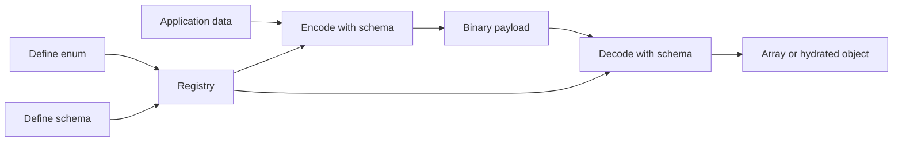
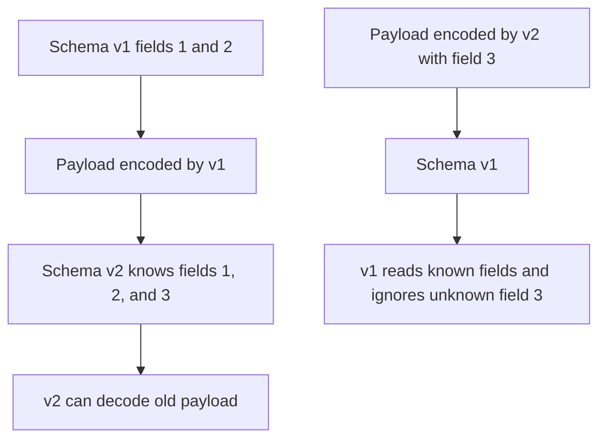

# IIBIN

IIBIN is King's native binary schema system. It exists for one simple reason:
many systems need something more disciplined than JSON and more readable than
hand-packed binary blobs.

If your application moves large numbers of messages, wants strict schema
control, needs long-lived compatibility rules, or wants to hydrate real objects
without spending its life converting arrays by hand, this chapter matters. It
explains what IIBIN is, why it exists, how to think about schemas and field
numbers, how compatibility works, and why IIBIN is one of the strongest pieces
of the King data plane.

## Start With The Basic Problem

Most PHP systems start with JSON because JSON is easy to read and easy to
inspect. That is a good reason to start there, but it is not a good reason to
stay there forever.

JSON is text. Text is larger than compact binary data for many message shapes.
JSON has no built-in field-number model, so schema evolution is mostly
convention. Text parsers also have to do more work when the system knows the
payload already follows a strict schema. When teams outgrow JSON, they often
fall into one of two bad alternatives. They either keep the JSON and absorb the
cost forever, or they invent a private binary format that becomes difficult to
evolve safely.

IIBIN exists to avoid both outcomes. It gives the application a real schema
language, a compact binary wire format, a decode path that understands those
schemas, and an optional object-hydration layer so the payload can become a
real PHP object instead of only another array.

## What IIBIN Actually Is

IIBIN is more than an encoder. It is a schema registry and a wire-format
system. The application defines enums and schemas once. After that, encode and
decode operations refer to those definitions by name.

A schema defines the fields that may exist in a message, their types, and their
field numbers. An enum defines a named set of integer values. Once those
definitions exist, the runtime can encode application data into a compact
binary payload and later decode that payload back into structured data.



The registry matters because the wire format is more than "some bytes". It is
bytes whose meaning is tied to a known schema.

## Why A Schema Matters

A schema is how a system makes a promise about message shape. It says which
fields exist, which types those fields use, whether a field can repeat, whether
the field is a map, whether a group of fields is mutually exclusive, and what
defaults apply when a field is absent.

That matters because a wire format without a schema quickly turns into folklore.
One service thinks a field is optional. Another thinks it is mandatory. One
decoder thinks a number is signed. Another thinks it is unsigned. One version
starts sending a new field and an older client breaks because nobody decided
how unknown fields should be treated.

IIBIN keeps those decisions explicit. The schema is not hidden in a comment or
in a wiki page that drifted out of date. It is part of the actual runtime.

## The Public Surface

King exposes the IIBIN surface in both procedural and object-oriented form.

The procedural functions are `king_proto_define_enum()`,
`king_proto_define_schema()`, `king_proto_encode()`,
`king_proto_encode_batch()`, `king_proto_decode()`,
`king_proto_decode_batch()`, `king_proto_is_defined()`,
`king_proto_is_schema_defined()`, `king_proto_is_enum_defined()`,
`king_proto_get_defined_schemas()`, and `king_proto_get_defined_enums()`.

The object-oriented mirror is `King\IIBIN`. Its static methods are
`defineEnum()`, `defineSchema()`, `encode()`, `encodeBatch()`, `decode()`,
`decodeBatch()`, `isDefined()`, `isSchemaDefined()`, `isEnumDefined()`,
`getDefinedSchemas()`, and `getDefinedEnums()`.

The important idea is that the two styles are mirrors. They are not two
different binary systems.

## A First Schema

The smallest useful IIBIN example is a schema with a couple of fields and one
roundtrip through encode and decode.

```php
<?php

king_proto_define_schema('User', [
    'id' => ['type' => 'uint64', 'field_number' => 1],
    'name' => ['type' => 'string', 'field_number' => 2],
]);

$binary = king_proto_encode('User', [
    'id' => 42,
    'name' => 'Ada',
]);

$decoded = king_proto_decode('User', $binary);
```

This example looks small, but it already shows the main model. The schema is
named. The fields are named. Each field has a type and a field number. The
encode step produces the binary payload. The decode step uses the same schema
name to recover the structure.

## Field Numbers Are Not Decoration

Readers who come from JSON often focus on field names first and treat field
numbers as a strange extra detail. In binary schema systems, field numbers are
part of the core contract.

The field name is useful to humans. The field number is useful to the wire
format. A field number gives the binary payload a stable identity for that
field. This is what makes schema evolution possible. If you keep field numbers
stable, you can rename internal variables, refactor code, or add new fields
without making older payloads meaningless.

This is one reason schema discipline matters. If a team reuses field numbers
carelessly, it is not "only a refactor". It is a wire-compatibility break.

## Types, Repeated Fields, Maps, And Oneofs

IIBIN supports ordinary scalar fields such as integers, floats, booleans, and
strings. It also supports repeated fields, map-like structures, nested
messages, enums, and oneof groups.

A repeated field is one field number that can appear more than once. A map is a
structure that stores key-value entries under one field definition. A oneof
group means several fields are mutually exclusive and only one of them may be
set at a time.

These are not advanced decorations. They are how real application data is
modeled. A user may have many tags. A job payload may have a map of model
parameters. A command may accept one of several payload shapes but never more
than one at once. The reason to use a schema system is to express these shapes
directly rather than smuggling them through vague arrays.

## Repeated And Nested Messages On Real Transport Paths

The most important repeated-plus-nested pattern in practice is not a toy local
array roundtrip. It is a live transport message where one frame carries a
batch with repeated entries and each entry includes nested state.

```php
<?php

King\IIBIN::defineSchema('RealtimeMember', [
    'id' => ['tag' => 1, 'type' => 'int32', 'required' => true],
    'role' => ['tag' => 2, 'type' => 'string'],
    'labels' => ['tag' => 3, 'type' => 'repeated_string'],
]);

King\IIBIN::defineSchema('RealtimeBatchV2', [
    'topic' => ['tag' => 1, 'type' => 'string', 'required' => true],
    'members' => ['tag' => 2, 'type' => 'repeated_RealtimeMember', 'required' => true],
    'request_id' => ['tag' => 3, 'type' => 'string'],
    'ack_ids' => ['tag' => 4, 'type' => 'repeated_string'],
]);

$binary = King\IIBIN::encode('RealtimeBatchV2', [
    'topic' => 'control.room.sync',
    'request_id' => 'req-7001',
    'members' => [
        ['id' => 7, 'role' => 'speaker', 'labels' => ['moderator', 'eu']],
        ['id' => 9, 'role' => 'viewer', 'labels' => ['mobile']],
    ],
    'ack_ids' => ['req-6998', 'req-6999'],
]);

king_websocket_send($socket, $binary, true);
```

This shape is exactly where compatibility semantics matter:

- newer readers decode the full repeated+nested shape
- older readers keep the shared field numbers and ignore unknown additions such
  as new repeated fields or nested members
- newer readers can still decode older payloads that never sent the newer
  fields

The contract for this exact repeated+nested compatibility behavior on a real
WebSocket transport path is now verified in
`670-iibin-repeated-nested-websocket-compatibility-contract.phpt`.

## Enums Make Integer Fields Human

`king_proto_define_enum()` lets the application bind names to integer values.
This helps in two ways. It keeps the wire format compact, and it prevents the
code from turning into a pile of mysterious numbers.

```php
<?php

king_proto_define_enum('JobState', [
    'pending' => 1,
    'running' => 2,
    'done' => 3,
    'failed' => 4,
]);
```

Enums matter most when a field participates in routing, policy, orchestration,
or state transitions. Those are exactly the parts of a system where magic
numbers become expensive mistakes.

## Encode Is More Than Serialization

When developers first hear "encode", they often think only of turning an array
into bytes. In IIBIN, encode is also the point where the runtime checks that
the data actually fits the declared schema. The schema is not there only for
documentation. It is there so the runtime can turn "I think this payload is
probably fine" into "this payload matches the declared contract".

That makes `king_proto_encode()` and `King\IIBIN::encode()` important for data
quality, not only for compactness.

## Batch Encode And Decode

Use `king_proto_encode_batch()` and `king_proto_decode_batch()` when many
records share the same schema and should cross the PHP/native boundary as one
bounded operation. The OO mirror is `King\IIBIN::encodeBatch()` and
`King\IIBIN::decodeBatch()`.

```php
<?php

$encoded = king_proto_encode_batch('User', [
    ['id' => 1, 'name' => 'Ada'],
    ['id' => 2, 'name' => 'Grace'],
]);

$decoded = king_proto_decode_batch('User', $encoded);

$objects = King\IIBIN::decodeBatch('User', $encoded, App\DTO\User::class);
```

Batch output keeps input iteration order. Batch decode supports the same
`decode_as_object` modes as single-record decode: `false`, `true`, a
class-string for top-level hydration, or a schema-to-class map for recursive
message hydration.

The batch contract is fail-closed. If any record is invalid, the whole batch
fails and no partial result is returned. Encode and decode errors include the
batch record index, and failures that originate in a lower-level encode or
decode operation preserve that original exception as `previous`. Decode also
rejects non-string batch entries before trying to parse them.

The current hard safety bound is `65536` records per batch. This limit is
checked before the runtime allocates the output list, so oversized inputs fail
before materializing a large result. Batch APIs are not streaming APIs; callers
that handle unbounded or externally supplied data should chunk the data into
bounded batches and keep backpressure in their own pipeline.

## Decode Can Return Arrays Or Objects

`king_proto_decode()` and `King\IIBIN::decode()` can decode into a plain array
or into a hydrated object. This is one of the strongest features in the whole
system because it lets the wire format stay compact while the application keeps
a real domain model.

If the decode target is an array, the result is easy to inspect and easy to
pass through generic code. If the decode target is an object, the result can
land directly in a class that matches the application's real model.

```php
<?php

$user = King\IIBIN::decode('User', $binary, App\DTO\User::class);
```

Hydration matters most in larger systems where arrays are not expressive
enough. A well-designed object carries method behavior, invariants, and clearer
intent than an associative array with many loosely understood keys.

## How Compatibility Works

Wire compatibility is the real reason mature teams adopt schema systems. The
happy path of encoding and decoding is easy. The hard part is keeping old and
new versions of a system talking to each other without breaking.

The simplest safe rule is this: once a field number is published, treat it as
part of the protocol. New fields may be added with new field numbers. Old
readers should ignore fields they do not know. Existing field numbers should
not quietly change meaning.

That is not a strange IIBIN-specific rule. It is what makes long-lived binary
protocols survivable. King includes the IIBIN surface precisely because the
extension is meant to support systems that evolve over long periods of time.



This is the key idea to keep. Compatibility is about careful change, not about
freezing the system forever.

## Schema Discovery And Registry Introspection

The registry is inspectable. `king_proto_get_defined_schemas()` returns the
known schema names. `king_proto_get_defined_enums()` returns the known enum
names. `king_proto_is_defined()`, `king_proto_is_schema_defined()`, and
`king_proto_is_enum_defined()` answer the obvious existence checks.

These functions are useful in admin tooling, tests, boot sequences, and systems
that load schema families conditionally. They also make the runtime easier to
reason about because the schema registry is visible instead of hidden.

## Where IIBIN Shows Up In The Platform

IIBIN is not an isolated serialization chapter. It becomes especially powerful
when it is combined with the rest of King.

Over [WebSocket](./websocket.md), IIBIN gives you compact, schema-defined
binary realtime messages. In MCP flows, it gives you a disciplined payload
shape for control and transfer traffic. In orchestration and autoscaling work,
it gives you a better way to move job state, policies, and events than loose
arrays or text blobs. In storage-backed systems, it gives you payloads that are
compact enough to keep hot and explicit enough to evolve safely.

The current repo-local Flow PHP / ETL bridge now also wraps this same surface
through `ProtoSchemaCodec` and `IibinSchemaCodec` in
[Flow PHP and ETL on King](./flow-php-etl.md), so ETL jobs can move between
row-shaped records and King-native schema-defined binary payloads without each
job hand-wiring `king_proto_encode()`, `king_proto_decode()`,
`King\IIBIN::encode()`, and `King\IIBIN::decode()` from scratch.

This is why the IIBIN chapter belongs near the center of the manual. It is one
of the pieces that lets the rest of the platform share one data language.

## Performance Expectations

IIBIN performance work is measured through source-controlled benchmark cases,
not through claims embedded in prose. Use
`./benchmarks/run-canonical.sh --case=proto_batch` to compare batch
encode/decode against the current runtime and
`./benchmarks/run-canonical.sh --case=proto_varint,proto_omega` when checking
integer encoding changes.

The practical expectation for batch APIs is lower per-record overhead when many
same-schema records are encoded or decoded together, because the caller crosses
the PHP/native boundary once for the batch instead of once per record. The
runtime still validates and materializes every record, so benchmark with the
real record shape before assuming a fixed speedup.

The current varint path is architecture-neutral and avoids enabling an
ARM64-specific unrolled decode path without dedicated architecture guard,
sanitizer proof, and benchmark evidence. Any future architecture-specific
change has to preserve wire compatibility and prove that it does not introduce
undefined behavior on supported builds.

## A Strong Realtime Pattern: WebSocket Plus IIBIN

The combination is worth calling out separately because it solves a common
problem so well.

WebSocket gives you a live message channel. IIBIN gives you a compact schema
for those messages. Together they give you a channel that can stay open for a
long time, move many messages, evolve safely over time, and decode directly
into objects.

```php
<?php

King\IIBIN::defineSchema('ChatMessage', [
    'room' => ['type' => 'string', 'field_number' => 1],
    'user' => ['type' => 'string', 'field_number' => 2],
    'body' => ['type' => 'string', 'field_number' => 3],
]);

$message = King\IIBIN::encode('ChatMessage', [
    'room' => 'general',
    'user' => 'ada',
    'body' => 'hello',
]);

$socket->sendBinary($message);
```

On the other side, the receiver decodes the frame back into structured data or
an object. The application does not have to guess the payload shape from
ad-hoc text.

## When To Choose IIBIN Instead Of JSON

Choose JSON when readability in logs or manual editing is the main goal and the
payload rate is small enough that size and parse cost do not matter much.

Choose IIBIN when the system needs compact messages, long-lived compatibility
rules, clear schema ownership, faster binary work, or object hydration without
loose userland parsing. In other words, choose IIBIN when the data plane has
started to matter enough that "it is easy to read in a text editor" is no
longer the main design goal.

That is why the system exists. It is for the moment when a team wants more
discipline without giving up developer clarity.

## Where To Go Next

If you want to see IIBIN inside a live channel, read [WebSocket](./websocket.md)
next. If you want the full public surface grouped by function name, open
[Procedural API Reference](./procedural-api.md) and
[Object API Reference](./object-api.md). If you want a compatibility-oriented
walkthrough, read the example guide
[Proto Wire Compatibility](./16-proto-wire-compatibility/README.md).
