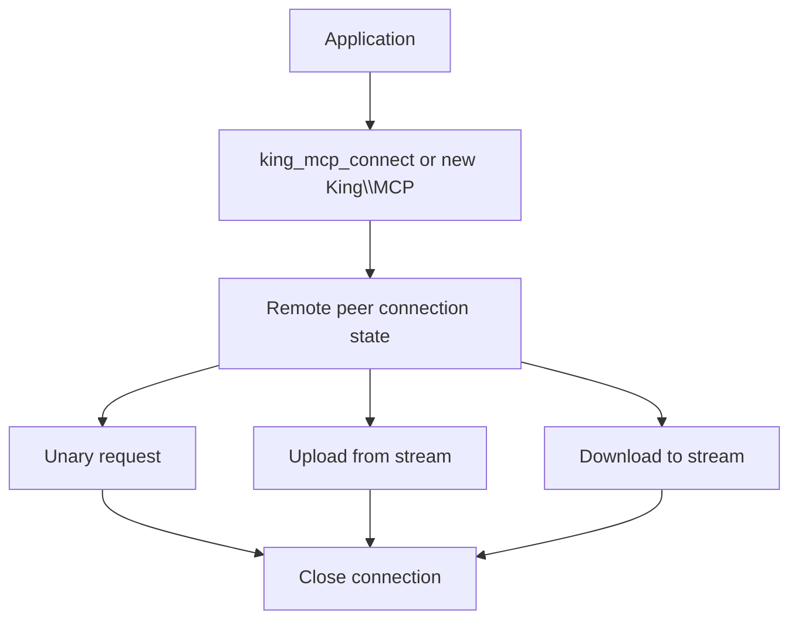
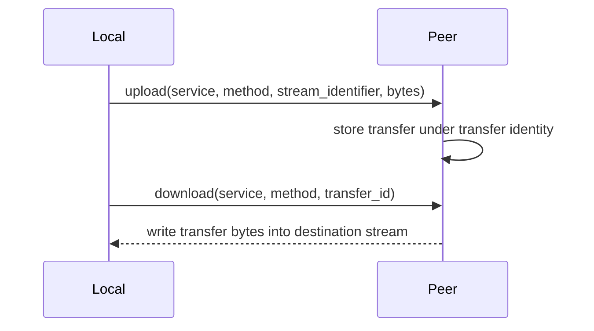

# MCP

MCP is the part of King that carries structured control-plane traffic between
processes, tools, agents, and remote workers. It exists for the moment when a
system needs more than a plain request string and less than a full custom
protocol stack built from scratch.

The chapter is not only about "remote procedure calls". It is also about how
King handles larger payloads, transfer identity, streamed uploads, streamed
downloads, deadlines, cancellation, and connection lifecycle while keeping the
whole model understandable from PHP.

If you are new to the topic, think of MCP as the control-plane cousin of the
HTTP client runtime. It gives names to services and methods, adds a disciplined
request and transfer model, and keeps the connection lifecycle explicit so the
application can reason about it.

## Start With The Problem MCP Solves

Many systems have two different traffic shapes at the same time. One shape is
public or user-facing traffic, which fits naturally into HTTP. The other shape
is internal control-plane traffic, which is about telling remote systems what to
do, asking them for one structured result, or moving one larger payload under a
known transfer identity.

That second shape is where many systems become messy. A team may start with a
few JSON calls, then add ad-hoc upload endpoints, then invent a transfer ID
format, then add timeout rules, then try to bolt cancellation on top. After a
while, the protocol is no longer simple, but it is also not disciplined.

MCP exists so that King has one native place for this kind of traffic. The
runtime can open a remote peer connection, send a named request, upload a stream
into a known transfer slot, download a stored transfer into another stream, and
apply the same explicit deadline and cancellation rules that the rest of the
platform already understands.

## What MCP Is In Plain Language

At the smallest level, MCP lets one process talk to another process by naming a
service, naming a method, and sending a payload. That is the unary request path.

At the larger-payload level, MCP also lets one side upload bytes from a PHP
stream into a remote transfer store under a transfer identity, and later lets
another side resolve that transfer identity and download the bytes into another
stream.

That is the whole model in simple language: connect, request, upload, download,
close.

## Why MCP Belongs Inside King

King is already a runtime for transport, storage, orchestration, telemetry, and
control-plane logic. MCP fits naturally here because it touches all of them.

An orchestrator step may call a remote tool through MCP. An MCP upload may later
become a durable object in the object store. A remote worker may expose tool
methods whose inputs or outputs are encoded with IIBIN. A telemetry pipeline may
need to observe timeout or retry behavior around remote calls. A cancel token
may need to stop an MCP request for the same reason it can stop an HTTP stream
or orchestration run.

MCP is therefore not an isolated "RPC helper". It is part of the main control
surface of the platform.

## The Public MCP Surface

The procedural MCP surface is small on purpose.

`king_mcp_connect()` opens a connection handle to a remote peer. `king_mcp_request()`
sends one unary request and returns the response payload. `king_mcp_upload_from_stream()`
drains a PHP stream into the remote transfer store under a specific
`(service, method, stream_identifier)` tuple. `king_mcp_download_to_stream()`
resolves a previously uploaded transfer and streams it into a destination PHP
stream. `king_mcp_close()` closes the connection state and its active peer
socket. `king_mcp_get_error()` reads the shared MCP error buffer.

The object-oriented mirror is `King\MCP`. Its methods are `__construct()`,
`request()`, `uploadFromStream()`, `downloadToStream()`, and `close()`.

The important point is that the OO and procedural paths are mirrors of one
runtime, not separate protocol implementations.

## The Connection Model

Everything begins with a remote peer connection. `king_mcp_connect()` and
`new King\MCP(...)` both create a connection-state wrapper for a host and port,
plus optional configuration. The runtime then owns the open or closed state of
that remote peer relationship.

This matters because MCP traffic is more than a set of unrelated function
calls. The runtime knows whether the peer is currently open, whether it has
already been closed, whether a previous operation failed, and which connection
that operation belongs to.



The value of explicit connection state is that all later operations know which
peer they are talking to and whether that peer relationship is still valid.

King also treats the peer target itself as part of the trust boundary. Loopback
peers such as `127.0.0.1`, `::1`, and `localhost` are allowed by default. Any
non-loopback MCP peer must be named explicitly through the system INI
`king.mcp_allowed_peer_hosts`. That keeps ad-hoc application code from turning
MCP into an unrestricted outbound TCP dialer while still preserving real
multi-host deployments under operator control.

That multi-host story is now verified in the tree, not only described. The MCP
test harness runs a client inside an unprivileged user/network namespace behind
`slirp4netns`, targets a host-bound MCP server over a non-loopback IPv4
address, and proves that unary request, upload, and download flows survive that
cross-host-style path instead of only loopback or same-process peers.

## Unary Request: One Payload In, One Payload Out

`king_mcp_request()` is the smallest useful MCP operation. The caller provides a
connection, a service name, a method name, a payload string, and optional
operation controls such as timeout, deadline, or cancel token.

The remote side receives a clear control-plane request: service, method,
payload. The local side receives a normalized response payload back.

```php
<?php

$conn = king_mcp_connect('127.0.0.1', 7001, null);

$reply = king_mcp_request(
    $conn,
    'artifact_service',
    'describe',
    '{"object_id":"models/checkpoint-42"}',
    [
        'timeout_ms' => 3000,
    ]
);

if ($reply === false) {
    throw new RuntimeException(king_mcp_get_error());
}
```

The important idea is that the request is structured before it even reaches the
payload. The protocol knows which service and method are being addressed.

## Upload From Stream

Unary requests are not enough once the payload is large. That is where
`king_mcp_upload_from_stream()` matters.

The function drains a PHP stream and uploads its bytes into the remote MCP
transfer store under a specific transfer identity. That identity is the tuple of
service name, method name, and stream identifier.

The point is not only "send some bytes". It is "send these bytes into a remote slot
that has a known identity and can be referenced again later".

King can also keep a local durable snapshot of uploaded transfer payloads when
`king.mcp_transfer_state_path` is configured. That snapshot is not a second
public API. It is a restart-recovery queue for the same transfer identities the
runtime already understands. If the process restarts before the transfer is
consumed, the next MCP connection can rehydrate that local queue, resolve the
same transfer identifier again, and remove the queued payload only after a
successful `downloadToStream()` write completes.

```php
<?php

$stream = fopen(__DIR__ . '/checkpoint-00042.bin', 'rb');

king_mcp_upload_from_stream(
    $conn,
    'artifact_service',
    'store_checkpoint',
    'run-2026-03-27-checkpoint-42',
    $stream,
    [
        'timeout_ms' => 10000,
    ]
);
```

This matters because large payload movement should not force the application to
pretend everything is a tiny in-memory string.

## Download To Stream

`king_mcp_download_to_stream()` is the reverse operation. The caller gives the
connection, the same service and method names used at upload time, a payload
that identifies the stored transfer, and a destination stream. The runtime
fetches the remote transfer and writes the bytes into that destination stream.

```php
<?php

$out = fopen(__DIR__ . '/restored-checkpoint.bin', 'wb');

king_mcp_download_to_stream(
    $conn,
    'artifact_service',
    'store_checkpoint',
    'run-2026-03-27-checkpoint-42',
    $out,
    [
        'timeout_ms' => 10000,
    ]
);
```

This is useful when the application wants large payload movement without turning
every transfer into a huge response string.

The local durable transfer queue matters here too. If a process restarts after
an upload has already been accepted, King can still resolve the transfer from
the configured local queue even when the restarted peer no longer has the
payload in its process memory. The queue is then consumed only after the
download has been written successfully.

## Transfer Identity Matters

The transfer identifier is one of the most important parts of the MCP story.
Without a clear transfer identity, streamed uploads and downloads quickly become
fragile. One side uploads bytes, another side tries to refer to them later, and
the system drifts into undocumented naming rules.

King prevents that by making the transfer identity explicit. The upload path is
keyed by service, method, and stream identifier. The download path resolves a
stored transfer by reusing that same service and method while treating the
request payload as the remote transfer ID component. That tuple is encoded
internally before it becomes a storage key, so newline-shaped components,
binary-safe identifiers, and separator ambiguity do not collapse distinct
transfers into one another.

That means the control-plane API stays understandable even when the payload is
too large to fit comfortably into one ordinary request body.



This sequence is why MCP is more than a simple string RPC helper.

## Deadlines, Timeouts, And Cancellation

MCP uses the same disciplined lifecycle thinking that appears elsewhere in King.
Operations can take a timeout, a monotonic deadline, and a cancel token.

A timeout says "this operation should not take longer than this many
milliseconds." A deadline says "this operation must finish before this absolute
monotonic time." A cancel token says "the caller has decided to stop this work
now."

Those three ideas are related, but they are not the same. A timeout is a local
limit. A deadline is a stronger time boundary that can be shared across several
operations. Cancellation is a caller decision that can happen even before the
runtime has exhausted its own timers.

This matters for control-plane traffic because orchestration, agent work, and
tool execution are often chained. One stalled remote call should not be able to
hold the whole control path hostage indefinitely.

## Connection Errors And Operation Errors

An MCP system can fail in several different ways. The connection may be closed.
The peer may reject the request shape. The timeout may expire. The transfer may
be missing. The payload may be invalid. The remote side may fail while writing
or reading the transfer body.

That is why King exposes both typed exception families and `king_mcp_get_error()`
for the procedural path. The point is not only to say "something failed". The
point is to keep the failure class understandable enough that the application can
respond properly.

Connection errors are not the same as protocol errors. Data errors are not the
same as timeouts. A closed peer is not the same as a malformed request. The
runtime keeps these distinctions explicit because operationally useful error
handling depends on them.

The OO surface makes that split concrete. `King\MCPConnectionException` means
the socket path failed or the peer disappeared. `King\MCPProtocolException`
means the peer answered with an explicit MCP error or sent an invalid MCP
response. `King\MCPTimeoutException` means the active timeout or deadline was
exhausted. `King\MCPDataException` means the local transfer side failed, such
as persisted transfer-state rehydration or cleanup on the local node.

## MCP And The Object Store

MCP and the object store belong close together even though they are different
subsystems.

The object store is about durable payload identity, metadata, edge delivery, and
recovery. MCP is about moving structured control-plane requests and larger
payloads between remote peers. In a real system, the two often meet. An MCP
upload may become a durable object. A remote request may ask another process to
describe, warm, or restore an object. A transfer ID may refer to data that will
later be persisted or served elsewhere.

That is why the handbook treats these chapters as neighbors rather than as
isolated technologies.

## MCP And The Pipeline Orchestrator

The orchestrator chapter is another natural neighbor. When the platform needs to
call a remote tool or worker, MCP is a clean transport for that control-plane
operation.

This matters because the orchestrator is about describing work, runs, tools, and
worker paths. MCP is one of the ways that work can cross a process or host
boundary without turning into an informal protocol.

The connection between the two chapters is not theoretical. The same system may
register a tool in the orchestrator and then reach the implementation of that
tool through an MCP peer.

## A Full Example

The following example shows a realistic MCP sequence: open one connection, make
one unary request, upload a larger payload, then download a payload back into
another stream.

```php
<?php

$conn = new King\MCP('127.0.0.1', 7001);

$reply = $conn->request(
    'artifact_service',
    'describe',
    '{"object_id":"models/checkpoint-42"}'
);

echo $reply . PHP_EOL;

$upload = fopen(__DIR__ . '/checkpoint-00042.bin', 'rb');
$conn->uploadFromStream(
    'artifact_service',
    'store_checkpoint',
    'run-2026-03-27-checkpoint-42',
    $upload,
    ['timeout_ms' => 10000]
);
fclose($upload);

$download = fopen(__DIR__ . '/restored-checkpoint.bin', 'wb');
$conn->downloadToStream(
    'artifact_service',
    'fetch_checkpoint',
    'run-2026-03-27-checkpoint-42',
    $download,
    ['timeout_ms' => 10000]
);
fclose($download);

$conn->close();
```

This example is intentionally plain. It shows the real sequence of operations
without hiding the connection lifecycle.

## Why Streams Matter Here

It is worth saying this directly: the stream-based MCP operations exist because
control-plane systems still need to move large payloads.

Without stream-based upload and download, a system ends up pretending that a
large artifact should fit into the same simple request pattern as a tiny
request string. That usually leads to either wasteful buffering or a second
protocol invented in a hurry.

MCP keeps the small request path and the large transfer path inside one runtime
so the application does not need to choose between discipline and practicality.

## Configuration And Policy

The detailed key lists live in the configuration reference, but the mental
picture is simple. MCP configuration shapes how the peer connection is opened,
how encryption and transport policy behave, how long the runtime should wait,
and how payload protection works when encryption-at-rest or payload-encryption
settings are involved in the larger platform.

The important part of this chapter is not memorizing every key. It is
understanding that remote peer traffic belongs to the same configuration world
as the rest of the runtime.

## Common Mistakes

One common mistake is treating MCP like a plain string RPC layer and ignoring
the transfer identity model. That makes larger payload flows much harder to
reason about later.

Another mistake is using tiny in-memory payloads for everything, even when the
data clearly wants streamed upload or streamed download. That throws away the
main reason the transfer API exists.

Another mistake is treating timeout, deadline, and cancellation as the same
thing. They are different controls and exist because real control-plane traffic
needs all three.

Another mistake is forgetting that connection lifecycle still matters. A closed
peer handle is not the same thing as an open one, and the runtime keeps that
difference explicit on purpose.

## Where To Go Next

If the next question is "what happens to a large payload after it has moved
through MCP?", read [Object Store and CDN](./object-store-and-cdn.md). If the
next question is "how does the platform use remote tools and workers once the
control path exists?", read [Pipeline Orchestrator](./pipeline-orchestrator.md).
If the next question is "how should the payload itself be structured?", read
[IIBIN](./iibin.md).
