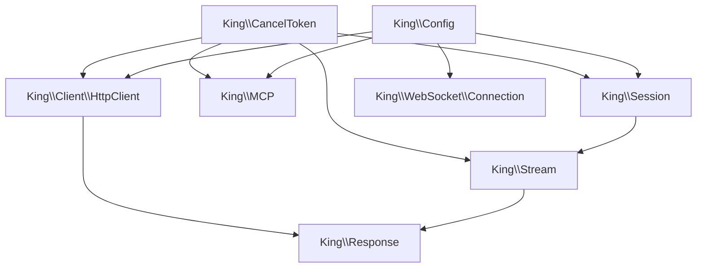

# Object API Reference

This chapter documents the object-oriented PHP surface exported by the King
extension. The procedural API exposes the full platform breadth. The object API
focuses on the places where long-lived handles, stream ownership, and reusable
client objects make the code easier to read.

If you prefer to understand the concepts first, read the subsystem handbook
chapters and then return here for the exact classes and methods. If you are
already writing code and need to know which class owns which behavior,
this chapter is the direct map.

## How The OO Surface Maps To The Procedural Surface

The OO layer is not a second runtime. It is a different way to reach the same
runtime. `King\Session` wraps the session and stream transport model.
`King\MCP` wraps the remote control-plane peer. `King\WebSocket\Connection`
wraps the WebSocket client lifecycle. `King\Config` wraps runtime overrides in
an object that can be reused. `King\Response` and `King\Stream` provide clearer
ownership for request and response state.

The important point is that the OO layer organizes state. It does not invent a
separate protocol or a different contract.

## Cancellation And Configuration

Two small classes appear everywhere else in the API because they solve two
cross-cutting problems: cancellation and configuration.

### `King\CancelToken`

Use `King\CancelToken` when a request, stream, or control-plane operation
should be stoppable from outside the code that started it. A token starts in
the non-cancelled state and stays cancelled after `cancel()` is called.

| Method | What it does |
| --- | --- |
| `cancel()` | Marks the token as cancelled. |
| `isCancelled()` | Reports whether the token has already been cancelled. |

### `King\Config`

Use `King\Config` when you want to keep one runtime override set together and
reuse it across multiple clients or sessions. It is the OO wrapper around the
same runtime key space documented in
[Runtime Configuration Reference](./runtime-configuration.md).

| Method | What it does |
| --- | --- |
| `__construct(?array $options = null)` | Builds a validated config object from runtime override keys. |
| `new(array $options = [])` | Named constructor for a new config object. |
| `get(string $key)` | Reads one runtime key from the object. |
| `set(string $key, mixed $value)` | Applies one validated runtime override to the object. |
| `toArray()` | Exports the effective runtime override set as an array. |

`King\Config` is especially useful when the same TLS, timeout, routing, or
telemetry policy should be reused across several client objects.

## Session, Stream, And Response

Read [HTTP Clients and Streams](./http-clients-and-streams.md) and
[QUIC and TLS](./quic-and-tls.md) for the full model. These three classes are
the heart of the stateful client OO surface.

`King\Session` owns the connection to the peer. `King\Stream` owns one request
or one bidirectional exchange inside that session. `King\Response` owns the
read side of the reply.

### `King\Session`

Use `King\Session` when you want an explicit connection object instead of a
one-shot dispatcher request. It is the right tool when session reuse, polling,
ALPN inspection, or explicit stream ownership matter.

| Method | What it does |
| --- | --- |
| `__construct(string $host, int $port, ?Config $config = null, array $connect_options = [])` | Opens a session to the target host and port. |
| `isConnected()` | Reports whether the session is currently connected. |
| `sendRequest(string $method, string $path, array $headers = [], string $body = '', ?CancelToken $cancel = null)` | Allocates one request stream on the session and returns a `King\Stream`. |
| `poll(int $timeout_ms = 0)` | Advances the session event loop. |
| `close(int $code = 0, ?string $reason = null)` | Closes the session. |
| `stats()` | Returns transport counters and metadata for the session. |
| `alpn()` | Returns the negotiated ALPN identifier. |
| `enableEarlyHints(bool $enable = true)` | Enables or disables client-side Early Hints handling on the session. |

### `King\Stream`

Use `King\Stream` when you need explicit control over a live request exchange.
It lets you send body data incrementally, finish the write side separately from
creating the stream, and then receive the response with optional timeout and
cancellation.

| Method | What it does |
| --- | --- |
| `receiveResponse(?int $timeout_ms = null, ?CancelToken $cancel = null)` | Receives the response for the stream. |
| `send(string $data, ?CancelToken $cancel = null)` | Sends request-body bytes on the stream. |
| `finish(?string $finalData = null)` | Finishes the write side of the stream. |
| `isClosed()` | Reports whether the stream is already closed. |
| `close()` | Closes the stream. |

### `King\Response`

Use `King\Response` when you want the reply as an object rather than as a raw
array. It is especially helpful when reading a body incrementally or when you
want one place for status, headers, and body access.

| Method | What it does |
| --- | --- |
| `getStatusCode()` | Returns the HTTP status code. |
| `getHeaders()` | Returns normalized response headers. |
| `getBody()` | Returns the full response body. |
| `read(int $length = 8192)` | Reads the next body chunk. |
| `isEndOfBody()` | Reports whether the body has been fully consumed. |

## MCP And Binary Data

The control plane and the native binary data model each get their own OO
wrapper because they benefit from holding state and intent together.

### `King\MCP`

Read [MCP](./mcp.md) for the wire model and error semantics. `King\MCP` wraps
the MCP connection state so repeated requests, uploads, and downloads can share
one object.

| Method | What it does |
| --- | --- |
| `__construct(string $host, int $port, ?Config $config = null)` | Opens an MCP connection object. |
| `request(string $service, string $method, string $payload, ?CancelToken $cancel = null, ?array $options = null)` | Executes one unary MCP request. |
| `uploadFromStream(string $service, string $method, string $streamIdentifier, $stream, ?array $options = null)` | Uploads a local stream to the remote peer. |
| `downloadToStream(string $service, string $method, string $payload, $stream, ?array $options = null)` | Downloads a remote transfer into a local stream. |
| `close()` | Closes the MCP connection object. |

### `King\IIBIN`

Read [IIBIN](./iibin.md) first. `King\IIBIN` is a static utility class because
schema and enum registration behave like registry operations rather than like
session state.

| Method | What it does |
| --- | --- |
| `defineEnum(string $name, array $values)` | Registers one enum definition. |
| `defineSchema(string $name, array $fields)` | Registers one schema definition. |
| `encode(string $schema, mixed $data)` | Encodes data with a named schema. |
| `decode(string $schema, string $data, bool|string|array $decodeAsObject = false)` | Decodes binary data with a named schema. |
| `isDefined(string $name)` | Checks whether a schema or enum exists. |
| `isSchemaDefined(string $schema)` | Checks whether a schema exists. |
| `isEnumDefined(string $name)` | Checks whether an enum exists. |
| `getDefinedSchemas()` | Returns the list of defined schemas. |
| `getDefinedEnums()` | Returns the list of defined enums. |

## HTTP Client Objects

Read [HTTP Clients and Streams](./http-clients-and-streams.md) first. The
client classes are the OO alternative to direct `king_*request_send()` calls.
They are useful when one object should own repeated request behavior and a
shared `King\Config`.

### `King\Client\HttpClient`

`King\Client\HttpClient` is the protocol-aware high-level client. It hides the
low-level session details when you only want to issue requests and receive
responses.

| Method | What it does |
| --- | --- |
| `__construct(?Config $config = null)` | Builds an HTTP client around a shared config object. |
| `request(string $method, string $url, array $headers = [], string $body = '', ?CancelToken $cancel = null)` | Executes one request and returns a `King\Response`. |
| `close()` | Closes pooled client state. |

### `King\Client\Http1Client`

`King\Client\Http1Client` is the HTTP/1-specialized subclass of
`King\Client\HttpClient`. It keeps the same constructor, `request()`, and
`close()` methods, but pins protocol choice to HTTP/1.

### `King\Client\Http2Client`

`King\Client\Http2Client` keeps the same public method set as `HttpClient` but
pins protocol choice to HTTP/2.

### `King\Client\Http3Client`

`King\Client\Http3Client` keeps the same public method set as `HttpClient` but
pins protocol choice to HTTP/3 over QUIC.

## WebSocket Objects

Read [WebSocket](./websocket.md) first. The WebSocket OO surface now has both
the bounded server-side accept object and the live connection object.

### `King\WebSocket\Server`

| Method | What it does |
| --- | --- |
| `__construct(string $host, int $port, ?Config $config = null)` | Prepares one bounded HTTP/1 websocket listener object. |
| `accept()` | Accepts one real on-wire websocket upgrade and returns a `King\WebSocket\Connection`. |
| `getConnections()` | Returns the live accepted-connection registry keyed by opaque `connection_id`. |
| `send(string $connectionId, string $message)` | Sends one targeted text frame to the accepted peer identified by `connection_id`. |
| `sendBinary(string $connectionId, string $payload)` | Sends one targeted binary frame to the accepted peer identified by `connection_id`. |
| `broadcast(string $message)` | Sends one text frame to every currently live accepted peer on that server instance. |
| `broadcastBinary(string $payload)` | Sends one binary frame to every currently live accepted peer on that server instance. |
| `stop()` | Stops the listener, sends `1001 server-shutdown` to live accepted peers, drains the close handshake, and prevents later accepts or sends on that server instance. |

### `King\WebSocket\Connection`

| Method | What it does |
| --- | --- |
| `__construct(string $url, ?array $headers = null, ?array $options = null)` | Opens a WebSocket connection. |
| `send(string $message)` | Sends a text frame. |
| `sendBinary(string $payload)` | Sends a binary frame. |
| `ping(?string $data = null)` | Sends a ping frame. |
| `close(int $code = 1000, ?string $reason = null)` | Sends a close frame and closes the connection. |
| `getInfo()` | Returns connection metadata, including the stable URL-style `id`, the targeted-send `connection_id`, and live queue diagnostics. |

## Exception Hierarchy

The exception hierarchy is part of the object API because many OO workflows use
exceptions as the main failure path rather than manually reading error buffers.
The hierarchy is broad because King spans transport, protocol, TLS, MCP,
WebSocket, and system-level operations.

### Base Exception Family

These classes are the common roots that most code catches first.

| Class | Use it when you want to catch |
| --- | --- |
| `King\Exception` | Any King-specific exception. |
| `King\RuntimeException` | Generic runtime failures. |
| `King\SystemException` | Coordinated system or component failures. |
| `King\ValidationException` | Invalid input or invalid configuration. |
| `King\TimeoutException` | Generic timeout failures. |
| `King\NetworkException` | Generic network failures. |
| `King\TlsException` | TLS and trust failures. |
| `King\QuicException` | QUIC transport failures. |
| `King\ProtocolException` | Higher-level protocol violations. |
| `King\StreamException` | Stream lifecycle or stream-state failures. |

### Fine-Grained Stream And Transport Exceptions

These classes narrow the stream or transport failure reason without forcing
every caller to catch them individually.

| Class | Meaning |
| --- | --- |
| `King\InvalidStateException` | An operation was attempted in the wrong state. |
| `King\UnknownStreamException` | The referenced stream does not exist. |
| `King\StreamBlockedException` | The stream cannot currently make forward progress. |
| `King\StreamLimitException` | A stream limit was reached. |
| `King\FinalSizeException` | Stream data violated the declared final size. |
| `King\StreamStoppedException` | The peer stopped the stream. |
| `King\FinExpectedException` | The runtime expected a final signal and did not receive it. |
| `King\InvalidFinStateException` | The final-state transition was invalid. |
| `King\DoneException` | The operation completed and has no further work to do. |
| `King\CongestionControlException` | QUIC congestion-control state prevented progress. |
| `King\TooManyStreamsException` | The session hit its stream ceiling. |

### MCP Exceptions

These exceptions narrow failure reasons in the MCP surface.

| Class | Meaning |
| --- | --- |
| `King\MCPException` | Generic MCP failure. |
| `King\MCPConnectionException` | MCP connection setup or connection-state failure. |
| `King\MCPProtocolException` | MCP wire or message-shape failure. |
| `King\MCPTimeoutException` | MCP timeout failure. |
| `King\MCPDataException` | MCP payload or transfer-data failure. |

### WebSocket Exceptions

These exceptions narrow failure reasons in the WebSocket surface.

| Class | Meaning |
| --- | --- |
| `King\WebSocketException` | Generic WebSocket failure. |
| `King\WebSocketConnectionException` | WebSocket connection or handshake failure. |
| `King\WebSocketProtocolException` | WebSocket protocol violation. |
| `King\WebSocketTimeoutException` | WebSocket timeout failure. |
| `King\WebSocketClosedException` | Use of a connection that has already closed. |

## Choosing Procedural Or OO

Use the OO surface when a long-lived handle helps the code read more clearly.
That is usually true for sessions, streams, HTTP clients, MCP peers, WebSocket
connections, and reusable config snapshots. Use the procedural surface when you
need the widest subsystem coverage or when the operation is naturally a single
function call.

The important thing is not which style is “better.” The important thing is that
both styles reach the same runtime and the same contract.
