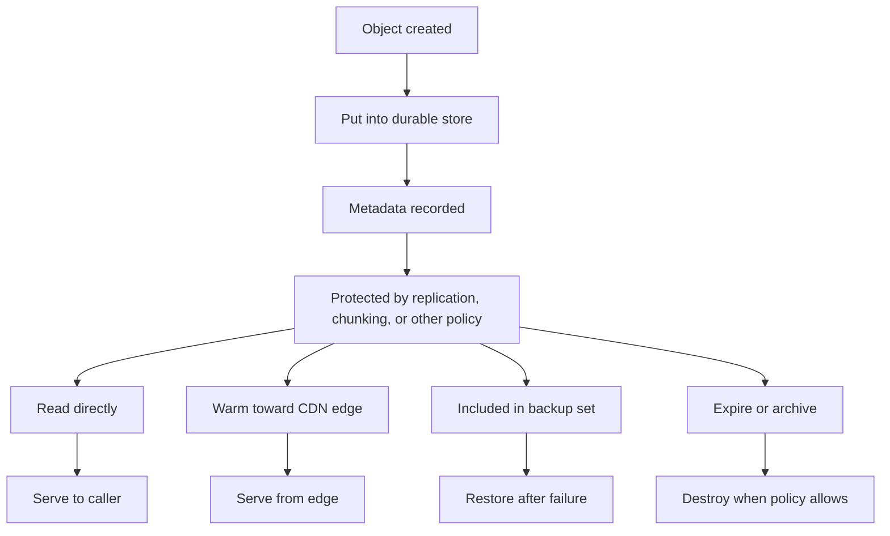
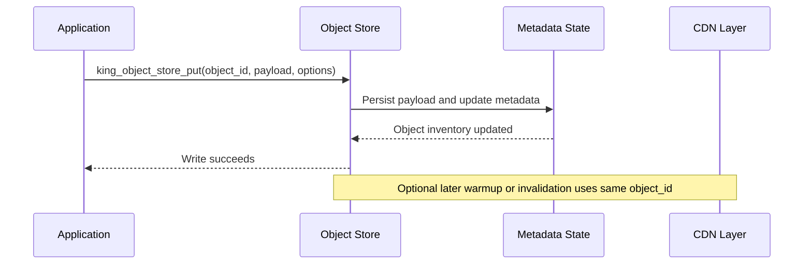
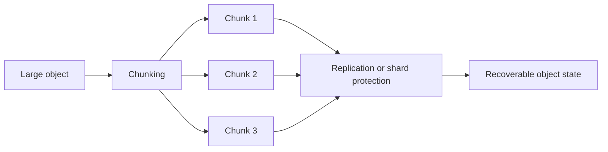
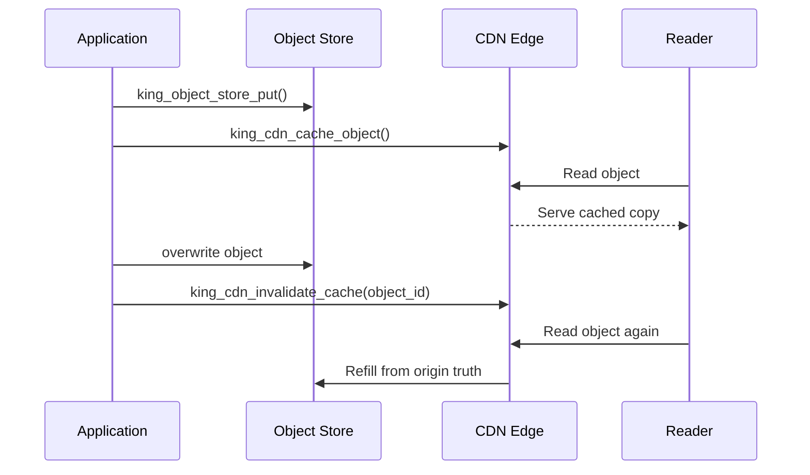

# Object Store and CDN

This chapter explains how King stores durable data, how it describes that data,
how it protects that data, and how it serves that data close to readers. It is
one of the longest chapters in the handbook because storage touches almost every
large workload. Once a system starts keeping model checkpoints, release
packages, generated media, cached responses, transfer payloads, training shards,
or expensive intermediate results, storage stops being a secondary concern and
becomes part of the main runtime contract.

This is why King puts the object store inside the extension itself instead of
treating it as a separate helper. The same runtime that receives traffic,
opens sessions, records telemetry, coordinates pipelines, and handles control
plane work also knows how durable objects are written, described, cached,
restored, invalidated, and prepared for later reads.

If you are new to storage systems, start with the next four sections. They
explain the basic words and the core lifecycle in plain language. If you
already work with storage, you can jump to the sections on redundancy,
encryption, predictive residency, CDN behavior, and recovery.

## Start With The Main Problem

Most applications begin with a filesystem path and a small wrapper that saves a
file. That works until the data starts to matter.

Once data matters, the application wants answers to questions that a bare path
does not answer. What is this payload? Is it safe to overwrite? Is it supposed
to expire? Has it already been backed up? Is it cached at the edge? Can it be
restored on another host? Should it stay warm because a training job will read
it again soon? Has it been encrypted at rest? Is it safe to destroy now, or is
it still part of another workflow?

An ordinary filesystem can store bytes, but it does not naturally answer all of
those questions as one coherent model. A database can keep metadata, but it is
not always the right place for large binary bodies. A CDN can deliver hot
copies, but it is not the source of truth. A backup system can preserve a copy,
but it does not necessarily know the serving policy of the object it copied.

King solves this by treating the payload, its metadata, its delivery policy,
and its recovery model as one subsystem.

## What An Object Store Means

An [object store](./glossary.md#object-store) is a storage model centered on
[objects](./glossary.md#object). An object has an identity, a body of bytes, and
metadata that explains how those bytes should be treated.

The identity is usually an object identifier rather than an accidental file
path. The payload is the actual byte body. The metadata describes facts such as
content type, content length, timestamps, cache policy, retention, backup
state, replication state, and whether the object is considered hot or cold.

This is different from saying "save a file under this path". The storage layer
is not only remembering where bytes were written. It is also remembering what
the bytes are for and how the platform should behave around them.

## The Words That Matter Most

This chapter uses a few words repeatedly, so it is worth stating them clearly
before going further.

A [blob](./glossary.md#blob) is a body of bytes. An [artifact](./glossary.md#artifact)
is a piece of output another system will fetch or use later. A [package](./glossary.md#package)
is a structured bundle moved as one unit. A [checkpoint](./glossary.md#checkpoint)
is saved state from a long-running process such as model training. A
[hotset](./glossary.md#hotset) is the part of the data the system expects to
need again soon. [Rehydration](./glossary.md#rehydration) means rebuilding
active runtime state from durable state. An [edge](./glossary.md#edge) is a
delivery node closer to readers than the origin. [Chunking](./glossary.md#chunking)
means splitting a large object into smaller pieces. [Retention](./glossary.md#retention)
means the rule that says how long the object should be kept.

If any of those words still feels unclear, keep the [Glossary](./glossary.md)
open while reading.

## Why King Keeps Storage In The Main Runtime

In many stacks, storage grows sideways. One system writes files. Another system
keeps metadata. Another system pushes objects to a CDN. Another system keeps
backups. Another system decides what belongs in fast local storage. None of
them sees the whole picture.

King keeps those concerns close together because the rest of the platform
already depends on them. An MCP upload may become an object. A pipeline step may
produce a durable result. A Semantic-DNS or autoscaling workflow may need to
promote a hot artifact before a compute wave starts. A CDN may need to warm or
invalidate a copy immediately after a write. Recovery logic may need payload and
metadata together after restart.

The object store is therefore not a minor subsystem on the platform. It is one
of the places where the platform becomes coherent.

## What Kinds Of Data Go Here

The object store is useful whenever the payload must live beyond the moment that
created it. Typical examples include release bundles, trained model snapshots,
fine-tuning datasets, inference caches, generated documents, uploaded media,
evaluation corpora, orchestration outputs, MCP transfer payloads, and large
binary data produced by background workers.

The common pattern is simple. The payload is expensive to produce, important to
keep, expensive to fetch cold, or likely to be read by more than one consumer.
That is exactly the kind of payload that deserves a full storage contract rather
than a temporary file.

## The Object Lifecycle

The easiest way to understand the subsystem is to follow one object from birth
to retirement.

An object begins when the application decides it has something worth keeping. It
is assigned an object identifier. It is written into durable storage. Metadata
is attached. Storage policy decides how the object should be protected and
whether it should also be prepared for edge delivery or fast local residency.

Later the object may be read directly, listed in inventory, cached toward the
edge, invalidated, backed up, restored, expired, archived, or destroyed. These
are deliberately different actions. An object can disappear from edge caches and
still exist durably. It can expire for ordinary reads but still remain
recoverable. It can be backed up without being warm at the edge. It can be
destroyed in a way that is much stronger than "not currently cached".



The main lesson is that a write is the beginning of the object's story, not the
end.

## Identity Matters More Than Paths

One reason object stores age better than ad-hoc filesystem patterns is that
identity is intentional. The application names the object because the object has
meaning, not because a path happened to exist.

That is why `king_object_store_put()` takes an explicit object identifier. The
identifier is what ties together payload, metadata, cache behavior, backup and
restore, and telemetry. When the system later calls `king_object_store_get()`,
`king_object_store_get_metadata()`, `king_cdn_cache_object()`, or
`king_object_store_backup_object()`, it is referring to the same object
identity, not to five unrelated path conventions.

This becomes even more important in distributed or operational settings. A
cache, a backup, an import operation, and a restore operation can all agree on
one identity if the object store remains the source of truth.

## The Write Path

The write path is where the object first becomes real. The application calls
`king_object_store_put()` with an object identifier, the payload, and optional
write policy. The runtime persists the payload, updates or creates the metadata,
updates inventory, and makes the object visible to the rest of the subsystem.
The current verified write-policy surface includes content metadata such as
`content_type` and `content_encoding`, retention/cache hints such as
`expires_at` and `cache_ttl_sec`, object classification via `object_type` and
`cache_policy`, caller-supplied `integrity_sha256`, and overwrite guards via
`if_match`, `if_none_match`, and `expected_version`.

If the write is an overwrite rather than a first write, the runtime also treats
that as a real state transition. New bytes may mean a new [ETag](./glossary.md#etag),
new timestamps, new cache invalidation work, a new backup snapshot later, and a
new hotness profile.



The important point is that payload and metadata move together. A write is not
considered complete only because bytes reached disk. The platform also needs the
object to have meaning.

## Metadata Is Part Of The Object

The object store is useful because it remembers more than the payload. Metadata
is how the store answers the questions that matter in operations and recovery.

An object may have content type, content encoding, content length, creation
time, modification time, expiry time, cache hints, [ETag](./glossary.md#etag),
backup state, edge state, and other lifecycle markers. In practice this means
the store can tell not only whether the object exists, but also whether it is
fresh, how it should be served, and what has happened to it recently.

That is why `king_object_store_get_metadata()` is a first-class API. It is not
a side utility. It is the read path for the object's meaning.

## Reading And Listing

`king_object_store_get()` returns the payload of one object. `king_object_store_list()`
returns the inventory view of stored objects. `king_object_store_get_stats()`
returns a runtime summary of the store and the CDN state around it.

These calls look ordinary at first, but each one answers a different operational
question.

`get()` answers "what are the bytes for this one object?" `list()` answers
"which objects exist right now?" `get_metadata()` answers "what is the current
story of this one object?" `get_stats()` answers "what does the subsystem look
like as a whole?"

Those distinctions matter because storage debugging often fails when every
question is treated as "read the file and see what happens."

The current verified read contract now also includes byte-range reads through
`king_object_store_get($objectId, ['offset' => ..., 'length' => ...])`, aligned
with RFC 7233-style byte ranges. Full-object reads validate stored
`integrity_sha256` metadata when present. Ranged reads intentionally return the
requested slice without claiming whole-object hash revalidation over bytes that
were not fetched.

## Overwrites, Versioning, And ETags

Overwriting an object is not a trivial act. The object may still be cached,
backed up, or referenced by another workflow. That is why overwrites need more
thought than "open a file and truncate it".

When an object changes, the runtime treats the new version as a new storage
state. That new state usually implies a new [ETag](./glossary.md#etag), fresh
timestamps, and a decision about whether edge copies must be invalidated.
The current verified overwrite contract exposes that explicitly through
`if_match`, `if_none_match`, and `expected_version`, so callers can require a
known stored validator or version before replacing the payload. That follows the
spirit of RFC 7232 conditional request semantics while keeping the object-store
native version counter explicit in the same API.

Versioning matters because long-lived systems need to reason about change
without confusing old and new payloads. Even when the API keeps the same object
identifier, the lifecycle around the object still distinguishes one concrete
stored state from the next.

## Retention, Expiry, Archive, And Destroy

These words are easy to mix up, but the differences matter.

Retention is the policy that says how long the object should remain kept.
Expiry is the moment the object stops being a valid ordinary read target.
Archiving means the object remains kept but is no longer in the main active
serving tier. Destruction means the object is meant to be gone, not merely cold
or invalid.

`expires_at` is now the ordinary-read visibility boundary across the verified
local and real cloud backends: once the stored expiry moment is in the past,
plain `get()`, `get_to_stream()`, and inventory listing stop surfacing the
object as a normal live entry, while `get_metadata()` still exposes the
snapshot and marks it as expired.

`king_object_store_cleanup_expired_objects()` exists because expired objects are
not only a business-rule concern. They are also an operational concern. A store
that never cleans expired material becomes harder to reason about, more
expensive to run, and more likely to keep serving stale or unnecessary data.

Controlled destruction also matters. Some objects should disappear from CDN
edges immediately but remain durably stored. Some should remain archived for
recovery. Some should be removed completely. King keeps those as distinct
concepts so the application and operator can be precise.

## Chunking, Replication, And Erasure Coding

Small objects and large objects do not want the same handling. A tiny JSON
artifact can often be stored as one unit without much thought. A multi-gigabyte
checkpoint or media body is a different problem.

This is where [chunking](./glossary.md#chunking), replication, and erasure
coding matter. Chunking splits a large object into pieces that are easier to
move, validate, resume, and protect. Replication keeps full extra copies of the
object or its parts. Erasure coding protects the object through a shard layout
that can survive partial loss without keeping full replicas of every byte.

King exposes the main storage policy through configuration keys such as
`storage.default_redundancy_mode`, `storage.default_replication_factor`,
`storage.erasure_coding_shards`, and `storage.default_chunk_size_mb`. These keys
decide how the object should survive failure, not only how it should sit on one
disk on one good day.



The point is not to make the storage story complicated for its own sake. The
point is to match the protection model to the value and size of the data.

## Integrity And Encryption At Rest

A storage system is only trustworthy if it can explain how it protects data
from disclosure and how it checks that returned bytes are really the intended
bytes.

Integrity starts with metadata and validation. Content length, [ETag](./glossary.md#etag),
and restore-time validation help the store answer "did I get back the same
thing that was put here?" Integrity matters during ordinary reads, during
restores, and during any movement between durable storage and edge caches.

Encryption at rest matters for a different reason. Even if transport security is
good, stored payloads may still live on disks or hosts that should not expose
plain content. King keeps storage encryption in the same policy family as the
rest of its security settings through `tls.storage_encryption_at_rest_enable`,
`tls.storage_encryption_algorithm`, and `tls.storage_encryption_key_path`.

That design choice is intentional. Storage trust is not a separate moral world
from transport trust. Both are part of the same platform security story.

## Predictive Residency, Hotsets, And DirectStorage

Many storage systems can answer the question "where is the data now?" Far fewer
can answer the question "which data should already be close before the next
workload starts?" King explicitly makes room for that second question.

This is where the [hotset](./glossary.md#hotset) idea matters. Some objects are
likely to be needed again soon. A model checkpoint created at the end of one run
may be read by a validation step right away. A training shard may be needed by
the next fine-tuning job. A release artifact may be fetched repeatedly during a
rollout wave. A cache fill may indicate which objects deserve to stay close to
the edge or to a fast local tier.

`storage.enable_directstorage` is the main policy switch for this idea. The
point is not that the store reads the future. The point is that the runtime can
use information it already has about workload behavior to avoid
bringing important data back from the coldest tier at the worst possible
moment.

This matters especially in AI and data-heavy workloads. A system that knows
which checkpoints, datasets, and artifacts are likely to be read soon can spend
less time waiting on cold storage and more time doing actual work.

## The CDN Is Part Of The Same Story

The CDN side of the subsystem is the delivery side of the same object identity.
The object store remains the origin truth. The CDN makes selected objects fast
to read from edge locations.

`king_cdn_cache_object()` pushes one object into the cache path. `king_cdn_invalidate_cache()`
retires one cached object or clears the whole cache view. `king_cdn_get_edge_nodes()`
returns the current edge inventory so the operator can see where the delivery
layer exists.

This matters because a storage write often has a delivery consequence. A fresh
object may need warming at the edge. An overwritten object may need invalidation
so old copies stop being served. A missing object may require origin fallback. A
temporary origin failure may still allow stale-on-error service from the edge.



The important principle is that the store and the CDN are not two competing
truths. The CDN is a serving layer around the store's truth.

## Backup, Restore, Import, Export, And Rehydration

A storage system earns trust on bad days. That is why backup and restore are
core APIs instead of afterthought scripts.

`king_object_store_backup_object()` exports one object and its metadata to a
directory. `king_object_store_restore_object()` brings that object back.
`king_object_store_backup_all_objects()` exports the full store view.
`king_object_store_restore_all_objects()` imports it again.

Those names are intentionally simple, but the current contract is no longer
"copy whatever happens to be visible right now into a directory". Single-object
backup and restore now participate in the same exclusive mutation lock that
protects writes and deletes. If a caller tries to export or restore an object
while another mutation is still in progress, the backup or restore fails
instead of racing a torn state.

The full-store path now has an explicit committed-snapshot contract.
`king_object_store_backup_all_objects()` exports into a staging directory,
writes a `.king_snapshot_manifest`, and only then swaps the finished snapshot
into the requested destination. That means repeated full backups to the same
directory do not silently retain payloads from an older run after those objects
have been deleted from the live store.

`king_object_store_restore_all_objects()` prefers that manifest when it is
present. Restore therefore replays the committed snapshot inventory rather than
whatever stray files happen to be sitting in the directory. This is
intentionally a snapshot import contract, not a destructive mirror contract:
objects listed in the snapshot are restored, but unrelated live objects already
present in the destination store are not deleted automatically.
The restore side is now also fail-closed against partial archive corruption.
If a manifest-listed upsert is missing its payload or `.meta` sidecar, if a
legacy directory contains a broken payload/metadata pair, or if the manifest
shape is internally inconsistent, the restore fails before mutating the live
store instead of importing an early subset and dying later.
That fail-closed contract now also includes restore-time integrity revalidation.
If the archived payload no longer matches the exported `content_length` or
`integrity_sha256`, the restore is rejected before the object becomes live, and
batch restore leaves the already-live store untouched.
The same revalidation now applies to the single-object import surface behind
`king_object_store_restore_object()`: tampered archived `object_id`,
`content_length`, or `integrity_sha256` metadata is rejected before the
imported object becomes live.
That single-object import API is also the current public partial-restore
contract. It restores exactly one archived object and leaves unrelated live
objects alone.
Batch restore now also requires a quiescent runtime. While
`king_object_store_restore_all_objects()` is replaying a committed snapshot, new
writes, deletes, and resumable-upload starts fail instead of interleaving with
the import. Symmetrically, if any live mutation is already in flight anywhere in
the store, `restore_all_objects()` fails closed before it starts mutating the
live inventory. The contract is therefore "committed snapshot replay against a
quiet store", not "best effort merge while traffic is still modifying data."

The same API now also supports explicit incremental backups:

```php
king_object_store_backup_all_objects(__DIR__ . '/backups/full');

king_object_store_backup_all_objects(__DIR__ . '/backups/incremental-0001', [
    'mode' => 'incremental',
    'base_snapshot_path' => __DIR__ . '/backups/full',
]);
```

Incremental mode is opt-in on purpose. It does not silently change what
`backup_all_objects()` means. The emitted snapshot still has a committed
manifest, but the payload directory now contains only changed or newly-added
objects, while the manifest carries delete tombstones and the effective current
inventory fingerprint set. `restore_all_objects()` treats that incremental
manifest as a patch: restore a full base snapshot first, then apply the
incremental snapshot to bring the target store forward.

That is the full current batch-restore contract. King does not currently expose
a rolling live replay mode, a batch subset selector, or a "restore only these
objects from this snapshot" option on `king_object_store_restore_all_objects()`.
If you need a partial restore today, use `king_object_store_restore_object()`
for one object at a time; if you need a batch restore, the supported shapes are
committed full-snapshot replay and committed incremental-patch replay only.

These functions matter because recovery is not complete if only the payload
returns. Metadata must travel with it, otherwise the restored bytes lose their
meaning. The restored object must still know what it is, how fresh it is, and
how it should behave in the rest of the platform.
The same export and restore format is also the currently verified migration path
between the real `local_fs` and `cloud_s3` backends. In the current runtime,
that means exporting from the source route and restoring under the target route
with the same object ids, not an in-place live backend flip. King now proves
that path in both directions against the real `cloud_s3` mock: batch export
from `local_fs` can be restored onto `cloud_s3`, and a `cloud_s3` object can be
exported and restored back onto `local_fs`.
That migration proof now also covers data integrity rather than only object
visibility. Binary payloads with NUL bytes and non-text octets survive the
roundtrip byte-for-byte, and the restored `content_length` still matches the
source payload size on the target backend.
The proof now also covers metadata consistency across that same real backend
boundary. Durable fields such as `created_at`, cache policy, distribution
state, and other exported `.meta` semantics survive the route change, while the
backend-presence markers stay honest about where real copies now exist instead
of silently dropping the source backend from the restored object view.
Committed `restore_all` replay is now also verified on the batch path from a
real `local_fs` snapshot onto the real `cloud_s3`, `cloud_gcs`, and
`cloud_azure` targets. Under that shared-root route-change contract, the same
durable `.meta` semantic fields survive the replay, the target cloud-presence
marker becomes visible, and unrelated cloud-presence markers stay clear instead
of being fabricated during batch restore.

`rehydration` is the runtime side of this story. After a restart, the store may
need to rebuild active in-memory state from durable truth. This is how the
system regains its footing after process loss without pretending that nothing
happened.
That restart re-entry is now explicitly proven after single-object export and
restore plus committed full-snapshot replay across the active persisted-state
modes: `local_fs`, `memory_cache`, `distributed`, `cloud_s3`, `cloud_gcs`, and
`cloud_azure`.

## Maintenance And Optimization

A store does not stay healthy only because it accepted writes earlier. Real
storage needs maintenance.

`king_object_store_optimize()` exists because inventory, housekeeping, and
maintenance are part of the storage contract. The exact tasks can vary by
backend policy, but the basic idea is stable: the store should be able to tell
you when it has reviewed and summarized its own state.

`king_object_store_cleanup_expired_objects()` exists for the other half of the
problem. Objects that are no longer meant to be served should not accumulate
without bound. Cleanup turns retention policy into real runtime behavior and
returns a summary of how many expired entries were scanned, removed, and how
many bytes were reclaimed.

These maintenance APIs matter because long-lived storage systems need explicit
care, not only explicit writes.

## The Public API, Grouped By Job

The easiest way to remember the API is by the question the caller is trying to
answer.

If the question is "how do I start the subsystem?", the answer is
`king_object_store_init()`.

If the question is "how do I write or remove one object?", the answers are
`king_object_store_put()`, `king_object_store_put_from_stream()`, and
`king_object_store_delete()`.

If the question is "how do I inspect what exists?", the answers are
`king_object_store_list()`, `king_object_store_get()`,
`king_object_store_get_to_stream()`, `king_object_store_get_metadata()`, and
`king_object_store_get_stats()`.

If the question is "how do I protect or recover data?", the answers are
`king_object_store_backup_object()`, `king_object_store_restore_object()`,
`king_object_store_backup_all_objects()`, and
`king_object_store_restore_all_objects()`.

If the question is "how do I keep the store healthy over time?", the answers are
`king_object_store_optimize()` and
`king_object_store_cleanup_expired_objects()`.

If the question is "how do I move the object toward readers?", the answers are
`king_cdn_cache_object()`, `king_cdn_invalidate_cache()`, and
`king_cdn_get_edge_nodes()`.

The names are intentionally direct. The value of the subsystem is not that the
surface is mysterious. The value is that the simple surface drives a coherent
runtime underneath.

Today that runtime has four honest backend slices:
- `local_fs`, with `memory_cache` preserved as a compatibility alias onto the
  same local filesystem path
- `cloud_s3` for real S3-compatible payload transport, while metadata still
  uses local `.meta` sidecars as the current reference contract
- `cloud_gcs` for real GCS-compatible payload transport, with the same local
  `.meta` sidecar contract and bearer-token based HTTP authentication
- `cloud_azure` for real Azure Blob-compatible payload transport, with the same
  local `.meta` sidecar contract and bearer-token based HTTP authentication

That does not mean the large-object contract is finished.
The current public API now has three storage/write surfaces:
`king_object_store_put()` / `king_object_store_get()` still cover the
materialized whole-object path, while
`king_object_store_put_from_stream()` / `king_object_store_get_to_stream()`
provide bounded-memory staged ingress and egress for large objects. The
explicit cloud-session surface
`king_object_store_begin_resumable_upload()` /
`king_object_store_append_resumable_upload_chunk()` /
`king_object_store_complete_resumable_upload()` /
`king_object_store_abort_resumable_upload()` /
`king_object_store_get_resumable_upload_status()` now covers provider-native
multipart or resumable upload flow shape for the real cloud backends. The
verified cloud work in this alpha is therefore about real backend transport,
honest failure/recovery semantics, metadata parity, range reads,
overwrite/versioning guards, full-read integrity validation, bounded-memory
public streaming, and explicit sequential upload-session semantics for S3
multipart upload, GCS resumable upload, and Azure block-list staging.
`chunk_size_kb` should be read in that light. In the current alpha it now
controls the bounded-memory staging/copy chunk size for the public stream
surfaces and the sequential append contract used by the upload-session
helpers. Publicly that now means:
- `put_from_stream()` / `get_to_stream()` copy in bounded memory using the
  configured runtime chunk size
- cloud upload sessions export `chunk_size_bytes`
- each appended resumable chunk must be non-empty and no larger than that
  value
- the final chunk may be shorter, but it does not get a larger size budget
- upload sessions remain strictly sequential instead of promising arbitrary
  parallel multipart scheduling

The upload-session contract is no longer request-local. Active real cloud
upload sessions now persist provider token, staged assembly bytes, metadata,
part/block inventory, and the per-object mutation claim under the configured
`storage_root_path`, so the same `upload_id` can be resumed or aborted after
`king_object_store_init()` re-entry or after a process/request restart.
Rehydrated session snapshots expose `recovered_after_restart=true`.

What is still open there is a richer provider-specific multipart tuning
surface, not whether restart recovery exists at all.

The concurrency contract itself is no longer implicit. King now treats object
mutation as per-object exclusive work across the local and real cloud
backends:
- `put()`, `put_from_stream()`, `delete()`, and resumable upload-session
  `begin/append/complete/abort` serialize on one per-object mutation lock
- conflicting writes or upload-session starts fail explicitly instead of
  racing hidden last-writer-wins state into the runtime
- local `local_fs` payload writes and `.meta` sidecar writes now commit via
  temp-file plus rename, so readers see the last committed payload rather than
  partially overwritten bytes
- a real cloud upload session keeps that object mutation lock until the
  session is completed or aborted
- local payload rehydration from a real cloud backup only mutates local state
  after it can acquire the same object mutation lock

That means the current alpha now has a stable "exclusive mutation, lock-free
reads of committed state" contract, including restart-safe recovery of active
real cloud upload sessions. What is still open there is deeper provider-side
multipart planning and broader recovery-policy tuning, not whether concurrent
object mutation is serialized at all.

The quota contract is now also explicit and shared across the local and real
cloud backends. `max_storage_size_bytes` is a runtime hard limit on committed
primary-inventory bytes:
- it applies to `put()`, `put_from_stream()`, restore/import paths, and the
  provider-native upload-session surface
- it counts one committed logical object body once, not a multiplied replica
  or backup footprint
- it is exposed in `king_object_store_get_stats()` through
  `runtime_capacity_mode`, `runtime_capacity_scope`,
  `runtime_capacity_enforced`, and `runtime_capacity_available_bytes`
- it is not a claim that King can currently discover or enforce the provider's
  own bucket/account quota; that remains a separate provider-integration and
  telemetry problem

`distributed` is no longer fenced as simulated-only. The current alpha now
exposes a real filesystem-backed distributed data plane under
`storage_root_path/.king-distributed/objects`, plus the persisted private
coordinator snapshot under
`storage_root_path/.king-distributed/coordinator.state`. That means the
verified public contract now includes real read/write/delete/list behavior for
`distributed`, real `local_fs -> distributed` backup semantics, and explicit
runtime visibility into coordinator presence, recovery state, version,
generation, path, and last load/error details through
`king_object_store_get_stats()['object_store']`.
The Azure slice now also has the same explicit runtime failure contract as the
other real cloud backends: endpoint connect failures, credential rejection, and
throttling responses surface through `runtime_*_adapter_status`,
`runtime_*_adapter_error`, and thrown `King\SystemException` failures instead
of being hidden behind a simulated-only fence.

When the active `cloud_s3` credentials are rejected, `king_object_store_init()`
keeps the runtime visible but marks the primary adapter as failed. The concrete
reason is exposed through `king_object_store_get_stats()['object_store']` in
`runtime_primary_adapter_status` and `runtime_primary_adapter_error`, and write
failures surface the same adapter error in the thrown `King\SystemException`.
The same status/error surface is now also the stable contract for endpoint
connectivity failures such as an unreachable `cloud_s3` API endpoint, and for
explicit `429` / S3 `SlowDown` throttling responses from the configured
endpoint. The same runtime also now has an explicit recovery contract for
incomplete `cloud_s3` writes: if a `PUT` lands remotely but the response tears
down before the write is acknowledged locally, the local sidecar state stays
failed instead of pretending success, the object remains readable from the
remote backend, metadata can be rehydrated on demand, and a fresh
`king_object_store_init()` heals the inventory counters from remote truth.
For `local_fs` primary plus real `cloud_s3` backup, King now also keeps a
separate partial-backup-failure contract: if the local primary write succeeds
but the backup `PUT` tears down mid-flight, the caller still sees the write as
failed, `is_backed_up` stays unset, the local primary object remains readable,
the backup adapter keeps the concrete failure reason, and a later successful
overwrite can heal the backup state back to `ok`.
The same pair now also has a delete-safe read-failover contract: if the local
payload disappears while the local `.meta` sidecar still says the object exists,
`king_object_store_get()` can read the body from the real `cloud_s3` backup,
rehydrate the missing local payload, and restore live counters from local
truth. A real delete still removes the `.meta` sidecar, so stale backup copies
do not resurrect intentionally deleted objects.
Across the local and real cloud backends, the public failure taxonomy is now
stable instead of adapter-specific guesswork:
- ordinary object misses still return `false` from `get()`,
  `get_to_stream()`, and `get_metadata()`
- unsatisfiable byte ranges, overwrite-precondition failures, and other caller
  contract violations surface as `King\ValidationException`
- simulated-only or otherwise unavailable backend surfaces fail with
  `King\RuntimeException`
- real backend execution faults such as root outages, rejected credentials,
  endpoint-connect failures, and throttling surface as
  `King\SystemException`

That means the caller no longer has to reverse-engineer a backend-specific HTTP
status or local errno string to tell "the object is absent" apart from
"the request was invalid" or "the backend is broken right now".
Delete semantics are now consistent across the verified local and real cloud
backends instead of being a `cloud_s3`-only special case:
- direct `cloud_s3`, `cloud_gcs`, and `cloud_azure` primaries treat a missing
  delete as `false`, preserve the object on real backend delete failure, and
  only make the object disappear after a successful remote delete
- when `local_fs` is primary with a real cloud backup, King removes the remote
  backup copy before it completes the logical local delete
- if that remote backup delete fails, the delete call fails honestly and the
  local object remains readable instead of pretending the object is gone while
  the cloud copy still exists
- if the local payload already vanished but the `.meta` sidecar still marks the
  object as live, a successful backup delete still completes the logical delete
  by clearing the remaining local sidecar and cache state

That contract is now verified through the same delete-failure and logical-delete
shape across `local_fs + cloud_s3`, `local_fs + cloud_gcs`, and
`local_fs + cloud_azure`, as well as through direct primary-cloud delete
failures on all three real cloud adapters.
The same `local_fs` + `cloud_s3` pair now also survives a temporary live
primary-root outage inside the same process. If the configured local storage
root disappears after the process already loaded valid `.meta` sidecars,
`king_object_store_get_metadata()` can still answer from a process-local
metadata bridge and `king_object_store_get()` can heal both the local payload
and its `.meta` sidecar back from the real `cloud_s3` backup. That bridge is
deliberately a live-process contract, not a restart contract: on restart King
still repopulates the cache only from durable local sidecars instead of
pretending that remote backup alone is the metadata source of truth.
The same verified pair now also has an explicit multi-backend routing contract
for shared storage roots. Local and cloud routes no longer treat every `.meta`
sidecar as globally visible truth. King persists backend-presence markers into
the sidecar, filters both durable sidecars and the live-process metadata cache
through the active route, and only falls back to a remote `HEAD` rehydrate on
the `cloud_s3` route when it needs to prove an older legacy cloud object.
That keeps `local_fs`-only objects invisible to a pure `cloud_s3` route, keeps
pure `cloud_s3` objects invisible to a `local_fs` route, and still preserves
shared visibility for the honest `local_fs` primary plus `cloud_s3` backup
slice.
The current real runtime also now evaluates replication against the copies it
actually achieved instead of stamping `replication_status=completed` on every
write with `replication_factor > 0`. Today the real topology can honestly
reach one real copy on a standalone `local_fs` or `cloud_s3` primary, and two
real copies on `local_fs` primary plus real `cloud_s3` backup. If a write asks
for more copies than that topology really produced, the payloads that were
successfully written remain readable, but the write fails and the stored
metadata records `replication_status=failed` instead of pretending the
replication target was met. That failed status is also recoverable instead of
sticky forever: when a later write runs under a topology and
`replication_factor` that the current real backends can actually satisfy, King
heals the same object's metadata back to `replication_status=completed`.

## A Full Example

The following example shows a realistic object flow. A service writes a model
checkpoint, inspects its metadata, warms it toward the CDN, exports a backup,
and later reads the payload back. It intentionally shows the simple
whole-object API first, then the bounded-memory stream API for larger payloads.

```php
<?php

king_object_store_init([
    'primary_backend' => 'local_fs',
    'storage_root_path' => __DIR__ . '/storage',
    'max_storage_size_bytes' => 50 * 1024 * 1024 * 1024,
    'replication_factor' => 3,
    'chunk_size_kb' => 4096,
    'cdn_config' => [
        'enabled' => true,
        'cache_size_mb' => 2048,
        'default_ttl_seconds' => 900,
    ],
]);

$objectId = 'models/finetune/run-2026-03-27/checkpoint-00042';
$payload = file_get_contents(__DIR__ . '/checkpoint-00042.bin');

if (!king_object_store_put($objectId, $payload, [
    'content_type' => 'application/octet-stream',
    'cache_ttl_sec' => 900,
    'expires_at' => '2026-04-03T00:00:00Z',
    'object_type' => 'binary_data',
    'cache_policy' => 'etag',
    'integrity_sha256' => hash('sha256', $payload),
])) {
    throw new RuntimeException('Failed to store checkpoint.');
}

$metadata = king_object_store_get_metadata($objectId);
$stats = king_object_store_get_stats();
$preview = king_object_store_get($objectId, ['offset' => 0, 'length' => 4096]);

king_cdn_cache_object($objectId, ['ttl_sec' => 300]);
king_object_store_backup_object($objectId, __DIR__ . '/backups/nightly');

$restoredPayload = king_object_store_get($objectId);

if ($restoredPayload === false) {
    throw new RuntimeException('Checkpoint missing after write.');
}
```

The example is small, but it still shows the whole model: one identity, one
payload, one metadata view, one edge action, one backup action, and a later
read from the same object contract.

For larger payloads, the same runtime now also exposes bounded-memory stream
surfaces:

```php
<?php

$source = fopen(__DIR__ . '/checkpoint-00042.bin', 'rb');
$destination = fopen('php://temp', 'w+');

king_object_store_put_from_stream('models/finetune/run-2026-03-27/checkpoint-00042', $source, [
    'content_type' => 'application/octet-stream',
    'cache_ttl_sec' => 900,
    'object_type' => 'binary_data',
    'cache_policy' => 'etag',
]);

king_object_store_get_to_stream(
    'models/finetune/run-2026-03-27/checkpoint-00042',
    $destination,
    ['offset' => 0, 'length' => 4096]
);
```

That bounded-memory streaming contract is now part of the verified public API.
The same runtime now also exposes explicit provider-native cloud upload-session
APIs for the real cloud backends:

```php
<?php

$upload = king_object_store_begin_resumable_upload(
    'models/finetune/run-2026-03-27/checkpoint-00042',
    [
        'content_type' => 'application/octet-stream',
        'integrity_sha256' => hash_file('sha256', __DIR__ . '/checkpoint-00042.bin'),
    ]
);

$source = fopen(__DIR__ . '/checkpoint-00042.bin', 'rb');

while (!feof($source)) {
    $chunk = fopen('php://temp', 'w+');
    fwrite($chunk, fread($source, 1024 * 1024));
    rewind($chunk);

    $isFinal = feof($source);

    king_object_store_append_resumable_upload_chunk(
        $upload['upload_id'],
        $chunk,
        ['final' => $isFinal]
    );
}

king_object_store_complete_resumable_upload($upload['upload_id']);
```

The important chunking and locking detail in that upload-session surface is now explicit:
the session snapshot returned by `begin`, `append`, `complete`, and `status`
includes `chunk_size_bytes`, `sequential_chunks_required`, and
`final_chunk_may_be_shorter`. The session also owns the per-object mutation
lock for its whole lifetime, so conflicting `put()` / `delete()` calls on the
same object fail instead of racing a half-finished multipart/resumable upload.
That is the stable cross-backend contract for real `cloud_s3`, `cloud_gcs`,
and `cloud_azure` uploads in this alpha.

What is still open for multi-gigabyte remote payloads is the stronger next
step: restart persistence for upload sessions and provider-tuned multipart
planning.

## Configuration Families

The detailed key lists live in the runtime configuration reference, but the
families are easier to understand when grouped by purpose.

The first family is store activation and general contract. Keys such as
`storage.enable`, `storage.versioning_enable`, and related store-level settings
decide whether the subsystem is active and what its high-level behavior is.

The second family is placement and protection. Keys such as
`storage.default_redundancy_mode`, `storage.default_replication_factor`,
`storage.erasure_coding_shards`, and `storage.default_chunk_size_mb` decide how
objects are split, copied, or protected against failure.

The third family is topology and metadata. Keys such as
`storage.metadata_agent_uri`, `storage.node_discovery_mode`,
`storage.node_static_list`, `storage.metadata_cache_enable`, and
`storage.metadata_cache_ttl_sec` decide where metadata authority lives and how
the store learns about storage topology. `storage.metadata_cache_max_entries`
adds the memory-safety boundary for long-lived runtimes so metadata readahead
and ordinary object churn do not grow the process-local cache without bound.

The fourth family is fast-path preparation. `storage.enable_directstorage` is
the main switch for predictive residency and direct read paths for likely future
workloads.

The fifth family is at-rest protection. `tls.storage_encryption_at_rest_enable`,
`tls.storage_encryption_algorithm`, and `tls.storage_encryption_key_path`
control encryption of stored payloads.

The sixth family is CDN behavior. `cdn.enable`, `cdn.cache_mode`,
`cdn.cache_memory_limit_mb`, `cdn.cache_disk_path`,
`cdn.cache_default_ttl_sec`, `cdn.cache_max_object_size_mb`,
`cdn.cache_respect_origin_headers`, `cdn.origin_http_endpoint`,
`cdn.origin_mcp_endpoint`, `cdn.origin_request_timeout_ms`,
`cdn.serve_stale_on_error`, and related keys decide how edge delivery behaves.

## The Questions Operators Should Ask

When operators evaluate a storage setup, they should ask the same questions the
runtime is trying to answer.

How much data must be kept, and for how long? Which objects are expensive
enough to deserve strong redundancy? Which objects must be served quickly from
the edge? Which objects are likely to be read again soon and deserve predictive
residency? How does the team know whether an object has been backed up? How does
it know whether stale edge copies still exist? How does it restore payload and
metadata together after failure?

Those are the real questions behind the API and the configuration keys. The
subsystem exists so the application does not have to answer them with scattered
scripts and tribal knowledge.

## Why This Matters For AI And Data-Heavy Systems

This subsystem becomes especially important in AI workloads. A fine-tuning job
does not care only that a checkpoint exists somewhere. It cares whether that
checkpoint is durable, whether it can be restored after failure, whether it can
be read quickly by the next stage, whether edge or peer systems can fetch it,
and whether the platform can keep the hot data near the compute that will ask
for it next.

The same is true for training shards, evaluation corpora, inference caches, and
generated artifacts. Storage becomes part of scheduling, throughput, and
operational trust. That is why King gives the object store a larger role than
an ordinary upload utility would have.

## Where To Go Next

If you want to see how durable data enters and leaves the platform through a
control-plane path, read [MCP](./mcp.md). If you want to see how stored objects
feed later work, read [Pipeline Orchestrator](./pipeline-orchestrator.md). If
you want the configuration keys in full detail, read
[Runtime Configuration Reference](./runtime-configuration.md). If you want a
walkthrough centered on one important artifact and its edge and recovery story,
read the example guide
[08: Object Store, Edge Warmup, Recovery, and High-Availability Delivery](./08-object-store-cdn-ha/README.md).
