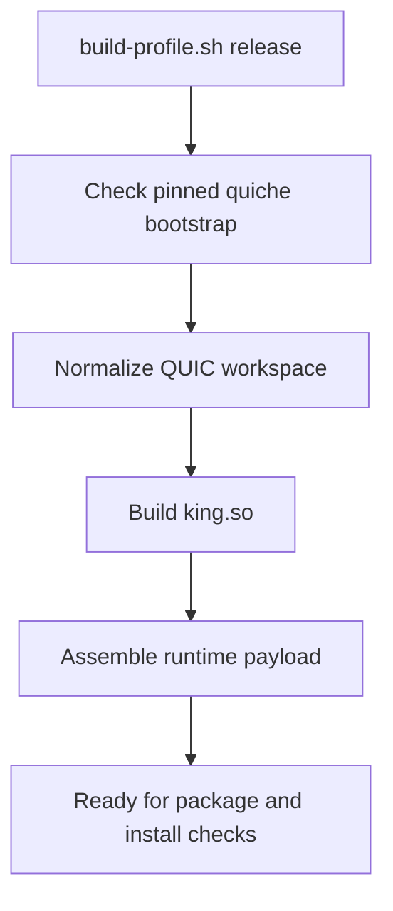
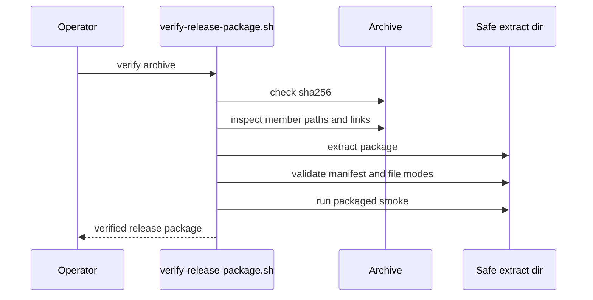
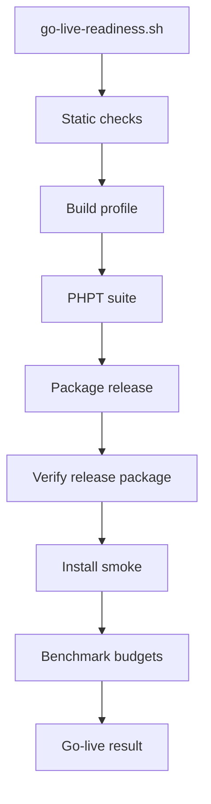

# Operations and Release

This chapter explains how King is built, verified, packaged, installed, and
released. It is written for the people who have to take the code from a clean
checkout to a trusted artifact that can be installed on a host or shipped in a
container image.

If you are new to release engineering, it helps to frame the problem clearly.
The job is not only to compile `king.so`. The job is to prove that the
extension can be built from a pinned dependency set, that the resulting module
matches its documented API, that the release package is internally consistent,
that it installs cleanly across the supported PHP versions, and that the full
quality gates still hold after packaging.

That is why the public release entrypoints live in `infra/scripts/`. Operators,
CI, and docs use the `infra/` layer as the stable toolchain surface.

```mermaid
flowchart LR
    A[Clean checkout] --> B[Static checks]
    B --> C[Build extension]
    C --> D[Full PHPT suite]
    D --> E[Release profile build]
    E --> F[Package release artifact]
    F --> G[Verify archive and manifest]
    G --> H[Install matrix]
    H --> I[Container smoke matrix]
    I --> J[Benchmark and go-live gate]
    J --> K[Publishable release]
```



The build is only one stage in that chain. A release is considered ready only
when every later stage agrees with the build.

## What This Chapter Covers

This chapter follows the same order a release engineer would use in practice.
It starts with local guard rails, moves into compiled output, then into test
coverage, then into packaging, then into installation and container checks, and
finally into the benchmark and go-live gates that answer the question, “Is this
artifact safe to ship?”

When you want the exact package contents and the archive verification story, see
the dedicated example guide
[`19-release-package-verification`](./19-release-package-verification/README.md).
This chapter stays focused on the full operational workflow.

## The Release Toolchain In Plain Language

King ships with a small number of scripts that each answer a different release
question.

Some scripts ask whether the source tree is internally consistent. Some ask
whether the extension still passes its runtime contract tests. Some ask whether
the package that would be handed to a user is reproducible and safe to install.
Some ask whether the artifact survives installation on multiple PHP versions.

Thinking of the scripts in terms of their questions makes the toolchain much
easier to remember.

| Script | The question it answers |
| --- | --- |
| `./infra/scripts/static-checks.sh` | Is the source tree structurally sane before we build anything? |
| `./infra/scripts/check-stub-parity.sh` | Does the declared public API still match the compiled extension surface? |
| `./infra/scripts/audit-runtime-surface.sh` | Does the runtime or documentation surface drift from the expected contract? |
| `./infra/scripts/check-include-layout.sh` | Are project-owned headers still under `extension/include/` where they belong? |
| `./infra/scripts/check-php-support-matrix.sh` | Do CI and matrix scripts still claim the supported PHP versions honestly? |
| `./infra/scripts/check-quiche-bootstrap.sh` | Is the QUIC dependency bootstrap still pinned and deterministic? |
| `./infra/scripts/build-extension.sh` | Can the extension compile in the ordinary development path? |
| `./infra/scripts/build-profile.sh release` | Can the full release profile build from the pinned dependency set? |
| `./infra/scripts/test-extension.sh` | Does the PHPT runtime contract still pass? |
| `./infra/scripts/package-release.sh` | Can we assemble a reproducible release archive? |
| `./infra/scripts/verify-release-package.sh` | Is the release archive internally consistent and safe to trust? |
| `./infra/scripts/install-package-matrix.sh` | Does the packaged release install on every supported PHP version? |
| `./infra/scripts/container-smoke-matrix.sh` | Do the published runtime containers build and pass the common smoke checks? |
| `./infra/scripts/inventory-release-cves.sh` | Can we produce a deterministic CVE inventory for release container images and targeted CVEs? |
| `./infra/scripts/check-release-cve-gate.sh` | Do the required release CVEs resolve to zero affected packages on the runtime image? |
| `./infra/scripts/php-version-docker-matrix.sh` | Do the repo build, PHPT suite, runtime container smoke, and demo network probe stay green across every supported PHP version? |
| `./infra/scripts/go-live-readiness.sh` | Does the complete release bar pass in one operator-facing command? |

The scripts are meant to be composed. A release run does not pick one of them.
It moves through them in order.

## Start With The Fast Local Gates

The fastest useful habit is to run the structural gates before asking the
compiler or the test suite to do expensive work.

```bash
./infra/scripts/static-checks.sh
```

`static-checks.sh` is the front door. It runs the structural checks that are
cheap, deterministic, and able to catch mistakes before the build step begins.
That includes the stub-parity gate, the include-layout gate, the PHP support
matrix gate, and the pinned QUIC bootstrap gate.

If you want to run the most important structural gates one by one, the
following commands are the usual manual path:

```bash
./infra/scripts/check-stub-parity.sh
./infra/scripts/audit-runtime-surface.sh
./infra/scripts/check-include-layout.sh
./infra/scripts/check-php-support-matrix.sh
./infra/scripts/check-quiche-bootstrap.sh
```

Each one answers a slightly different question. Stub parity checks that the
declared PHP surface still matches the compiled export set. The runtime-surface
audit checks that the contract being claimed in code and documentation is still
coherent. The include-layout gate prevents header drift. The PHP matrix gate
prevents silent support shrinkage. The QUIC bootstrap gate prevents release
builds from depending on an unlocked or drifting dependency graph.

## Build The Development Extension

The normal development build path is intentionally simple.

```bash
./infra/scripts/build-extension.sh
```

This script is the answer to the question, “Can I build the module in the
current checkout with the ordinary local development flow?” It is the right
command to use when you are iterating on source code and want the extension
rebuilt quickly.

The output of this path is the compiled module under `extension/modules/` and
the usual build products produced by the PHP extension toolchain.

## Build The Release Profile

When you are preparing a release, the development build is not enough. The
release profile exists because shipping King involves more than compiling the
module. The release profile normalizes the QUIC dependency workspace, builds
the module with the release-oriented settings, and assembles the runtime files
used later by package verification and install smoke.

```bash
./infra/scripts/build-profile.sh release
```

This is the build path that matters for release engineering. It is the command
that turns a source checkout into the pinned release workspace used by the rest
of the shipping pipeline.



If the release profile does not build cleanly, there is no release, even if a
developer build happened to succeed.

## Run The Full PHPT Runtime Contract

Once the extension builds, the next question is whether the runtime still
behaves the way the documented public surface says it behaves. That is the job
of the PHPT suite.

```bash
./infra/scripts/test-extension.sh
```

The full suite is the normal release gate. When you are working on one area,
you can still run a targeted subset with explicit test files:

```bash
./infra/scripts/test-extension.sh tests/190-http3-request-send-roundtrip.phpt
```

Targeted runs are useful for iteration. Full runs are what matter for release.
The suite is not only a collection of feature tests. It is the executable
definition of the King contract across transports, storage, telemetry, control
plane, and operations.

## Package The Release Artifact

Packaging takes the release-profile output and turns it into the artifact a
user or operator can actually install.

```bash
./infra/scripts/package-release.sh --verify-reproducible --output-dir ../dist
```

The package step builds the archive, manifest, checksums, runtime files, and
verification metadata. The `--verify-reproducible` flag matters because it asks
the packager to prove that the archive can be reproduced consistently rather
than just emitted once.

The `dist/` directory then becomes the staging area for the next steps.

## Verify The Release Package

An archive is not trusted merely because it exists. The verification script
answers whether the archive is internally consistent and shaped like a real King
release rather than an arbitrary tarball.

```bash
./infra/scripts/verify-release-package.sh ../dist/king-<version>.tar.gz
```

This script checks the archive checksum, validates the manifest, extracts the
package safely, and runs the packaged smoke path from inside the archive. It is
the closest thing to asking, “If someone receives this release package without
the source tree, does the package still verify as a coherent King release?”



The difference between packaging and verification is important. Packaging
creates the artifact. Verification proves the artifact stands on its own.

## Run The Install Matrix

A release archive is not ready until it proves that it installs on every
supported PHP version. That is the role of the install matrix.

```bash
./infra/scripts/install-package-matrix.sh \
  --archive ../dist/king-<version>.tar.gz \
  --php-bins php8.1,php8.2,php8.3,php8.4,php8.5
```

This script installs the packaged module into each target PHP environment and
then runs the common install smoke path. It is the place where ABI mismatches,
misplaced runtime assets, or version-specific installation regressions become
visible.

The install matrix is especially important because the build machine and the
user’s target machine are often not the same thing. A release is only credible
if it survives installation across the supported version range.

## Run The Container Smoke Matrix

King also ships through containerized runtime paths, so the container build is
not a cosmetic extra. It is part of the release contract.

```bash
./infra/scripts/container-smoke-matrix.sh --php-versions 8.1,8.2,8.3,8.4,8.5
```

This script builds the published runtime container variants and runs the common
install smoke inside them. The point is not just to build images. The point is
to prove that the image a user would actually run still contains a working King
runtime with the expected assets in place.

## Use The Common Runtime Install Smoke

Both the package-install matrix and the container-smoke matrix converge on the
same runtime smoke path:

`infra/scripts/runtime-install-smoke.php`

That shared smoke path matters because it keeps the definition of “a working
installed runtime” the same across host and container environments. When a host
install passes and a container install passes, they are being judged by the
same operational expectation.

## Benchmarking And Budget Gates

Performance is part of the release bar, not a separate hobby. The benchmark
tooling exists to answer whether the current build still lives within the
expected performance budgets.

The canonical benchmark runner lives under `benchmarks/`:

```bash
cd benchmarks
./run-canonical.sh --json
```

The canonical budget files live under `benchmarks/budgets/`. These files tell
the release tooling what budget a benchmark is allowed to consume before the
result is considered a regression rather than normal variation.

Benchmarks matter most when transport, storage, orchestration, or telemetry
work has changed. A release that compiles and passes tests but silently becomes
too slow is still a broken release.

## Run The Go-Live Gate

The go-live gate exists for the question every release engineer eventually has
to answer: “Can I run one command that performs the whole release-readiness
check in the order that matters?”

```bash
./infra/scripts/go-live-readiness.sh \
  --output-dir ../dist \
  --benchmark-samples 3 \
  --benchmark-budget-file ../benchmarks/budgets/canonical-ci.json
```

This script ties together the structural gates, the build, the PHPT suite, the
package verification path, the install smoke path, and the benchmark budgets.
It is the closest thing to a final operational verdict.



This script does not replace understanding the individual steps. It exists so
the release engineer can run the whole chain in one stable, reviewable command.

## Continuous Integration

The GitHub workflows apply the same logic in automation. The CI pipeline is not
supposed to invent a different definition of quality. Its job is to run the
same release questions without manual intervention.

In practice, the workflows cover the following responsibilities:

The main CI workflow builds the extension, runs the full PHPT suite, runs the
install checks, and enforces the benchmark budget path. The Docker workflow
builds and validates the runtime container variants. The package and release
steps rely on the same scripts that operators can run locally.

This matters because it keeps local release work and CI behavior aligned. If a
release path only works in GitHub and not on a release engineer’s machine, it
is not a trustworthy path.

Published GHCR Docker images are intentionally a mainline-only follow-up. Branch
and pull-request runs stop at package and container verification; the actual
Docker publish flow runs only after a successful canonical baseline on `main`.

Release publication follows the canonical release gate on the mainline. There
is no parallel ad-hoc publish path that bypasses the same validation and
packaging flow used everywhere else in this document.

## A Practical Release Sequence

A careful release engineer usually works through the toolchain in a predictable
order.

First, run the structural gates so obvious drift is caught quickly. Then build
the release profile, because later steps depend on that output. Then run the
full PHPT suite. After that, package the artifact and verify the package
itself. Once the archive verifies, run the install matrix and container smoke
matrix so the packaged release proves it works in the environments it claims to
support. Finally, run the go-live gate so the benchmark and packaging logic are
checked together.

In command form, that usually looks like this:

```bash
./infra/scripts/static-checks.sh
./infra/scripts/build-profile.sh release
./infra/scripts/test-extension.sh
./infra/scripts/package-release.sh --verify-reproducible --output-dir ../dist
./infra/scripts/verify-release-package.sh ../dist/king-<version>.tar.gz
./infra/scripts/install-package-matrix.sh --archive ../dist/king-<version>.tar.gz --php-bins php8.1,php8.2,php8.3,php8.4,php8.5
./infra/scripts/container-smoke-matrix.sh --php-versions 8.1,8.2,8.3,8.4,8.5
./infra/scripts/inventory-release-cves.sh --images intelligentintern/king:<version> --output ../dist/release-cve-inventory.json
./infra/scripts/check-release-cve-gate.sh --inventory ../dist/release-cve-inventory.json
./infra/scripts/go-live-readiness.sh --output-dir ../dist --benchmark-budget-file ../benchmarks/budgets/canonical-ci.json
```

That sequence is longer than a one-command build because a release is larger
than a build.

## When To Use Which Script

When you are developing, `build-extension.sh` and targeted PHPT runs are the
normal fast loop. When you are preparing a release, `build-profile.sh release`
becomes the build that matters. When you need a final answer, `go-live-readiness.sh`
is the operator-facing summary gate. When you need to explain why a release is
safe to hand to someone else, the package verification and install matrices are
the most important evidence.

The scripts are most useful when they are treated as named decisions rather
than as a bag of commands. Each one exists because a release engineer has to
answer a concrete question, and together they turn the answer into a repeatable
release process.
