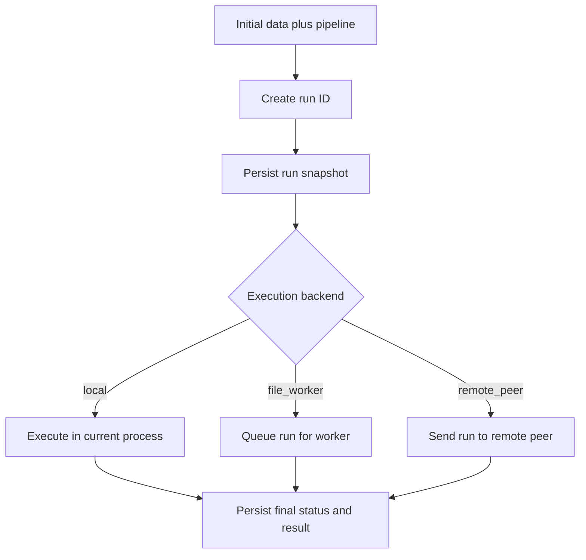
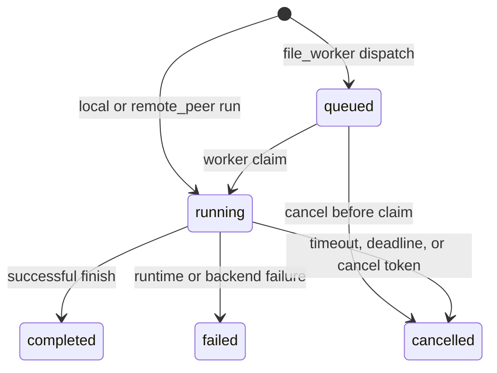
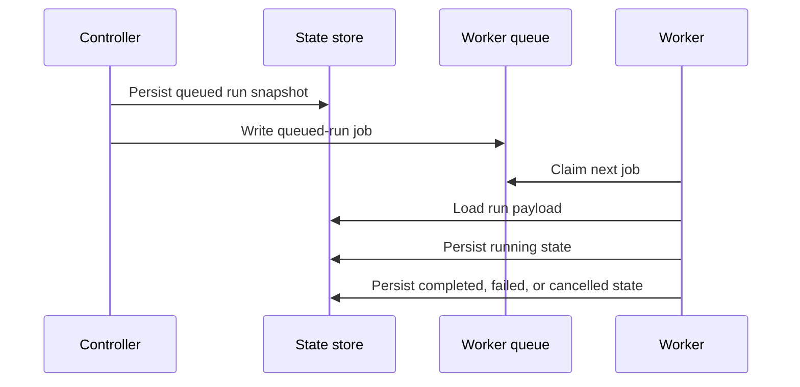
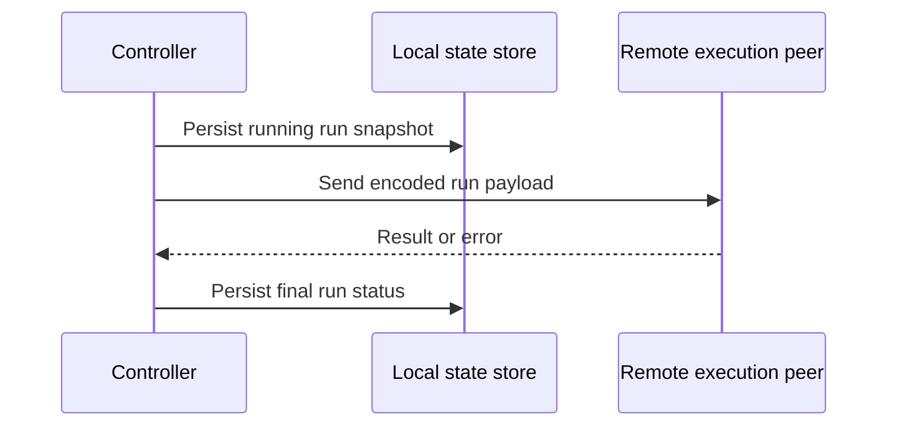

# Pipeline Orchestrator

The pipeline orchestrator is the King subsystem that turns multi-step work into
named runs with explicit lifecycle state, configurable execution backends, and
durable run history.

If you are reading this as a beginner, the easiest way to think about the
orchestrator is this: a normal function call does some work and returns. An
orchestrated run is different. It has a run ID, a stored snapshot, a backend
that actually executes it, a status you can inspect later, and a place in the
system's operational history.

That difference matters because large workloads do not stop mattering after
the line of code that started them has returned. You often need to know which
run was started, whether it is queued or running, whether it completed or
failed, whether it was cancelled, and which backend handled it.

If the workload is a userland dataflow or ETL system, read
[Flow PHP and ETL on King](./flow-php-etl.md) alongside this chapter. The
orchestrator supplies execution, durability, recovery, and control-plane
boundaries; it does not redefine row, dataset, or transform semantics inside
the C core.

## Start With The Problem

Application code often grows from single calls into workflows. One request may
need to validate input, stage data, call a model, summarize a result, persist a
report, and notify another system. At first, teams usually keep this as nested
control flow. That works until they need one of four things.

The first thing is visibility. Someone asks which run failed and why. The second
thing is scheduling. Work needs to move from the request path into a worker.
The third thing is control. A run needs a timeout, a deadline, or cancellation.
The fourth thing is topology. The work should stay local, be queued to a
same-host worker, or be sent to a remote execution peer.

The orchestrator exists because these needs keep appearing together. King
therefore treats them as one subsystem rather than as a pile of unrelated
helpers.

## The Main Concepts

The orchestrator chapter uses a few recurring words.

A tool is a named capability stored in the tool registry. A pipeline is an
ordered list of steps. A run is one concrete execution of an initial input plus
a pipeline definition. A run snapshot is the persisted record that lets the
system inspect that run later. A controller is the side that starts or dispatches
the work. A worker is the side that claims queued work and executes it.

Once these words are clear, the rest of the subsystem becomes much easier to
follow.

## What The Orchestrator Stores

The orchestrator is not only an executor. It is also a state store for workflow
history.

When a run begins, King persists a snapshot of the run ID, timing fields,
status, initial data, pipeline definition, execution options, result when one
exists, and error information when a failure occurs. The tool registry and
logging configuration are also persisted so a restarted controller or worker can
recover the current orchestrator state instead of starting from an empty memory
image.

Run snapshots now also keep the orchestrator's explicit failure classification
instead of collapsing everything into one generic error string. When a run
fails or is cancelled, `king_pipeline_orchestrator_get_run()` preserves whether
the terminal condition was `validation`, `timeout`, `backend`,
`remote_transport`, or `cancelled`, whether that classification is step-scoped
or run-scoped, which backend owned the failure boundary, and which step index
and tool were implicated when that is known.

The same snapshot also carries a step-by-step status view. That matters because
operational questions are usually not only "did the run fail?" but also "which
step failed, which steps already completed, and is the remainder still pending
or now indeterminate because the failure happened on a remote boundary?"

Failed or cancelled multi-step runs now also expose an explicit compensation
contract instead of leaving rollback to guesswork. The run snapshot carries the
top-level `compensation_policy`, and the nested `compensation` block makes the
current contract concrete: compensation is still caller-managed, but the
runtime names the reverse-completed-step strategy, whether compensation is
required for the current terminal state, and which completed steps are pending
compensation in reverse order. Each step snapshot also carries its own
`compensation_status`, so a caller can tell the difference between a completed
step that now needs compensation, a completed step that no longer needs it
because the run ultimately succeeded, and a step for which compensation does
not apply.

Distributed runs also keep their operational breadcrumbs inside the snapshot
instead of only in logs. `king_pipeline_orchestrator_get_run()` now exposes the
run's `execution_backend`, `topology_scope`, `retry_policy`,
`idempotency_policy`, `compensation_policy`, and a
`distributed_observability` block that records queue phase, enqueue time, claim
count, claiming worker PID, recovery count and reason, remote-attempt count,
and the last relevant timestamps for those events. Each step snapshot also
carries its effective backend, topology scope, and compensation status, which
makes remote-boundary outcomes and post-failure cleanup duties visible at step
granularity rather than only at the top level.

Run snapshots now also carry a first-class `telemetry_adapter` block instead of
leaving pipeline identity to collector-side guesswork. That adapter records the
contract name, the run-level `attempt_identity`, optional `retry_identity`,
counted partition and batch usage, and the stable `failure_identity` for a
failed or cancelled attempt. Step snapshots mirror the same surface with their
step-local `partition_id`, `batch_id`, and failed-step `failure_identity`, so a
caller can line up one persisted run snapshot with exported spans, logs, and
metrics after controller restart or worker recovery.

This is the key reason the orchestrator feels like a control-plane subsystem
instead of a convenience wrapper. The run is a system object with history.



The run is therefore visible both before and after execution. That is what
makes lookup, restart recovery, and operational inspection possible.

## The Tool Registry

The tool registry is the named catalog of capabilities a pipeline may refer to.
You register tools with `king_pipeline_orchestrator_register_tool()`. The
registry stores the tool name and its configuration snapshot so the orchestrator
can validate pipeline steps and recover the registry after restart.

This is important because pipelines should not refer to accidental strings. A
tool name is a declared runtime object. If a pipeline step names a tool that
does not exist in the registry, the orchestrator rejects that run instead of
pretending the step is valid.

The tool registry is also surfaced through system component info. The
orchestrator component reports how many tools are registered and exposes the
list of tool names in `registered_tools`. That makes the registry inspectable at
runtime instead of being hidden inside application code.

## Userland Tool Handlers

The public orchestrator contract now separates two things that are easy to blur
together if they are only discussed informally.

The first thing is the durable tool definition. That is what
`king_pipeline_orchestrator_register_tool()` stores today: a tool name plus a
configuration snapshot that pipelines and persisted run state can refer to
honestly across restart, file-worker claim, and remote-peer execution.

The second thing is the executable userland handler that application code wants
to run for that tool. That handler is not the same kind of state. It belongs to
the PHP process that currently owns execution. Controller memory, worker
memory, remote-peer memory, closure captures, object instances, resources, and
arbitrary userland callables are therefore not part of the current durable
orchestrator state contract.

That boundary is now part of the public documentation on purpose. King does not
claim that a registered tool definition already means a PHP callable was
serialized, persisted, or transported safely across process or host boundaries.
`king_pipeline_orchestrator_register_handler()` now binds an executable
userland handler to that tool-name identity inside the current PHP process, but
that binding is still non-durable runtime state. The handler-registration API
therefore keeps the stronger contract explicit:

- the durable run state persists tool names, tool config, pipeline data, and
  run metadata
- executable handlers are registered per process, not smuggled through
  persisted run state
- every controller, file-worker, and remote execution peer that may execute a
  step must register the handlers it intends to run
- unsupported non-rehydratable forms such as captured closures, opaque object
  graphs, or resource-backed callables must fail closed instead of being
  treated as durable
- missing handler registration must be visible as an explicit runtime failure,
  not hidden behind fake fallback behavior

The runtime contract is now narrower and more honest than "handlers work
everywhere" but stronger than "the API only exists on paper". The local
backend now consumes registered handlers for real step execution and persists
the latest local payload together with `completed_step_count` after each
completed local step. That lets `king_pipeline_orchestrator_resume_run()`
continue a persisted local `running` run from honest local progress instead of
rerunning already-completed local steps after controller restart or
running-snapshot recovery. The file-worker backend now does the same for
userland-backed queued runs after per-process re-registration: workers execute
the boundary-marked steps through the registered handlers, persist the latest
payload plus `completed_step_count` after each completed step, and let a
replacement worker continue from that honest persisted progress after worker
loss or restart. The remote-peer backend now consumes that same durable
boundary over the TCP host/port request: the controller sends only the
tool-name boundary plus durable tool configs, the remote execution peer must
bind its own handlers locally, a ready peer executes those boundary-marked
steps for real, and a peer without that process-local readiness fails closed
explicitly instead of pretending controller memory crossed the network.

Non-local userland-backed runs now persist the durable handler-reference
boundary they will need later too. When the dispatching or remote-calling
process had bound executable handlers for non-local tools, the persisted run
snapshot exposes this as `handler_boundary`, which currently carries only the
durable tool-name references plus step indexes for queued worker execution or
remote-peer replay. That boundary is deliberately narrower than executable
readiness:

- `handler_boundary` persists tool-name references only
- `handler_boundary` is durable across queue, restart, and snapshot reload
- `handler_boundary` does not persist PHP callback names, closures, object
  state, or controller memory
- later worker or remote-peer readiness must still be satisfied by per-process
  handler registration before execution begins
- each persisted run now also exposes `handler_readiness`, which reports whether
  the currently observed process can execute the required userland boundary
  and which tools are still missing for each queued or resumed claim
- ready workers now execute those boundary-marked steps and persist progress
  after each completed step for later recovery
- unready workers skip those queued or recovered runs before claim or recovery
  resume instead of failing late inside opaque worker execution
- ready remote peers now receive that same boundary plus durable tool configs
  over TCP and execute the marked steps through their own process-local
  handler bindings
- unready remote peers now fail closed explicitly instead of silently falling
  back to controller memory or topology downgrade

The local handler invocation contract is now explicit too. The callable
receives one context array with these top-level keys:

- `input`: the current step input payload
- `tool`: an array containing the durable `name` plus decoded durable `config`
- `run`: an array containing `run_id`, `attempt_number`,
  `execution_backend`, and `topology_scope`
- `step`: an array containing `index`, `tool_name`, and the full step
  `definition`

For compatibility with the first local slice, the top-level `run_id` alias is
still present too, but the structured `run` block is now the public contract.

The local result contract is explicit and fail-closed: the handler must return
one array containing key `output`, and `output` must itself be the next array
payload that should flow into the next step and persisted run state. Returning
a bare payload array, a scalar, or an array without `output` is now a runtime
contract violation instead of an implied shortcut.

## Handler Identity And Re-Registration

The exact public identity boundary is now explicit.

The durable orchestrator identity for executable userland work is the tool name
string that appears in the pipeline step and in the tool registry. That is the
only cross-process, cross-restart, and cross-host identifier the current public
contract is willing to treat as durable at the handler boundary.

Tool configuration is durable input to that tool identity, but it is not a
second executable-handler identity. Closure captures, object-instance state,
resource handles, and controller memory are not handler identity either. They
may influence a process-local registration call in the future, but they are not
part of the persisted orchestrator contract.

The practical rule is therefore simple: if a process may execute a step for
tool `X`, that process must register the executable handler for tool `X`
locally before execution starts. The orchestrator may persist the run, the tool
definition, and the step metadata, but executable handler readiness is still a
per-process obligation.

The required registration matrix is:

- local backend: the controller process that calls `run()` must register the
  handler for every tool it may execute locally
- file-worker backend: the controller may queue a run after registering the
  durable tool definition, but each worker process that may call
  `worker_run_next()` must register the executable handlers it may run; the
  queued userland-backed run now persists only the durable tool-name boundary
  needed to check that readiness later, ready workers execute those marked
  steps and persist progress after each completed step, and unready workers
  skip that run before claim or recovery resume
- local restart continuation: the restarted controller process must re-register
  the executable handlers before `resume_run()`
- file-worker restart continuation: any restarted replacement worker must
  re-register the executable handlers before claiming queued or recovered work
- remote-peer backend: the remote execution peer must register the executable
  handlers it may run; controller-side registration only persists the durable
  boundary and tool-config snapshot that `run()` or `resume_run()` later send
  to the peer, and does not satisfy remote execution readiness by itself
- remote-peer return after loss: the returning peer must re-register the
  executable handlers before it can execute resumed or new remote work again;
  the restarted controller resends only the durable boundary and tool config,
  not the old PHP callable state

This means the handler-registration API cannot treat "I registered this once
somewhere in the system" as a sufficient readiness claim. Readiness must be
true in the exact process that will execute the step.

The same rule also defines the honest fail-closed line. If a run, worker, or
remote peer reaches a step whose tool name has no executable handler bound in
that exact process, King must treat that as missing execution readiness. It
must not silently borrow controller memory, infer closure state from persisted
arrays, or pretend a previous process registration still exists after restart.

## Unsupported Non-Rehydratable Handler Forms

The fail-closed boundary now needs no guesswork.

The following forms are outside the durable public handler contract and must be
treated as unsupported for cross-restart, file-worker, or remote-peer
execution:

- closures with captured state
- object instances whose executable meaning depends on constructor-time or
  request-time mutable memory
- resources and extension handles
- handlers that depend on open sockets, streams, temporary files, or live
  process-local descriptors
- handlers whose executable identity depends on unserialized controller memory
  instead of the durable tool-name string
- handlers that require implicit global bootstrap side effects which a
  replacement process cannot verify or reproduce explicitly

The important point is not that such forms are "bad PHP". The point is that the
orchestrator must not misrepresent them as durable execution state once work can
cross queue, restart, or host boundaries.

That gives the handler-registration API an explicit fail-closed contract:

- reject unsupported handler forms at registration time when the runtime can
  tell they are non-rehydratable
- otherwise refuse execution at claim or resume time when the exact process
  cannot prove handler readiness honestly
- classify the result as missing or unsupported handler readiness, not as a
  successful durable rehydration
- never synthesize fallback execution by reviving stale controller memory,
  serializing closure internals informally, or silently downgrading the backend
  to hide the unsupported form

This is a contract-strengthening rule, not a convenience restriction. The
orchestrator is preserving honest restart and topology semantics by refusing to
pretend that non-durable PHP execution state became durable just because a run
was persisted.

## Userland Restart Duties

The runtime contract is role-based. The same process that executes a step must
own a local executable binding for the step tool before that process can execute
it.

Use this practical checklist for every userland-backed path:

- A controller that runs userland-backed steps on the local backend must call
  `king_pipeline_orchestrator_register_tool()` for each required tool, then
  `king_pipeline_orchestrator_register_handler()` in the same process for the
  same tool names before `run()` or `king_pipeline_orchestrator_resume_run()`.
- A controller that queues userland-backed steps onto `file_worker` must still
  register the same tool handlers before `dispatch()` so the persisted
  `handler_boundary` can honestly name which steps require worker-side
  readiness later.
- A file-worker process that may run queued work must call
  `king_pipeline_orchestrator_register_tool()` and re-register the exact same
  userland handlers in that worker process before calling
  `king_pipeline_orchestrator_worker_run_next()` and before claiming recovered
  jobs.
- A remote-peer process that receives userland-backed execution must register tool
  definitions and executable handlers locally before accepting remote work.
- Controller-side handler registration does not satisfy worker or peer execution.
  On any restart or replacement, each execution process (`controller`,
  `file_worker`, `remote_peer`) must repeat the local binding step before
  resuming or claiming work.
- If a process cannot complete that checklist, it must fail closed as
  `missing_handler` (or unsupported readiness) instead of pretending callable
  state still exists.

The explicit consequence is this:

- `dispatch()` stores durable `handler_boundary` state and a handler registry
  snapshot so restart and restart/recovery can discover what is required.
- `worker_run_next()` and `resume_run()` re-validate that the current process has
  re-registered the required tool handlers before execution starts.
- unsupported handler forms never become durable state and are rejected by form or
  by process-local readiness at claim/resume boundaries.

The repo-local Flow PHP execution helper under
`userland/flow-php/src/ExecutionBackend.php` mirrors this split directly. It
surfaces backend capabilities and keeps `continueRun()` separate from
`claimNext()` so userland ETL code does not accidentally collapse local,
file-worker, and remote-peer control paths into one inaccurate abstraction.

## What A Pipeline Looks Like

A pipeline is an ordered array of step definitions. At minimum, each step names
the tool that should be used for that step. Steps may also carry scheduling
options such as `delay_ms`, which lets the controller or worker delay the start
of that step while still honoring timeout, deadline, and cancellation checks.

The important idea is that the pipeline is data, not hidden control flow.
Because the pipeline is data, King can validate it, persist it, queue it,
rehydrate it, send it to a remote peer, and inspect it after the fact.

That is one of the biggest practical differences between an orchestrated
workflow and in-process callback chaining. In King, workflow data crosses
durable boundaries while executable handlers are re-registered on the process
that owns execution (the app-worker boundary).

## Run Lifecycle

Every orchestrator run moves through an explicit lifecycle. A run begins in a
persisted initial state. After that, its path depends on the selected execution
backend. A local run moves into `running` immediately. A file-worker run begins
as `queued` until a worker claims it. A remote-peer run is persisted locally but
executed by the configured remote worker peer. When execution finishes, the run
becomes `completed`, `failed`, or `cancelled`.



This lifecycle is what `king_pipeline_orchestrator_get_run()` reads back. The
orchestrator is therefore something you can ask questions of after the original
call site is long gone.

## Execution Backends

The orchestrator does not guess where work should run. The execution backend is
explicit configuration. That is a good thing because topology decisions should
be visible and reviewable.

King currently treats the execution backend as part of the component contract.
System component info exposes both `execution_backend` and `topology_scope` so
you can see whether the orchestrator is operating as `local`, `file_worker`, or
`remote_peer`, and whether the effective topology is
`local_in_process`, `same_host_file_worker`, or
`tcp_host_port_execution_peer`.

### Local Execution

Local execution is the simplest path. The controller starts the run and the
current process executes it directly. This is the best fit when the work is
short, the request path is allowed to own the execution, and you want the least
topology overhead.

The scheduler policy for this mode is `in_process_linear`. In ordinary language,
that means the controller process owns the run directly and progresses it in the
same local runtime.

### File-Worker Execution

File-worker execution is the queued same-host path. The controller persists the
run, writes a queue job into the configured worker queue directory, and returns
the queued run snapshot. A worker process later calls
`king_pipeline_orchestrator_worker_run_next()` to claim the next runnable job,
load the persisted run payload, and execute it.

This mode matters when the request path should not do the work itself. The run
can be accepted quickly, queued durably on the host, and then claimed by a
worker process. The scheduler policy exposed by component info in this mode is
`claimed_recovery_then_fifo_run_id`. That means the worker first prefers runs
that were already claimed but need recovery, and otherwise processes queued runs
in FIFO order by run ID.

The worker does not trust queue filenames alone. When it claims a job, it opens
the claimed entry as a nofollow regular file and discards unsafe path swaps
instead of following them. That matters because the file-worker queue is a real
filesystem boundary, not just a naming convention.



File-worker mode also supports queued-run cancellation through
`king_pipeline_orchestrator_cancel_run()`. That function is intentionally tied
to the file-worker backend because queued same-host work has a concrete local
claim and cancel path.

### Remote-Peer Execution

Remote-peer execution keeps the controller-side run history local while sending
the actual execution request to a remote TCP host and port. This is useful when
the control plane lives in one process or host but the execution capacity lives
somewhere else.

The controller still persists the run snapshot locally before sending the remote
execution payload. That matters because the run remains visible in local system
history even though the work itself is performed remotely.

The current proof for this backend is no longer limited to one remote process
that handles the whole run in one place. King now also has an end-to-end
verification slice where one remote execution peer distributes the pipeline's
steps across multiple worker processes behind that peer boundary while the
controller-side run snapshot still remains stable. The tree now also carries a
shared repo-wide multi-host namespace harness for host-bound peers over a
non-loopback path, but the orchestrator backend itself is still verified here
through the current remote-peer execution boundary rather than a broader
distributed orchestrator topology. That is still stronger than a
single-worker-only remote story.



This mode is the bridge between the orchestrator and the wider control plane. A
controller can own the run history while execution happens on a different node.
The remote result is decoded as a plain value tree. Network payloads that try
to materialize PHP objects are rejected instead of being treated as executable
runtime state.

## Timeout, Deadline, Concurrency, And Cancellation

The orchestrator has to do more than execute steps. It has to protect the run
from taking too long, from exceeding local policy, or from continuing after the
caller has withdrawn interest.

That is what execution control options are for.

`timeout_ms` and `overall_timeout_ms` define how much runtime budget one run is
allowed to consume. `deadline_ms` expresses an absolute time boundary.
`max_concurrency` lets the caller request a concurrency ceiling, but it still
must stay within the configured orchestrator concurrency default. `cancel`
accepts a `King\CancelToken` so the caller can actively signal cancellation.

These controls matter because orchestration is rarely only about sequencing. It
is also about making sure runs respect operational policy.

## Persistence And Recovery

A run snapshot is only useful if it survives the process that created it. That
is why the orchestrator has an explicit `orchestrator_state_path`.

The state path is system-owned. It is intentionally not a normal userland
runtime override. The reason is simple. Persisted orchestrator state is part of
the control plane and should be governed at deployment level, not rewritten by
arbitrary application input.

When the orchestrator starts, it can recover tool registry state, logging
configuration, and run snapshots from this persisted state. Component info
surfaces whether the orchestrator was `recovered_from_state`, which gives
operators a direct way to confirm that restart recovery occurred.

The persisted run snapshot now keeps more than status and payloads. Queue
claims, claimed-run recovery, explicit resume-driven recovery, and remote-peer
attempts all survive restart in the stored `distributed_observability` block.
That means an operator can tell whether a file-worker run was only enqueued,
claimed and abandoned by one worker, recovered by another worker, or resumed
after controller loss without reconstructing that story from external logs.

Recovery is not limited to inspection. A controller that restarts on the local
or `remote_peer` backends can call
`king_pipeline_orchestrator_resume_run()` for a persisted `running` run and let
the orchestrator continue that run from the stored initial data, pipeline, and
execution options. This is run-level continuation, not mid-step checkpointing.
If the interrupted run had already crossed a remote boundary, the
`caller_managed` idempotency policy still applies, which means the caller owns
the decision to replay that run. The compensation contract is explicit now too:
if a run failed after completing earlier steps, the caller must compensate the
listed completed steps in reverse order before replaying or replacing that run.
That replay contract is now verified not only for controller-process restart,
but also for the broader host-loss case where the controller and remote peer
both disappear and the peer later returns on the same persisted host/port
route. The tree now also carries one reusable failover harness that proves
controller loss, file-worker loss, and remote-peer return through the same
persisted-state contract instead of relying on one-off scenario-specific
recovery tests each time.

## Logging Configuration

The orchestrator has its own logging snapshot, configured with
`king_pipeline_orchestrator_configure_logging()`. This lets the control plane
persist the logging policy of orchestrated runs separately from the rest of the
application.

This is useful because orchestrated work often lives longer than the request
that started it. Logging for the orchestrator therefore needs to remain stable
across controller and worker boundaries.

## Reading Component Info

The orchestrator exposes a rich component snapshot through
`king_system_get_component_info('pipeline_orchestrator')`.

This snapshot includes timeout defaults, recursion depth, concurrency default,
distributed tracing policy, execution backend, topology scope, scheduler
policy, retry policy, idempotency policy, compensation policy, state path,
worker queue path, remote host and port, recovery status, tool count, run
history count, active run count, queued run count, last run ID, last run
status, and the list of registered tools.

It now also names the public telemetry adapter surface directly through
`telemetry_adapter_contract` and `telemetry_identity_surface`. That makes it
explicit that pipeline identity is not only visible in OTLP exports; it is also
claimed through `king_pipeline_orchestrator_get_run()` and the component
snapshot itself.

The component snapshot also exposes a nested `distributed_observability` block
and `active_handler_contract` block with process-local registration-state
metadata, including scope, registered handler count, active handler names, and
whether that process-local boundary is currently required.
with claimed-run count, recovered-run count, remote-attempted-run count, and
the last run IDs and recovery reason seen through those paths. Together with
the per-run snapshot, this gives both fleet-level and run-level visibility into
distributed execution outcomes.

This matters because the orchestrator is not only a callable runtime. It is an
inspectable operational subsystem.

## Configuring The Orchestrator

The orchestrator shares a configuration family with MCP because both belong to
the control plane. The main orchestrator settings are easy to understand in
plain language.

`orchestrator_default_pipeline_timeout_ms` sets the default runtime budget for a
run. `orchestrator_max_recursion_depth` defines the maximum allowed recursion
depth for orchestrated evaluation. `orchestrator_loop_concurrency_default`
defines the default local concurrency ceiling. 
`orchestrator_enable_distributed_tracing` turns orchestrator trace correlation
on or off. `orchestrator_execution_backend` selects `local`, `file_worker`, or
`remote_peer`. `orchestrator_worker_queue_path` is the queue directory for the
file-worker backend. `orchestrator_remote_host` and
`orchestrator_remote_port` select the remote execution peer. 
`king.orchestrator_state_path` defines where persisted orchestrator state lives.

When distributed tracing stays enabled, the orchestrator now does more than
copy a caller-owned `trace_id` string into run metadata. `run()` and
`dispatch()` persist the live caller span's distributed parent snapshot with the
run, and `resume_run()` plus `worker_run_next()` reopen that lineage through an
internal `pipeline-orchestrator-boundary` span. The resumed worker or process
therefore stays on the original controller trace instead of silently forking a
new local root when work crosses a restart or file-worker boundary.

The runtime now also emits a concrete pipeline telemetry adapter on top of that
trace lineage. Each execution attempt exports `pipeline-orchestrator-run` and
`pipeline-orchestrator-step` spans, bounded pipeline counters, and a structured
pipeline failure log when work terminates unsuccessfully. The exported
attributes stay aligned with the persisted run snapshot: run ID, attempt
identity, retry identity for recovered attempts, step-local partition and batch
identity, and the same stable `failure_identity` that the run snapshot stores.

The following runtime configuration example shows the general shape for a remote
controller.

```php
<?php

$config = new King\Config([
    'orchestrator.orchestrator_default_pipeline_timeout_ms' => 120000,
    'orchestrator.orchestrator_loop_concurrency_default' => 50,
    'orchestrator.orchestrator_execution_backend' => 'remote_peer',
    'orchestrator.orchestrator_remote_host' => '10.0.0.25',
    'orchestrator.orchestrator_remote_port' => 9444,
]);
```

The system INI layer is where deployment-owned paths and backend defaults are
normally set.

```ini
king.orchestrator_default_pipeline_timeout_ms=120000
king.orchestrator_max_recursion_depth=10
king.orchestrator_loop_concurrency_default=50
king.orchestrator_enable_distributed_tracing=1
king.orchestrator_execution_backend=file_worker
king.orchestrator_worker_queue_path=/var/lib/king/orchestrator-queue
king.orchestrator_state_path=/var/lib/king/orchestrator/state.bin
```

The full key-by-key description is covered in
[Runtime Configuration](./runtime-configuration.md) and
[System INI Reference](./system-ini-reference.md).

## Public API

This chapter covers the full public orchestrator API.

`king_pipeline_orchestrator_register_tool()` creates or replaces one named tool
definition in the active registry and persists the registry snapshot.

`king_pipeline_orchestrator_configure_logging()` persists the active
orchestrator logging snapshot.

`king_pipeline_orchestrator_run()` starts one run immediately on the configured
execution backend. In local mode the run executes in the current process. In
remote-peer mode the controller sends the run to the configured remote host and
port. In file-worker mode this direct path is intentionally unavailable because
queued execution should use dispatch instead. When local userland handlers are
registered for the step tool names, the local backend executes those handlers
and persists the latest local payload after each completed step so restart-time
continuation can resume from the last completed local step honestly.

`king_pipeline_orchestrator_dispatch()` persists one run in queued state and
places it onto the configured file-worker queue.

`king_pipeline_orchestrator_worker_run_next()` is the worker-side claim and
execute entry point. It claims the next runnable queued job, resumes the stored
run payload, and returns `false` when the queue is empty.

`king_pipeline_orchestrator_resume_run()` continues one persisted `running` run
after controller restart on the local or `remote_peer` backends. This function
is intentionally separate from `worker_run_next()` because the file-worker
backend already has its own claim and recovery path. On the local backend, a
restarted controller must re-register the relevant handlers first; continuation
then resumes from the persisted local payload and `completed_step_count`
instead of replaying already-completed local steps.

`king_pipeline_orchestrator_get_run()` reads one persisted run snapshot by run
ID. The returned snapshot includes the persisted top-level run state plus a
structured `error_classification` block, per-step `steps` status entries, and
the run's distributed observability fields so callers can distinguish
validation, runtime, timeout, backend, remote-transport, cancelled, and
missing-handler failures, see whether the failure honestly belongs to one step
or to the run as a whole, see which backend and topology owned each step, and
explain queue, claim, recovery, and remote-attempt history without inferring it
from exception strings. For userland-backed steps this classification now stays
explicit across local, file-worker, and remote-peer execution: handler input or
precondition failures classify as `validation`, handler-thrown general
execution failures classify as `runtime`, explicit timeout failures classify as
`timeout`, control-path stop conditions classify as run-scope `cancelled`,
backend/runtime preparation faults classify as `backend`, and absent required
process-local handler bindings classify as `missing_handler`.

`king_pipeline_orchestrator_cancel_run()` requests cancellation for a persisted
queued run on the file-worker backend.

## Common Questions

One common question is why `run()` and `dispatch()` are separate functions
instead of one function with hidden backend behavior. The answer is clarity.
Immediate execution and queue submission are different acts. Keeping them
separate makes the call site easier to read and the operational contract easier
to reason about.

Another common question is why run state is persisted locally even when the
backend is remote. The answer is that the controller still needs local run
history. A remote execution peer may do the work, but the controller should
still be able to answer which run was started, how it ended, and what the last
known status was.

A third common question is whether cancellation means the same thing in every
backend. It does not. A file-worker run has an explicit queued-run cancellation
path. A local or remote run uses timeout, deadline, and cancel-token execution
control during active execution.

## Related Chapters

If you want to understand the remote execution transport that the orchestrator
shares with the wider control plane, read [MCP](./mcp.md). If you want to
understand how service discovery and topology feed into controller placement,
read [Semantic DNS](./semantic-dns.md) and
[Router and Load Balancer](./router-and-load-balancer.md). If you want the full
configuration surface, read [Configuration Handbook](./configuration-handbook.md),
[Runtime Configuration](./runtime-configuration.md), and
[System INI Reference](./system-ini-reference.md).
