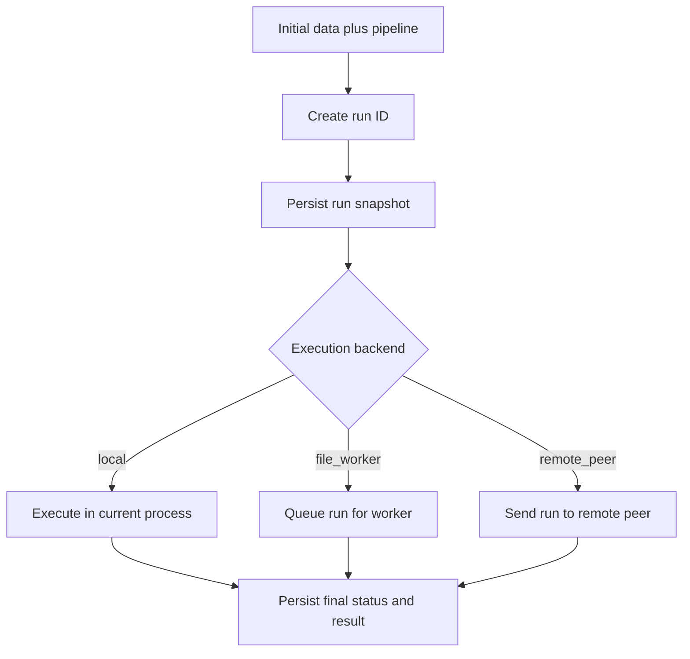
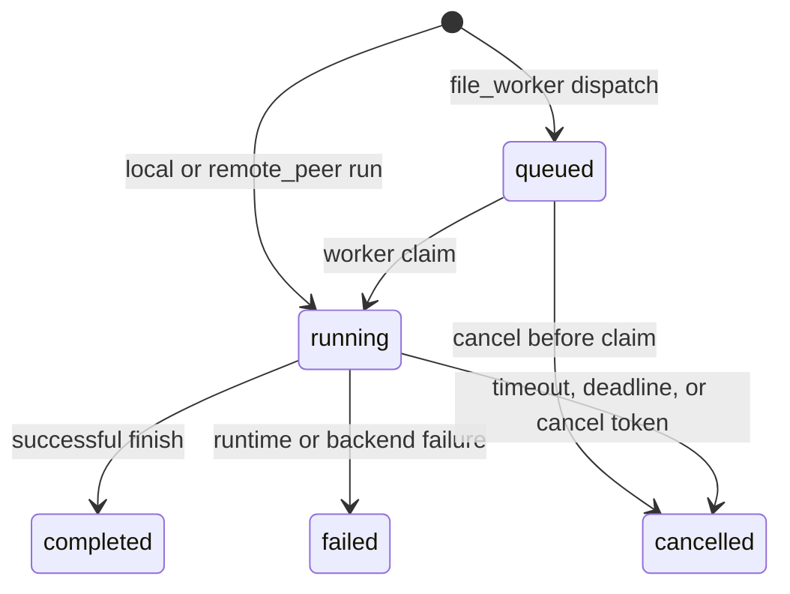
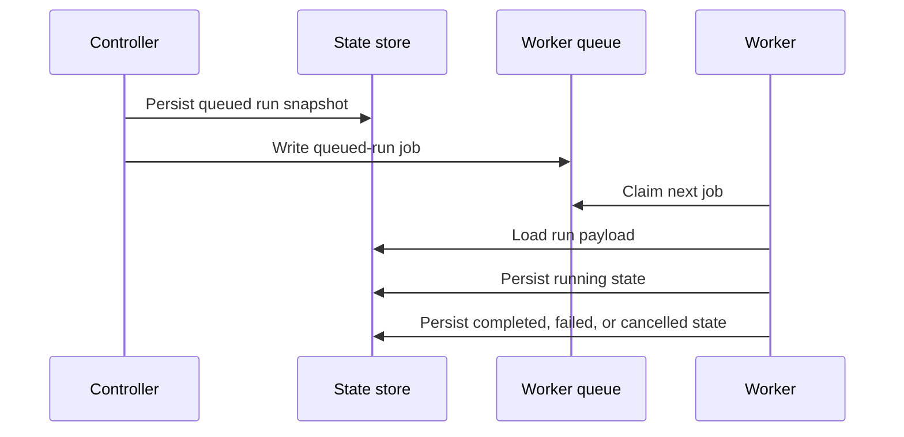
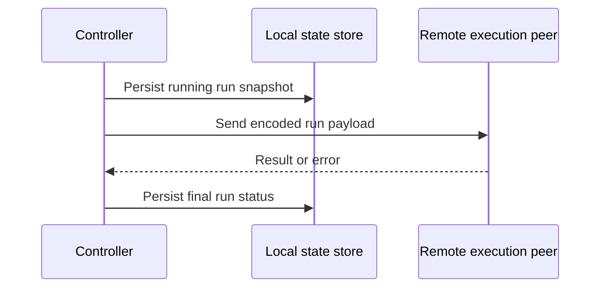

# Pipeline Orchestrator

The pipeline orchestrator is the King subsystem that turns multi-step work into
named runs with explicit lifecycle state, configurable execution backends, and
durable run history.

If you are reading this as a beginner, the easiest way to think about the
orchestrator is this: a normal function call does some work and returns. An
orchestrated run is different. It has a run ID, a stored snapshot, a backend
that actually executes it, a status you can inspect later, and a place in the
system's operational history.

That difference matters because large workloads do not stop mattering after
the line of code that started them has returned. You often need to know which
run was started, whether it is queued or running, whether it completed or
failed, whether it was cancelled, and which backend handled it.

## Start With The Problem

Application code often grows from single calls into workflows. One request may
need to validate input, stage data, call a model, summarize a result, persist a
report, and notify another system. At first, teams usually keep this as nested
control flow. That works until they need one of four things.

The first thing is visibility. Someone asks which run failed and why. The second
thing is scheduling. Work needs to move from the request path into a worker.
The third thing is control. A run needs a timeout, a deadline, or cancellation.
The fourth thing is topology. The work should stay local, be queued to a
same-host worker, or be sent to a remote execution peer.

The orchestrator exists because these needs keep appearing together. King
therefore treats them as one subsystem rather than as a pile of unrelated
helpers.

## The Main Concepts

The orchestrator chapter uses a few recurring words.

A tool is a named capability stored in the tool registry. A pipeline is an
ordered list of steps. A run is one concrete execution of an initial input plus
a pipeline definition. A run snapshot is the persisted record that lets the
system inspect that run later. A controller is the side that starts or dispatches
the work. A worker is the side that claims queued work and executes it.

Once these words are clear, the rest of the subsystem becomes much easier to
follow.

## What The Orchestrator Stores

The orchestrator is not only an executor. It is also a state store for workflow
history.

When a run begins, King persists a snapshot of the run ID, timing fields,
status, initial data, pipeline definition, execution options, result when one
exists, and error information when a failure occurs. The tool registry and
logging configuration are also persisted so a restarted controller or worker can
recover the current orchestrator state instead of starting from an empty memory
image.

Run snapshots now also keep the orchestrator's explicit failure classification
instead of collapsing everything into one generic error string. When a run
fails or is cancelled, `king_pipeline_orchestrator_get_run()` preserves whether
the terminal condition was `validation`, `timeout`, `backend`,
`remote_transport`, or `cancelled`, whether that classification is step-scoped
or run-scoped, which backend owned the failure boundary, and which step index
and tool were implicated when that is known.

The same snapshot also carries a step-by-step status view. That matters because
operational questions are usually not only "did the run fail?" but also "which
step failed, which steps already completed, and is the remainder still pending
or now indeterminate because the failure happened on a remote boundary?"

This is the key reason the orchestrator feels like a control-plane subsystem
instead of a convenience wrapper. The run is a system object with history.



The run is therefore visible both before and after execution. That is what
makes lookup, restart recovery, and operational inspection possible.

## The Tool Registry

The tool registry is the named catalog of capabilities a pipeline may refer to.
You register tools with `king_pipeline_orchestrator_register_tool()`. The
registry stores the tool name and its configuration snapshot so the orchestrator
can validate pipeline steps and recover the registry after restart.

This is important because pipelines should not refer to accidental strings. A
tool name is a declared runtime object. If a pipeline step names a tool that
does not exist in the registry, the orchestrator rejects that run instead of
pretending the step is valid.

The tool registry is also surfaced through system component info. The
orchestrator component reports how many tools are registered and exposes the
list of tool names in `registered_tools`. That makes the registry inspectable at
runtime instead of being hidden inside application code.

## What A Pipeline Looks Like

A pipeline is an ordered array of step definitions. At minimum, each step names
the tool that should be used for that step. Steps may also carry scheduling
options such as `delay_ms`, which lets the controller or worker delay the start
of that step while still honoring timeout, deadline, and cancellation checks.

The important idea is that the pipeline is data, not hidden control flow.
Because the pipeline is data, King can validate it, persist it, queue it,
rehydrate it, send it to a remote peer, and inspect it after the fact.

That is one of the biggest practical differences between an orchestrated
workflow and a chain of ad-hoc PHP calls.

## Run Lifecycle

Every orchestrator run moves through an explicit lifecycle. A run begins in a
persisted initial state. After that, its path depends on the selected execution
backend. A local run moves into `running` immediately. A file-worker run begins
as `queued` until a worker claims it. A remote-peer run is persisted locally but
executed by the configured remote worker peer. When execution finishes, the run
becomes `completed`, `failed`, or `cancelled`.



This lifecycle is what `king_pipeline_orchestrator_get_run()` reads back. The
orchestrator is therefore something you can ask questions of after the original
call site is long gone.

## Execution Backends

The orchestrator does not guess where work should run. The execution backend is
explicit configuration. That is a good thing because topology decisions should
be visible and reviewable.

King currently treats the execution backend as part of the component contract.
System component info exposes both `execution_backend` and `topology_scope` so
you can see whether the orchestrator is operating as `local`, `file_worker`, or
`remote_peer`, and whether the effective topology is
`local_in_process`, `same_host_file_worker`, or
`tcp_host_port_execution_peer`.

### Local Execution

Local execution is the simplest path. The controller starts the run and the
current process executes it directly. This is the best fit when the work is
short, the request path is allowed to own the execution, and you want the least
topology overhead.

The scheduler policy for this mode is `in_process_linear`. In ordinary language,
that means the controller process owns the run directly and progresses it in the
same local runtime.

### File-Worker Execution

File-worker execution is the queued same-host path. The controller persists the
run, writes a queue job into the configured worker queue directory, and returns
the queued run snapshot. A worker process later calls
`king_pipeline_orchestrator_worker_run_next()` to claim the next runnable job,
load the persisted run payload, and execute it.

This mode matters when the request path should not do the work itself. The run
can be accepted quickly, queued durably on the host, and then claimed by a
worker process. The scheduler policy exposed by component info in this mode is
`claimed_recovery_then_fifo_run_id`. That means the worker first prefers runs
that were already claimed but need recovery, and otherwise processes queued runs
in FIFO order by run ID.

The worker does not trust queue filenames alone. When it claims a job, it opens
the claimed entry as a nofollow regular file and discards unsafe path swaps
instead of following them. That matters because the file-worker queue is a real
filesystem boundary, not just a naming convention.



File-worker mode also supports queued-run cancellation through
`king_pipeline_orchestrator_cancel_run()`. That function is intentionally tied
to the file-worker backend because queued same-host work has a concrete local
claim and cancel path.

### Remote-Peer Execution

Remote-peer execution keeps the controller-side run history local while sending
the actual execution request to a remote TCP host and port. This is useful when
the control plane lives in one process or host but the execution capacity lives
somewhere else.

The controller still persists the run snapshot locally before sending the remote
execution payload. That matters because the run remains visible in local system
history even though the work itself is performed remotely.



This mode is the bridge between the orchestrator and the wider control plane. A
controller can own the run history while execution happens on a different node.
The remote result is decoded as a plain value tree. Network payloads that try
to materialize PHP objects are rejected instead of being treated as executable
runtime state.

## Timeout, Deadline, Concurrency, And Cancellation

The orchestrator has to do more than execute steps. It has to protect the run
from taking too long, from exceeding local policy, or from continuing after the
caller has withdrawn interest.

That is what execution control options are for.

`timeout_ms` and `overall_timeout_ms` define how much runtime budget one run is
allowed to consume. `deadline_ms` expresses an absolute time boundary.
`max_concurrency` lets the caller request a concurrency ceiling, but it still
must stay within the configured orchestrator concurrency default. `cancel`
accepts a `King\CancelToken` so the caller can actively signal cancellation.

These controls matter because orchestration is rarely only about sequencing. It
is also about making sure runs respect operational policy.

## Persistence And Recovery

A run snapshot is only useful if it survives the process that created it. That
is why the orchestrator has an explicit `orchestrator_state_path`.

The state path is system-owned. It is intentionally not a normal userland
runtime override. The reason is simple. Persisted orchestrator state is part of
the control plane and should be governed at deployment level, not rewritten by
arbitrary application input.

When the orchestrator starts, it can recover tool registry state, logging
configuration, and run snapshots from this persisted state. Component info
surfaces whether the orchestrator was `recovered_from_state`, which gives
operators a direct way to confirm that restart recovery occurred.

Recovery is not limited to inspection. A controller that restarts on the local
or `remote_peer` backends can call
`king_pipeline_orchestrator_resume_run()` for a persisted `running` run and let
the orchestrator continue that run from the stored initial data, pipeline, and
execution options. This is run-level continuation, not mid-step checkpointing.
If the interrupted run had already crossed a remote boundary, the
`caller_managed` idempotency policy still applies, which means the caller owns
the decision to replay that run. That replay contract is now verified not only
for controller-process restart, but also for the broader host-loss case where
the controller and remote peer both disappear and the peer later returns on the
same persisted host/port route.

## Logging Configuration

The orchestrator has its own logging snapshot, configured with
`king_pipeline_orchestrator_configure_logging()`. This lets the control plane
persist the logging policy of orchestrated runs separately from the rest of the
application.

This is useful because orchestrated work often lives longer than the request
that started it. Logging for the orchestrator therefore needs to remain stable
across controller and worker boundaries.

## Reading Component Info

The orchestrator exposes a rich component snapshot through
`king_system_get_component_info('pipeline_orchestrator')`.

This snapshot includes timeout defaults, recursion depth, concurrency default,
distributed tracing policy, execution backend, topology scope, scheduler
policy, retry policy, idempotency policy, state path, worker queue path, remote
host and port, recovery status, tool count, run history count, active run
count, queued run count, last run ID, last run status, and the list of
registered tools.

This matters because the orchestrator is not only a callable runtime. It is an
inspectable operational subsystem.

## Configuring The Orchestrator

The orchestrator shares a configuration family with MCP because both belong to
the control plane. The main orchestrator settings are easy to understand in
plain language.

`orchestrator_default_pipeline_timeout_ms` sets the default runtime budget for a
run. `orchestrator_max_recursion_depth` defines the maximum allowed recursion
depth for orchestrated evaluation. `orchestrator_loop_concurrency_default`
defines the default local concurrency ceiling. 
`orchestrator_enable_distributed_tracing` turns orchestrator trace correlation
on or off. `orchestrator_execution_backend` selects `local`, `file_worker`, or
`remote_peer`. `orchestrator_worker_queue_path` is the queue directory for the
file-worker backend. `orchestrator_remote_host` and
`orchestrator_remote_port` select the remote execution peer. 
`king.orchestrator_state_path` defines where persisted orchestrator state lives.

The following runtime configuration example shows the general shape for a remote
controller.

```php
<?php

$config = new King\Config([
    'orchestrator.orchestrator_default_pipeline_timeout_ms' => 120000,
    'orchestrator.orchestrator_loop_concurrency_default' => 50,
    'orchestrator.orchestrator_execution_backend' => 'remote_peer',
    'orchestrator.orchestrator_remote_host' => '10.0.0.25',
    'orchestrator.orchestrator_remote_port' => 9444,
]);
```

The system INI layer is where deployment-owned paths and backend defaults are
normally set.

```ini
king.orchestrator_default_pipeline_timeout_ms=120000
king.orchestrator_max_recursion_depth=10
king.orchestrator_loop_concurrency_default=50
king.orchestrator_enable_distributed_tracing=1
king.orchestrator_execution_backend=file_worker
king.orchestrator_worker_queue_path=/var/lib/king/orchestrator-queue
king.orchestrator_state_path=/var/lib/king/orchestrator/state.bin
```

The full key-by-key description is covered in
[Runtime Configuration](./runtime-configuration.md) and
[System INI Reference](./system-ini-reference.md).

## Public API

This chapter covers the full public orchestrator API.

`king_pipeline_orchestrator_register_tool()` creates or replaces one named tool
definition in the active registry and persists the registry snapshot.

`king_pipeline_orchestrator_configure_logging()` persists the active
orchestrator logging snapshot.

`king_pipeline_orchestrator_run()` starts one run immediately on the configured
execution backend. In local mode the run executes in the current process. In
remote-peer mode the controller sends the run to the configured remote host and
port. In file-worker mode this direct path is intentionally unavailable because
queued execution should use dispatch instead.

`king_pipeline_orchestrator_dispatch()` persists one run in queued state and
places it onto the configured file-worker queue.

`king_pipeline_orchestrator_worker_run_next()` is the worker-side claim and
execute entry point. It claims the next runnable queued job, resumes the stored
run payload, and returns `false` when the queue is empty.

`king_pipeline_orchestrator_resume_run()` continues one persisted `running` run
after controller restart on the local or `remote_peer` backends. This function
is intentionally separate from `worker_run_next()` because the file-worker
backend already has its own claim and recovery path.

`king_pipeline_orchestrator_get_run()` reads one persisted run snapshot by run
ID. The returned snapshot includes the persisted top-level run state plus a
structured `error_classification` block and per-step `steps` status entries so
callers can distinguish validation, timeout, backend, remote-transport, and
cancelled failures without inferring them from exception strings.

`king_pipeline_orchestrator_cancel_run()` requests cancellation for a persisted
queued run on the file-worker backend.

## Common Questions

One common question is why `run()` and `dispatch()` are separate functions
instead of one function with hidden backend behavior. The answer is clarity.
Immediate execution and queue submission are different acts. Keeping them
separate makes the call site easier to read and the operational contract easier
to reason about.

Another common question is why run state is persisted locally even when the
backend is remote. The answer is that the controller still needs local run
history. A remote execution peer may do the work, but the controller should
still be able to answer which run was started, how it ended, and what the last
known status was.

A third common question is whether cancellation means the same thing in every
backend. It does not. A file-worker run has an explicit queued-run cancellation
path. A local or remote run uses timeout, deadline, and cancel-token execution
control during active execution.

## Related Chapters

If you want to understand the remote execution transport that the orchestrator
shares with the wider control plane, read [MCP](./mcp.md). If you want to
understand how service discovery and topology feed into controller placement,
read [Semantic DNS](./semantic-dns.md) and
[Router and Load Balancer](./router-and-load-balancer.md). If you want the full
configuration surface, read [Configuration Handbook](./configuration-handbook.md),
[Runtime Configuration](./runtime-configuration.md), and
[System INI Reference](./system-ini-reference.md).
