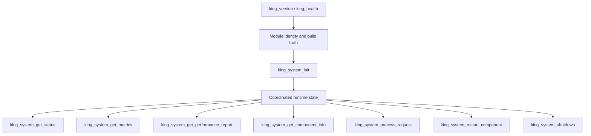
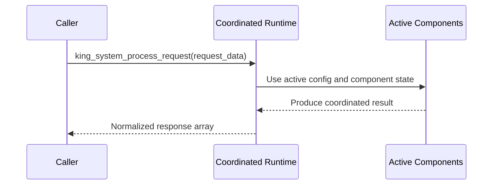

# Platform Model

King is one native runtime that gives PHP programs direct access to transport,
[streaming](./glossary.md#streaming), [realtime](./glossary.md#realtime)
communication, binary encoding, storage, service discovery, orchestration,
[telemetry](./glossary.md#telemetry), and operational control.

That sentence sounds broad, but the model behind it is not hard to understand.
PHP stays in charge of application logic. King stays in charge of the protocol
and runtime machinery. The two meet through explicit objects and explicit
lifecycle boundaries.

## Why This Extension Exists

Many PHP systems start in a simple way and then grow into more demanding work.
At first a short request helper may be enough. Later the same system needs
persistent connections, bidirectional traffic, large payloads, retries,
streaming, telemetry, routing, storage, or control-plane work. At that point
teams often begin to split the critical path into sidecars, shell scripts,
extra daemons, or foreign-language helper services.

King exists to keep that work inside one PHP-facing runtime. The point is to
let PHP programs use a real systems-oriented runtime directly instead of
splitting the critical path across many unrelated helper layers.

## The Core Runtime Objects

The easiest way to understand the platform is through the main objects you see
from userland.

`King\Config` holds runtime policy. If you want to say how transport, timeouts,
TLS, telemetry, DNS, orchestration, or storage should behave, you put those
decisions into a config snapshot.

`King\Session` holds a live transport context. In simple words, it owns a
[connection](./glossary.md#connection) or listener state.

`King\Stream` holds one active unit of protocol work inside a session. A
[stream](./glossary.md#stream)
is where request and response work happens in a controlled way.

`King\Response` holds a received response in structured form.

`King\CancelToken` gives your code an explicit stop signal for long-running
work.

These names matter because they show the style of the whole extension. King
prefers explicit state over hidden state.

## The Runtime In Layers

You can think of the runtime in four large layers.

The transport layer handles outgoing and incoming protocol work. This includes
HTTP, QUIC, TLS, streaming, WebSocket, server listeners, and session-level
state.

The data layer handles structured and durable data. This includes IIBIN, the
object store, CDN state, and other payload-oriented subsystems.

The control-plane layer handles coordination. This includes Semantic-DNS, MCP,
the pipeline orchestrator, router and load-balancer policy, and autoscaling.

The operations layer handles visibility and operational control. This includes
telemetry, health, metrics, component introspection, release checks, and
runtime lifecycle control.

These layers are separate enough to stay understandable, but close enough to
share one model of state and ownership.

## The Coordinated System Runtime

There is one more layer on top of the subsystem chapters: the coordinated
system runtime. This is the part of King that treats the process as one running
platform instead of as a pile of separate features.

That distinction matters when you need answers to questions such as these:

Is the runtime initialized at all? Which components are active right now? Which
ones are degraded? What does the process think its current memory use looks
like? Can one component be restarted in place? Can a normalized request be sent
through the full coordinated runtime instead of directly through one low-level
client or server call? Can the runtime shut itself down in an orderly way?

Those questions are handled by the system-runtime functions:
`king_system_health_check()`, `king_system_init()`,
`king_system_get_status()`, `king_system_get_metrics()`,
`king_system_get_performance_report()`,
`king_system_get_component_info()`, `king_system_process_request()`,
`king_system_restart_component()`, and `king_system_shutdown()`.

At the very top, `king_health()` and `king_version()` answer a slightly
different question. They describe the extension module itself: which build is
loaded, which version is active, and whether the process-level runtime surface
is healthy enough to answer basic questions.

The point is not to hide the individual subsystems. The point is to expose one
honest process-wide control surface above them.

## What Explicit State Means In Practice

Explicit state means the system tries to avoid hidden magic.

Configuration is created on purpose. Sessions are created on purpose. Streams
belong to sessions. Cancels are owned by callers. Responses are structured
objects. Object-store writes produce metadata and durable state. Orchestrator
runs keep run state. Autoscaling and Semantic-DNS keep the state they need to
restart cleanly.

This matters because long-lived systems become hard to debug when state appears
from nowhere. King tries to keep the edges visible.

## Procedural And OO Surfaces

King exports both procedural functions and classes. The two styles are meant to
work together.

The procedural surface is useful when you want direct and compact calls such as
`king_send_request()`, `king_http3_request_send()`, `king_mcp_request()`, or
`king_object_store_put()`.

The OO surface is useful when you want longer-lived objects and clearer program
structure. In that style you may work with `King\Config`,
`King\Client\Http3Client`, `King\WebSocket\Connection`, `King\MCP`, or other
typed objects.

The important point is that these are not separate runtimes. They are two ways
to reach the same native kernels.

## The Configuration Model

King has two main configuration surfaces.

The first is runtime configuration, usually passed through `king_new_config()`,
`King\Config`, or an inline config array. This is the right place for policy
that belongs to a specific application workflow.

The second is system configuration, loaded through `php.ini` under the
`king.*` namespace. This is the right place for process-wide defaults, operator
policy, paths, credentials, and deployment-level choices.

This split matters because not every setting belongs in application code, and
not every setting belongs in deployment files.

## Health, Status, Metrics, And Performance Are Different Kinds Of Truth

Many runtimes blur all of these into one vague "status" call. King keeps them
separate because they answer different operational questions.

`king_health()` is the smallest top-level answer. It tells you whether the
extension is loaded, which build and version are active, which PHP version is
hosting it, whether userland config overrides are allowed, and which runtime
groups are active.

`king_system_health_check()` is a small coordinated answer for the system
runtime itself. It tells you whether the integrated runtime currently considers
itself healthy enough to proceed.

`king_system_get_status()` is broader. It gives a system snapshot that includes
system information, configuration, and autoscaling-related state.

`king_system_get_metrics()` gives numeric resource facts such as current and
peak memory use together with the collection timestamp.

`king_system_get_performance_report()` goes one step further. It turns the live
snapshot into a compact performance view with component-specific notes and
recommendations.

You can think of the layers this way. Health answers "is the platform okay
enough to continue?" Status answers "what is the platform currently doing?"
Metrics answer "what numbers describe it right now?" Performance answers "what
does the runtime conclude from those numbers?"

## Component Introspection And Safe Restart

Large runtimes rarely fail all at once. More often one component becomes stale,
degraded, misconfigured, or disconnected while the rest of the process keeps
working.

That is why King exposes `king_system_get_component_info($name)`. It lets you
ask one named subsystem to describe itself. The accepted names mirror the
component inventory exposed by the runtime itself, including `config`,
`client`, `server`, `semantic_dns`, `object_store`, `cdn`, `telemetry`,
`autoscaling`, `mcp`, `iibin`, and `pipeline_orchestrator`.

When inspection is not enough, `king_system_restart_component($name)` gives the
runtime a way to cycle one named component without throwing away the whole
process immediately. This is useful for the kinds of situations where one
subsystem needs to reload state, refresh local snapshots, or re-enter its own
clean startup path while the rest of the platform stays up.

The important idea is not that every failure can be repaired in place. The
important idea is that restart is an explicit capability with an explicit
surface instead of an operator superstition.

## Coordinated Request Processing

King also exposes `king_system_process_request()` for cases where the caller
does not want to talk directly to one client helper, one server hook, or one
control-plane function. Instead, the caller hands a normalized request payload
to the coordinated runtime and lets the integrated system path process it as a
whole.

This function matters most in platform-style deployments where one process is
acting as a coherent edge or control node. The request then moves through a
runtime that already knows its active configuration, component state, and
integration boundaries.

## Startup And Shutdown Are Part Of The Contract

`king_system_init()` and `king_system_shutdown()` belong in the platform model
because startup and shutdown are not side details. They are part of what makes
the runtime trustworthy.

Initialization means more than creating one config array. It means materializing
the coordinated component snapshot the process will rely on afterward.

Shutdown means more than letting PHP exit eventually. It means giving the
runtime one explicit chance to flush, release, close, and report in a defined
order.

This is one reason King keeps explicit lifecycle functions in public view. A
platform that wants to be predictable under load, restarts, rollout, and
operations must describe how it comes up and how it goes down.

## What A King Program Usually Looks Like

A typical King program does not start by touching every subsystem. It usually
starts with one concrete need. A service may need an HTTP client with strong
timeout control. A realtime node may need WebSocket state. A data-heavy system
may need the object store and CDN path. A tool worker may need MCP. A control
service may need telemetry, autoscaling, and Semantic-DNS.

The value of the platform model is that these parts do not feel unrelated. They
share the same ideas about configuration, ownership, state, and lifecycle.

## Deployment Shape

King is designed for long-lived PHP processes that need explicit control over
network behavior, durable state, and runtime policy. It fits packaged release
artifacts, container delivery, benchmarked builds, smoke-tested installs, and
production systems where operators need to know what is happening inside the
runtime.

It is not meant to be an unrelated bag of helper functions. It is one runtime
with a PHP-facing control surface.

## Where To Go Next

If you want to understand how policy is expressed, read the
[Configuration Handbook](./configuration-handbook.md).

If you want to understand transport work, read
[HTTP Clients and Streams](./http-clients-and-streams.md) and
[QUIC and TLS](./quic-and-tls.md).

If you want to understand data and control-plane work, read
[Object Store and CDN](./object-store-and-cdn.md),
[MCP](./mcp.md),
[IIBIN](./iibin.md),
[Semantic-DNS](./semantic-dns.md), and
[Pipeline Orchestrator](./pipeline-orchestrator.md).

If you want to understand startup, health, coordinated request handling,
restart, and shutdown as one operational story, read
[17: System Lifecycle Coordination](./17-system-lifecycle-coordination/README.md).
