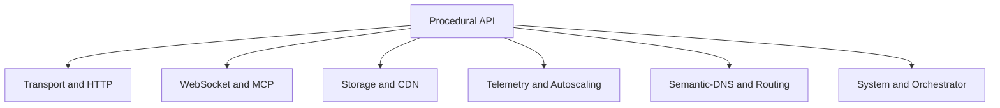

# Procedural API Reference

This chapter is the complete reference for the procedural King API. It is the
place to come when you already know what subsystem you want to use and need the
exact function name, the shape of the call, and the shortest explanation of
what the function is for.

The handbook chapters explain the ideas first. This page is the map back from
those ideas to the exact global entry points exported by the extension.
Signatures live in [`stubs/king.php`](../stubs/king.php), but this chapter is
written to answer the question that stubs alone cannot answer: “When would I
actually call this function, and how does it fit into the rest of the runtime?”

## How The Procedural Surface Fits Together

The procedural API is broad on purpose. It exposes the whole extension, from
transport sessions and HTTP clients to storage, telemetry, orchestration,
Semantic-DNS, autoscaling, and system integration.

That does not mean every project should call every function directly. In
practice, most code uses one part of the surface deeply and only touches the
rest through higher-level workflows. A service that relies on HTTP and
WebSocket might never call the object store. A data-heavy pipeline may care
about the object store, IIBIN, telemetry, and orchestration far more than about
the server listener surface.

Read this chapter as a grouped reference, not as a tutorial. When you need the
full explanation behind a group of functions, each section points back to the
handbook chapter that explains the topic in depth.

## Transport, Requests, And Sessions

Read [HTTP Clients and Streams](./http-clients-and-streams.md) and
[QUIC and TLS](./quic-and-tls.md) first if you are new to the transport model.
This group is the foundation of the client runtime. It opens sessions, sends
requests, receives responses, drives event loops, and exposes low-level stream
control.

| Function | What it does | Read first |
| --- | --- | --- |
| `king_connect()` | Opens a session handle to a remote host and port. | [HTTP Clients and Streams](./http-clients-and-streams.md) |
| `king_close()` | Closes a low-level session handle. | [HTTP Clients and Streams](./http-clients-and-streams.md) |
| `king_send_request()` | Sends one request through the runtime dispatcher and returns either a normalized response or a streaming request context. | [HTTP Clients and Streams](./http-clients-and-streams.md) |
| `king_receive_response()` | Materializes a `King\Response` from a live request context. | [HTTP Clients and Streams](./http-clients-and-streams.md) |
| `king_client_send_request()` | Client-facing alias for the dispatcher request path. | [HTTP Clients and Streams](./http-clients-and-streams.md) |
| `king_poll()` | Advances a live session event loop. | [HTTP Clients and Streams](./http-clients-and-streams.md) |
| `king_cancel_stream()` | Records cancellation on a low-level stream. | [HTTP Clients and Streams](./http-clients-and-streams.md) |
| `king_client_stream_cancel()` | Client-facing alias for stream cancellation. | [HTTP Clients and Streams](./http-clients-and-streams.md) |
| `king_get_stats()` | Returns transport and configuration statistics for a live session. | [HTTP Clients and Streams](./http-clients-and-streams.md) |

The practical distinction inside this group is simple. `king_connect()` and the
poll or cancel functions are session-oriented. `king_send_request()` and
`king_client_send_request()` are request-oriented. `king_receive_response()` is
only needed when you are working with a live request context rather than with a
fully buffered response.

## Protocol-Specific HTTP

Read [HTTP Clients and Streams](./http-clients-and-streams.md) and
[QUIC and TLS](./quic-and-tls.md) for the full explanation of protocol choice,
session reuse, and failure handling. Use these functions when you do not want
the dispatcher to choose the protocol for you.

| Function | What it does | Read first |
| --- | --- | --- |
| `king_http1_request_send()` | Sends one direct HTTP/1 request. | [HTTP Clients and Streams](./http-clients-and-streams.md) |
| `king_http2_request_send()` | Sends one direct HTTP/2 request. | [HTTP Clients and Streams](./http-clients-and-streams.md) |
| `king_http2_request_send_multi()` | Sends a multiplexed batch across one HTTP/2 session. | [HTTP Clients and Streams](./http-clients-and-streams.md) |
| `king_http3_request_send()` | Sends one direct HTTP/3 request over QUIC. | [QUIC and TLS](./quic-and-tls.md) |
| `king_http3_request_send_multi()` | Sends a multiplexed batch across one HTTP/3 session. | [QUIC and TLS](./quic-and-tls.md) |

Most applications do not need protocol-specific calls on every request. They
matter when protocol choice is itself part of the job, such as HTTP/2 or
HTTP/3 multiplexing tests, explicit QUIC request paths, or controlled fallback
behavior.

## Early Hints

Read [HTTP Clients and Streams](./http-clients-and-streams.md) and
[Server Runtime](./server-runtime.md) for the end-to-end Early Hints model.
This pair of functions exists for workflows where the caller wants to inspect
or preserve HTTP 103-style link metadata.

| Function | What it does | Read first |
| --- | --- | --- |
| `king_client_early_hints_process()` | Parses a header set as Early Hints on a live request context. | [HTTP Clients and Streams](./http-clients-and-streams.md) |
| `king_client_early_hints_get_pending()` | Returns the pending Early Hints captured for that context. | [HTTP Clients and Streams](./http-clients-and-streams.md) |

## TLS And Session Tickets

Read [QUIC and TLS](./quic-and-tls.md) before using this group. These functions
deal with trust material and reusable session state. They exist because some
applications need to load trust anchors or carry session tickets across process
boundaries in a controlled way.

| Function | What it does | Read first |
| --- | --- | --- |
| `king_set_ca_file()` | Sets the default CA bundle path for the procedural surface. | [QUIC and TLS](./quic-and-tls.md) |
| `king_client_tls_set_ca_file()` | Client-facing alias for CA bundle configuration. | [QUIC and TLS](./quic-and-tls.md) |
| `king_set_client_cert()` | Sets the default client certificate and key paths. | [QUIC and TLS](./quic-and-tls.md) |
| `king_client_tls_set_client_cert()` | Client-facing alias for client-certificate configuration. | [QUIC and TLS](./quic-and-tls.md) |
| `king_export_session_ticket()` | Exports a reusable session ticket from a live session. | [QUIC and TLS](./quic-and-tls.md) |
| `king_client_tls_export_session_ticket()` | Client-facing alias for ticket export. | [QUIC and TLS](./quic-and-tls.md) |
| `king_import_session_ticket()` | Imports a session ticket into the shared ticket ring. | [QUIC and TLS](./quic-and-tls.md) |
| `king_client_tls_import_session_ticket()` | Client-facing alias for ticket import. | [QUIC and TLS](./quic-and-tls.md) |

The important distinction is that CA and certificate calls control identity and
trust, while the ticket calls control resumption and connection reuse.

## WebSocket

Read [WebSocket](./websocket.md) first. These functions open client
connections, move frames, expose connection state, and report WebSocket-local
errors.

| Function | What it does | Read first |
| --- | --- | --- |
| `king_client_websocket_connect()` | Opens a WebSocket client connection from a URL. | [WebSocket](./websocket.md) |
| `king_client_websocket_send()` | Sends a text or binary frame. | [WebSocket](./websocket.md) |
| `king_client_websocket_receive()` | Receives the next available payload frame. | [WebSocket](./websocket.md) |
| `king_client_websocket_ping()` | Sends a WebSocket ping frame. | [WebSocket](./websocket.md) |
| `king_client_websocket_get_status()` | Returns the current WebSocket connection state. | [WebSocket](./websocket.md) |
| `king_client_websocket_close()` | Closes the WebSocket connection with optional close metadata. | [WebSocket](./websocket.md) |
| `king_websocket_send()` | Compatibility alias for WebSocket send. | [WebSocket](./websocket.md) |
| `king_client_websocket_get_last_error()` | Returns the shared WebSocket error buffer. | [WebSocket](./websocket.md) |

In this group, the most important split is between lifecycle functions and data
functions. `connect`, `close`, and `get_status` describe the connection.
`send`, `receive`, and `ping` move data and control frames through it.

## MCP

Read [MCP](./mcp.md) first. These functions expose the Model Context Protocol
transport in procedural form. They open a remote peer connection, issue unary
requests, upload payloads from streams, download payloads into streams, and
surface the MCP-local error buffer.

| Function | What it does | Read first |
| --- | --- | --- |
| `king_mcp_connect()` | Opens an MCP connection handle to a remote peer. | [MCP](./mcp.md) |
| `king_mcp_request()` | Executes one unary MCP request. | [MCP](./mcp.md) |
| `king_mcp_upload_from_stream()` | Uploads a local stream to the remote peer. | [MCP](./mcp.md) |
| `king_mcp_download_to_stream()` | Downloads a remote transfer into a local stream. | [MCP](./mcp.md) |
| `king_mcp_close()` | Closes the MCP connection and any active peer socket. | [MCP](./mcp.md) |
| `king_mcp_get_error()` | Returns the shared MCP error buffer. | [MCP](./mcp.md) |

## Server Runtime

Read [Server Runtime](./server-runtime.md) first. These functions turn the
extension from a client runtime into a listener-driven server runtime. They are
the entry points for one-shot listeners, continuous listeners, upgrades, server
telemetry setup, and server-side close behavior.

| Function | What it does | Read first |
| --- | --- | --- |
| `king_http1_server_listen()` | Runs the HTTP/1 listener path. | [Server Runtime](./server-runtime.md) |
| `king_http1_server_listen_once()` | Accepts and handles one on-wire HTTP/1 request. | [Server Runtime](./server-runtime.md) |
| `king_http2_server_listen()` | Runs the HTTP/2 listener path. | [Server Runtime](./server-runtime.md) |
| `king_http2_server_listen_once()` | Accepts and handles one on-wire h2c request. | [Server Runtime](./server-runtime.md) |
| `king_http3_server_listen()` | Runs the HTTP/3 listener path. | [Server Runtime](./server-runtime.md) |
| `king_http3_server_listen_once()` | Accepts and handles one on-wire HTTP/3 request over QUIC. | [Server Runtime](./server-runtime.md) |
| `king_server_listen()` | Dispatches a generic server listener through the runtime index. | [Server Runtime](./server-runtime.md) |
| `king_server_on_cancel()` | Registers a cancel callback for server-side work. | [Server Runtime](./server-runtime.md) |
| `king_server_send_early_hints()` | Records Early Hints on the server session and emits real `103` hints on the HTTP/1 one-shot listener. | [Server Runtime](./server-runtime.md) |
| `king_server_upgrade_to_websocket()` | Upgrades a request or session to WebSocket. | [Server Runtime](./server-runtime.md) |
| `king_server_reload_tls_config()` | Reloads TLS material on a live server session, including during active on-wire request handling. | [Server Runtime](./server-runtime.md) |
| `king_server_init_telemetry()` | Attaches telemetry configuration to a server session. | [Server Runtime](./server-runtime.md) |
| `king_session_get_peer_cert_subject()` | Returns the normalized peer certificate subject for a session. | [Server Runtime](./server-runtime.md) |
| `king_session_close_server_initiated()` | Closes a session from the server side with explicit close data. | [Server Runtime](./server-runtime.md) |
| `king_admin_api_listen()` | Starts the admin API listener for the configured server role. | [Server Runtime](./server-runtime.md) |

## Core Runtime And System Integration

Read [Platform Model](./platform-model.md) for the broad picture and
[Configuration Handbook](./configuration-handbook.md) for config layering. This
group gives you the top-level extension information and the system-integration
runtime that coordinates components together.

The easiest way to read this group is in layers. `king_version()` and
`king_health()` describe the loaded module itself. `king_new_config()` creates
validated runtime policy. The `king_system_*` functions then operate on the
coordinated runtime that is initialized from that policy. That is why the
system functions belong together instead of being scattered across unrelated
chapters.

| Function | What it does | Read first |
| --- | --- | --- |
| `king_version()` | Returns the extension version string. | [Platform Model](./platform-model.md) |
| `king_new_config()` | Creates a validated runtime configuration snapshot. | [Configuration Handbook](./configuration-handbook.md) |
| `king_health()` | Returns extension health and build information. | [Platform Model](./platform-model.md) |
| `king_get_last_error()` | Returns the shared runtime error buffer. | [Platform Model](./platform-model.md) |
| `king_system_health_check()` | Returns a system-level health summary. | [Platform Model](./platform-model.md) |
| `king_system_init()` | Initializes the coordinated system runtime. | [Platform Model](./platform-model.md) |
| `king_system_get_status()` | Returns current coordinated system status. | [Platform Model](./platform-model.md) |
| `king_system_get_metrics()` | Returns system-level metrics. | [Platform Model](./platform-model.md) |
| `king_system_get_performance_report()` | Returns a performance report with recommendations. | [Platform Model](./platform-model.md) |
| `king_system_get_component_info()` | Returns the descriptor for one named component. | [Platform Model](./platform-model.md) |
| `king_system_process_request()` | Processes a normalized request through the coordinated runtime. | [Platform Model](./platform-model.md) |
| `king_system_restart_component()` | Restarts one named component. | [Platform Model](./platform-model.md) |
| `king_system_shutdown()` | Shuts down the coordinated system runtime. | [Platform Model](./platform-model.md) |

## Object Store And CDN

Read [Object Store and CDN](./object-store-and-cdn.md) first. These functions
form the public storage surface. They initialize the runtime, store objects,
list objects, read payloads, read metadata, export and import backups, run
maintenance, and control the in-process CDN cache.

| Function | What it does | Read first |
| --- | --- | --- |
| `king_object_store_init()` | Initializes the object-store and CDN runtime. | [Object Store and CDN](./object-store-and-cdn.md) |
| `king_object_store_put()` | Stores one object payload. | [Object Store and CDN](./object-store-and-cdn.md) |
| `king_object_store_list()` | Lists stored objects. | [Object Store and CDN](./object-store-and-cdn.md) |
| `king_object_store_get()` | Reads one stored object payload. | [Object Store and CDN](./object-store-and-cdn.md) |
| `king_object_store_delete()` | Deletes one object. | [Object Store and CDN](./object-store-and-cdn.md) |
| `king_object_store_backup_object()` | Exports one object plus metadata. | [Object Store and CDN](./object-store-and-cdn.md) |
| `king_object_store_restore_object()` | Restores one object plus metadata from backup material. | [Object Store and CDN](./object-store-and-cdn.md) |
| `king_object_store_backup_all_objects()` | Exports a committed full snapshot or an explicit incremental delta snapshot. | [Object Store and CDN](./object-store-and-cdn.md) |
| `king_object_store_restore_all_objects()` | Restores a committed full snapshot or applies an incremental patch snapshot. | [Object Store and CDN](./object-store-and-cdn.md) |
| `king_object_store_optimize()` | Runs maintenance and live-summary work. | [Object Store and CDN](./object-store-and-cdn.md) |
| `king_object_store_cleanup_expired_objects()` | Removes expired objects. | [Object Store and CDN](./object-store-and-cdn.md) |
| `king_object_store_get_metadata()` | Returns metadata for one object. | [Object Store and CDN](./object-store-and-cdn.md) |
| `king_object_store_get_stats()` | Returns object-store and CDN runtime statistics. | [Object Store and CDN](./object-store-and-cdn.md) |
| `king_cdn_cache_object()` | Pushes one object into the CDN cache. | [Object Store and CDN](./object-store-and-cdn.md) |
| `king_cdn_invalidate_cache()` | Invalidates one cached object or clears the cache. | [Object Store and CDN](./object-store-and-cdn.md) |
| `king_cdn_get_edge_nodes()` | Returns the explicit edge-node inventory known to the CDN runtime. | [Object Store and CDN](./object-store-and-cdn.md) |

## IIBIN

Read [IIBIN](./iibin.md) first. This group is the procedural surface for schema
registration, enum registration, binary encoding, binary decoding, and registry
inspection.

| Function | What it does | Read first |
| --- | --- | --- |
| `king_proto_get_defined_schemas()` | Lists the currently defined schemas. | [IIBIN](./iibin.md) |
| `king_proto_define_enum()` | Registers one enum definition. | [IIBIN](./iibin.md) |
| `king_proto_define_schema()` | Registers one schema definition. | [IIBIN](./iibin.md) |
| `king_proto_get_defined_enums()` | Lists the currently defined enums. | [IIBIN](./iibin.md) |
| `king_proto_encode()` | Encodes a payload using a named schema. | [IIBIN](./iibin.md) |
| `king_proto_decode()` | Decodes a payload using a named schema. | [IIBIN](./iibin.md) |
| `king_proto_is_defined()` | Checks whether a schema or enum name exists. | [IIBIN](./iibin.md) |
| `king_proto_is_schema_defined()` | Checks whether a schema exists. | [IIBIN](./iibin.md) |
| `king_proto_is_enum_defined()` | Checks whether an enum exists. | [IIBIN](./iibin.md) |

## Telemetry

Read [Telemetry](./telemetry.md) first. This group records local signals,
manages the telemetry buffers, and exposes trace-context helpers used to carry
observability state between components.

| Function | What it does | Read first |
| --- | --- | --- |
| `king_telemetry_get_status()` | Returns telemetry exporter and queue status. | [Telemetry](./telemetry.md) |
| `king_telemetry_get_metrics()` | Returns the live metric registry snapshot. | [Telemetry](./telemetry.md) |
| `king_telemetry_init()` | Initializes the telemetry runtime. | [Telemetry](./telemetry.md) |
| `king_telemetry_start_span()` | Starts one span and returns its identifier. | [Telemetry](./telemetry.md) |
| `king_telemetry_end_span()` | Ends one span and merges final attributes. | [Telemetry](./telemetry.md) |
| `king_telemetry_record_metric()` | Records one metric point. | [Telemetry](./telemetry.md) |
| `king_telemetry_log()` | Records one structured log record. | [Telemetry](./telemetry.md) |
| `king_telemetry_flush()` | Builds and flushes telemetry batches. | [Telemetry](./telemetry.md) |
| `king_telemetry_get_trace_context()` | Returns the active trace context. | [Telemetry](./telemetry.md) |
| `king_telemetry_inject_context()` | Injects trace context into a carrier such as headers. | [Telemetry](./telemetry.md) |
| `king_telemetry_extract_context()` | Extracts trace context from an inbound carrier. | [Telemetry](./telemetry.md) |

## Autoscaling

Read [Autoscaling](./autoscaling.md) first. This group drives the local
autoscaling controller and exposes controller state and managed-node inventory.

| Function | What it does | Read first |
| --- | --- | --- |
| `king_autoscaling_get_status()` | Returns controller status. | [Autoscaling](./autoscaling.md) |
| `king_autoscaling_get_metrics()` | Returns the metrics the controller is using. | [Autoscaling](./autoscaling.md) |
| `king_autoscaling_init()` | Initializes the autoscaling runtime. | [Autoscaling](./autoscaling.md) |
| `king_autoscaling_start_monitoring()` | Starts the monitoring and control loop. | [Autoscaling](./autoscaling.md) |
| `king_autoscaling_stop_monitoring()` | Stops the monitoring and control loop. | [Autoscaling](./autoscaling.md) |
| `king_autoscaling_get_nodes()` | Returns the managed-node inventory. | [Autoscaling](./autoscaling.md) |
| `king_autoscaling_scale_up()` | Triggers a scale-up action. | [Autoscaling](./autoscaling.md) |
| `king_autoscaling_scale_down()` | Triggers a scale-down action. | [Autoscaling](./autoscaling.md) |
| `king_autoscaling_register_node()` | Registers a newly provisioned node with the controller. | [Autoscaling](./autoscaling.md) |
| `king_autoscaling_mark_node_ready()` | Marks a registered node as ready to carry traffic. | [Autoscaling](./autoscaling.md) |
| `king_autoscaling_drain_node()` | Drains a node before termination or removal. | [Autoscaling](./autoscaling.md) |

## Semantic-DNS

Read [Semantic DNS](./semantic-dns.md) first. This group lets procedural code
create a Semantic-DNS runtime, register services, register mother nodes,
discover services, compute routes, and update service health.

| Function | What it does | Read first |
| --- | --- | --- |
| `king_semantic_dns_init()` | Initializes the Semantic-DNS runtime. | [Semantic DNS](./semantic-dns.md) |
| `king_semantic_dns_start_server()` | Starts the Semantic-DNS server runtime. | [Semantic DNS](./semantic-dns.md) |
| `king_semantic_dns_get_service_topology()` | Returns the current service and mother-node topology. | [Semantic DNS](./semantic-dns.md) |
| `king_semantic_dns_register_service()` | Registers one service record. | [Semantic DNS](./semantic-dns.md) |
| `king_semantic_dns_register_mother_node()` | Registers one mother node. | [Semantic DNS](./semantic-dns.md) |
| `king_semantic_dns_discover_service()` | Discovers services that match a type and optional criteria. | [Semantic DNS](./semantic-dns.md) |
| `king_semantic_dns_get_optimal_route()` | Computes the preferred route for one service name. | [Semantic DNS](./semantic-dns.md) |
| `king_semantic_dns_update_service_status()` | Updates service health and optional live counters. | [Semantic DNS](./semantic-dns.md) |

## Pipeline Orchestrator

Read [Pipeline Orchestrator](./pipeline-orchestrator.md) first. This group is
the public control surface for registering tools, executing pipelines, queueing
file-worker runs, driving workers, reading persisted run state, and requesting
cancellation.

| Function | What it does | Read first |
| --- | --- | --- |
| `king_pipeline_orchestrator_run()` | Executes one pipeline immediately through the active backend. | [Pipeline Orchestrator](./pipeline-orchestrator.md) |
| `king_pipeline_orchestrator_dispatch()` | Queues one pipeline run onto the worker backend. | [Pipeline Orchestrator](./pipeline-orchestrator.md) |
| `king_pipeline_orchestrator_register_tool()` | Registers or replaces one durable tool definition. | [Pipeline Orchestrator](./pipeline-orchestrator.md) |
| `king_pipeline_orchestrator_register_handler()` | Binds or replaces one process-local executable handler for a registered tool name. | [Pipeline Orchestrator](./pipeline-orchestrator.md) |
| `king_pipeline_orchestrator_configure_logging()` | Configures orchestrator logging. | [Pipeline Orchestrator](./pipeline-orchestrator.md) |
| `king_pipeline_orchestrator_worker_run_next()` | Claims and executes the next queued worker run. | [Pipeline Orchestrator](./pipeline-orchestrator.md) |
| `king_pipeline_orchestrator_resume_run()` | Continues one persisted `running` run after controller restart. | [Pipeline Orchestrator](./pipeline-orchestrator.md) |
| `king_pipeline_orchestrator_get_run()` | Returns one persisted run snapshot. | [Pipeline Orchestrator](./pipeline-orchestrator.md) |
| `king_pipeline_orchestrator_cancel_run()` | Requests cancellation for one persisted run. | [Pipeline Orchestrator](./pipeline-orchestrator.md) |

Important boundary: `king_pipeline_orchestrator_register_tool()` stores the
durable tool name plus configuration snapshot only. The current public
orchestrator API does not claim that arbitrary userland callables, closure
captures, or controller memory are persisted or transported as executable
handler state across restart, file-worker, or remote-peer boundaries.

Handler binding boundary: `king_pipeline_orchestrator_register_handler()`
attaches an executable callable to that durable tool-name identity inside the
current process only. Executable handler readiness is still process-local, so
the exact controller, worker, or remote-peer process that will execute a step
must bind a handler for that tool name again after restart or replacement.

Queued file-worker boundary: userland-backed
`king_pipeline_orchestrator_dispatch()` runs now persist an explicit
`handler_boundary` block inside the run snapshot returned later by
`king_pipeline_orchestrator_get_run()`. That block contains the durable
tool-name references and step indexes needed for queued worker continuation,
but it still does not serialize executable PHP callables or claim that worker
readiness already exists. A worker process that has not re-registered those
handlers now skips that queued or recovered run before claim/resume instead of
failing late inside worker execution.

Local execution boundary: when the active backend is local and those handlers
have been bound in the current process, `king_pipeline_orchestrator_run()` and
`king_pipeline_orchestrator_resume_run()` now execute them directly and persist
the latest local payload together with completed-step progress so local restart
continuation can resume from honest persisted progress instead of replaying
already-completed local steps.

File-worker execution boundary: when a queued run carries that durable
`handler_boundary` and the current worker has re-registered the required
handlers, `king_pipeline_orchestrator_worker_run_next()` now executes those
marked steps through the registered handlers and persists the latest payload
plus completed-step progress after each completed step. A replacement worker
therefore resumes from honest file-worker progress after worker loss or
restart instead of replaying already-completed userland-backed steps.

Local handler contract: the callable receives one context array with `input`,
`tool`, `run`, and `step` blocks, plus the legacy top-level `run_id` alias.
The callable must return one array result contract containing key `output`,
and `output` must be the next array payload. Missing `output`, a scalar
result, or a bare payload array now fails closed as a runtime contract
violation.

Fail-closed boundary: unsupported non-rehydratable forms such as captured
closures, resource-backed callables, or handlers that depend on opaque
controller memory are outside the durable public contract and must be rejected
or treated as missing execution readiness instead of being serialized
informally.

## Error Buffers And Reading Order

Three functions exist specifically to expose the shared error buffers used by
the runtime: `king_get_last_error()`, `king_client_websocket_get_last_error()`,
and `king_mcp_get_error()`. The generic buffer is useful when a procedural call
returns `false` and the failure is not already expressed as a typed exception.
The WebSocket and MCP buffers exist so callers can inspect the last subsystem
error without mixing it with other activity.

If you are learning the extension from this page, the easiest path is to start
with the concept chapter for your subsystem, then come back here for the exact
function names. If you are already building against the extension, use this
chapter as the index and the subsystem chapter as the explanation behind each
entry point.
