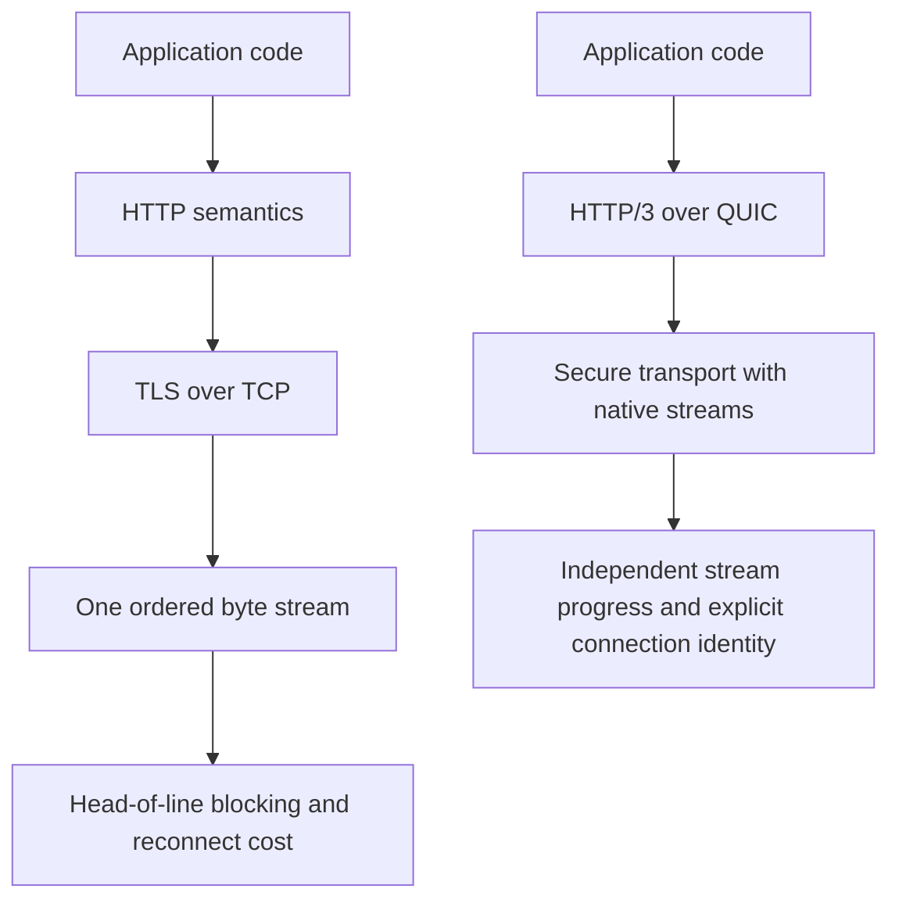
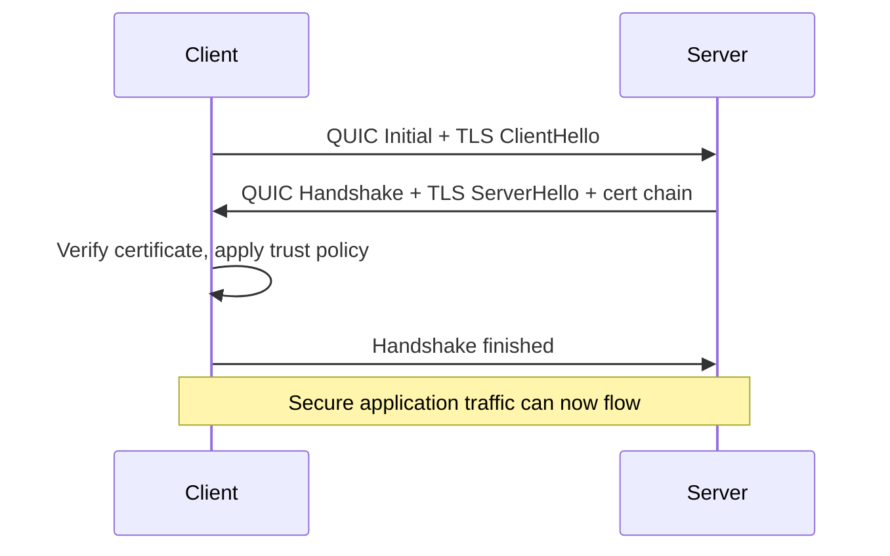
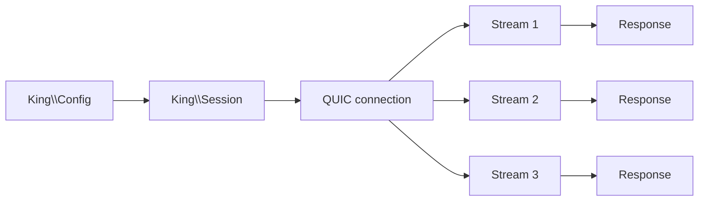
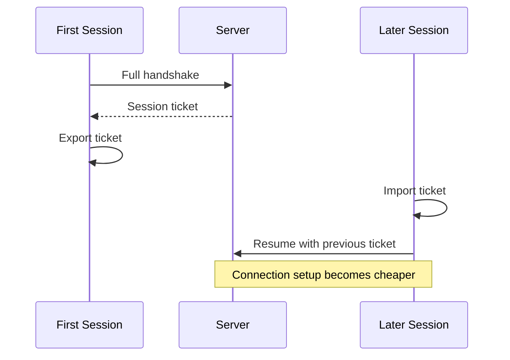

# QUIC and TLS

This chapter explains the transport layer that sits under a large part of King.
If you use HTTP/3, explicit sessions, session tickets, client certificates, or
transport tuning, you are already using the ideas described here whether you
think about them directly or not.

QUIC is worth a long explanation because it changes more than latency numbers
alone. It changes how a connection starts, how work is split into streams, how
timeouts feel, how reconnects behave, and how much state the runtime can keep
alive between requests. TLS matters equally because a fast connection is not
useful if the application cannot decide who to trust.

The goal of this chapter is simple. A reader who has never studied transport
protocols should be able to finish it and understand what `King\Session`,
HTTP/3, session tickets, certificate files, and QUIC tuning are doing. A
reader who already knows the field should be able to use the same chapter as a
map of where King exposes the transport.

## Start With The Problem

Before QUIC existed, most application stacks were split into layers that had to
cooperate but could not see each other very well. TCP moved bytes. TLS added
encryption and identity. HTTP sat on top and tried to turn the byte stream back
into requests, responses, and streams. This worked, but it also meant that the
stack inherited the limits of each layer.

If one packet was lost, an older stack could make unrelated work wait even when
the application had already split that work into separate logical requests. If
a mobile client changed network paths, the old connection often had to die and
restart. If the application wanted to keep rich transport state alive, it had
to fight a stack that was not designed to expose much of it clearly.

King uses QUIC because it fits the extension's overall shape. King does not
treat transport as an invisible utility. The runtime keeps explicit session
state, stream state, trust policy, cancellation, reuse, and retry behavior. A
transport that already thinks in streams, recovery, and connection identity is
a better fit than a transport that only thinks in one long byte pipe.



The left side still works. It is an older design with fewer native tools for
modern multi-stream work. The right side gives the runtime a better place to
represent what modern systems already need.

## What QUIC Is

QUIC is a transport protocol that usually runs over UDP. That sentence is true,
but it is too small to be useful. The important part is that QUIC bundles
several concerns that older stacks split apart. It handles secure connection
setup, loss recovery, congestion control, stream multiplexing, packet
protection, and connection identity as one transport.

That design has a few consequences that are easy to feel at the application
level. A QUIC connection can carry many independent streams. A slow or lost
packet on one stream does not force unrelated streams to stop making forward
progress at the application layer. A connection has its own identity, so a
device can change network paths without automatically losing the transport
state. The handshake is also tightly integrated with TLS, which means the
transport and security parts of the stack are not constantly handing control
back and forth through separate state machines.

When readers first hear "QUIC is over UDP", they often imagine an unreliable
fire-and-forget datagram pipe. That is not how QUIC feels in practice. QUIC
still gives the application ordered, reliable streams when it wants them. It
does so with a design that is better suited to modern multi-stream traffic and
explicit connection state.

## What TLS Is In This Context

[TLS](./glossary.md#tls) is the part that proves identity and protects traffic
in transit. In many programming stacks TLS feels like an afterthought. You set
one "secure" flag and hope the environment is configured correctly.

King does not treat TLS that way. The runtime exposes the parts of trust and
identity that matter in real systems. That includes certificate verification,
certificate-authority bundles, client certificates, private keys, minimum
protocol versions, session tickets, and related settings. The exact key names
live in the configuration reference, but the basic explanation belongs here.

If your program connects to a remote API, TLS answers the question "how do I
know this really is the remote API I meant to talk to?" If the remote side
expects mutual TLS, TLS also answers the question "how does the client prove
its own identity?" Those are not optional details. They are part of the basic
meaning of a network connection in production.

## QUIC And TLS Are Not Separate Stories

When people first meet QUIC, they sometimes picture it as "UDP plus some extra
logic" and then imagine TLS as something wrapped around it later. That picture
is wrong enough to cause confusion.

In King, the QUIC chapter and the TLS chapter are one chapter because QUIC and
TLS are one transport story in practice. The handshake, the keys, the early
traffic, the peer verification, the resumption information, and the HTTP/3
session above it all depend on that combined design.



That combined handshake is one reason HTTP/3 feels different from older HTTP
transport stacks. The secure transport and the request layer are much closer to
each other.

## The Three Ideas That Matter Most

If you remember only three things from this chapter, make them these.

First, a QUIC connection is not "one request". It is a live transport context
that can carry many streams and can survive more kinds of network change than a
traditional short-lived stack.

Second, the security policy is not a side file hidden somewhere in the machine.
King lets the application choose trust material and certificate behavior
deliberately through configuration and helper functions.

Third, connection reuse is not magic. When the runtime resumes a transport, or
reuses ticket state, or keeps a session alive for more requests, that is
explicit behavior the application can understand and tune.

## How A King Session Maps To QUIC

`King\Session` is the main object-level entry point into this transport model.
It represents a live client-side session to a host and port. That session owns
the transport context, its security settings, its statistics, and the streams
you create on top of it.

When you call the procedural `king_connect()`, you are asking the runtime to
open the same kind of session through the lower-level API. When you create
`King\Client\Http3Client`, the client is using the same transport ideas for
direct HTTP/3 request work. These are different entry points to one runtime
model, not unrelated stacks.



This is the practical picture to keep in mind. The session is the long-lived
owner. Streams are the individual units of work. Responses are what come back
from those streams.

The current tree also proves that lifecycle against real peers instead of only
describing it abstractly. The active QUIC coverage now follows one-shot HTTP/3
sessions through Initial, established/open, request-stream open/body/finish
plus request-body drain-before-response, response-drain, draining, and closed
phases with peer-observed capture, so the session model above is backed by
real transport behavior rather than by a conceptual diagram alone. The same
live peer coverage now also proves that negotiated QUIC idle timeouts surface
explicitly as transport closure and that peer-sent application closes surface
as protocol closes instead of collapsing into generic request timeouts.

## A First Session

The first explicit session usually looks like this:

```php
<?php

$config = new King\Config([
    'tls.verify_peer' => true,
    'quic.cc_algorithm' => 'bbr',
    'quic.ping_interval_ms' => 15000,
]);

$session = new King\Session('api.example.com', 443, $config);

$stream = $session->sendRequest(
    'GET',
    '/v1/status',
    ['accept' => 'application/json']
);

$response = $stream->receiveResponse(5000);

if ($response === null) {
    throw new RuntimeException('No response received.');
}

echo $response->getBody();
```

Nothing in this example is "HTTP/3 magic". It is a normal session, one stream,
and one response. The important part is that the transport policy sits in
`King\Config`, the connection lives in `King\Session`, and the unit of request
work is a stream rather than a hidden socket.

## Streams Explain Why QUIC Feels Different

A stream is a logical channel inside a connection. This is one of the biggest
practical differences between QUIC-based systems and older single-connection
transport models.

If you send three requests over a reused transport, the application does not
want one slow response to make the other two feel frozen. QUIC handles this by
letting the connection carry multiple streams. Each stream has its own ordered
byte sequence, but the connection can keep moving other streams forward.

King exposes this directly. `Session::sendRequest()` returns a `King\Stream`.
That stream has methods such as `send()`, `finish()`, `receiveResponse()`,
`isClosed()`, and `close()`. The procedural layer gives you the same model with
functions like `king_send_request()`, `king_receive_response()`,
`king_cancel_stream()`, and `king_poll()`.

This matters far beyond transport theory. It changes how you design client
reuse, streaming uploads, incremental reads, cancellation, and pooled request
work.

## Flow Control In Plain Language

Flow control sounds abstract until it goes wrong. In simple terms, flow control
means the receiver tells the sender how much data it is willing to accept
before the sender must wait. QUIC uses this at both the connection level and
the stream level.

Connection-level flow control protects the whole session. Stream-level flow
control protects each stream. Together, they stop one peer from flooding the
other with more data than the other side can buffer or process.

The relevant configuration names in King start with `quic.initial_max_*`. When
you see `quic.initial_max_data`, think "overall receive budget for the
connection". When you see `quic.initial_max_stream_data_*`, think "receive
budget per stream". When you see `quic.initial_max_streams_bidi` or
`quic.initial_max_streams_uni`, think "how many streams may exist at once".

You do not need to memorize the numbers immediately. You only need the basic
picture: flow control is how the transport turns memory and fairness limits
into explicit budgets.

## Congestion Control And Pacing

Flow control is about what the receiver can handle. Congestion control is about
what the network can handle.

A connection that blasts packets as fast as the CPU can send them will perform
poorly on real networks. Congestion control estimates how much traffic can be
in flight safely. Pacing shapes when packets are sent so the connection does
not create large bursts that the network drops immediately.

That is why King exposes settings such as `quic.cc_algorithm`,
`quic.cc_initial_cwnd_packets`, `quic.cc_min_cwnd_packets`,
`quic.cc_enable_hystart_plus_plus`, `quic.pacing_enable`, and
`quic.pacing_max_burst_packets`. These settings are for readers who want to
shape transport behavior on purpose instead of accepting one opaque default.

Most applications should start with the defaults, measure, and then tune only
when they have a real reason. The chapter matters because once you do have that
reason, the names stop looking mysterious.

## Connection IDs And Path Changes

One quiet strength of QUIC is that a connection has its own identity separate
from the current 4-tuple of source IP, source port, destination IP, and
destination port. This is where [connection IDs](./glossary.md#connection-id)
matter.

If a device moves from one network path to another, QUIC can keep the
connection identity and continue instead of throwing the whole transport away by
default. This does not mean every path change is free. It means the transport
model is better prepared for network movement than an older socket model that
tied identity too closely to one path.

In King, this matters for long-lived sessions, HTTP/3 reuse, and systems that
keep control or realtime traffic alive across unstable networks.

## Session Tickets And Resumption

A [session ticket](./glossary.md#session-ticket) is resumable state that helps
a later connection continue faster. You can think of it as proof that the
client and server have already met and may reuse some of the expensive setup
work next time.

King makes ticket handling explicit instead of hiding it behind process-local
state. You can export a ticket from a live session with
`king_export_session_ticket()` or its client-facing alias
`king_client_tls_export_session_ticket()`. You can import a previously saved
ticket with `king_import_session_ticket()` or
`king_client_tls_import_session_ticket()`.

```php
<?php

$session = new King\Session('api.example.com', 443, $config);
$ticket = king_export_session_ticket($session);

file_put_contents('/var/lib/king/tickets/api.ticket', $ticket);

$resumed = new King\Session('api.example.com', 443, $config);
king_import_session_ticket(
    $resumed,
    file_get_contents('/var/lib/king/tickets/api.ticket')
);
```

Ticket reuse matters when a service makes many short bursts of outbound work to
the same remote system. Instead of paying the full connection setup cost every
time, the runtime can carry useful state forward.

King also exposes `tls.enable_early_data` and related ticket settings because
some deployments want to use resumption aggressively while others prefer a
stricter trust policy.

### The Ticket Functions In Practice

The ticket API appears in two naming styles because the runtime exposes both a
session-first surface and a client-facing alias surface. The function pairs do
the same job:

`king_export_session_ticket()` and
`king_client_tls_export_session_ticket()` both take a live session and return a
ticket string that can be stored somewhere durable. `king_import_session_ticket()`
and `king_client_tls_import_session_ticket()` take a live session plus a ticket
string and attach that resumable state before the next connection attempt.

The important idea is simple. Export functions read resumable state out of a
session that has already completed a handshake. Import functions place that
state onto a new session that is about to connect again to the same service.

If you are reading a short example and see the client-facing alias names, do
not assume there are two different ticket systems. There is one ticket system
with two entry styles so that procedural code and OO-style client code stay
consistent.



## Trust Material: CA Files, Client Certificates, And Peer Subjects

Trust starts with certificate validation. A client needs a CA file or CA bundle
that tells it which certificate authorities it is willing to trust. King
exposes that decision through `king_set_ca_file()` and the client-facing alias
`king_client_tls_set_ca_file()`.

Some systems also require the client to present its own certificate. That is
where `king_set_client_cert()` and `king_client_tls_set_client_cert()` matter.
They bind a client certificate and private key to the runtime so the remote
side can verify the client as part of the TLS handshake.

After the handshake, a caller can inspect the negotiated peer identity through
`king_session_get_peer_cert_subject()`. This is useful when applications want
to log or enforce details of the remote certificate subject instead of treating
verification as a black box.

In practice, these four questions matter most:

1. Which certificate authorities do I trust?
2. Must the peer present a valid certificate?
3. Must I present my own certificate?
4. Do I need to inspect the peer subject after connection?

King exposes all four on purpose because real deployments regularly need all
four.

### The CA File Functions

`king_set_ca_file()` and `king_client_tls_set_ca_file()` set the certificate
authority file that the runtime should trust for outbound TLS verification.
Both functions answer the same operational question: which authority signed the
peer certificate, and do you trust that authority enough to continue the
handshake?

In small examples this may look like a one-line setup call. In production it
is a statement of trust policy. A private control plane, an internal API, and a
public internet service often trust different roots. The explicit function
exists so that the runtime does not silently inherit trust from whatever the
host happened to ship.

### The Client Certificate Functions

`king_set_client_cert()` and `king_client_tls_set_client_cert()` bind a client
certificate path and key path to the active outbound TLS profile. Use these
functions when the remote side expects mutual TLS, often shortened to mTLS. In
that model the server proves its identity to the client, and the client also
proves its identity back to the server.

This matters for private APIs, control planes, admin listeners, internal
service-to-service links, and any environment where "reaching the port" is not
enough. The certificate answers "which client is this?" before application work
starts.

### Peer Subject Inspection

`king_session_get_peer_cert_subject()` lets you read the normalized certificate
subject from a live server-capable session after the handshake has already
finished. This function takes the session plus the current server-session
capability integer. That capability is a guard value carried by the active
session snapshot so that later code cannot inspect stale or unrelated server
state by accident.

The return value is an associative array describing the peer subject. You use
it when verification alone is not the whole policy. Many systems also need to
log the peer identity, compare it against an expected subject, or apply
different server behavior depending on which certificate connected.

This function belongs in the TLS chapter because it is still about trust and
identity, even though the session capability model is explained in more detail
in [Server Runtime](./server-runtime.md).

## The Most Important QUIC Settings

Readers often open the full runtime configuration reference and feel buried by
the number of keys. The easiest way to stay oriented is to group the settings
by what they are trying to control.

| Family | What it changes |
| --- | --- |
| `quic.cc_*` | Congestion-control behavior and startup window sizes. |
| `quic.pacing_*` | Whether packets are paced and how large bursts may be. |
| `quic.max_ack_delay_ms`, `quic.ack_delay_exponent`, `quic.pto_*` | Recovery timing, acknowledgement timing, and probe behavior. |
| `quic.initial_max_data` | Total receive budget for the whole connection. |
| `quic.initial_max_stream_data_*` | Receive budget per stream. |
| `quic.initial_max_streams_*` | How many streams may exist at once. |
| `quic.ping_interval_ms` | Keepalive behavior for idle sessions. |
| `quic.active_connection_id_limit` | How many connection IDs may be kept ready. |
| `quic.datagrams_enable`, `quic.dgram_*` | Datagram support and queue sizing. |
| `quic.stateless_retry_enable`, `quic.grease_enable` | Interoperability and defense-related protocol behavior. |

The table is not a substitute for the full reference. It is only here so that
the key names have a shape in your head before you look at the long list in
[Runtime Configuration Reference](./runtime-configuration.md).

## The Most Important TLS Settings

The TLS keys also become easier to read when grouped by purpose rather than by
alphabetical order.

| Family | What it changes |
| --- | --- |
| `tls.verify_peer`, `tls.verify_depth` | Whether the remote certificate is verified and how deep the chain may be. |
| `tls.default_ca_file` | Which CA bundle the runtime trusts by default. |
| `tls.default_cert_file`, `tls.default_key_file` | Which client certificate and private key the runtime presents by default. |
| `tls.min_version_allowed`, `tls.tcp_tls_min_version_allowed` | The lowest TLS version the runtime accepts. |
| `tls.ciphers_tls13`, `tls.ciphers_tls12`, `tls.curves` | Cipher suite and curve preferences. |
| `tls.session_ticket_lifetime_sec`, `tls.ticket_key_file` | Ticket lifecycle and server-side ticket key material. |
| `tls.enable_early_data` | Whether resumption may send early application data. |
| `tls.enable_ocsp_stapling`, `tls.enable_ech`, `tls.require_ct_policy` | Advanced trust and privacy features. |

If you are just starting, the first keys to understand are usually
`tls.verify_peer`, `tls.default_ca_file`, `tls.default_cert_file`,
`tls.default_key_file`, and `tls.min_version_allowed`.

## How HTTP/3 Sits On Top

HTTP/3 is the HTTP layer that rides on this transport. The easiest way to think
about it is that QUIC and TLS build the road, and HTTP/3 drives on that road.

If you use `king_http3_request_send()` or `King\Client\Http3Client`, the
transport details described in this chapter still shape the result. Connection
reuse, ticket reuse, handshake cost, peer verification, cancellation
responsiveness, keepalive behavior, and transport statistics all come from the
session underneath.

That is why this chapter comes before the main WebSocket and HTTP/3 discussions
in the handbook. The request layer makes more sense once the reader understands
the transport the requests are riding on.

## Failure Paths That Matter In Practice

Transport chapters often make protocols sound smooth and elegant. Production
systems are noisier. Networks drop packets. Certificate files go missing.
Remote peers present the wrong certificate. Middleboxes kill idle traffic.
Remote hosts accept a port but never finish the handshake.

King keeps these failures visible. A session can fail before it connects. A
stream can time out. A transport can close while the application still thinks a
request is in flight. The reason to study QUIC and TLS is not only to make the
fast path faster. It is also to understand why the failure path looks the way
it does and which knobs shape recovery.

The transport statistics returned by `Session::stats()` are part of that story.
Round-trip time, retransmits, bytes, stream counts, and related numbers help a
caller answer "is this a server problem, a network problem, or a policy
problem?"

## When To Use The Low-Level Session API

Many readers can stay at the HTTP client layer most of the time. You usually
move down to the explicit session API when one of the following becomes true.

You want to keep a long-lived transport alive and reuse it intentionally. You
want to manage tickets yourself. You want detailed transport statistics. You
want to drive the session event loop with `poll()`. You want to reason directly
about streams, cancellation, and response timing.

If none of that applies yet, that is fine. The chapter still matters because it
explains what the higher-level clients are doing under the hood.

## A Good Reading Order From Here

If you want to keep following the networking story, the next chapter is
[HTTP Clients and Streams](./http-clients-and-streams.md). That chapter takes
the transport model described here and shows what a request, response, stream,
timeout, and pooled session look like from application code.

If you care about long-lived bidirectional channels, continue with
[WebSocket](./websocket.md). If you want the exact key names and accepted value
ranges, keep this chapter open in one tab and read
[Runtime Configuration Reference](./runtime-configuration.md) in another.
