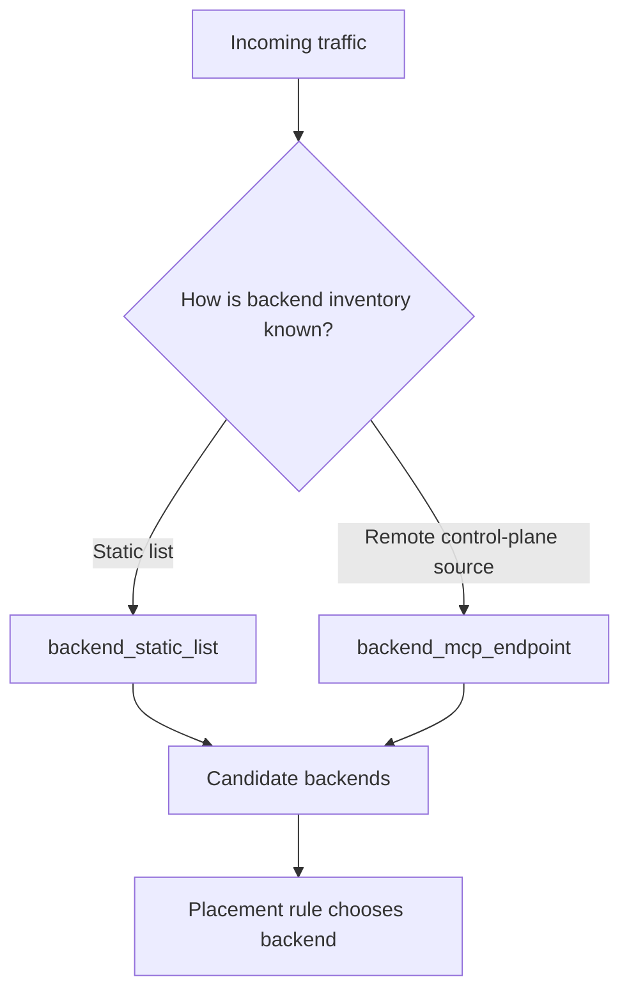
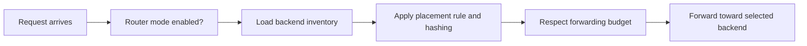

# Router and Load Balancer

This chapter explains how King models traffic distribution once more than one
backend can serve the same kind of work. It is the chapter where discovery,
topology, and autoscaling turn into actual traffic decisions.

The router and load-balancer surface in King is a config-backed subsystem. That
does not make it less important. It means the main public contract lives in
runtime and deployment policy rather than in a separate procedural request API.
The subsystem tells the platform how backend discovery works, how requests are
assigned, how stable the assignment should be across repeated traffic, and how
much forwarding work one process should be willing to take on.

## Start With The Problem

The moment one service has more than one backend, the platform needs a rule for
choosing among them. That rule has to do more than "pick one at random." Real
systems care about stability, fairness, capacity, load, topology, and the cost
of moving work around unnecessarily.

A router therefore has to answer three questions at once.

The first question is discovery: what backends exist right now? The second
question is placement: which backend should receive this request? The third
question is pacing: how much forwarding work should this process attempt before
it starts protecting itself?

King keeps those answers together as one router and load-balancer policy surface
instead of scattering them across unrelated helpers.

## What This Subsystem Is

The router and load balancer in King is the part of the platform that defines
how incoming work is mapped onto available backends. It is the policy layer
between traffic arrival and backend execution.

This subsystem is closely related to Semantic-DNS and autoscaling, but it is not
the same thing as either of them. Semantic-DNS answers "which services are good
route candidates?" Autoscaling answers "how many backend nodes should exist?"
The router answers "given the current backend inventory, which backend should
this traffic actually go to?"

That distinction matters because one platform can discover perfectly good
backends and still route traffic badly if the balancing policy is weak.

## The Config-Backed Contract

King exposes the router and load-balancer as a config-backed system component.
The public runtime describes the component as `router_loadbalancer` with a
`forwarding_contract` of `config_only`.

This means the important public surface is the policy and introspection layer.
The subsystem declares how routing should behave, how backends are discovered,
which hashing strategy is used, and how much forwarding work is permitted. The
platform can then reason about the router as a first-class system component even
though the surface is primarily configuration-driven.

This is a normal design for control-plane policy. Not every important subsystem
needs a large procedural API to be real.

## The Main Router Questions

The router answers a few recurring questions.

What is the backend inventory? Is the inventory static, or should it be learned
through another runtime such as MCP-backed discovery? Should repeated traffic
from the same identity stay sticky to the same backend when possible? How much
forwarding traffic per process is acceptable before the local node should
protect itself? What entropy should shape consistent placement so traffic
distribution stays stable but still safe?

These questions explain the key configuration fields more clearly than a raw key
list does.

## The Core Configuration Fields

The main runtime policy fields are:

`router_mode_enable`, `hashing_algorithm`, `connection_id_entropy_salt`,
`backend_discovery_mode`, `backend_static_list`, `backend_mcp_endpoint`,
`backend_mcp_poll_interval_sec`, and `max_forwarding_pps`.

The system INI surface mirrors those through the `king.router_*` directives,
including `king.router_mode_enable`, `king.router_hashing_algorithm`,
`king.router_connection_id_entropy_salt`,
`king.router_backend_discovery_mode`, `king.router_backend_static_list`,
`king.router_backend_mcp_endpoint`,
`king.router_backend_mcp_poll_interval_sec`, and
`king.router_max_forwarding_pps`.

The chapter below explains what these mean in ordinary language.

## Router Mode

`router_mode_enable` is the top-level switch that says whether the runtime
should behave as a router and load-balancer policy participant.

This is important because a platform node does not always play the same role. A
node may act as a pure worker, a pure origin, a pure controller, or a
traffic-facing ingress. Router mode is the point where the platform states that
this node should actively take part in traffic distribution rather than only in
backend execution.

## Backend Discovery

The router cannot place traffic if it does not know which backends exist. That
is why backend discovery mode is one of the first router settings.

`backend_discovery_mode` tells the runtime where the backend inventory should
come from. `backend_static_list` is the simplest option and gives the router a
fixed backend set. `backend_mcp_endpoint` and
`backend_mcp_poll_interval_sec` support the policy where backend inventory is
learned or refreshed through an MCP-backed discovery path.

This matters because discovery policy changes how dynamic the router can be. A
static list is stable and predictable. An MCP-backed inventory can follow a
living backend set more closely.



This is the first half of the routing story: discovering the candidate pool.

## Stable Placement And Hashing

Once the backend inventory exists, the next question is how requests are placed.
The key setting here is `hashing_algorithm`.

The point of a hashing strategy is not mathematical elegance. The point is
placement stability. If traffic from the same client, session, or connection
identity should usually land on the same backend, the routing policy needs a
stable way to decide that.

A stable placement rule reduces unnecessary churn. It can improve cache warmth,
session locality, and predictable load distribution. At the same time, the
router must still spread traffic across the backend pool in a way that does not
concentrate all work onto one target.

`connection_id_entropy_salt` belongs here because stable placement should not be
fully predictable from the outside. The salt gives the hashing process a
platform-controlled entropy source so repeated placement can be stable without
being a transparent open secret.

## Forwarding Budget

A router is also a process with finite local limits. Even if the backend pool
looks healthy, the current process should not forward traffic without any local
ceiling.

`max_forwarding_pps` is the key that shapes this limit. In plain language, it is
the process-level forwarding budget. It tells the node how aggressively it is
willing to behave as a traffic-forwarding participant.

This matters because a traffic-distribution layer must protect itself too. A
node that forwards without a local budget can become unstable even if the
backends behind it are not yet saturated.

## The Routing Decision In One Picture



This is the complete high-level shape of the subsystem. Discovery, placement,
budget, and forwarding are one continuous decision path.

## Why Consistent Placement Matters

Readers sometimes treat load balancing as if the only goal were to make counts
look even. In real systems, a perfectly even but constantly shifting placement
can be worse than a slightly uneven but stable one.

Stable placement helps when backends benefit from locality. A backend may keep a
warm cache, a hot working set, open upstream sessions, or a local model already
loaded in memory. If traffic for the same caller or object jumps around too
often, the platform loses that locality.

That is why hashing and placement policy deserve explanation in the handbook.
Routing is not only about dividing work. It is also about deciding what kind of
stability the traffic should preserve.

## How The Router Fits With Semantic-DNS

Semantic-DNS and the router are neighbors because they answer adjacent
questions.

Semantic-DNS discovers and scores service candidates using service identity,
health, load, topology, and mother-node state. The router uses backend discovery
and placement policy to decide how one node forwards traffic toward those
candidates.

In simpler words, Semantic-DNS helps answer "which backends look appropriate?"
The router helps answer "how should this node actually distribute traffic among
those backends?"

This is why a platform that has strong discovery but weak router policy still
feels incomplete.

## How The Router Fits With Autoscaling

Autoscaling changes the backend pool over time. The router decides how traffic
is placed onto the current backend pool. Those two systems therefore influence
each other constantly.

When autoscaling adds nodes, the router gets a larger candidate set. When
autoscaling drains nodes, the router should stop preferring them. When a new
node joins, stable placement policy has to absorb that topology change without
causing unnecessary traffic churn.

This is another reason the router chapter belongs after Semantic-DNS and
autoscaling. Discovery says which services are viable. Autoscaling changes the
size of the pool. Router policy determines how traffic behaves across that pool.

## How The Router Fits With The Rest Of The Platform

The router chapter also matters for other subsystems.

An object-store-backed service may want sticky routing so the same artifact
traffic keeps landing on a backend with the hottest local state. A WebSocket or
long-lived session workload may care about connection identity in placement
decisions. An MCP-backed backend discovery mode may let the control plane update
router knowledge without rewriting static configuration. A telemetry system may
want to record forwarding rate, churn, and backend imbalance.

That is why this subsystem belongs in the main handbook even though its surface
is mostly config-driven. It shapes traffic behavior for many other parts of the
platform.

## Reading The Component Introspection

The system component introspection for `router_loadbalancer` exposes the router
as a named system component with a `config_backed` implementation. The
configuration view includes:

`router_mode_enable`, `hashing_algorithm`, `backend_discovery_mode`,
`backend_static_list`, `backend_mcp_endpoint`,
`backend_mcp_poll_interval_sec`, `max_forwarding_pps`, and
`forwarding_contract`.

This matters because it gives operators and applications a stable way to inspect
what routing mode the runtime is currently using. A config-backed subsystem is
still a real subsystem, and the introspection view is part of what makes it
operable.

## A Full Configuration Example

The following example shows the general shape of the router configuration in a
runtime snapshot.

```php
<?php

$config = new King\Config([
    'router_mode_enable' => true,
    'hashing_algorithm' => 'consistent_hash',
    'connection_id_entropy_salt' => 'replace-this-with-a-long-random-secret',
    'backend_discovery_mode' => 'mcp',
    'backend_static_list' => '10.0.1.10:8443,10.0.1.11:8443',
    'backend_mcp_endpoint' => '127.0.0.1:9998',
    'backend_mcp_poll_interval_sec' => 10,
    'max_forwarding_pps' => 1000000,
]);
```

This example is not here to claim that every deployment should use the same
values. It is here to show the shape of the policy surface.

## How To Think About Static Versus Dynamic Discovery

Static backend lists are easier to reason about and often good enough for
smaller or more stable deployments. They make the candidate set explicit and
predictable.

Dynamic discovery through an MCP endpoint is useful when the backend inventory
changes more often or when the control plane already maintains a fresh backend
view elsewhere. In that case, the router does not need to carry the whole
backend list as a fixed string forever. It can refresh its view on a poll
interval through the discovery source.

The real decision is not "which mode is more advanced?" The real decision is
"how often does the backend pool change and who should be the source of truth
for that pool?"

## Common Mistakes

One common mistake is treating load balancing as if it only meant "spread
requests evenly." Stable placement, local hot state, and routing churn matter
too.

Another mistake is treating backend discovery and route placement as unrelated
problems. A router can only be as good as the backend inventory it sees.

Another mistake is ignoring the local forwarding budget. A node that forwards
without a ceiling can become a bottleneck or failure point itself.

Another mistake is forgetting that router policy sits downstream of discovery
and autoscaling. If those systems change and router policy is not updated
accordingly, traffic behavior will still be wrong.

## Where To Go Next

If the next question is "how does the platform decide which service candidates
are healthy and routeable before forwarding even begins?", read
[Smart DNS and Semantic-DNS](./semantic-dns.md). If the next question is "how
does the backend pool grow or shrink over time?", read
[Autoscaling](./autoscaling.md). If the next question is "how are requests and
listeners modeled before routing enters the picture?", read
[Server Runtime](./server-runtime.md).
