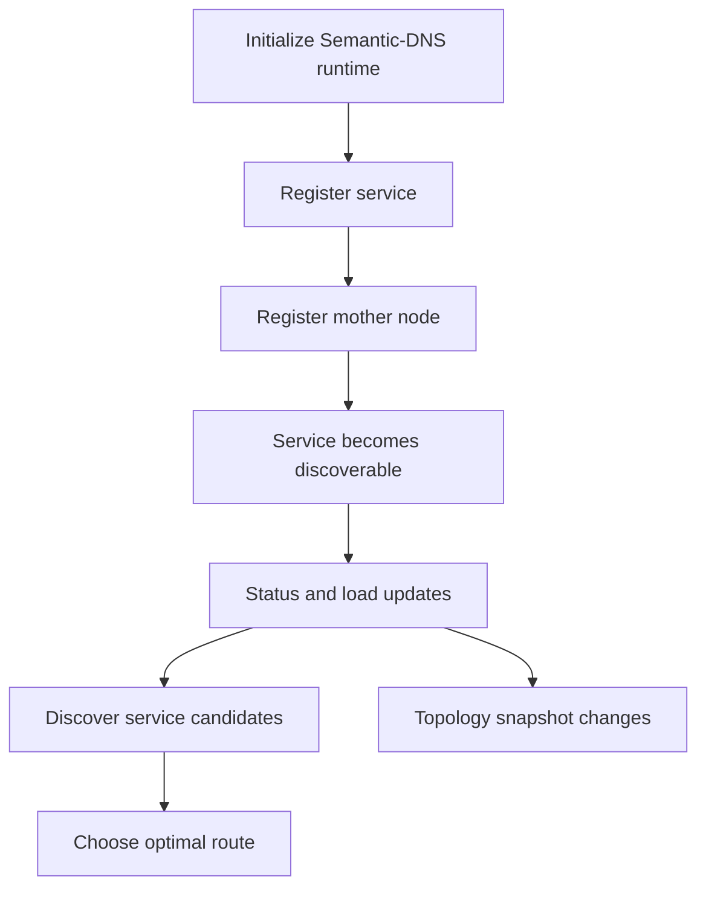
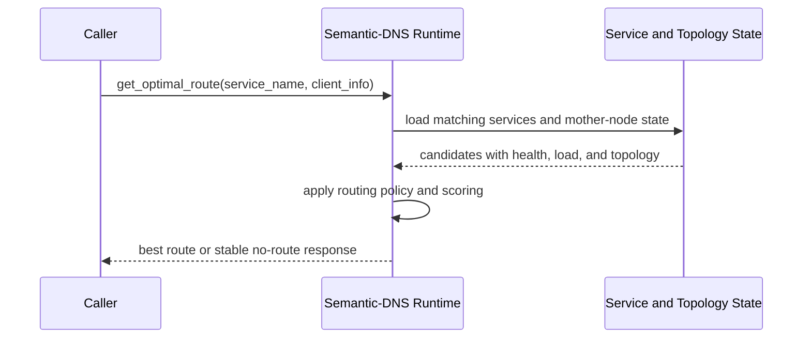

# Smart DNS and Semantic-DNS

This chapter explains how King turns naming, service discovery, and route
selection into one coherent runtime instead of treating them as three unrelated
systems.

Many teams first meet service discovery as a lookup problem. A service has a
name, the system returns an address, and the story appears to end there. Real
systems do not stay that simple for long. Once there are several backends for
the same service, several health states, several load levels, several network
regions, and several control-plane nodes that need to agree about topology, the
question is no longer "what IP belongs to this name?" The question becomes
"which service instance should answer this request right now, and why?"

That is the problem Semantic-DNS is designed to solve.

## Start With The Core Idea

Smart DNS in King means DNS used as an active service-discovery and routing
system instead of only a static name-to-address table. Semantic-DNS adds a
richer model on top of that. Services are not only names and ports. They also
have identity, type, health, live load, attributes, topology membership, and a
relationship to mother nodes that coordinate or observe the broader service map.

The result is that route selection becomes a runtime decision informed by live
state instead of a static configuration guess made long before the request
arrived.

## Why This Matters

A large system usually has more than one backend that could answer the same
kind of work. It may have several API nodes, several inference workers,
several artifact stores, several orchestration workers, or several admin
endpoints. If the system always picks the same endpoint, it will ignore health
changes and overload one target. If it chooses randomly, it will often make bad
choices under churn. If it leaves service discovery in one tool and routing in
another, the platform becomes harder to reason about.

King keeps these concerns together so the same runtime can answer the full
question: which services exist, which are healthy, what their live load looks
like, which topology they belong to, and which route is best for the current
request.

## What Semantic-DNS Is In Plain Language

Semantic-DNS is the service-discovery control plane inside King. It tracks
service records, mother nodes, service status, live load, and routing policy.
The runtime can then answer three kinds of questions.

The first question is "what services of this type currently exist?" The second
question is "what does the current topology look like?" The third question is
"which route is best right now for this named service?"

Those three questions correspond directly to the main public calls:
`king_semantic_dns_discover_service()`,
`king_semantic_dns_get_service_topology()`, and
`king_semantic_dns_get_optimal_route()`.

## The Public Surface

The Semantic-DNS API is intentionally direct.

`king_semantic_dns_init()` initializes the runtime with bind, TTL, discovery,
mode, and routing configuration. `king_semantic_dns_start_server()` starts the
runtime server state. `king_semantic_dns_register_service()` adds a service
record. `king_semantic_dns_register_mother_node()` adds a mother-node record.
`king_semantic_dns_update_service_status()` patches live status and optional
load counters for a service. `king_semantic_dns_discover_service()` returns the
discoverable services for one service type. `king_semantic_dns_get_optimal_route()`
returns the best route for a named service. `king_semantic_dns_get_service_topology()`
returns the current topology view.

The value of this API is not that it is exotic. The value is that each call
maps to one real control-plane question.

## Services, Types, And Names

The first thing the runtime needs is a service record. A service record tells
the platform that one concrete service instance exists. That record includes a
service identifier, service name, service type, hostname, port, and optional
state such as status, current load, active connections, total requests, and
scalar attributes.

The difference between service name and service type matters. A service name is
usually the specific logical endpoint the caller wants, such as
`model-router-primary` or `artifact-origin`. A service type is the broader class
of service, such as `inference`, `artifact_store`, or `orchestrator_worker`.
Discovery often starts with service type. Final route choice often ends with
service name.

This distinction is one reason Semantic-DNS is more useful than a flat registry.
It can represent both what a service is and which concrete instance is being
considered.

## Mother Nodes

The phrase "mother node" needs a plain explanation because it is not universal
language outside this subsystem.

A mother node is a higher-level topology participant that coordinates, observes,
or anchors groups of managed services. It is part discovery peer, part topology
authority, and part route-shaping influence. A mother node record includes a
node identifier, hostname, port, and optional state such as status, managed
service count, and trust score.

This matters because route selection is not always only about one service's
local health. In larger systems, topology also matters. A route that looks good
in isolation may still be a poor choice if the surrounding node is degraded,
distrusted, or overloaded.

## The Lifecycle Of A Service Record

The easiest way to understand the subsystem is to follow one service through its
lifecycle.

The runtime is initialized. The service is registered. Its mother node, if any,
is registered. The service enters the discoverable set. Later its health or load
changes. Discovery results change. Route selection changes. Topology snapshots
change. Eventually the service may be removed, drained, or become unroutable.



This is why route choice belongs inside the same subsystem as registration and
status updates. They are stages in the same control-plane story.

## Initialization

`king_semantic_dns_init()` builds the runtime configuration snapshot for the
subsystem. This is where the platform decides the bind host, port, default TTL,
service-discovery limits, mother-node sync behavior, and optional routing
policies.

```php
<?php

king_semantic_dns_init([
    'dns.server_bind_host' => '127.0.0.1',
    'dns.server_port' => 5353,
    'dns.default_record_ttl_sec' => 30,
    'dns.service_discovery_max_ips_per_response' => 8,
    'dns.semantic_mode_enable' => true,
    'dns.mothernode_uri' => 'mcp://semantic-core.internal:7443',
    'dns.routing_policies' => [
        'prefer_local_region' => true,
        'penalize_high_load' => true,
    ],
]);
```

The important part is not to memorize every key here. The important part is that
the system can state its discovery and routing mode explicitly before
services start joining the topology.

## Starting The Server State

After initialization, `king_semantic_dns_start_server()` starts the active
server-state slice for the subsystem. In simple terms, this moves the runtime
from "configured" to "actively serving Semantic-DNS state and route decisions."

This matters because discovery and route selection are not purely static
configuration reads. They belong to live runtime state.

## Registering Services

Once the runtime exists, services can be registered.

```php
<?php

king_semantic_dns_register_service([
    'service_id' => 'infer-eu-1',
    'service_name' => 'inference-primary',
    'service_type' => 'inference',
    'hostname' => '10.0.1.10',
    'port' => 8443,
    'status' => 'healthy',
    'current_load_percent' => 27,
    'active_connections' => 142,
    'total_requests' => 185443,
    'attributes' => [
        'region' => 'eu-central',
        'accelerator' => 'gpu',
    ],
]);
```

This is the point where a service becomes part of the live discovery map.
Without registration, there is no service for the routing layer to choose from.

## Registering Mother Nodes

Mother nodes are registered separately because they are not the same thing as
services.

```php
<?php

king_semantic_dns_register_mother_node([
    'node_id' => 'mother-eu-1',
    'hostname' => '10.0.1.2',
    'port' => 7443,
    'status' => 'healthy',
    'managed_services_count' => 37,
    'trust_score' => 97,
]);
```

Once mother nodes exist in the topology, the routing layer can take topology
coordination and trust policy into account instead of only looking at one
service record in isolation.

## Discovering Services

`king_semantic_dns_discover_service()` answers the question "which routeable
services of this type currently match my criteria?"

```php
<?php

$discovery = king_semantic_dns_discover_service('inference', [
    'region' => 'eu-central',
    'accelerator' => 'gpu',
]);

print_r($discovery);
```

The point of discovery is not yet to choose one winner. The point is to build a
candidate set. This is where service type and scalar criteria matter most.

That distinction keeps the control-plane model clear. Discovery narrows the set.
Routing chooses from that set.

## Updating Health And Load

Registration alone is not enough because systems change while they are running.
`king_semantic_dns_update_service_status()` lets the runtime patch the status of
one registered service and optionally update live load counters such as current
load, active connections, and total requests.

```php
<?php

king_semantic_dns_update_service_status(
    'infer-eu-1',
    'degraded',
    [
        'current_load_percent' => 88,
        'active_connections' => 441,
        'total_requests' => 186002,
    ]
);
```

This is one of the most important calls in the subsystem because it turns the
registry from a static list into a live route-selection system.

If a service becomes unhealthy, that should affect route choice. If a service is
still healthy but overloaded, that should also affect route choice. Without
status and load updates, discovery quickly falls back to being a stale catalog.

Those updates can come from direct application writes or from live probe data.
When a service record includes attributes such as `health_check_path`,
`health_check_host`, or `health_check_port`, the running Semantic-DNS server
can refresh the active service record from a real HTTP endpoint before it
answers discovery, topology, or route questions.

When Semantic-DNS persistence is enabled, King also treats those writes as a
shared control-plane state problem instead of a local array update. Concurrent
service registration, status changes, and probe-driven refreshes are serialized
through the durable-state lock, and each writer reloads the latest persisted
snapshot before applying its own mutation. That is what keeps one worker from
quietly deleting another worker's registration or status update when both touch
the same Semantic-DNS state file at nearly the same time.

## Choosing The Optimal Route

`king_semantic_dns_get_optimal_route()` answers the final routing question:
"given the current service state, topology, and optional client information,
which route should be used right now?"

```php
<?php

$route = king_semantic_dns_get_optimal_route('inference-primary', [
    'client_region' => 'eu-central',
    'latency_sensitive' => true,
]);

print_r($route);
```

This is where the subsystem becomes more than a registry. It is no longer only
returning a list of names. It is making a route decision from live state.

That live state can be fed by direct status calls and by HTTP health probes.
Probe responses can publish values such as `X-King-Service-Status`,
`X-King-Load-Percent`, `X-King-Active-Connections`, and
`X-King-Total-Requests`. The route layer can then score the current candidates
from what the service is reporting now, not only from the values it had when it
was first registered.



This sequence is the heart of the chapter. Registration and updates feed the
decision. Discovery narrows the candidate set. Routing selects the result.

## Topology Snapshots

`king_semantic_dns_get_service_topology()` returns the broad current view of the
runtime: services, mother nodes, statistics, and the generation timestamp of the
topology snapshot.

```php
<?php

$topology = king_semantic_dns_get_service_topology();
print_r($topology);
```

This matters because operators and control-plane components often need the whole
map, not only the latest one-route answer. A topology snapshot is useful for
debugging, observability, audits, and control decisions made outside the
immediate request path.

## Health, Degraded State, And Routing Safety

One of the easiest ways to misunderstand service discovery is to treat it like a
name lookup and ignore health semantics. Semantic-DNS exists precisely so the
platform can do better than that.

Healthy, degraded, maintenance, and unhealthy are different routing states, not
just labels for dashboards. A degraded service may still be routeable when the
platform needs it. An unhealthy service should not quietly win a route decision
because its name still exists in the registry. A service in maintenance may be
discoverable in some topology views but not a valid answer for active traffic.

That is why the status update path and the route-selection path belong in the
same subsystem. The platform should not need one way of thinking for
"registration is true" and another for "routing is safe."

## Client Information And Route Policy

The route function accepts optional client information for a reason. The best
route is not always the same for every caller.

A latency-sensitive client in one region may want a different target than a
batch workload in another region. A large payload download may prefer a route
with lower current load even if another candidate is geographically closer. A
trusted internal caller may be allowed to see routes that a public caller should
never receive.

This is what turns the subsystem from plain lookup into semantic routing. The
route result is a function of service state, topology state, and caller context.

## Mother-Node Synchronization

Mother nodes matter because larger topologies do not stay correct by accident.
They need coordination. A mother node gives the system a higher-level place to
track the shape of the topology, the number of managed services, and the trust
or health of the coordinating nodes themselves.

This does not mean every service instance must become a topology authority. It
means the runtime can keep the service map and the topology map close enough
together that route selection remains informed by both.

In practice, mother-node synchronization is what helps a discovery system remain
consistent when the topology is changing, not only when it is static.

In the current runtime, that synchronization is guarded as one persisted-state
transaction. When several local processes register or update mother nodes at
nearly the same time, King refreshes the registry-backed topology, applies the
new mother-node change, recalculates discovery and synchronization counters, and
then persists the whole result while the state lock is still held. That is what
keeps larger local topology churn from tearing the mother-node view away from
the statistics that discovery and routing consume.

## How Semantic-DNS Fits With The Router And Load Balancer

It is important to separate discovery from forwarding while still understanding
that they cooperate.

Semantic-DNS answers "which backend should I prefer?" The router and load
balancer answer "how do I send traffic to that backend?" Discovery and routing
policy produce the decision. Forwarding and balancing execute the decision.

That is why the Semantic-DNS chapter sits beside the router chapter in the
handbook. One decides. The other acts.

## How Semantic-DNS Fits With Autoscaling

Autoscaling changes the topology. Semantic-DNS describes the topology. Those two
subsystems naturally interact.

When autoscaling adds nodes, new service records or mother-node relationships
may appear. When autoscaling drains or removes nodes, service health and route
eligibility change. A routing system that does not understand topology churn
cannot react intelligently to autoscaling. An autoscaling system that does not
understand how discovery will route new nodes into traffic is also incomplete.

That is why these chapters belong close together in the handbook.

## A Full Example

The following example shows a realistic sequence: initialize the runtime, start
the server state, register one mother node, register two services, patch live
load on one service, discover candidates, and finally ask for the best route.

```php
<?php

king_semantic_dns_init([
    'dns.server_bind_host' => '127.0.0.1',
    'dns.server_port' => 5353,
    'dns.default_record_ttl_sec' => 30,
    'dns.service_discovery_max_ips_per_response' => 8,
    'dns.semantic_mode_enable' => true,
    'dns.mode' => 'service_discovery',
]);

king_semantic_dns_start_server();

king_semantic_dns_register_mother_node([
    'node_id' => 'mother-eu-1',
    'hostname' => '10.0.1.2',
    'port' => 7443,
    'status' => 'healthy',
    'managed_services_count' => 2,
    'trust_score' => 98,
]);

king_semantic_dns_register_service([
    'service_id' => 'infer-eu-1',
    'service_name' => 'inference-primary',
    'service_type' => 'inference',
    'hostname' => '10.0.1.10',
    'port' => 8443,
    'status' => 'healthy',
    'current_load_percent' => 24,
    'attributes' => [
        'region' => 'eu-central',
        'accelerator' => 'gpu',
        'health_check_path' => '/health',
    ],
]);

king_semantic_dns_register_service([
    'service_id' => 'infer-eu-2',
    'service_name' => 'inference-primary',
    'service_type' => 'inference',
    'hostname' => '10.0.1.11',
    'port' => 8443,
    'status' => 'healthy',
    'current_load_percent' => 61,
    'attributes' => [
        'region' => 'eu-central',
        'accelerator' => 'gpu',
        'health_check_path' => '/health',
    ],
]);

king_semantic_dns_update_service_status('infer-eu-2', 'degraded', [
    'current_load_percent' => 91,
    'active_connections' => 501,
]);

$discovery = king_semantic_dns_discover_service('inference', [
    'region' => 'eu-central',
    'accelerator' => 'gpu',
]);

$route = king_semantic_dns_get_optimal_route('inference-primary', [
    'client_region' => 'eu-central',
    'latency_sensitive' => true,
]);

$topology = king_semantic_dns_get_service_topology();
```

This example shows the three main outputs of the subsystem together: discovery,
route selection, and topology view.

## Configuration Families

The detailed key list lives in the runtime configuration reference, but the
families are easier to understand when grouped by job.

The first family is listener and mode configuration. Keys such as
`dns.server_enable`, `dns.server_enable_tcp`, `dns.server_bind_host`,
`dns.server_port`, and `dns.mode` decide where the DNS-facing runtime lives and
what operating mode it uses.

The second family is Semantic-DNS behavior. Keys such as
`dns.semantic_mode_enable`, `dns.default_record_ttl_sec`,
`dns.service_discovery_max_ips_per_response`, `dns.mothernode_sync_interval_sec`,
and `dns.mothernode_uri` shape discovery and topology behavior.

The third family is validation and external coordination. Keys such as
`dns.enable_dnssec_validation`, `dns.health_agent_mcp_endpoint`, and related
resolver or topology settings shape how the runtime trusts, coordinates, and
refreshes service state.

The main point of the chapter is not memorizing those keys. It is understanding
that the subsystem has clear jobs and that the keys map cleanly to those jobs.

## Common Mistakes

One common mistake is treating service discovery like a static registry and
ignoring the fact that route selection must react to status and load changes.

Another mistake is treating health state as a dashboard concern instead of a
routing concern. In a real system, health state is part of routing safety.

Another mistake is forgetting that topology matters. A route decision is not
always only about one service record. Mother-node state and broader topology can
change what "best route" means.

Another mistake is leaving discovery, routing, and autoscaling in separate
mental worlds. In practice they are three views of the same moving system.

## Where To Go Next

If the next question is "how does the platform actually forward traffic once a
route is chosen?", read [Router and Load Balancer](./router-and-load-balancer.md).
If the next question is "how does topology change under load?", read
[Autoscaling](./autoscaling.md). If the next question is "how does the broader
platform fit together around control-plane state?", read
[Platform Model](./platform-model.md).
