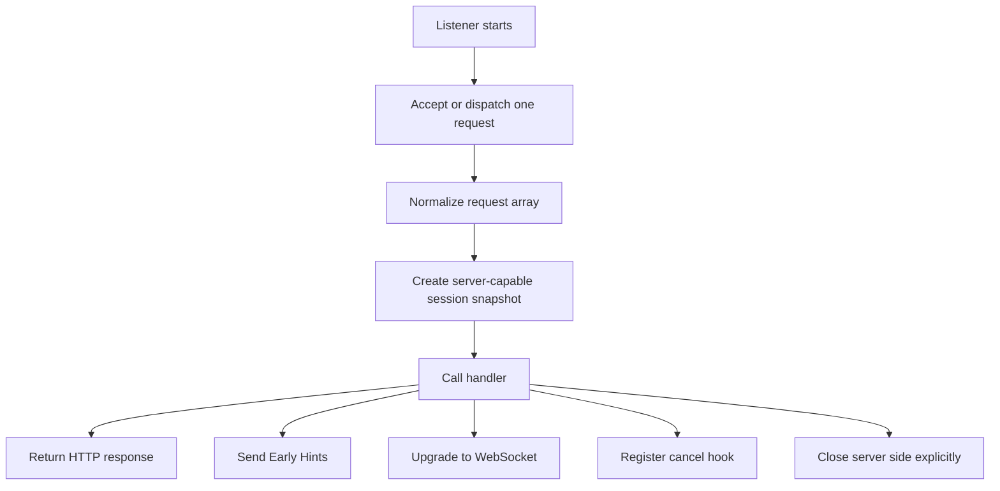
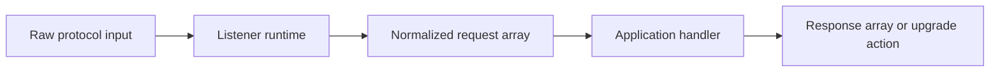
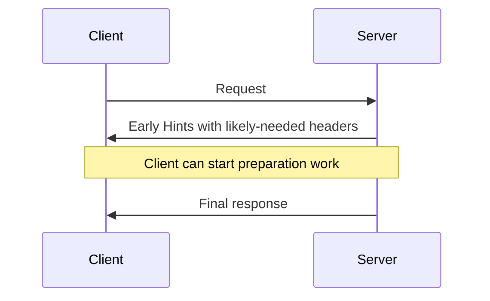
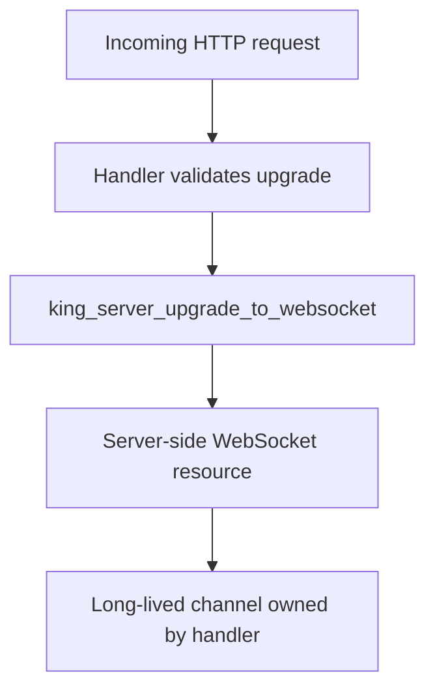

# Server Runtime

This chapter explains how King receives traffic instead of only sending it.
Client-side chapters talk about opening sessions toward remote systems. This
chapter talks about the opposite direction: listeners, accepted requests,
upgrades, early hints, cancel hooks, admin listeners, TLS reloads, and the
server-owned session state that ties those pieces together.

The main idea is simple. King does not treat server behavior as a hidden global
callback model. A server path still has explicit runtime state. There is a
listener. There is one accepted request or dispatch cycle. There is a
normalized request shape. There is a `King\Session`-backed server context. There
is one response, one upgrade, or one explicit close decision.

That design matters because serious server work includes more than "read request
body, return body string". Real server paths need to send early hints, attach
telemetry, react to cancellation, reload certificates, switch a request into
WebSocket mode, and expose privileged control flows through an admin API. King
keeps those actions in one server model.

## Start With The Basic Server Shape

A server listener in King accepts traffic on a host and port, normalizes the
incoming request into a stable request array, creates a server-capable session
snapshot, calls the handler, and then completes the request with one of a small
number of outcomes.

The outcome may be an ordinary HTTP response. It may include Early Hints before
that final response. It may become a WebSocket upgrade. It may be cancelled. It
may be closed by the server side with an explicit code and reason. It may also
carry telemetry or admin behavior attached to the same session.



This picture is the right way to read the rest of the chapter. The API is built
around these server actions because these are the real actions a long-lived
server needs to take.

## The Public Server Entry Points

King exposes several listener functions because there are several useful ways to
receive traffic.

`king_http1_server_listen()` runs one HTTP/1 server dispatch through the local
server runtime. `king_http1_server_listen_once()` accepts one real on-wire
HTTP/1 request on a bound TCP socket and handles that one request from start to
finish. `king_http2_server_listen()` and `king_http3_server_listen()` run the
same server model for HTTP/2 and HTTP/3 request shapes. `king_server_listen()`
is the generic listener entry point that chooses the appropriate listener mode
from configuration.

The practical difference is not only protocol version. It is also about how
directly the request reaches the listener and which transport shape surrounds
the handler.

## Why The Listener Model Matters

Many PHP readers are used to server frameworks where the handler is the whole
story. A request arrives, the framework has already normalized everything, and
the code only sees the request and a response builder.

King is more explicit because its server runtime is meant to coordinate
transport, upgrades, telemetry, lifecycle, and operations. A request is not
only a body and headers. It is also part of a live session that can later be
cancelled, upgraded, closed, measured, reconfigured, or inspected.

This is why the server APIs carry both the listener entry point and explicit
session-aware helpers instead of burying everything inside one giant callback
abstraction.

## The Normalized Request Array

A server handler in King receives a normalized request array instead of raw
socket bytes. This is an important design choice.

The array carries the data a handler naturally wants to reason about: method,
path, headers, body, and protocol-specific metadata. It can also carry stream
and session fields that help the handler understand which live server context it
is operating on.

The point of normalization is not to hide the protocol. The point is to avoid
forcing every handler to rebuild the same request parsing logic. The runtime
keeps ownership of the low-level transport work so the application can work at
the level of actual request handling.



This design makes handlers easier to read while still keeping transport-aware
operations available through the session APIs.

## HTTP/1, HTTP/2, And HTTP/3 Listeners

The three protocol-specific listener functions share the same basic mental
model. They accept host, port, config, and a handler. They prepare a
server-capable session snapshot and pass a normalized request array into the
handler.

`king_http1_server_listen()` is the ordinary HTTP/1 listener entry point when
the application wants one server dispatch cycle in the local runtime. It is a
good match for focused HTTP/1 request handling, response generation, and
server-side helper flows that do not need a custom accept loop.

`king_http2_server_listen()` gives the same server shape over an HTTP/2-style
request model. That matters when the application wants one coherent way to work
with pseudo-header style metadata, stream semantics, and the rest of the
HTTP/2-side request shape.

`king_http3_server_listen()` does the same for HTTP/3-style request handling in
the server runtime. It keeps the server-side request model aligned with the rest
of the QUIC-aware platform.

The important thing is that these are not three unrelated APIs. They are three
protocol faces of one server runtime model.

## The One-Shot HTTP/1 Listener

`king_http1_server_listen_once()` deserves special attention because it is the
most direct server accept path in the public surface. It binds a real TCP
socket, accepts exactly one request, materializes one server-side session, runs
the handler, writes the response when the handler returns a normal HTTP result,
and then closes the listener and accepted session.

This shape is especially useful when the application wants a tightly scoped,
single-request listener flow. It is also the most direct entry point for
workflows that need to observe one real HTTP/1 request and, when appropriate,
upgrade it into a WebSocket channel.

The value of a one-shot listener is not that it is "small". The value is that
the whole accept path is explicit and bounded.

## The Generic Listener Dispatcher

`king_server_listen()` exists so the application does not have to repeat
protocol-selection logic in userland. The function accepts the same host, port,
config, and handler shape as the protocol-specific listeners and chooses the
actual listener mode from the runtime configuration.

In practice, this means a service can describe the server policy in
configuration and keep its application handler stable. The code still knows that
it is a server handler, but it does not have to manually branch between HTTP/1,
HTTP/2, and HTTP/3 listener functions in every place that starts a listener.

This is an example of King using configuration to choose runtime mode while
still keeping the actual runtime actions explicit.

## What A Handler Returns

The usual server path is that the handler returns a normalized response array.
The listener runtime validates that response, writes the final response, and
then closes or completes the relevant server state for that request.

The more interesting part is that a handler does not only return final content.
It can also interact with the live session while building the final result. It
can send Early Hints, register a cancel callback, attach telemetry, reload TLS
material on the server session, or upgrade the request into a WebSocket
connection.

That is why the session-aware helper functions are part of the public surface.
A real server request often needs to do more than return a status code and body.

## Early Hints

Early Hints are provisional HTTP hints sent before the final response is ready.
They are useful when the server already knows which assets or resources the
client will probably need and wants to tell the client that information early.

King exposes this through `king_server_send_early_hints()`. The function takes
a server-capable session, a stream identifier, and a normalized set of hint
headers. The runtime stores and tracks the hint batch on the session state.

This matters because server behavior is often staged. The final response may not
be ready yet, but the server may already know enough to improve the next few
round trips.



The concept is simple: tell the client something useful before the full answer
is finished.

## Server-Side Cancellation

Long-running server work needs a way to react when the active request is no
longer wanted. That is what `king_server_on_cancel()` is for. The function
registers a cancel callback for one stream on a live server-capable session.

This matters most when the server has started expensive work that should stop if
the client disconnects or cancels the request. A render, a data aggregation, a
streaming transform, or a long-running tool invocation may all need a clean stop
path instead of blindly continuing after the client is gone.

The cancel hook keeps that server-side reaction explicit. The handler is not
left guessing whether the client still cares about the result.

## Server-Owned Session State

The server helpers all operate on a server-capable `King\Session` snapshot. This
is the same broad session idea used on the client side, but the meaning is now
server-owned rather than outbound-client-owned.

The session is what lets the runtime keep related state together. Early Hints
batches, TLS reload state, telemetry attachment, cancel handlers, WebSocket
upgrade ownership, peer certificate subject data, and explicit server-side close
state all belong to the same live server session rather than being scattered
through unrelated globals.

This is the heart of the server runtime design. One accepted request may feel
small, but the surrounding server state is still real and still worth modeling
explicitly.

## Upgrading To WebSocket

`king_server_upgrade_to_websocket()` is how an incoming server request changes
from ordinary HTTP handling into a long-lived bidirectional WebSocket channel.

The function takes the current server-capable session and a stream identifier
for the request that is being upgraded. If the request is valid for upgrade, the
runtime creates a server-side WebSocket resource and hands ownership of that
channel to the handler.

This matters because a WebSocket channel is more than "another response body".
It is a change in protocol mode and in connection ownership. After upgrade,
the server is no longer only preparing one final HTTP response. It is managing a
live channel.



That shift from request mode to channel mode is one of the biggest differences
between ordinary HTTP handlers and realtime server work.

## Closing From The Server Side

Sometimes the server needs to terminate a session on purpose. This is not the
same thing as the client disappearing. The server may be enforcing policy,
shutting down cleanly, rejecting a capability mismatch, or draining a session as
part of lifecycle management.

`king_session_close_server_initiated()` exists for that case. It marks a live
server-capable session as closed by the server side and records the explicit
error code and optional reason.

This is important because clean lifecycle management needs more than raw socket
shutdown. The runtime should know why the server ended the session and surface
that decision as part of the session state.

## Peer Certificate Information

When the server is operating with TLS or mTLS, it may need to inspect the
identity presented by the remote peer. `king_session_get_peer_cert_subject()`
returns the normalized peer-certificate subject snapshot for a live
server-capable session when the requested capability matches the active session.

This matters for policy decisions, audit logs, and privileged admin flows. It is
one thing to know that the handshake succeeded. It is another to know exactly
which peer identity the server accepted.

The function exists so that certificate-based trust can be observed by the
application, not only buried inside the transport layer.

## Reloading TLS Material

Server certificates and keys change over time. They expire. They are rotated.
An operator may need to switch a listener to new key material without treating
that event as a full process mystery.

King exposes this path through `king_server_reload_tls_config()`. The function
takes a live server-capable session plus new certificate and key paths, validates
that the replacement material is readable, and applies a new server-side TLS
snapshot to the session.

This matters because certificate rotation is not an edge case. It is normal
operations. A platform that serves traffic for long periods has to make TLS
reload a first-class action instead of something left to side effects.

## Attaching Telemetry To A Server Session

`king_server_init_telemetry()` attaches telemetry configuration to a live
server-capable session. This is how the handler or startup path can tell the
runtime that this server session should record the relevant metrics, spans, or
logs according to the supplied telemetry configuration.

This matters because good server behavior is not only about serving traffic. The
system also needs to observe itself while serving traffic. Early Hints counters,
cancel behavior, TLS reload counts, admin activity, request timing, and upgrade
activity all become more useful when they are tied back to a coherent telemetry
story.

## The Admin API Listener

`king_admin_api_listen()` is the entry point for a privileged operational
listener bound to a target server. This is where a platform can place
introspection, management, and protected control actions.

The point of an admin listener is not that it is "another port". The point is
that operational control is different from ordinary public request traffic. It
may require explicit enablement, stronger authentication, and separate request
policy. In King, the admin listener stays tied to the same server session model
instead of pretending that operations traffic lives in a completely different
universe.

This is one reason the server chapter belongs close to the operations chapter.
Serving traffic and operating the server are not two unrelated concerns.

## A Full Listener Example

The following example shows a small HTTP/1 listener that attaches telemetry,
sends Early Hints, and returns a normal response.

```php
<?php

king_http1_server_listen('127.0.0.1', 8080, [
    'tls.verify_peer' => false,
], function (array $request) {
    $session = $request['session'];
    $streamId = $request['stream_id'];

    king_server_init_telemetry($session, [
        'otel.enabled' => true,
        'otel.service_name' => 'handbook-demo',
    ]);

    king_server_send_early_hints($session, $streamId, [
        ['link', '</assets/app.css>; rel=preload; as=style'],
    ]);

    king_server_on_cancel($session, $streamId, function () {
        error_log('client cancelled request');
    });

    return [
        'status' => 200,
        'headers' => [
            'content-type' => 'text/plain',
        ],
        'body' => "hello from King\n",
    ];
});
```

This example is small, but it shows the important shape. The handler receives a
normalized request. It reaches back into the live server session when it needs
server-aware operations. It then returns a final response.

## A WebSocket Upgrade Example

The next example shows the protocol-mode change from HTTP request handling to a
WebSocket channel.

```php
<?php

king_http1_server_listen_once('127.0.0.1', 9001, null, function (array $request) {
    $session = $request['session'];
    $streamId = $request['stream_id'];

    if (($request['path'] ?? '/') !== '/realtime') {
        return [
            'status' => 404,
            'headers' => ['content-type' => 'text/plain'],
            'body' => "not found\n",
        ];
    }

    $websocket = king_server_upgrade_to_websocket($session, $streamId);
    if ($websocket === false) {
        return [
            'status' => 400,
            'headers' => ['content-type' => 'text/plain'],
            'body' => "upgrade failed\n",
        ];
    }

    return [
        'status' => 101,
        'headers' => [],
        'body' => '',
    ];
});
```

The exact response handling can vary by application design, but the basic
picture stays the same: a request enters as HTTP and, when accepted, becomes a
long-lived channel owned by the handler.

## How To Think About Protocol Choice

The server runtime lets the application be explicit about protocol while still
sharing one handler model.

Choose `king_http1_server_listen()` or `king_http1_server_listen_once()` when
you want HTTP/1 request handling or a tightly scoped one-shot accept path.
Choose `king_http2_server_listen()` when the surrounding traffic shape is better
described as HTTP/2. Choose `king_http3_server_listen()` when the server path
should sit inside the QUIC and HTTP/3 side of the runtime. Choose
`king_server_listen()` when configuration should decide the protocol mode.

The important point is that protocol choice is not the same as abandoning one
common server model. King keeps one consistent server model across those
listeners.

## Operational Questions For Server Readers

A server chapter is incomplete if it only explains how to write one response.
Operators and framework authors need answers to larger questions.

How does the server expose a cancel path for long-running work? How does it send
information before the final response is ready? How does it rotate certificate
material without treating that as out-of-band magic? How does it inspect peer
identity for mTLS-protected admin traffic? How does it attach telemetry to live
request handling? How does it cleanly terminate a session from the server side?

Those are the questions this public surface is designed to answer.

## Common Mistakes

The first common mistake is treating server-side helpers as if they were
optional decorations around a normal callback. They are part of the runtime
contract. If a handler needs cancel awareness, upgrade ownership, or telemetry
attachment, those actions should stay explicit.

The second mistake is treating a WebSocket upgrade like an ordinary HTTP body
decision. It is a protocol-mode change and should be thought about that way.

The third mistake is treating TLS reload and admin-listener behavior as separate
from the server runtime. In King they are part of the same server lifecycle and
should be documented, observed, and operated as such.

## Where To Go Next

If you want to understand the realtime side after an upgrade, read
[WebSocket](./websocket.md). If you want the transport story beneath HTTP/3 and
secure sessions, read [QUIC and TLS](./quic-and-tls.md). If you want the
operational view of shipping and running listener configurations, read
[Operations and Release](./operations-and-release.md). If you want the exact
function list grouped by subsystem, keep this chapter open beside
[Procedural API Reference](./procedural-api.md).
