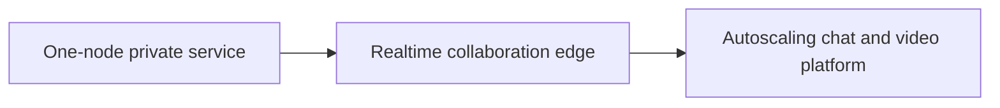

# Solution Blueprints

This chapter is for readers who understand the basic idea of King and then ask
the next practical question: what should I build first?

That question matters because King covers a lot of ground. A new reader can see
QUIC, WebSocket, IIBIN, object storage, Semantic-DNS, autoscaling, telemetry,
and orchestration all in one handbook and still not know where to begin. The
answer is to begin with one deployment shape that matches the problem in front
of you.

This chapter gives three starting paths. The first is small and safe. The
second is a realtime collaboration step. The third is the full platform shape:
an autoscaling chat and video system with OAuth, WebSocket chat, IIBIN control
messages, QUIC-based media, Semantic-DNS routing, telemetry, and object-backed
artifacts.

You do not need to start with the largest shape. You do need to understand how
the smaller shape grows into the larger one without changing runtime families.
That is one of the main reasons to use King in the first place.

## Blueprint 1: One Node That Owns The Whole Service

The first useful shape is one long-lived node that terminates TLS, serves the
application, makes outbound requests, keeps local object storage, and exports
telemetry. This is the best first deployment when the team needs a single
reliable service before it needs a cluster.

In that shape, the runtime is simple to reason about. `King\Session` owns live
transport state. `King\Config` defines policy. The server runtime accepts
requests. The object store holds durable payloads. Telemetry records what the
process is doing. The whole system can still expose health, metrics, and a
coordinated shutdown path through the system runtime.

This shape is right when your immediate job is to replace a scattered PHP stack
with one process that is easier to observe and harder to break accidentally. It
is also the best place to learn request flow, TLS policy, storage lifecycle,
and shutdown behavior before any routing or autoscaling is involved.

## Blueprint 2: One Realtime Workspace Edge

The second shape is for systems that stop looking like ordinary request and
response traffic. A collaborative editor, a trading dashboard, a shared
operator console, or a customer support workspace all need long-lived stateful
channels. This is where WebSocket, [IIBIN](./iibin.md), and
[Semantic-DNS](./semantic-dns.md) begin to work together.

The public web edge accepts traffic on one stable hostname. The browser opens a
WebSocket connection. Messages on that connection are not vague JSON blobs;
they are typed binary structures carried through IIBIN so that the wire format
stays explicit and compatible over time. Semantic-DNS is used to choose the
best backend route for room state, control actions, or other realtime work.

This is the right deployment shape when the product is still one application,
but the application is no longer only a page loader with a few API requests. It
is a live workspace that needs presence, typed events, routing, and strict
ownership of connection state.

## Blueprint 3: A Full Chat And Video Platform

The third shape is the complete platform story. One public edge node starts as
the first useful production server. It serves the web application, terminates
TLS, performs OAuth login handoff, accepts chat signaling, routes media
sessions, records telemetry, stores durable artifacts, and watches its own
load. When traffic rises, that same node grows a worker fleet through the
autoscaling path.

This is the right shape when you are building a product that looks like a
modern collaboration platform: rooms, group chat, large live calls, presence,
recordings, playback assets, durable room state, rolling release payloads, and
day-two operations that should not depend on a maze of disconnected helper
services.

The runtime families stay the same all the way through the build:

The browser talks to the platform over TLS, HTTP, WebSocket, and QUIC. Chat,
presence, and control messages travel as IIBIN structures over WebSocket.
Media setup and transport use the QUIC-facing transport layer and the video
session is routed through the live cluster. Semantic-DNS chooses backend routes.
Telemetry drives autoscaling. The object store keeps recordings, uploads,
thumbnails, exports, and package-like artifacts. The router and load balancer
turn one node into a growing edge cluster.

The complete walkthrough for that shape is the flagship example guide:
[Global Chat And Video Platform](./global-chat-video-platform.md).

## Which Blueprint Should You Choose

If you are replacing a traditional PHP service and need a clean first landing
zone, start with the one-node private service shape. It keeps the moving parts
small while still teaching the important runtime ideas.

If your first real business need is a live collaborative product, start with
the realtime workspace edge. That will force the right decisions around
connection state, typed messaging, and route choice before you add media and
autoscaling.

If the actual product target is already obvious and it already includes live
rooms, chat, video, login, storage, and scale, skip directly to the full chat
and video platform guide. It is longer, but it follows one complete operating
story from domain setup to large-call behavior.

## Read This Next

If you want the end-to-end operational path, open
[Global Chat And Video Platform](./global-chat-video-platform.md).

If you want the cluster growth story first, open
[01: Hetzner Self-Bootstrapping Edge Cluster](./01-hetzner-self-bootstrapping-edge-cluster/README.md).

If you want the typed realtime control story first, open
[02: Realtime Control Plane With WebSocket, IIBIN, And Semantic-DNS](./02-realtime-control-plane-websocket-iibin-semantic-dns/README.md).
