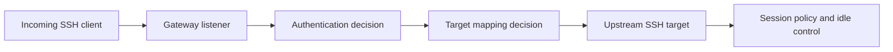
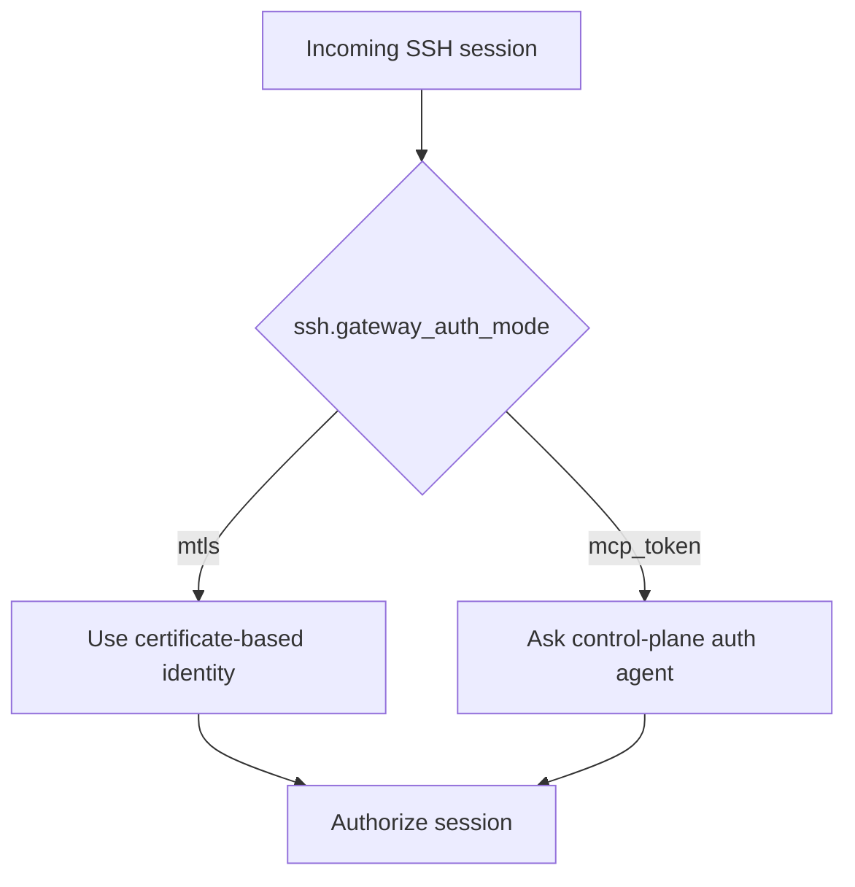
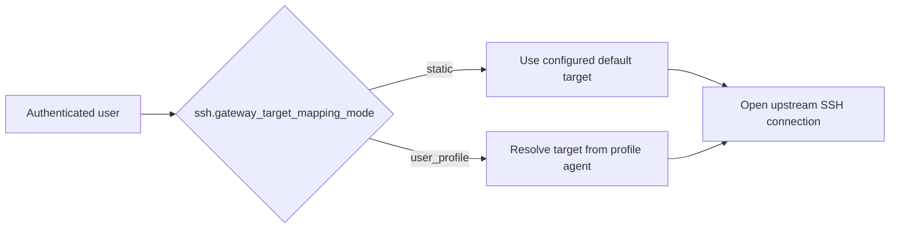
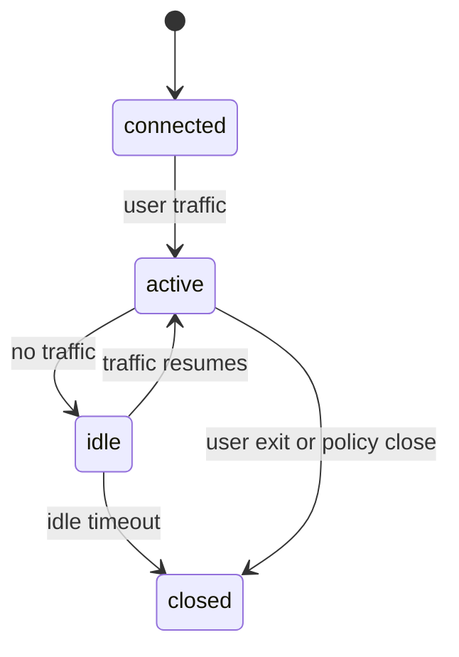

# SSH over QUIC

This chapter explains how King treats SSH access as a gateway policy problem
inside the same runtime that already manages QUIC, TLS, telemetry, topology,
identity, and control-plane integration.

The important point is not only that SSH traffic can ride through a QUIC-centered
platform. The important point is that SSH stops being "just one more port" and
becomes something the runtime can govern explicitly. King can decide where the
gateway listens, which upstream host and port it targets, how authentication is
resolved, how target selection works, how long idle sessions are allowed to
stay open, and whether session activity should be logged.

## Start With The Problem

Most teams meet SSH first as a simple tool for getting into a machine. That is
fine for one machine and one operator. It becomes much harder once access is
supposed to cross modern edge policy, multiple backend environments, service
identity, and operator audit requirements.

At that point, SSH is no longer only "a shell over the network." It becomes a
gateway question. Where should the connection terminate? How should the target
host be chosen? Should identity come from mutual TLS or from a control-plane
token lookup? Should one static target be used, or should the gateway resolve
the final target from a user profile service?

That is why King documents SSH over QUIC as a gateway model rather than as a
single transport trick.

## Why QUIC Changes The Shape Of The Problem

Traditional SSH is normally carried over TCP. King already has a runtime model
centered on QUIC, TLS policy, connection identity, and gateway control. Once
you already have that runtime, it makes sense to describe SSH access inside the
same policy surface instead of leaving it as a separate unmanaged tunnel.

This does not mean that SSH itself stops being SSH. It means the gateway that
admits, authenticates, routes, and supervises the session becomes part of the
same platform story as the rest of the network edge.

That matters because operators do not want one way of thinking for web traffic,
another for control-plane RPC, and a third for privileged remote access. The
gateway chapter is where those views meet.

## The Gateway Model

King models SSH over QUIC as an explicit gateway with three parts.

The first part is the listener. This is where the gateway binds and accepts
incoming sessions. The second part is target selection. This is how the gateway
decides which upstream host and port should actually receive the SSH session.
The third part is session policy. This covers authentication mode, connect
timeout, idle timeout, and session activity logging.



Thinking in these three parts keeps the topic readable. If you treat the whole
gateway as one big mystery box, every config key starts looking arbitrary.

## Listener Configuration

The listener side answers a simple question: where should the gateway accept
incoming sessions?

`ssh.gateway_enable` turns the gateway on or off. `ssh.gateway_listen_host`
selects the bind address. `ssh.gateway_listen_port` selects the listening port.

These settings matter because access gateways are part of the deployment edge.
Some teams want a wide bind such as `0.0.0.0` on a controlled internal network.
Other teams want a more specific host binding so the gateway exists only on a
dedicated management interface or inside one network namespace.

The listen port matters for the same reason. It is not only a technical value.
It is part of the operational contract of the gateway.

## Upstream Target Selection

An SSH gateway needs to know where a session should go after it has accepted the
client side of the connection.

The simplest form of this is the default target. `ssh.gateway_default_target_host`
and `ssh.gateway_default_target_port` tell the gateway where to send the session
when a static target is desired. `ssh.gateway_target_connect_timeout_ms` tells
the gateway how long it is allowed to wait for that upstream target to accept
the connection.

This means the gateway can be used as a controlled front door to a known admin
host, a fixed bastion target, or one stable internal service.

## Authentication Modes

The next part of the model is identity.

King exposes the SSH gateway authentication decision through
`ssh.gateway_auth_mode`. The supported authentication modes are `mtls` and
`mcp_token`.

`mtls` means the gateway uses mutual TLS as the trust anchor for deciding who is
connecting. This is the strongest fit for environments that already manage
client certificates and want access to follow the same certificate trust model
as the rest of the platform.

`mcp_token` means the gateway treats an MCP-facing control plane as the source
of token-based identity or authorization decisions. This mode is useful when
operator identity, short-lived access grants, or policy checks already live in a
control service rather than only in certificates.



This distinction matters because authentication is never only about a single
protocol exchange. It decides which trust system the gateway is attached to.

## Target Mapping Modes

Authentication decides who is asking for access. Target mapping decides where
that access should go.

King exposes target mapping through `ssh.gateway_target_mapping_mode`. The
supported mapping modes are `static` and `user_profile`.

`static` means the gateway uses the configured default target host and port.
This is the simplest model and the easiest one to reason about during initial
deployment.

`user_profile` means the gateway may resolve the upstream target through a user
profile service rather than only through a fixed host and port pair. In that
mode, the profile data becomes part of the routing decision.

This is where the gateway stops being only a tunnel and starts behaving more
like an access controller.



## Control-Plane Agent Integration

Two URI settings define how the gateway can ask for outside help.

`ssh.gateway_mcp_auth_agent_uri` gives the runtime the address of the auth
agent used when authentication depends on the control plane. 
`ssh.gateway_user_profile_agent_uri` gives the runtime the address of the
profile service used when target mapping depends on user profile data.

These settings matter because they turn the gateway into part of a larger
access system. The gateway can stay narrow and focused while external agents
decide whether a user is allowed in and where that user should land.

That separation is often the right design. The gateway owns transport and
session policy. The external control services own identity policy and mapping
policy.

## Session Policy

An access gateway is not finished once it can open a connection. It also has to
decide how that connection is supervised.

`ssh.gateway_idle_timeout_sec` defines how long an idle session may stay open
before the gateway considers it stale. `ssh.gateway_log_session_activity`
defines whether the gateway records session activity for operational visibility.

This is important because remote access sessions behave differently from short
HTTP requests. They can stay open for long periods, become idle, wake up again,
and outlive the small events that created them. A gateway therefore needs
explicit session policy, not only accept-and-forward behavior.



## Typical Deployment Shapes

The simplest deployment shape is one static gateway in front of one known
administration host. In this model the gateway listens on one port, authenticates
the caller, and forwards the session to one fixed upstream machine.

The next step up is a profile-driven access gateway. In this model the caller's
identity is resolved first, and the final target host is chosen from profile or
policy data. This is useful when one gateway fronts a fleet of operator shells,
tenant-specific targets, or controlled maintenance endpoints.

A third shape is a policy-enforced internal access edge where mutual TLS and
session logging are both required. In that model the gateway is part of the
same trust and observability perimeter as the rest of the platform.

These shapes are all built from the same small set of config values, which is
exactly why the chapter explains the model before listing the keys.

## Configuration Walkthrough

The runtime configuration surface groups the SSH-over-QUIC gateway under the
`ssh.*` namespace.

`ssh.gateway_enable` enables the gateway. `ssh.gateway_log_session_activity`
controls session logging. `ssh.gateway_listen_host` and
`ssh.gateway_listen_port` define the listener. 
`ssh.gateway_default_target_host` and `ssh.gateway_default_target_port`
define the fallback or static upstream target. 
`ssh.gateway_target_connect_timeout_ms` defines the upstream connect timeout.
`ssh.gateway_idle_timeout_sec` defines how long idle sessions may stay open.
`ssh.gateway_auth_mode` selects `mtls` or `mcp_token`.
`ssh.gateway_target_mapping_mode` selects `static` or `user_profile`.
`ssh.gateway_mcp_auth_agent_uri` points at the auth service.
`ssh.gateway_user_profile_agent_uri` points at the profile service.

The following runtime example shows a controlled profile-driven gateway.

```php
<?php

$config = new King\Config([
    'ssh.gateway_enable' => true,
    'ssh.gateway_listen_host' => '10.0.0.5',
    'ssh.gateway_listen_port' => 2222,
    'ssh.gateway_default_target_host' => '127.0.0.1',
    'ssh.gateway_default_target_port' => 22,
    'ssh.gateway_target_connect_timeout_ms' => 5000,
    'ssh.gateway_idle_timeout_sec' => 1800,
    'ssh.gateway_auth_mode' => 'mcp_token',
    'ssh.gateway_target_mapping_mode' => 'user_profile',
    'ssh.gateway_mcp_auth_agent_uri' => 'mcp://auth/ssh',
    'ssh.gateway_user_profile_agent_uri' => 'mcp://profiles/ssh-targets',
]);
```

The same policy can be owned at the system INI layer.

```ini
king.ssh_gateway_enable=1
king.ssh_gateway_listen_host=10.0.0.5
king.ssh_gateway_listen_port=2222
king.ssh_gateway_default_target_host=127.0.0.1
king.ssh_gateway_default_target_port=22
king.ssh_gateway_target_connect_timeout_ms=5000
king.ssh_gateway_idle_timeout_sec=1800
king.ssh_gateway_auth_mode=mcp_token
king.ssh_gateway_target_mapping_mode=user_profile
king.ssh_gateway_mcp_auth_agent_uri=mcp://auth/ssh
king.ssh_gateway_user_profile_agent_uri=mcp://profiles/ssh-targets
king.ssh_gateway_log_session_activity=1
```

## How This Topic Fits With The Rest Of King

SSH over QUIC belongs in the King handbook because it sits at the point where
transport, trust, identity, and operations meet.

It relates to [QUIC and TLS](./quic-and-tls.md) because listener security and
mutual TLS trust are foundational to the gateway. It relates to [MCP](./mcp.md)
because control-plane auth or profile services can live behind MCP-facing agent
URIs. It relates to [Telemetry](./telemetry.md) because session activity and
gateway behavior belong in the same observability story as the rest of the
platform. It relates to [Router and Load Balancer](./router-and-load-balancer.md)
because the access edge is still part of the wider traffic story.

This is another reason the chapter matters. Remote access is not a side topic.
It is part of the platform boundary.

## Common Questions

One common question is whether SSH over QUIC means the upstream target itself
must natively speak QUIC. The answer is no. The gateway model is about where
the access policy lives, not about forcing every upstream target to change its
native transport implementation.

Another common question is why target mapping should be dynamic at all. The
answer is that operator access is often identity dependent. A profile-based
mapping model lets the gateway resolve the right upstream target after identity
has already been established.

A third common question is why session logging should be configurable. The
answer is that access gateways live in different environments. Some deployments
must log every session touch. Others want a lighter footprint for trusted
internal lab systems. The platform therefore makes the choice explicit.

## Related Chapters

For the transport and trust foundation, read [QUIC and TLS](./quic-and-tls.md).
For the control-plane services that may supply auth or profile decisions, read
[MCP](./mcp.md). For the full key reference, read
[Runtime Configuration](./runtime-configuration.md) and
[System INI Reference](./system-ini-reference.md).
