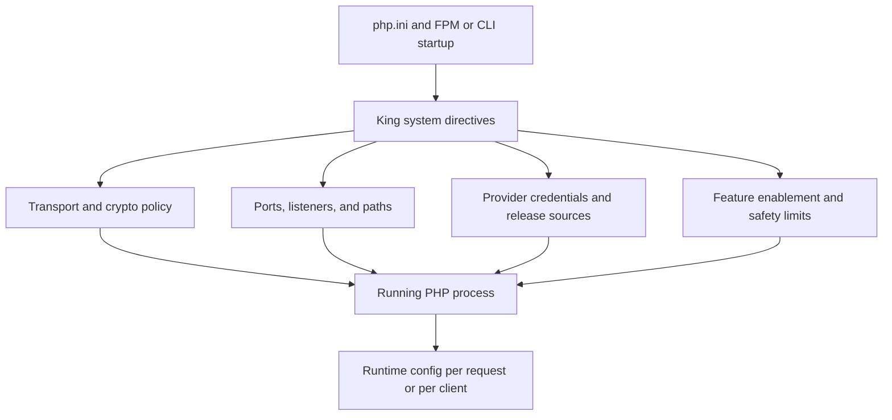

# System INI Reference

This chapter documents the deployment-time `php.ini` surface for the King
extension. These directives are the settings that shape how the extension
starts, what policies it enforces before userland code runs, and which
subsystems are available to the process from the moment PHP loads the module.

If you only need to change behavior for one request, one client, or one
application-level configuration object, use
[Runtime Configuration Reference](./runtime-configuration.md) instead. Runtime
configuration is the place for `king_new_config()` and `King\Config`. System
INI is the place for trust roots, ports, durable paths, provider credentials,
capacity ceilings, transport policy, and feature policy that must be decided
before the process begins serving work.

It helps to think of the two layers like this. Runtime configuration answers
the question, “How should this operation behave?” System INI answers the
question, “What kind of process is this, what is it allowed to do, and what
infrastructure does it belong to?”

The important point is that system INI is the outer contract. A runtime
override can only operate inside the boundaries created here.

## How To Read This Reference

Every section in this chapter follows the same pattern. First, the section
explains why the subsystem exists and why an operator would care about it.
After that, the reference table lists each directive with its default value and
the practical meaning of the setting.

Defaults are taken from the actual `ini.c` registrations in the source tree.
An empty default means the directive starts unset and must be supplied by the
deployment if that part of the system is meant to be active.

## What Belongs In System INI

Some settings almost always belong here.

A certificate bundle belongs here because trust policy should not change from
one request to the next. A state path belongs here because a durable file is an
operator concern, not a userland concern. A port belongs here because it shapes
the process boundary. A cloud API token belongs here because it is deployment
identity. A queue path belongs here because it defines cross-process behavior.

By contrast, a one-off timeout for one request is normally better as runtime
config. So is a request-specific trace header or a one-request cache policy.

If you are deciding where a setting belongs, ask whether changing it should
create a different process role. If the answer is yes, it belongs in system
INI.

## Namespace Map

The King system INI surface is grouped by subsystem so operators can move from
concept to deployment more easily.

| Namespace | What it controls |
| --- | --- |
| `king.http_*`, `king.h3_*`, `king.websocket_*`, `king.webtransport_*` | HTTP feature policy, WebSocket defaults, and HTTP/3 or WebTransport limits |
| `king.io_*`, `king.socket_*` | low-level packet and buffer behavior |
| `king.cluster_autoscale_*` | provider integration, scaling policy, and durable autoscaling state |
| `king.cluster_*` | worker process model and restart policy |
| `king.admin_api_*`, `king.security_*` | admin listener and security guard rails |
| `king.dataframe_*`, `king.gpu_*`, `king.cuda_*`, `king.rocm_*`, `king.arc_*` | compute and AI runtime policy |
| `king.http2_*` | HTTP/2 flow control and push behavior |
| `king.iibin_*`, `king.io_shm_*` | IIBIN schema and shared-buffer policy |
| `king.mcp_*`, `king.orchestrator_*` | control-plane transport and orchestration policy |
| `king.storage_*`, `king.cdn_*` | object-store and edge cache deployment policy |
| `king.otel_*` | telemetry exporter and batching policy |
| `king.transport_*` | QUIC congestion control, pacing, datagrams, and flow control |
| `king.router_*` | routing and load-distribution role |
| `king.geometry_*` | semantic geometry defaults |
| `king.smartcontract_*` | smart-contract provider and wallet policy |
| `king.dns_*` | Smart DNS and Semantic-DNS server policy |
| `king.ssh_gateway_*` | SSH-over-QUIC listener and target mapping |
| `king.state_manager_*` | state backend defaults |
| `king.tcp_*` | TCP listener and socket policy |
| `king.tls_*` | trust, certificates, ticket policy, and encryption policy |

## Application Protocols, WebSocket, And WebTransport

This group controls the public application protocols that sit above the raw
transport. It decides whether the runtime advertises HTTP/3, whether it emits
Early Hints, how large WebSocket frames may be by default, and how much
WebTransport concurrency the server is willing to accept.

Operators touch these keys when they are shaping client compatibility,
controlling default frame sizes, or preparing a listener for high numbers of
interactive sessions.

| Directive | Default | Meaning |
| --- | --- | --- |
| `king.http_advertise_h3_alt_svc` | `1` | Advertises HTTP/3 availability to compatible clients through `Alt-Svc`. |
| `king.http_auto_compress` | `brotli,gzip` | Declares which content codings the runtime may apply automatically when serving compressible responses. |
| `king.h3_max_header_list_size` | `65536` | Sets the accepted HTTP/3 header budget in bytes. |
| `king.h3_qpack_max_table_capacity` | `4096` | Sets the QPACK dynamic table size used for HTTP/3 header compression. |
| `king.h3_qpack_blocked_streams` | `100` | Limits how many streams may wait on QPACK state at one time. |
| `king.h3_server_push_enable` | `0` | Enables or disables HTTP/3 server push support. |
| `king.http_enable_early_hints` | `1` | Allows the runtime to emit HTTP 103 Early Hints where the server flow supports it. |
| `king.websocket_default_max_payload_size` | `16777216` | Sets the default maximum accepted WebSocket payload size in bytes. |
| `king.websocket_default_ping_interval_ms` | `25000` | Sets the default ping interval for long-lived WebSocket sessions. |
| `king.websocket_handshake_timeout_ms` | `5000` | Sets how long the runtime will wait for the WebSocket handshake to complete. |
| `king.webtransport_enable` | `1` | Enables or disables WebTransport support in the process. |
| `king.webtransport_max_concurrent_sessions` | `10000` | Caps how many WebTransport sessions the process will keep active. |
| `king.webtransport_max_streams_per_session` | `256` | Caps how many streams may exist inside one WebTransport session. |

## Bare-Metal Tuning

These directives shape how the process talks to the operating system at the
packet, ring, and buffer level. They are for operators who are tuning a
high-throughput box, not for ordinary application code.

In practice, these keys matter when the process runs on a dedicated host, when
the team is trying to reduce syscall overhead, or when the deployment needs to
pin IO threads to a particular CPU or NUMA policy.

| Directive | Default | Meaning |
| --- | --- | --- |
| `king.io_engine_use_uring` | `1` | Enables the `io_uring` IO path where the host supports it. |
| `king.io_uring_sq_poll_ms` | `0` | Sets the submission queue polling interval in milliseconds for `io_uring`-based processing. |
| `king.io_max_batch_read_packets` | `64` | Limits how many packets may be read in one low-level batch. |
| `king.io_max_batch_write_packets` | `64` | Limits how many packets may be written in one low-level batch. |
| `king.socket_receive_buffer_size` | `2097152` | Sets the preferred socket receive buffer size in bytes. |
| `king.socket_send_buffer_size` | `2097152` | Sets the preferred socket send buffer size in bytes. |
| `king.socket_enable_busy_poll_us` | `0` | Enables busy polling for sockets and sets the polling window in microseconds. |
| `king.socket_enable_timestamping` | `1` | Enables kernel packet timestamp support when available. |
| `king.io_thread_cpu_affinity` | unset | Pins the IO thread set to specific CPUs if the deployment requires it. |
| `king.io_thread_numa_node_policy` | `default` | Selects the NUMA policy used for IO threads and related memory allocation. |

## Autoscaling And Cloud Provisioning

The autoscaling controller is one of the most deployment-specific parts of the
extension. These directives tell it which provider to talk to, how many nodes
it may manage, how aggressively it may react, where it stores durable state,
and where new nodes should fetch their prepared King release.

These are system directives because they express infrastructure identity and
cluster policy. A PHP request must not be able to quietly turn itself into a
different cloud control loop.

| Directive | Default | Meaning |
| --- | --- | --- |
| `king.cluster_autoscale_provider` | unset | Selects the autoscaling provider backend such as Hetzner. |
| `king.cluster_autoscale_region` | unset | Selects the target region for newly created nodes. |
| `king.cluster_autoscale_credentials_path` | unset | Points at the provider credential file when a path-based credential flow is used. |
| `king.cluster_autoscale_api_endpoint` | `https://api.hetzner.cloud/v1` | Sets the provider API base URL. |
| `king.cluster_autoscale_state_path` | unset | Points at the autoscaling durable state file. |
| `king.cluster_autoscale_server_name_prefix` | `king-node` | Sets the name prefix for managed nodes. |
| `king.cluster_autoscale_bootstrap_user_data` | unset | Provides cloud-init or equivalent bootstrap payload for new nodes. |
| `king.cluster_autoscale_firewall_ids` | unset | Lists the provider firewall objects attached to managed nodes. |
| `king.cluster_autoscale_placement_group_id` | unset | Names the provider placement group used for managed instances. |
| `king.cluster_autoscale_prepared_release_url` | unset | Points at the prepared release artifact used when bootstrapping a node. |
| `king.cluster_autoscale_join_endpoint` | unset | Points at the cluster join endpoint used during bootstrap. |
| `king.cluster_autoscale_hetzner_api_token` | unset | Carries the Hetzner API token when the Hetzner provider is active. |
| `king.cluster_autoscale_hetzner_budget_path` | unset | Points at the budget probe source used for Hetzner spend enforcement. |
| `king.cluster_autoscale_min_nodes` | `1` | Sets the minimum number of managed nodes the controller will preserve. |
| `king.cluster_autoscale_max_nodes` | `10` | Sets the maximum number of managed nodes the controller may create. |
| `king.cluster_autoscale_max_scale_step` | `1` | Limits how many nodes may be added or removed per scaling decision. |
| `king.cluster_autoscale_scale_up_cpu_threshold_percent` | `80` | Triggers scale-up when sustained CPU use reaches this percentage. |
| `king.cluster_autoscale_scale_down_cpu_threshold_percent` | `20` | Allows scale-down when sustained CPU use falls below this percentage. |
| `king.cluster_autoscale_scale_up_policy` | `add_nodes:1` | Describes how scale-up decisions translate into concrete node additions. |
| `king.cluster_autoscale_spend_warning_threshold_percent` | `80` | Raises a spend warning at this percentage of the configured budget. |
| `king.cluster_autoscale_spend_hard_limit_percent` | `95` | Blocks further growth when the spend ceiling reaches this percentage. |
| `king.cluster_autoscale_quota_warning_threshold_percent` | `80` | Raises a provider quota warning at this percentage. |
| `king.cluster_autoscale_quota_hard_limit_percent` | `95` | Stops new provisioning when provider quota reaches this percentage. |
| `king.cluster_autoscale_cooldown_period_sec` | `300` | Sets the quiet period between autoscaling decisions. |
| `king.cluster_autoscale_idle_node_timeout_sec` | `600` | Sets the timeout used to roll back pending or idle nodes that never become healthy members. |
| `king.cluster_autoscale_instance_type` | unset | Selects the provider instance class or flavor to provision. |
| `king.cluster_autoscale_instance_image_id` | unset | Selects the provider image identifier for newly created nodes. |
| `king.cluster_autoscale_network_config` | unset | Carries provider-specific network placement or interface configuration. |
| `king.cluster_autoscale_instance_tags` | unset | Applies provider tag metadata to managed nodes. |

## Cluster And Process Model

These directives describe how the PHP process itself should behave as a member
of a worker set. They control how many workers exist, how the process restarts
them, how long graceful shutdown lasts, and whether worker-level scheduling or
CPU placement rules are enforced.

This is the part of the configuration an operator reads when the goal is to
shape process density, restart discipline, and host-level execution policy.

| Directive | Default | Meaning |
| --- | --- | --- |
| `king.cluster_workers` | `0` | Sets the worker count. A value of `0` means the runtime chooses its default strategy. |
| `king.cluster_graceful_shutdown_ms` | `30000` | Sets how long the process waits for graceful shutdown before forcing closure. |
| `king.server_max_fd_per_worker` | `8192` | Caps the file-descriptor budget per worker process. |
| `king.cluster_restart_crashed_workers` | `1` | Enables automatic restart of crashed workers. |
| `king.cluster_max_restarts_per_worker` | `10` | Limits how many times one worker may be restarted in the tracking window. |
| `king.cluster_restart_interval_sec` | `60` | Sets the restart accounting window in seconds. |
| `king.cluster_worker_niceness` | `0` | Sets the worker process niceness value. |
| `king.cluster_worker_scheduler_policy` | `other` | Selects the scheduler policy for worker processes. |
| `king.cluster_worker_cpu_affinity_map` | unset | Pins workers to specific CPUs when deterministic placement is needed. |
| `king.cluster_worker_cgroup_path` | unset | Places workers inside a specific cgroup hierarchy. |
| `king.cluster_worker_user_id` | unset | Drops worker processes to a target user ID if configured. |
| `king.cluster_worker_group_id` | unset | Drops worker processes to a target group ID if configured. |

## Admin API And Security

The admin listener and traffic guard rails are part of the outer security
boundary of the extension. These settings decide whether an administrative
interface exists, where it binds, what trust material it uses, whether userland
runtime overrides are permitted, and what rate-limiter or CORS policy applies.

Because this is process identity, every one of these settings belongs at system
scope.

| Directive | Default | Meaning |
| --- | --- | --- |
| `king.admin_api_enable` | `0` | Enables the admin API listener. |
| `king.admin_api_bind_host` | `127.0.0.1` | Sets the host or interface used by the admin API listener. |
| `king.admin_api_port` | `2019` | Sets the admin API port. |
| `king.admin_api_auth_mode` | `mtls` | Selects the authentication mode used by the admin API listener. |
| `king.admin_api_ca_file` | unset | Points at the CA file used to verify admin API client certificate chains; arbitrary self-signed leaf certificates are rejected. |
| `king.admin_api_cert_file` | unset | Points at the server certificate file used by the admin API listener. |
| `king.admin_api_key_file` | unset | Points at the private key file used by the admin API listener. |
| `king.security_allow_config_override` | `0` | Allows or forbids userland runtime configuration overrides. |
| `king.security_rate_limiter_enable` | `1` | Enables the built-in traffic rate limiter. |
| `king.security_rate_limiter_requests_per_sec` | `100` | Sets the steady-state request budget per second for the limiter. |
| `king.security_rate_limiter_burst` | `50` | Sets the extra burst budget above the steady-state limit. |
| `king.security_cors_allowed_origins` | `*` | Sets the allowed origin list for the active server-side CORS helper, which evaluates normalized live request headers and reflects the matched origin on supported listener response paths. |

## Compute And AI Runtime

This section covers the data-frame and accelerator side of the extension. It
decides whether the compute surface is enabled, how much memory is reserved for
data-frame work, whether GPUs are available, how peer-to-peer transfer is
treated, and what backend defaults the process exposes.

These settings matter when King is acting as a data-plane runtime for training,
fine-tuning, batch inference, or any other AI-heavy workload that must run
close to storage and transport.

| Directive | Default | Meaning |
| --- | --- | --- |
| `king.dataframe_enable` | `1` | Enables the dataframe subsystem. |
| `king.dataframe_memory_limit_mb` | `1024` | Sets the memory ceiling for dataframe operations in megabytes. |
| `king.dataframe_string_interning_enable` | `1` | Enables string interning in dataframe-heavy workloads to reduce duplication. |
| `king.dataframe_cpu_parallelism_default` | `0` | Sets the default CPU parallelism level used by dataframe tasks. |
| `king.gpu_bindings_enable` | `0` | Enables GPU bindings for the process. |
| `king.gpu_default_backend` | `auto` | Selects the default GPU runtime backend. |
| `king.worker_gpu_affinity_map` | unset | Pins workers to particular GPU devices. |
| `king.gpu_memory_preallocation_mb` | `2048` | Preallocates GPU memory per process where supported. |
| `king.gpu_p2p_enable` | `1` | Enables peer-to-peer transfer between GPUs. |
| `king.gpu_storage_enable_directstorage` | `0` | Enables direct storage flow from storage to GPU memory where the platform supports it. |
| `king.cuda_enable_tensor_cores` | `1` | Allows CUDA backends to use tensor cores. |
| `king.cuda_stream_pool_size` | `4` | Sets the CUDA stream pool size. |
| `king.rocm_enable_gfx_optimizations` | `1` | Enables ROCm-specific accelerator optimizations. |
| `king.arc_enable_xmx_optimizations` | `1` | Enables Intel Arc XMX optimizations. |
| `king.arc_video_acceleration_enable` | `1` | Enables Intel Arc video acceleration support. |

## HTTP/2

HTTP/2 is the first protocol where flow control and multiplexing shape the user
experience directly. These directives let an operator decide how wide each
session may fan out, how large frames may become, and whether server push stays
available.

| Directive | Default | Meaning |
| --- | --- | --- |
| `king.http2_enable` | `1` | Enables the HTTP/2 runtime. |
| `king.http2_initial_window_size` | `65535` | Sets the per-stream receive window used by HTTP/2 flow control. |
| `king.http2_max_concurrent_streams` | `100` | Caps concurrent streams per HTTP/2 session. |
| `king.http2_max_header_list_size` | `0` | Sets the accepted header budget. `0` keeps the default behavior. |
| `king.http2_enable_push` | `1` | Enables capture and handling of HTTP/2 server push. |
| `king.http2_max_frame_size` | `16384` | Sets the maximum HTTP/2 frame size. |

## IIBIN And Shared Buffer Policy

IIBIN is King’s native binary data model, so its limits and shared-memory
behavior belong to the part of the system that shapes process memory. These
directives control schema depth, schema width, default buffer sizing, and the
use of shared memory for large binary work.

Operators care about this section when the runtime is carrying large binary
payloads, hydrating many objects, or optimizing memory reuse across worker
boundaries.

| Directive | Default | Meaning |
| --- | --- | --- |
| `king.iibin_string_interning_enable` | `1` | Enables string interning for IIBIN-heavy workloads. |
| `king.iibin_max_schema_fields` | `256` | Caps the number of fields a schema may define. |
| `king.iibin_max_recursion_depth` | `32` | Caps nested IIBIN traversal depth. |
| `king.io_use_shared_memory_buffers` | `0` | Enables shared memory buffers for IO and binary payload handling. |
| `king.io_default_buffer_size_kb` | `64` | Sets the default shared or local buffer size in kilobytes. |
| `king.io_shm_total_memory_mb` | `256` | Sets the total shared-memory budget reserved for IO buffers. |
| `king.io_shm_path` | `/king_io_shm` | Names the shared-memory object or path used for shared buffers. |

## MCP And Pipeline Orchestrator

These directives shape the control plane. On the MCP side they define message
size, timeout, retry, and cache policy. On the orchestrator side they define
pipeline timeout defaults, concurrency policy, tracing policy, and which
backend executes runs.

This is system INI because it decides whether orchestration is local,
file-worker-based, or remote-peer-based, and because durable state or queue
paths are machine-level concerns.

| Directive | Default | Meaning |
| --- | --- | --- |
| `king.mcp_default_request_timeout_ms` | `30000` | Sets the default timeout for MCP unary requests. |
| `king.mcp_max_message_size_bytes` | `4194304` | Caps MCP message size in bytes. |
| `king.mcp_default_retry_policy_enable` | `1` | Enables the default retry policy for MCP requests. |
| `king.mcp_default_retry_max_attempts` | `3` | Sets the default maximum number of MCP retry attempts. |
| `king.mcp_default_retry_backoff_ms_initial` | `100` | Sets the initial MCP retry backoff in milliseconds. |
| `king.mcp_enable_request_caching` | `0` | Enables request-result caching for eligible MCP calls. |
| `king.mcp_request_cache_ttl_sec` | `60` | Sets the cache lifetime for MCP request caching. |
| `king.mcp_allowed_peer_hosts` | unset | Lists non-loopback MCP peer hosts that this process may target. Loopback peers remain allowed by default; remote peers require an explicit comma-separated allowlist. |
| `king.mcp_transfer_state_path` | unset | Points at the durable local MCP transfer queue snapshot used to rehydrate uploaded payloads after process restart until a successful download consumes them. |
| `king.orchestrator_default_pipeline_timeout_ms` | `120000` | Sets the default pipeline timeout. |
| `king.orchestrator_max_recursion_depth` | `10` | Caps pipeline nesting or recursive orchestration depth. |
| `king.orchestrator_loop_concurrency_default` | `50` | Sets the default concurrency used by loop-style orchestration constructs. |
| `king.orchestrator_enable_distributed_tracing` | `1` | Enables trace propagation for orchestrated work. |
| `king.orchestrator_execution_backend` | `local` | Selects the orchestration backend: `local`, `file_worker`, or `remote_peer`. |
| `king.orchestrator_worker_queue_path` | unset | Points at the queue directory used by the file-worker backend. |
| `king.orchestrator_remote_host` | unset | Points at the remote orchestrator host used by the remote-peer backend. |
| `king.orchestrator_remote_port` | `9444` | Sets the remote orchestrator port. |
| `king.orchestrator_state_path` | unset | Points at the durable state file used for persisted run snapshots. |

## Object Store And Native CDN

The object store and CDN directives determine where durable bytes live, how
they are protected, how metadata is discovered, and how the cache behaves at
the edge. These settings are part of the storage identity of the process, so
they belong in `php.ini`.

| Directive | Default | Meaning |
| --- | --- | --- |
| `king.storage_enable` | `0` | Enables the native object-store subsystem. |
| `king.storage_s3_api_compat_enable` | `0` | Enables the S3-compatible API surface for the object store. |
| `king.storage_versioning_enable` | `1` | Enables object versioning behavior. |
| `king.storage_allow_anonymous_access` | `0` | Allows anonymous access where the deployment intentionally exposes it. |
| `king.storage_default_redundancy_mode` | `erasure_coding` | Selects the default durability mode for stored objects. |
| `king.storage_erasure_coding_shards` | `8d4p` | Sets the erasure-coding shard layout. |
| `king.storage_default_replication_factor` | `3` | Sets the default replication factor for replication-based durability. |
| `king.storage_default_chunk_size_mb` | `64` | Sets the default object chunk size in megabytes. |
| `king.storage_metadata_agent_uri` | `127.0.0.1:9701` | Points at the metadata agent used by the object-store control plane. |
| `king.storage_node_discovery_mode` | `static` | Selects the node discovery strategy used by the object store. |
| `king.storage_node_static_list` | `127.0.0.1:9711,127.0.0.1:9712` | Lists storage nodes when static discovery is used. |
| `king.storage_metadata_cache_enable` | `1` | Enables metadata caching. |
| `king.storage_metadata_cache_ttl_sec` | `60` | Sets the metadata cache lifetime in seconds. |
| `king.storage_metadata_cache_max_entries` | `4096` | Caps the process-local metadata cache so long-lived runtimes evict older entries instead of growing without bound. |
| `king.storage_enable_directstorage` | `0` | Enables direct storage paths for storage-heavy compute workloads. |
| `king.cdn_enable` | `0` | Enables the native CDN subsystem. |
| `king.cdn_cache_mode` | `disk` | Selects the cache storage mode. |
| `king.cdn_cache_memory_limit_mb` | `512` | Sets the in-process memory budget reserved for CDN caching. |
| `king.cdn_cache_disk_path` | `/var/cache/king_cdn` | Points at the disk cache path used by the CDN. |
| `king.cdn_cache_default_ttl_sec` | `86400` | Sets the default edge cache lifetime. |
| `king.cdn_cache_max_object_size_mb` | `1024` | Caps the size of one cacheable object. |
| `king.cdn_cache_respect_origin_headers` | `1` | Honors origin cache headers when enabled. |
| `king.cdn_cache_vary_on_headers` | `Accept-Encoding` | Sets the header set used when varying cached responses. |
| `king.cdn_origin_mcp_endpoint` | unset | Points at the MCP origin used by CDN fetches when that origin mode is active. |
| `king.cdn_origin_http_endpoint` | unset | Points at the HTTP origin used by CDN fetches when that origin mode is active. |
| `king.cdn_origin_request_timeout_ms` | `15000` | Sets the timeout for origin fetches. |
| `king.cdn_serve_stale_on_error` | `1` | Allows the CDN to serve stale content when the origin is failing. |
| `king.cdn_response_headers_to_add` | `X-Cache-Status: HIT` | Adds response headers to CDN-served responses. |
| `king.cdn_allowed_http_methods` | `GET,HEAD` | Limits which HTTP methods may be served through the CDN path. |

## OpenTelemetry

Telemetry is part of operations, but its exporter and batching policy must be
set before the process starts. These directives decide whether telemetry is
enabled, where the collector lives, how large the retry queue is, how often
metrics are exported, and what sampler policy traces use.

| Directive | Default | Meaning |
| --- | --- | --- |
| `king.otel_enable` | `1` | Enables the telemetry subsystem. |
| `king.otel_service_name` | `king_application` | Sets the service name written into exported telemetry. |
| `king.otel_exporter_endpoint` | `http://localhost:4317` | Points at the OTLP collector endpoint. |
| `king.otel_exporter_protocol` | `grpc` | Selects the OTLP transport protocol. |
| `king.otel_exporter_timeout_ms` | `10000` | Sets the exporter request timeout. |
| `king.otel_exporter_headers` | unset | Supplies static headers added to OTLP export requests. |
| `king.otel_batch_processor_max_queue_size` | `2048` | Caps the telemetry retry queue size and the derived in-process telemetry byte budget (`64 KiB` per queue slot). |
| `king.otel_batch_processor_schedule_delay_ms` | `5000` | Sets the telemetry batch scheduling delay. |
| `king.otel_traces_sampler_type` | `parent_based_probability` | Selects the trace sampling strategy. |
| `king.otel_traces_sampler_ratio` | `1.0` | Sets the probabilistic trace sampling ratio. |
| `king.otel_traces_max_attributes_per_span` | `128` | Caps how many attributes may be attached to one span. |
| `king.otel_metrics_enable` | `1` | Enables metric export. |
| `king.otel_metrics_export_interval_ms` | `60000` | Sets the metric export interval. |
| `king.otel_metrics_default_histogram_boundaries` | `0,5,10,25,50,75,100,250,500,1000` | Sets the default histogram bucket boundaries used for exported metrics. |
| `king.otel_logs_enable` | `0` | Enables log export. |
| `king.otel_logs_exporter_batch_size` | `512` | Caps the number of log records grouped into one export batch. |

## QUIC Transport

QUIC directives control the transport engine itself. They decide how the
runtime grows and shrinks its congestion window, how quickly it probes a path,
how often it pings a quiet connection, and whether datagram support is active.

These values are the ones operators revisit when they are tuning throughput on
high-latency links, reducing burstiness, or deciding how much stream and
datagram concurrency one connection may carry.

| Directive | Default | Meaning |
| --- | --- | --- |
| `king.transport_cc_algorithm` | `cubic` | Selects the congestion-control algorithm. |
| `king.transport_cc_initial_cwnd_packets` | `32` | Sets the initial congestion window in packets. |
| `king.transport_cc_min_cwnd_packets` | `4` | Sets the minimum congestion window floor. |
| `king.transport_cc_enable_hystart_plus_plus` | `1` | Enables HyStart++ startup tuning. |
| `king.transport_pacing_enable` | `1` | Enables paced packet transmission. |
| `king.transport_pacing_max_burst_packets` | `10` | Caps how many packets may be emitted in one pacing burst. |
| `king.transport_max_ack_delay_ms` | `25` | Sets the expected ACK delay budget. |
| `king.transport_ack_delay_exponent` | `3` | Sets the ACK delay exponent used when interpreting peer delays. |
| `king.transport_pto_timeout_ms_initial` | `1000` | Sets the initial probe timeout. |
| `king.transport_pto_timeout_ms_max` | `60000` | Sets the maximum probe timeout. |
| `king.transport_max_pto_probes` | `5` | Caps how many PTO probes are sent before loss escalation. |
| `king.transport_ping_interval_ms` | `15000` | Sets the transport keepalive ping interval. |
| `king.transport_initial_max_data` | `10485760` | Sets the connection-level flow-control budget in bytes. |
| `king.transport_initial_max_stream_data_bidi_local` | `1048576` | Sets the local bidirectional stream receive window. |
| `king.transport_initial_max_stream_data_bidi_remote` | `1048576` | Sets the remote bidirectional stream receive window. |
| `king.transport_initial_max_stream_data_uni` | `1048576` | Sets the unidirectional stream receive window. |
| `king.transport_initial_max_streams_bidi` | `100` | Caps concurrent bidirectional streams. |
| `king.transport_initial_max_streams_uni` | `100` | Caps concurrent unidirectional streams. |
| `king.transport_active_connection_id_limit` | `8` | Caps the number of active connection IDs retained. |
| `king.transport_stateless_retry_enable` | `0` | Enables stateless retry. |
| `king.transport_grease_enable` | `1` | Enables QUIC grease behavior. |
| `king.transport_datagrams_enable` | `1` | Enables QUIC datagrams. |
| `king.transport_dgram_recv_queue_len` | `1024` | Sets the datagram receive queue length. |
| `king.transport_dgram_send_queue_len` | `1024` | Sets the datagram send queue length. |

## Router And Load Balancer

The router subsystem turns the process into a traffic distributor instead of a
plain application endpoint. These directives decide how backends are found, how
flow hashing works, and how much forwarding traffic the router is expected to
carry.

| Directive | Default | Meaning |
| --- | --- | --- |
| `king.router_mode_enable` | `0` | Enables router mode. |
| `king.router_hashing_algorithm` | `consistent_hash` | Selects the algorithm used to map traffic to backends. |
| `king.router_connection_id_entropy_salt` | `change-this-to-a-long-random-string-in-production` | Supplies the entropy salt used when generating or interpreting connection IDs. |
| `king.router_backend_discovery_mode` | `static` | Selects the backend discovery strategy. |
| `king.router_backend_static_list` | `127.0.0.1:8443` | Lists the static backends used when static discovery is active. |
| `king.router_backend_mcp_endpoint` | `127.0.0.1:9998` | Points at the MCP endpoint used for dynamic backend discovery. |
| `king.router_backend_mcp_poll_interval_sec` | `10` | Sets how often the router refreshes MCP-derived backend state. |
| `king.router_max_forwarding_pps` | `1000000` | Sets the maximum forwarding rate in packets per second. |

## Semantic Geometry

Semantic geometry is used where the extension needs vector reasoning or spatial
comparisons as part of higher-level logic. These directives set the default
dimension count and algorithm choices so operators can keep numerical behavior
stable across a deployment.

| Directive | Default | Meaning |
| --- | --- | --- |
| `king.geometry_default_vector_dimensions` | `768` | Sets the default vector dimension count. |
| `king.geometry_calculation_precision` | `float64` | Selects the numeric precision used for geometry operations. |
| `king.geometry_convex_hull_algorithm` | `qhull` | Selects the convex hull algorithm. |
| `king.geometry_point_in_polytope_algorithm` | `ray_casting` | Selects the point-in-polytope algorithm. |
| `king.geometry_hausdorff_distance_algorithm` | `exact` | Selects the Hausdorff-distance algorithm. |
| `king.geometry_spiral_search_step_size` | `0.1` | Sets the step size used by spiral-search routines. |
| `king.geometry_core_consolidation_threshold` | `0.95` | Sets the threshold used by core-consolidation logic. |

## Smart Contracts

The smart-contract subsystem needs network identity, ledger defaults, gas
policy, and wallet policy to be fixed before the process begins. These
directives supply that policy.

| Directive | Default | Meaning |
| --- | --- | --- |
| `king.smartcontract_enable` | `0` | Enables the smart-contract subsystem. |
| `king.smartcontract_dlt_provider` | `ethereum` | Selects the distributed-ledger provider backend. |
| `king.smartcontract_chain_id` | `1` | Sets the default chain identifier. |
| `king.smartcontract_default_gas_limit` | `300000` | Sets the default gas limit used for transactions. |
| `king.smartcontract_default_gas_price_gwei` | `20` | Sets the default gas price in gwei. |
| `king.smartcontract_use_hardware_wallet` | `0` | Enables hardware-wallet flows. |
| `king.smartcontract_event_listener_enable` | `0` | Enables the smart-contract event listener. |

## Smart DNS And Semantic-DNS Server

These directives define whether the DNS listener exists, where it binds, how it
answers, and how many addresses it may return for a discovery response. They
also decide whether Semantic-DNS behavior is active and which mother node the
instance should sync with.

| Directive | Default | Meaning |
| --- | --- | --- |
| `king.dns_server_enable` | `0` | Enables the DNS listener. |
| `king.dns_server_bind_host` | `0.0.0.0` | Sets the bind host for the DNS listener. |
| `king.dns_server_port` | `53` | Sets the DNS listener port. |
| `king.dns_default_record_ttl_sec` | `60` | Sets the default DNS record TTL. |
| `king.dns_mode` | `service_discovery` | Selects the DNS operating mode. |
| `king.dns_service_discovery_max_ips_per_response` | `8` | Caps how many IP addresses one discovery response may contain. |
| `king.dns_semantic_mode_enable` | `0` | Enables Semantic-DNS behavior on top of the DNS runtime. |
| `king.dns_mothernode_uri` | unset | Points at the mother node used for topology sync. |

## SSH Over QUIC

This section controls the SSH gateway role. It decides where the gateway
listens, which host and port it targets by default, what authentication mode it
uses, whether it resolves users through MCP, and how long idle sessions may
stay open.

| Directive | Default | Meaning |
| --- | --- | --- |
| `king.ssh_gateway_enable` | `0` | Enables the SSH-over-QUIC gateway. |
| `king.ssh_gateway_listen_host` | `0.0.0.0` | Sets the host or interface used by the SSH gateway listener. |
| `king.ssh_gateway_listen_port` | `2222` | Sets the SSH-over-QUIC listener port. |
| `king.ssh_gateway_default_target_host` | `127.0.0.1` | Sets the default SSH target host used in static mapping mode. |
| `king.ssh_gateway_default_target_port` | `22` | Sets the default SSH target port. |
| `king.ssh_gateway_target_connect_timeout_ms` | `5000` | Sets the timeout for connecting to the target SSH service. |
| `king.ssh_gateway_auth_mode` | `mtls` | Selects the SSH gateway authentication mode. |
| `king.ssh_gateway_mcp_auth_agent_uri` | unset | Points at the MCP auth agent used when token-based auth is active. |
| `king.ssh_gateway_target_mapping_mode` | `static` | Selects how user sessions map to SSH targets. |
| `king.ssh_gateway_user_profile_agent_uri` | unset | Points at the profile agent used when user-profile mapping is active. |
| `king.ssh_gateway_idle_timeout_sec` | `1800` | Sets the idle session timeout. |
| `king.ssh_gateway_log_session_activity` | `1` | Enables session activity logging for the gateway. |

## State Management

State management is a smaller subsystem, but it still needs a deployment-time
default backend. These directives decide where generic state goes when a caller
does not provide a more specific backend or URI.

| Directive | Default | Meaning |
| --- | --- | --- |
| `king.state_manager_default_backend` | `memory` | Selects the default state backend. |
| `king.state_manager_default_uri` | unset | Sets the default backend URI when the chosen backend needs one. |

## TCP Transport

TCP is still important even in a QUIC-heavy platform because it carries TLS,
admin listeners, fallback clients, and many internal service paths. These
directives decide how those sockets are opened, buffered, and kept alive.

| Directive | Default | Meaning |
| --- | --- | --- |
| `king.tcp_enable` | `1` | Enables the TCP transport runtime. |
| `king.tcp_max_connections` | `10240` | Caps the number of active TCP connections the process will hold. |
| `king.tcp_connect_timeout_ms` | `5000` | Sets the outbound TCP connect timeout. |
| `king.tcp_listen_backlog` | `511` | Sets the listener backlog depth. |
| `king.tcp_reuse_port_enable` | `1` | Enables `SO_REUSEPORT` where supported. |
| `king.tcp_nodelay_enable` | `0` | Enables `TCP_NODELAY` when set. |
| `king.tcp_cork_enable` | `0` | Enables `TCP_CORK` when set. |
| `king.tcp_keepalive_enable` | `1` | Enables TCP keepalive probes. |
| `king.tcp_keepalive_time_sec` | `7200` | Sets the idle time before keepalive begins. |
| `king.tcp_keepalive_interval_sec` | `75` | Sets the interval between keepalive probes. |
| `king.tcp_keepalive_probes` | `9` | Sets the number of keepalive probes attempted before declaring failure. |
| `king.tcp_tls_min_version_allowed` | `TLSv1.2` | Sets the TLS version floor used for TCP/TLS paths. |
| `king.tcp_tls_ciphers_tls12` | `ECDHE-ECDSA-AES128-GCM-SHA256:ECDHE-RSA-AES128-GCM-SHA256:ECDHE-ECDSA-AES256-GCM-SHA384` | Sets the TLS 1.2 cipher list used by TCP/TLS paths. |

## TLS And Crypto

These directives define the trust and encryption policy of the process. They
decide whether peer verification happens, which CA file and certificate files
are used by default, which cipher suites and curves are accepted, how long
session tickets live, and whether storage or MCP payload encryption is turned
on.

If a deployment has strict trust requirements, this is one of the first
sections an operator reads.

| Directive | Default | Meaning |
| --- | --- | --- |
| `king.tls_verify_peer` | `1` | Enables peer certificate verification. |
| `king.tls_verify_depth` | `10` | Caps certificate-chain verification depth. |
| `king.tls_default_ca_file` | unset | Points at the default CA bundle file. |
| `king.tls_default_cert_file` | unset | Points at the default certificate file used when client identity is required. |
| `king.tls_default_key_file` | unset | Points at the private key that matches the default certificate. |
| `king.tls_ticket_key_file` | unset | Points at the file used to seed server-side TLS session tickets. |
| `king.tls_ciphers_tls13` | `TLS_AES_128_GCM_SHA256:TLS_AES_256_GCM_SHA384:TLS_CHACHA20_POLY1305_SHA256` | Sets the TLS 1.3 cipher-suite list. |
| `king.tls_ciphers_tls12` | `ECDHE-ECDSA-AES128-GCM-SHA256:ECDHE-RSA-AES128-GCM-SHA256:ECDHE-ECDSA-AES256-GCM-SHA384` | Sets the TLS 1.2 cipher-suite list. |
| `king.tls_curves` | `P-256:X25519` | Sets the preferred elliptic-curve list. |
| `king.tls_session_ticket_lifetime_sec` | `7200` | Sets the lifetime of issued session tickets. |
| `king.tls_enable_early_data` | `0` | Enables TLS early data. |
| `king.tls_server_0rtt_cache_size` | `100000` | Sets the server-side cache size for 0-RTT tracking. |
| `king.tls_enable_ocsp_stapling` | `1` | Enables OCSP stapling support. |
| `king.tls_min_version_allowed` | `TLSv1.2` | Sets the runtime-wide minimum TLS version. |
| `king.storage_encryption_at_rest_enable` | `0` | Enables encryption at rest for stored objects. |
| `king.storage_encryption_algorithm` | unset | Selects the algorithm used for storage encryption at rest. |
| `king.storage_encryption_key_path` | unset | Points at the key material used for storage encryption at rest. |
| `king.mcp_payload_encryption_enable` | `0` | Enables encryption for MCP payload bodies. |
| `king.mcp_payload_encryption_psk_env_var` | unset | Names the environment variable that holds the MCP pre-shared key. |
| `king.tls_enable_ech` | `0` | Enables Encrypted ClientHello support where the deployment uses it. |
| `king.tls_require_ct_policy` | `0` | Requires certificate-transparency policy enforcement. |
| `king.tls_disable_sni_validation` | `0` | Disables SNI validation only when the deployment explicitly permits it. |
| `king.transport_disable_encryption` | `0` | Disables transport encryption. This exists for controlled environments and should normally remain off. |

## Choosing Between INI And Runtime Overrides

If a setting changes who the process trusts, what port it binds, where it
stores durable state, which provider it controls, or which backend role it
plays, put that setting in `php.ini`. If a setting changes how one request or
one client operation behaves inside those boundaries, put that setting in
runtime config.

This division matters because it keeps the platform understandable. Operators
can reason about the process as a deployment unit, while application code can
still tune request-level behavior without quietly rewriting the identity of the
runtime underneath it.
